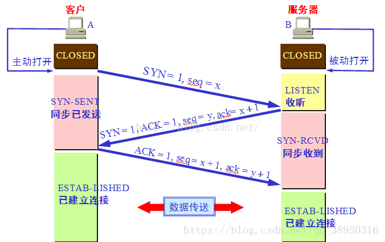
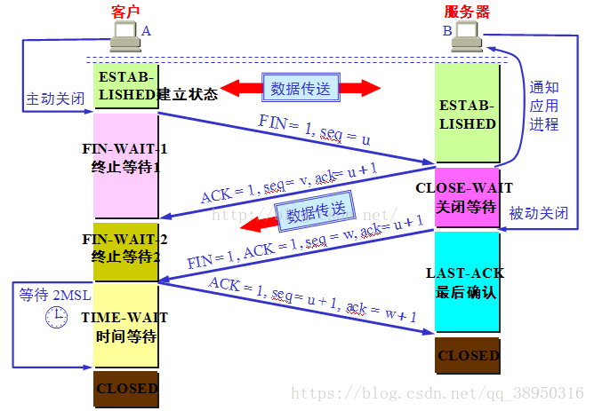

# 网络设备

```
一台机器可以有多少ip
网卡接口，网卡，虚拟网卡，虚拟网卡接口区别，如何使用创建
发送请求可以访问所有网卡段嘛
docker如何指定的网卡
```

##### ifconfig详解

```
eth0表示第一块网卡，lo表示主机回环地址
查询结果每一行代表的意思：
HWaddr 物理地址，inet addr为IP地址，Bcast为广播地址，Mask为掩码
UP             LOOPBACK   RUNNING        MTU：150                         Metric:1
网卡开启状态                网线被连接上    MAX TRANSPORT UNIT(BYTES)        MULTICST:支持组播
RX packets:接受数据包情况统计
TX packets:发送数据包情况统计
RX Bytes:接受字节情况统计
TX Bytes:发送字节情况统计
```


# 计算机网络book

## 第一章

### 互联网的组成

边缘部分与核心部分

互联网的边缘部分

计算机进程之间的通信方式有cs和p2p(对等连接)
cs：客户端请求服务，服务端提供服务。
p2p:双方不区分服务器，可以共享资源。不在所谓的服务器存储资源文件。

互联网的核心部分

互联网的核心部分是路由器，它是实现分组交换的关键构件，功能是转发收到的分组。

- 电路交换的特点
  当电话问世后，想让两个终端两两相连不现实，就需要使用交换机分配传输线路。通过建立连接，通话，释放连接。在通话时间段内，两个终端始终占用通信资源。

- 分组交换的特点

## 网络层

## 网络层提供的两种服务
1面向连接，可靠传输的。
2简单灵活的，无连接的，尽可能交付的数据报（分组）服务。

## 网络协议ip

### 三个配套协议
ARP:地址解析协议
ICMP：网际控制报文协议
IGMP：网际组管理协议
​

### 虚拟互联网络
各个网络具有异构性，但是使用统一的ip协议互联，在网络层看起来是统一的虚拟互联网络。
如果加上上层的tcp就是当今使用的互联网。

### 分类ip地址
通过给主机号分配不同的位数，ip地址分为三类。这主要是为了可以控制每个网段的主机数，避免资源的浪费，但是不利于后期的变动。
A类，主机号3个字节，故最大主机数为2的24次方-2
B类，2字节
C类，一个字节。

### ip与硬件地址
区别：ip地址是网络层使用的一种逻辑地址，因为使用软件实现的。硬件地址是物理层和数据链路层使用的。ip地址放在ip数据报首部，硬件地址放在mac帧首部。
ip数据报交给数据链路层后，就被封装成mac帧了。mac帧在传递过程中都是使用物理地址的。当设备收到mac时，根据首部的硬件地址决定丢弃或收下。收下后，剥去mac帧首部后把数据交给网络层，网络层才能找到IP地址和目的ip地址。
​

### 地址解析协议ARP（解决局域网内ip到硬件地址的映射）

ARP实现了连接异构的网络，而且让用户感受不到这种差异性。
​在传输过程中，我们会遇到这样的问题。已知网络层的目的ip地址，但是不知道mac中需封装的物理地址。ARP就是解决此问题。
实现原理:在ARP高速缓存中放一个ip到硬件地址的映射表，并且这个表动态更新。
工作步骤：1找高速缓存2单播逐个发送ARP
请求分组，内容为自己的ip，硬件地址，我要知道ip为。。的物理地址。
3对应主机发送ARP响应分组，内容为我的ip，硬件地址。4写入高速缓存。

#### ARP四种典型情况
1主机发送到同一网络的另一主机。
2主机发送到另一网络的主机。
3路由器发送到同一网络的主机。
4路由器发送到不同网络的主机。
​

- ip数据报格式（协议，长度，地址，分组）
  版本，首部长度，区分服务，总长度，标识，标志，片偏移，生存时间，协议，首部检验和，源地址，目的地址，可选字段，填充，数据部分。

- ip分组转发
  1从ip报中得到目的ip，得出网络地址D。
  2若与路由器直接相连的同一网络，直接交付
  3路由表中有目的地址为D的特定主机路由，发送给对应的下一跳。
  4若有到达网络N的路由，发送给指定下一跳。
  5有默认路由发往默认路由。
  6报告转发分组出错

- 划分子网和超网

  1ip地址空间利用率低，这是由于其灵活性低，不能随意控制网络主机数和划分。
  2给每一个物理网络分配一个网络号，使得路由表非常大。因为，每个路由表必须能查出到达其他任何网络的下一跳地址。
  划分子网思路：1多个物理网络不需要对应多个网络，而是划分为多个子网
  2划分子网通过向主机号借用位数，使ip成为网络号+子网号+主机号。
  3对于外界不可见，凡是到达此网络的ip，都是先到达路由，再由路由分发到子网。

  - 子网掩码
    程序到达该网络路由后，如何判断是否进行了子网划分呢，如果划分了如何转发呢。通过将子网掩码和ip想与，直接得到网络地址，无需区分是否划分了子网。划分子网增加了网络的灵活性，但是可以连接的主机数减少了，因为对于全0和全1无法使用。

  - 使用子网时，分组的转发。
    1获取ip地址D
    2判断是否可直接交付，用与路由器直接相连的网络的子网掩码与D相与，再看是否与对应网络地址匹配。
    3是否有目的地址为D的特定主机路由。
    4对路由表每一行，将D与子网掩码相与，看是否和每行对应网络地址匹配。符合，则传输给对应下一条服务器。
    5若由默认路由，传输给默认路由。
    6报告转发分组错误。

  - 超网
    互联网发展遇到的困难：
    1b类地址分配完毕
    2路由表条目过多，项目急剧增长。
    3ipv4使用耗尽。
    ​
    ​

  - 变长地址掩码与定长子网掩码
    1定长只能划分大小相等的子网，不过灵活，浪费ip。
    2定长为分类地址。
    3定长使用多个长度不同的子网掩码。

  - CIDR
    CIDR为变长子网掩码的正是名字，无分类地址编码，无分类域间路由选择。
    特点：1无分类网络2合并相同网络前缀的网络，成为CIDR地址块。
    两种写法：[10.0.0.0/10](http://10.0.0.0/10)，10/10或00001010 00*
    CIDR相当于合并了多个网络，使得路由表只存储一个地址。所以称为超网。

  - 最长前缀匹配
    由于使用无分类地址，会出现较短的前缀包含较长的前缀的情况。当路由表中同时出现时，其选择较长的地址前缀，因为其地址块更小，路由更具体的传送。如果不出现较长的前缀，则其会经过短的前缀的总路由，再次转发。

  - 二叉线索树查找路由表

### 网际控制报文协议ICMP

ICMP虽然包裹在ip数据包中，但不是高层协议。
分类：ICMP差错报告报文和ICMP询问报文。

- ICMP差错报告报文有四种
  ICMP的前八个字节，加上出错的ip数据包的首部及数据字段的前8个字节提取出来。
  ​1终点不可达，路由器或主机无法交付数据。
  2时间超过，路由器收到生存时间为0的数据。主机在规定时间内，没有收到一个数据报的全部数据报片时，丢弃所有已收到数据报片，并发送超时报文。
  3参数问题，当路由器收到首部字段的值不正确时，就丢弃该数据包，并发送报文。
  4改变路由，路由器把改变路由报文发给主机，让主机下次发送给别的更好的路由器。

- ICMP询问报文有两种
  1回送请求和回答，ICMP回送请求报文是由主机或路由器向一个特定主机发送的报文，主机必须回应ICMP回送回答报文。探测主机是否可达。
  2时间戳请求和回答，请求某台主机或路由器回答当前日期或时间，时间戳问答报文中有一个32位的字段，写入日期和时间。

- ICMP的应用
  ICMP重要应用就是PING，分组网间探测，用来测试连通性。ping是应用层直接使用网络层icmp的例子，它没有经过tcp或udp。

### 路由选择协议

理想的路由算法
1.正确和完整2计算简单3适应通信量和网络拓扑的变化4稳定性5公平6最佳

- 分层次的路由选择协议
  自适应的，分布式路由协议。采用分层次的原因
  1互联网规模非常大
  2单位希望对外部隐藏路由协议等细节。
  ​

- 路由选择协议分两类
  通过把互联网划分成许多较小的自治系统，自治系统是在单一技术管理下的一组路由器，使用单一一致的路由选择策略。分两类：
  1内部网关协议IGP：即一个资质系统内部使用的选择协议，目前使用较多，如RIP和OSPF协议
  2外部网关协议EGP：若源主机和目的主机处于不同的自治系统中，需要一个协议将信息在两个自治系统中传递。目前基本为BGP-4
  自治系统之间的选择称为域间路由选择，而在自治系统内部的称为域内路由选择。
  早期路由器称为网关，后来更名。所以一般称为IRP,ERP.

- 内部网关协议RIP

  RIP是一种分布式的基于距离向量的路由选择协议，优点是简单
  RIP要求每个路由器维护他到其他每一个网络的距离记录。
  距离定义如下，直接连接为1，不为直接连接，则为经过的路由器数量。RIP的距离也称为跳数。距离最长为15，16被认为不可达，可见它适用于小型互联网。
  ​

  - RIP协议的特点
    1仅和相邻路由交换信息
    2交换的信息为当前路由器的路由表
    3按固定时间间隔交换路由信息

  - 距离向量算法
    对相邻路由器X的数据做如下处理
    1把距离加一，下一跳改为相邻路由器X。
    2若当前路由表没有网络N，则加入。
    若有，其下一跳为X，则替换项目。
    若有，下一跳不为X，比较距离，若更短则替换。
    3若三分钟没有收到，把此路由器距离设为16，表示不可达。

  - RIP报文格式
    地址类别，自治系统标记，路由表信息。  
    ​好消息传得块，坏消息传的慢（网络出现故障，不可达时）

###  内部网关协议OSPF

Open Shortest Path First，开放最短路径优先，他是为了克服RIP的缺点。
它使用分布式的链路状态协议。它和RIP的不同之处有：
​1向本自治系统发送信息，采用洪泛法（flooding），即先发给相邻路由器，相邻路由器在发送给自己相邻的路由器。
2发送的信息是与本路由器相邻的所有路由器的链路状态。链路状态就是此路由器相邻的路由有哪些，以及该链路的度量（花费，时延等）。
3只有当链路状态发生变化时，才发送洪泛法信息。

####  区域
为了方便管理，对自治系统划分成不同的区域。一般包括一个主干区域，主干区域连接其他区域，负责与外部通信。主干区域内的路由器称为主干路由器，连接各子区域的路由器称为边界路由器，与外界沟通的称为自治系统边界路由器。

#### 特点

1OSPF允许对每条路指派不同代价。例如卫星链路对于非实时业务设置较低代价，而对于延时敏感的设为较高的代价。
2如果到达目的网络有多条相同代价的路径，那么可以将通信量分配给这几条路，这叫做多路径的负载均衡。
3每个链路状态带上32位的序号，越新序号越大。

#### OSPF的五种分组类型

1问候分组：发现和维持可达性
2数据库描述：发送链路状态数据库所有信息
3链路状态请求：向对方请求某些链路状态
4链路状态更新：用洪泛法更新全网状态，是ofpf的核心
5链路状态确认：对链路更新分组的确定。

#### OSPF工作步骤

上一栏的1，2，3，4，5，只请求所需要的。
​

#### 外部网关协议BGP

与内部的不同之处
1互联网过于庞大，每个网关必须知道其他任何AS自治系统的对应目的地址。使用最短路径算法，过于效率低下。
2自治系统之间差别大，如性能差距，个性需求，不让某些通过，不想从某国通过。所以BGP只能尽量找到一条合适的路径，BGP使用路径向量路由选择协议。

#### 路由器的构成

路由器的分组转发是路由层最主要的工作。

- 路由选择部分
  核心为路由选择处理机，负责根据路由协议构造及维护路由表
  ​

- 分组转发部分

- 虚拟专用网络VPN和网络地址转换NAT
  - VPN
    1外部网络不安全，让不连接网络的主机使用本地地址，不用申请。
    为了不冲突ip，划分专门的段给专用网络使用。专用ip也称可重用ip。
    有时公司分布在各地，专用网络如何沟通？1购买专用线路。2借助互联网为载体。

## 运输层

>从通信和信息处理的角度看，运输层是向他上面的应用层提供服务。它是通信部分的最高层，也是用户功能的最底层。当两台机器通信时，只在两台主机端协议栈才有运输层，而网络的核心部分中的路由器只有下三层的功能。
>
>运输层提供应用进程间的逻辑通信。之所以说是逻辑，是因为好像是这样进程对进程的通信，实际上是层层解包打包，通过网络核心部分传输的。

### 运输层协议概述

#### 为什么需要运输层？

**网络中的通信实际上是一台机器上的进程和另一台机器上的进程通信。而不是主机与主机的通信。**但是网络层只提供了主机到主机的服务，那ip数据包到达目的主机之后呢？如何交付给对应进程，由tcp负责。当然，tcp也负责很多其他功能。如拥塞控制，流量控制等。

**运输层还要实现复用和分用的功能**

#### 使用tcp和udp的各种应用和应用层协议

| 应用           | 应用层协议             | 运输层协议 |
| -------------- | ---------------------- | ---------- |
| 名字转换       | DNS:域名系统           | UDP        |
| 文件传送       | TFTP：简单文件传送协议 | UDP        |
| 路由选择协议   | RIP：路由信息协议      | UDP        |
| IP地址配置     | DHCP:动态主机配置协议  | UDP        |
| 网络管理       | SNMP：简单网络管理协议 | UDP        |
| 远程文件服务器 | NFS：网络文件系统      | UDP        |
| IP电话         | 专用协议               | UDP        |
| 流式多媒体通信 | 专用协议               | UDP        |
| 多播           | IGMP：网际组管理协议   | UDP        |
| 电子邮件       | SMTP：简单邮件传送协议 | TCP        |
| 远程终端接入   | TELNET:远程终端协议    | TCP        |
| 万维网         | HTTP：超文本传送协议   | TCP        |
| 文件传送       | FTP：文件传送协议      | TCP        |

#### 运输层的端口号

> 运输层接收到网络层上交的报文后，通过其中的端口号确认交付的应用进程。

端口号分为两大类：

第一类是服务器端使用的端口号，这里又分为两类，一类是熟知端口号或系统端口号，值为0-1023。另一类是注册端口号。为1024-49151

常用熟知端口号：

| 应用程序   | FTP  | TELNET | SMTP | DNS  | TFTP | HTTP | SNMP | HTTPS | SNMP(trap) |
| ---------- | ---- | ------ | ---- | ---- | ---- | ---- | ---- | ----- | ---------- |
| 熟知端口号 | 21   | 23     | 25   | 53   | 69   | 80   | 161  | 443   | 162        |

第二类是客户端使用的端口号，值为49152-65535。这类端口号只在客户进程运行时才动态选择，又称为短暂端口号。当服务端接收到客户端的报文时，它就知道客户端的进程端口号，因而可以发送数据到对应进程。当通信结束时，使用过的客户端端口号就不复存在，可以被其他进程占用了。

### tcp

>Transmission Control Protocol：传输控制协议
>
>开销比udp大，他要提供确认，流量控制，计时器和连接管理等。需要先建立连接，后通信。

>seq：发送的数据包中的开始字节的按照字节的编号
>
>ack：已经成功接收到截止x的报文了，请从x+1开始编号seq发送。
>
>ACK:确认报文
>
>SYN:请求建立链接
>
>说一下三次握手：
>
>tcp在通信前，需要先通过三次建立连接。
>
>首先，客户端向服务端发送请求，请求建立连接，SYN标志为1，并指定seq序号为x开始。
>
>服务端接收后，发送ACK、SYN报文，确认接受到了建立链接请求并发起建立链接请求。ACK为1，SYN为1，ack为x+1，seq为y。
>
>客户端收到确认和建立链接的报文，返回确认报文，同意建立链接。seq为x+1，ack为y+1。

>为什么三次握手不携带payload，但是seq要增加1，这是为了处理多次重发的请求。假设发生了重发，可以借助seq号区分不同的SYN请求，也能根据ACK，SYN报文的ack号确定是对那个请求的响应。如果不加1，无法区分到底是对那个请求的ACK响应。

>说一下，四次挥手用于断开tcp链接。
>
>首先，客户端向服务端发送FIN报文，请求断开链接。FIN为1，seq=u。
>
>服务端发送ACK报文，同意断开链接。ACK为1，seq为v，ack为u+1。
>
>服务端等待数据传输完成，发送SYN,ACK报文，请求断开链接。SYN=1，ACK=1,seq=w，ack=u+1
>
>客户端同意断开链接发送ACK报文，seq=u+1，ack=w+1.

三次握手

- 三次握手和四次挥手

  - 基础名称
    SYN:同步连接序号，SYN=1（请求建立连接）；
    ACK:请求/应答状态，ACK=0（请求状态），ACK=1（应答状态）；
    FIN:结束连线，FIN=0（结束连线请求），FIN=1（结束连线）；​
    ack：为当前报文段最后一个字节的编号+1.
- 
  - 三次握手
    1客户端向服务端发送连接请求（SYN包，进入SYN-SEND状态，syn=x）；
    2服务端收到请求后，同意向客户端建立连接（发送ACK-SYN包，进入SYN-RCVD状态,syn=y,ack=x+1）；
    3客户端收到服务端的同意后，与服务端确认建立连接(ack=y+1),进入ESTABLISHED。​
- 
  - 四次握手
    1客户端向服务端发送断开连接请求（FIN=1,进入FIN-WAIT-1状态，seq=u）。
    2服务端接收到断开请求后，同意断开连接，但是还有数据在传输，等待传输完成再断开（进入CLOSE-WAIT状态,ack=u+1）；(客户端进入FIN-WAIT-2状态)
    3服务端数据传输完成后，告知客户端，要关闭连接了(，seq=w,ack=u+1)。
    4客户端收到服务端的断开连接消息后，告知服务端已经收到断开连接的消息。(ack=w+1)​

- TCP粘包拆包

  - 定义
    客户端向服务端发送了packet1和packet2，服务端收到的数据分为三种
    第一种情况，接收端正常收到两个数据包，即没有发生拆包和粘包的现象，此种情况不在本文的讨论范围内。
    第二种情况，接收端只收到一个数据包，由于TCP是不会出现丢包的，所以这一个数据包中包含了发送端发送的两个数据包的信息，这种现象即为粘包。这种情况由于接收端不知道这两个数据包的界限，所以对于接收端来说很难处理。
    第三种情况，这种情况有两种表现形式，如下图。接收端收到了两个数据包，但是这两个数据包要么是不完整的，要么就是多出来一块，这种情况即发生了拆包和粘包。这两种情况如果不加特殊处理，对于接收端同样是不好处理的。

    

拥塞控制.

>慢开始：逐步增加发送的数量
>
>拥塞控制：当造成拥塞后，削减发送量到一个值，再重复增长的过程。

流量控制

>滑动窗口:发送数据的窗口大小
>
>接受方的响应报文中会携带窗口大小，当发送方收到窗口为0的应答时，停止发送，等待下一次应答窗口不为0了，再发送。

### udp

>User Datagram Protocol用户数据报协议
>
>无需连接，直接通信，无需回应报文。


## http

过程：连接，请求，回应，断开。
1无连接：每次连接处理一个请求，收到客户应答后，即断开连接。
2无状态：对事物处理没有记忆，若后续需要前面的信息，则必须重传。
3灵活：传输各种类型，由content-type标记。
​

- http和https区别
  1https为sll加密传输，http为明文。
  2http用80端口，https443
  3http连接简单，无状态，https由ssl+http可进行加密，身份认证和网络协议。
  由上向下层：http，tcp，ip，数据链路层，物理层。

- http响应模式
  http永远是客户端请求，服务器响应。无法在客户端没发起请求时，服务器无法发送消息。
  推送实际上是客户端定时向服务器请求。
  1轮询：定时请求，响应后关闭连接
  优点：后端代码容易
  ​缺点：请求很多无用，浪费资源
  实例：用于小型应用
  2长轮询：请求后hold住连接，有新请求时，再返回消息断开连接。客户端处理了返回消息后再请求一次。
  ​

### http报文
1.起始行：请求行：包含一个请求方法字段，url，http协议版本。响应行：包含响应报文的http版本，数字状态码，以及原因短语。
2首部（header）：常见首部：http有一种简单的语法：名字后边跟着：，再跟上可选空格，再跟上字段值，最后是一个CRLF（换行）。
首部延续行：将长的首部分为多行可以提高可读性。
如;Content-Length:1241234
3空行，表示头部到此为止。
3主体：主体的主题是http报文的负荷，就是传输内容。http可以传输很多种数据。
以下是一个报文的示例
请求报文：
报文语法：

### 通用报文

Connection:keep_alive
Cache-Control:no-cache
Transfer-Encoding:chunked
Upgrade：升为其他协议
​

### 实体报文

对实体部分的内容进行描述
Content-Type
Content-Encoding
Content-Length
Content-Language
Content-MD5
Content-Range
Content-Modified


## 代理

### 正向代理

客户端的请求全部由代理服务器代理，然后代理服务器请求相应的服务器。
对于服务器隐藏了客户端，代理服务器代理客户端进行请求。

### 反向代理

客户端直接请求代理服务器，由代理服务代替服务器进行处理响应。
对于客户端隐藏了服务器的存在，代理服务器代理服务器。