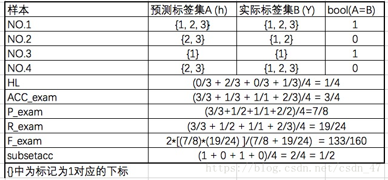

```
这两个格式做参考
https://kns.cnki.net/KXReader/Detail?invoice=li0QzkEP8kfU5L4iCsz4OSB1cjfFIOX5HtGtmTTQId3gUHepGBv4Vc6CIsYm6maB843OA0YYqJNwKeEvR6bRrtQESaYsiJyKfpcp06vyC5W4%2Bev%2Fk7wDf4r%2B9rE9up5Fs%2BZxt9%2FZ5WZHBoHZkUClifqrmKxX64o0XZNChE4QTKI%3D&DBCODE=CAPJ&FileName=JSJC20211216005&TABLEName=capjlast&nonce=EEF30EF0E97C4D6F8DB192FEF409F041&uid=&TIMESTAMP=1640329439125
```


|      | 文档 | 句子 | Token | 实体 |
| ---- | ---- | ---- | ----- | ---- |
| 训练 |      |      |       |      |
| 验证 |      |      |       |      |
| 测试 |      |      |       |      |


```
以"面向自动驾驶的交通场景语义分割"这篇文章为例子，
2020-07-28收的稿件，2021-06-30-S1版发布的。S1一般在6月末或7月初发布，S2在12月末发布。也就是最晚22年12月发布。
```

# 文献作者

```
uc berkley  ries labor  lon Stoica
Eric Liang
hao zhang 
```


```
1切合ti的主题，填充其他组件。
2有利于项目，丰富显示的界面，后边还能做其他研究。
3国内无人做，有数据集，可快速做出来。

```


```
其他网络（多标签分类），并行。
```


```
prorequest,dblp,google,hindawi,paperwithcode
```


```
fournumber
importBymodule
searches
cve

searchprovider
platformprovider
```


```
一行为一条记录，记为一次。
列数可以不固定，但是需要可分割的列。
fp输出的为所有项的频次。对应于ti就是所有列的组合频次。
```


# metrics

```
https://blog.csdn.net/hahajinbu/article/details/78629130
```

````
myModel.py
worker.py
to_simple_rdd.py
evaluate.py
````

```
Dow
```

|       | **0**  | 1    | **2**  |
| ----- | ------ | ---- | ------ |
| **0** | **00** | 01   | 02     |
| **1** | 10     | 11   | 12     |
| **2** | 20     | 21   | **22** |

```
https://blog.csdn.net/pearl8899/article/details/109987788
对角线为命中的数量。
macrof1,分类别计算f1值，然后平均。对于单个类别，例如0类：
召回率=（00）/（00+01+02）
精确度=(00)/(00+10+20)
计算单类别f1，然后平均三个指标得到全局。

对于整个数据集所有类别(micro)：
召回率=（00+11+22）/（00+01+02+10+11+12+20+21+22）
精确度=(00+11+22)/（00+01+02+10+11+12+20+21+22）
计算microf1即可。
microf1，直接使用计算后的精确度和召回率计算f1，一般三个值相等...,包括accuracy也相等。

```

```
k-cfsfdp，本来就有人提出了......
```


```
三个指标（单机，该方法），达到准确度的速度（history）（同步，异步，该方法），

```

```
已存方法，新领域，这个不算
(改变)，已存方法(改变)，新领域，
apt报告，lstm，并行，ti。

1.多个步骤，改了一个步骤。
apt报告,lstm，并行，ti。
2.集成

同步等待，异步陈旧参数，通信开销（压缩，通信窗口，参数服务器），收敛否及效率。通信行为和收敛的关系相伴相生
既然每个电脑配置不同，你给不同的数据不行嘛。（实验，，，）
-------1.提model并行方法,这不就相当于通用型了，那你不得超越所有....
1.通信开销 -J，moving rate α
1.（陈旧度）通信协议？？这不是又是泛用，而且是单独的点。异步陈旧度（这个可以自定义，参数版本），异步（对于长期处于trainging，这种不用等到提交再去评定陈旧，可丢弃），提交时和定时都要检测陈旧度。
worker过于陈旧（参数版本，），丢弃并拉取最新。worker提交的过于陈旧，加权削弱或丢弃。
1.对于快的电脑分配更多的数据集（计算能力）。
1.弥补spark同步能力的缺失，其rdd只能同步拉取
2.基于spark实现了参数服务器异步训练model，使用...策略增项了model。easgd,downpour
3.将model应用于ti，取得了...效果
```

```
parallel training, Spark cloud computing
bigdata, Hadoop, apache spark,
big data,ensemble techniques
```


# Apache Spark DL Book

### spark的局限性

```
spark实现的是数据的多个并行节点的自主划分，但是施加的并行任务是相同的，都是同一个子问题。以Approximate Parallel High Utility Itemset Mining为例，本质做的还是数据并行，不过传统的数据并行是拆分多个样本，而此文是拆分一个样本为多个并行数据，然后用相同的子问题对不同的数据进行操作。对于数据不同，且子问题不同的划分，spark难以实现对应关系，也许可以通过partion id控制施加的操作。而且如果是机器学习方法，涉及到训练的迭代。
同时，频繁的迭代对带宽和内存资源造成压力，影响性能。
```

```
模型并行也有其局限性，会导致分块模型之间的大量通信，可能导致比单机更慢，而且依赖于特定模型无法通用。elephas只可以实现数据并行。
```

```
For a network to be large enough: here's a rough guide. If the network takes 100ms or longer to perform one iteration (100ms per fit operation on each minibatch), distributed training should work well with good scalability. At 10ms per iteration, we might expect sub-linear scaling of performance vs. number of nodes. At around 1ms or below per iteration, the communication overhead may be too much: training on a cluster may be no faster (or perhaps even slower) than on a single machine. For the benefits of parallelism to outweigh the communication overhead, users should consider the ratio of network transfer time to computation time and ensure that the computation time is large enough to mask the additional overhead of distributed training.
```


### 1 setting up 

```
jupyter notebook 配置 pyspark
spark是运行在jvm中的，需要安装jdk。使用anaconda安装jupyter、pyspark。然后配置环境变量如下，运行sparknotebook会自动启动notebook，也可以不配置环境变量，在运行命令时指定即可。
配置环境变量如下,vim ~/.bashrc:
export PATH="/home/docker/minianaconda/bin:$PATH"
function sparknotebook()
{
export SPARK_HOME=/home/docker/minianaconda
export PYSPARK_PYTHON=python3
export PYSPARK_DRIVER_PYTHON=jupyter
export PYSPARK_DRIVER_PYTHON_OPTS="notebook"
$SPARK_HOME/bin/pyspark
}
等价于在terminal运行命令时指定：
$SPARK_HOME/bin/pyspark  SPARK_HOME=/home/docker/minianaconda PYSPARK_PYTHON=python3 ...省略
```


# 共享和可信度

**A Reputation-based Approach using Consortium Blockchain  for Cyber Threat Intelligence Sharing**

```
问题：cti中包含企业隐私信息，如何确保不被窃取,避免个人身份泄露，进一步利用风险，名誉损失。应对拜占庭攻击，使用区块链。
解决：分布式信誉系统，联盟区块链
指标：吞吐量，达成共识效率
优点：解决了拜占庭
缺点：
创新：分布式信誉
文献：24-26
```

**Attribute Based Sharing in Cybersecurity**
**Information Exchange Framework**

```
问题：避免个人身份泄露，进一步利用风险，名誉损失。共享组织可能访问隐私信息
解决：使用基于属性的半信任控制访问。
```

**Distributed security framework**

```
MISP:open-source threat intelligence sharing platform
```

**Info-Trust: A Multi-Criteria and Adaptive Trustworthiness Calculation Mechanism for Information Sources**

```
```


```
挖掘，可信，共享，知识推断，资产发现，资产加情报，web自定义sql
```


```
硕博论文集：ProQuest
计算机相关：dblp
论文集：arxiv
```


```
威胁情报源的可信性评估，威胁情报内容的可信性评估，基于....
```


```
问题：情报共享社区中的威胁情报质量参差不齐，只有高可信的情报才有价值。
解决方案
指标
创新
优点
缺点
```


```
特点
理论部分都是自定义的评估方式，不同于直接用模型，自己的部分较多，本质是优化评估可信度的方式。实验部分可用仿真，但使用时又可以放到spark上。
如何仿真的？一个并行的算法如何仿真？spark的呢？
信息可信感知技术
```


### 谷歌学术

```
搜谷歌学术，进中文的那个谷歌搜索，点击搜索结果上的引号，赋值GB/T 标准的引用。
```


```
一个是http，一个是用rdd返回的结果直接处理的。
```

### spark

```
spark如何输出日志。
可用print，或和flask等框架一样使用日志框架。
如何使用flask服务的,post和get请求？
开flask服务，提供post和get接口。然后用urllib处理拉取和更新请求。
```


测试此版本

```
tensorflow 2.1.0, pyspark 3.0.2, jdk-8u281 and python 3.7 and elephas 1.4.2
```


### 搜索关键词

```
选择advcanced search：全文搜索"apache spark" AND "deep learning"   ,   "apache spark" AND "name entity"
```


### github库

```
https://github.com/cerndb/dist-keras
相关的可选库
https://blog.csdn.net/weixin_33849942/article/details/91609549
https://blog.csdn.net/weixin_39195527/article/details/76099206
```

# 并行

>厦大的一个lab: http://dblab.xmu.edu.cn/blog/2935/

```
dist-keras-:https://joerihermans.com/ramblings/distributed-deep-learning-part-1-an-introduction/
```

```
提出并行方法，使用异步downpour,spark实现并行了模型,
应用于领域
```

```
网络开销：参数压缩，通信行为(一堆指标参数)
参数服务器：模型分区
训练速度：异步
```

### spark传统

```
tfidf、聚类、knn分大类。
小类筛选之后再聚类、knn。
但是一个文章对应n个（n未知）tactic，n个technique。
tf-idf、词向量等。
```

###### mapreduce knn,mlknn

```
基础示例:https://blog.csdn.net/qq_39009237/article/details/86346762
```

```
knn时间复杂度：测试阶段，对于一个sample，计算邻居距离要O((n*D))的时间复杂度，n为训练样本数量，D为特征维度。计算完成后进行排序才能挑出最近邻居，需要O（n*log(n)）的时间复杂度。时间复杂度主要由循环计算和排序产生。
训练阶段为O(1)。
mlknn时间复杂度：测试阶段，对于一个sample，计算邻居距离要O((n*D))的时间复杂度，n为训练样本数量，D为特征维度。计算完成后进行排序才能挑出最近邻居，需要O（n*log(n)）的时间复杂度。时间复杂度主要由循环计算和排序产生。
训练阶段为也需要计算最近邻居，故时间复杂度为O(label_num)+n*label_num*((n-1)*D)。
```


##### knn

>java mulan多标签库及数据集：https://blog.csdn.net/ysk0825/article/details/78388937
>
>多标签数据集：http://mulan.sourceforge.net/index.html

###### 数据集

```
gpu mlknn dataset:http://www.uco.es/kdis/mllresources/
python MLKNN  dataset:http://mulan.sourceforge.net/datasets-mlc.html
hMEKA datadset:ttp://waikato.github.io/meka/
```

###### 代码

```
knn_is github code:https://github.com/JMailloH/kNN_IS
MLKNN python code:https://github.com/hinanmu/MLKNN
spark knn:https://github.com/saurfang/spark-knn
```


###### temp

```
拆分tfidf的维度。
```


###### sklearn和github区别

```
sklearn先统一计算所有sample的neighbors，大小为1400*20,k=20
然后遍历每个样本，填写后验概率，填写步骤如下。取出sample对应k个邻居，取出k个邻居的label，大小为20*14。计算每个label共多少个标签，填入后验概率个数加一。
neighbors： 1400*20 ，   label_info[neighbors[instance], :] ： 20*14  ，label_info[neighbors[instance], :].sum(axis=0)  ： 1*14.
for instance in range(self._num_instances):
      deltas = label_info[neighbors[instance], :].sum(axis=0)
           for label in range(self._num_labels):
               if label_info[instance, label] == 1:
                    c[label, deltas[0, label]] += 1
                else:
                    cn[label, deltas[0, label]] += 1
速度变快是因为避免了for循环，避免了多次调用knn，使用sum(arix=0)矩阵运算代替了for循环。
```

```
计算的后验也不一样，sklearn计算对于每个sample的每个label，其对应的邻居有多少个拥有此label，有则加一。github也是一样的计算方法，但是其使用的浮点数，可能由此产生了更高和结果，即损失和准确度表现更好。
```


###### mlknn

```
https://www.jianshu.com/p/040f5e43a7de
https://github.com/ZesenChen/PyMLKNN
https://github.com/hinanmu/MLKNN
```


###### bayes

```
https://blog.csdn.net/klqulei123/article/details/52781643
```


###### 多标签分类介绍

```
https://blog.csdn.net/weixin_33680199/article/details/112707210
https://blog.csdn.net/qq_38290475/article/details/104465795
```


###### 概念介绍

```
https://blog.csdn.net/xsdjj/article/details/83829822
```

```
knn是一种计算与已标记的数据的距离的方式来分类，计算量巨大。是一种有监督方式
```

###### 评价指标

```
https://blog.csdn.net/clx55555/article/details/88925370
```



```
https://blog.csdn.net/Kodoo/article/details/49735187
Hamming Loss(汉明损失)：该指标衡量预测所得标签与样本实际标签之间的不一致程度，即样本的预测标签集与实际标签集之间的差距。这个值越小越好。
使用不一致的label个数/总的label个数
One-error(1-错误率)：该指标表示样本预测的隶属度最高的标签不属于其实际标签集的可能性。这个值越小越好。
Coverage(覆盖率)：该指标表示在预测标签集的排序队列中，从隶属度最高的类别开始向下，平均需要跨越多少标签才能覆盖其实际标签集的所有标签。这个值越小越好。
Ranking Loss(排序损失)：该指标表明了样本预测标签集中，预测正确的标签的隶属度低于预测错误的标签的隶属度的可能性。这个值越小越好。
Average Precision(平均准确度)：该指标表示预测标签集的平均准确度。这个值越高越好。
```

###### ml-knn多标签

```
详细算法步骤解释：https://blog.csdn.net/Kodoo/article/details/49905877
此片博客使用详细的公式和语言介绍了mlknn过程。
对于一个输入x，对于其某一个label，其概率选择如下，类似后验的选择：
arg max (P(x有此标签)P(近邻中有n个邻居包含此标签|x有此标签),P(x有此标签)P(近邻中有n个邻居包含此标签|x有此标签))
我们关心的是是否有此标签，若不适用后验的方式，就是最大似然估计。即，"近邻中有n个邻居包含此标签"作为直接的判断依据，观察为阳性就判定为癌症，观察为一般为正面就判定都为0.5概率。
```


```
https://www.jianshu.com/p/040f5e43a7de?utm_campaign=maleskine&utm_content=note&utm_medium=seo_notes&utm_source=recommendation
```


##### knn文本分类

```
https://www.cnblogs.com/chenyaling/p/7461386.html
```

##### 文献

###### Distributed nearest neighbor classification for large-scale multi-label data on spark

```
比较了几种索引方法的knn查询效率。
```


###### kNN-IS: An Iterative Spark-based design of the k-Nearest Neighbors classifier for big data 

```
code github:https://github.com/JMailloH/kNN_IS
```


###### Improved KNN Text Classification Algorithm with MapReduce Implementation

```
针对类别特有的高频词会被忽略的问题，提出了新的项，DF，来让这些类特有的词获得更高的权重。
```

###### 一种基于关联规则的 ＭＬＫＮＮ多标签分类算法

```
若标签之间有关联，则提取规则，并用于标签的预测。
```

###### Parallel Processing of Improved KNN Text Classification Algorithm Based on  Hadoop

```
过滤掉离中心较远的的点，减少计算量。
```


###### 基于 MPI 的 ML-kNN 算法并行

```
搜索空间可以拆分多个sample和多个label。
```

###### ML-kNN算法在大数据集上的高效应用

```
聚类再knn
```


### 数据并行

```
基于Spark的舆情情感大数据分析集成方法_戴宏亮
基于Spark的车联网分布式组合深度学习入侵检测方法_俞建业
```

```
8跑基本数据，对比单机
8对比其他模型
9增加贡献部分
9对比基线并行（确认基线是谁）
```

```
1同步方法 vs. 异步方法
2参数平均法 vs. 更新式方法
3中心化同步 vs. 分布式同步
1怎么收集？2收集后计算规则？3中心化同步 vs. 分布式同步？
平均与否，就是步长的区别，不平均步长是n，平均为1。
```

### 基本概念

```
GD（Gradient Descent）：就是没有利用Batch Size，用基于整个数据库得到梯度
BGD，每次迭代使用批量的数据计算梯度，再更新
SGD，每次使用<随机选取>一个数据计算梯度，然后执行更新。
mini-batch sgd,每次使用<随机选取>批量数据计算梯度，然后执行更新。
MBGD(mini-batch bgd),BGD和SGE的折中，每次使用数据集一部分计算，注意不是随机的。也就是我默认使用的rdd分区，但是我没有在一次迭代后更新参数。
1，如果我使用分为n块的全局数据集，再执行n次更新这是sgd嘛？如果我将这n个平均了再更新，是sgd嘛？如果是，那么划分了数据集就一定是sgd嘛？
不是sgd，是mbgd。不是sgd，是mgbd，只是步长不同。不是，主要区别在随机选取。
2原本单机的不就是按batch嘛，也是数据集的部分呀，这是bgd。并行了不还是一样？

算完了整个数据集才更新，是rdd默认模式，为bgd。
按步骤，每次迭代要更新，为mbgd。

blog:https://blog.csdn.net/qq_19672707/article/details/94056538
```

### 文献

>attck:https://attack.mitre.org/tactics/TA0006/

```
突然发现之前dl4j的bert是跑成功了的....只是数据给的少，所以没得结果。
```

```
attck的描写内容可以提供一份或多份文档，还有attck仓库中的文档，不知道是否有重复部分。github和官网重复的，官网爬取的更全面。
capec映射到attck的相关文档：https://capec.mitre.org/data/definitions/658.html

```

##### rcatt

```
colorama == 0.4.3
flask == 1.1.2
joblib == 0.14.1
nltk == 3.4.5
numpy == 1.17.4
pandas == 0.25.3
sklearn == 0.22
stix2 == 1.2.1
```

```
多标签分类。
使用tf-idf和word2vec作为特征，使用sklearn的decision tree，extra tree classifiers，random forest，extra trees等。比较了所有的算法。
```


##### Automated Threat Report Classification Over Multi-Source Data

```
贡献：1tacticd的可信度传递到technique，2数据加权后进行svm的训练，自动调整偏移。使用指定的规则和生成的规则来分类kil_chain。使用tf-idf作为特征,k-nearest，svn，kmm作为分类器。
```


##### 数据处理

```
github网站的基本是工具，要删掉。
2262，2261，1443，1363，1782，1368，1377，1108，1646，1527，1981
```


##### 多标签分类

```
tfidf、聚类、knn分大类。
小类筛选之后再聚类、knn。
但是一个文章对应n个（n未知）tactic，n个technique。
tf-idf、词向量等。
```


```
从给定的一篇文档中确认它包含的n个（n不确定）att&ck包含的ttp，类似于多标签分类。
介绍：https://www.cnblogs.com/cxf-zzj/p/10049613.html
binary  ...：多个二分类器
classifi chain：
csdn:https://blog.csdn.net/u011412768/article/details/109082838
指标计算：https://zhuanlan.zhihu.com/p/51125423
```

##### pdfminer

```
https://pypi.org/project/pdfminer/
```

##### tf-idf

```
https://www.jianshu.com/p/68b0b3126e8c
https://blog.csdn.net/BeforeEasy/article/details/104149815/
```

##### Automatic and Accurate Extraction of Threat Actions  from Unstructured Text of CTI Sources

```
数据集来自att&ck和收集的apt报告，来自symantec security c
svm分类，然后Stanford typed dependencies词性依赖工具挑选action，最后BM25,tf-idf映射。
取threat-action，映射，频繁
hmm效果，映射，频繁点缀
stadnford:https://blog.csdn.net/guotong1988/article/details/50667335
stadnford manual script: https://downloads.cs.stanford.edu/nlp/software/dependencies_manual.pdf
stadnford gui: https://blog.csdn.net/sinat_41144773/article/details/102828718
frequent question:https://nlp.stanford.edu/software/parser-faq.html
stadnford csdn:https://blog.csdn.net/guotong1988/article/details/50667335
短语结构和依存句法：https://blog.csdn.net/qq_43428310/article/details/107290398
information retrieval ：information retrieval
```

##### stanford用法

```
查看dependencies_manual.pdf文件，the pratice 章节有具体用法。前边章节有理论介绍。
```

##### gui

```
load parser
load file 输入的句子
```

##### cmd

```
java -mx200m -cp "*"  edu.stanford.nlp.parser.lexparser.LexicalizedParser  -retainTmpSubcategories -originalDependencies -outputFormat "penn,typedDependencies" -outputFormatOptions "basicDependencies"  "edu/stanford/nlp/models/lexparser/englishPCFG.ser.gz"  test.txt
englishPCFG.ser.gz这种后缀的都在models.jar包中
LexicalizedParser这种功能一般在sources.jar包中
```

##### 流程

```
句子分类，句法依赖。信息相似度，信息检索，文本相似度，相似度计算
分句，然后提取依赖，然后筛选。
att&ck描述一般是threat-actor怎么怎么样，主语最好替换以下。不一定是一句，可能是一个长度的窗口。只选需要的部分，满足动名词的部分。
数据集格式，tactic  1->n technique   n<->n  (procedure,blogtxt)
近义词
```

##### 问题

```
send waves of spearphishing messages  ,只能取到send  waves，没有spearphishing影响后边的相似度计算
00 00 03 Malware downloads the URL that follows the command ID .数字影响提取
prep [ connected to ] 
pobj [ to 198.55.115.71 ] 
prep [ connected over ] 
pobj [ over port ] 
num [ port 1913 ] 
prep — 介词修饰这一种也只能丢失信息
```

att&ck

```
tactic -> technique -> procedure(group,description)
group -> software
group -> technique

关于enterprise和mobile：http://www.yidianzixun.com/article/0SBkITCh
Enterprise 领域主要面向的平台为 Linux、MacOSI 和 WindowsATT&CK Matrix 的解读
attck:https://attack.mitre.org/tactics/TA0006/
```


##### featureSmith

```
dataset from scientific papers and malware from Drebin dataset
ttp,然后检测恶意软件
```

##### Using Entropy and Mutual Information to Extract Threat Actions from Cyber Threat Intelligence

```
互信息(Mutual Information)是信息论中的概念，用来衡量两个随机变量之间的相互依赖程度。
csdn MI:https://www.jianshu.com/p/00254c4d0931
数据集来自att&ck，wiki
改进了取threat-action部分，让vo自由组合，而不是按照编写的规则。自由组合会有很多不合法的组合，通过MI进行筛选。但是没有映射为ttp，可能是因为映射为ttp并没有提升效果，如send data，send info等可能重复的threat-action。提升的方面体现在，获取了更多组合方式。
相似度计算：https://blog.csdn.net/circle2015/article/details/107952424
这种挑选方式，增加了vo对，但是使用相似度过滤仍然会保留不合法的vo对。提取出不正确的threat-ation，例如send,download,crate,modify,明明是download dll， exe或sh但会将其与send结合。
```

##### EX-Action

```
改了第二部
```

```
上边三篇都是使用了句法依存、机器学期、MI、词向量等，无改进部分。但分别解决了部分问题，如ttpdrill解决的抽取宏观信息，ttp，而不是ioc。用句法依存和MI解决。ActionMiner解决抽取不全，用MI解决。第三个是改了第一步的标签，第二步加权了一些指标，解决本体的使用问题。那如此类比，标签的动作和谁组合，合并词语，指代，词性，分类，hmm威胁动作，使用本体是为了从大量的组合中筛选有用的，替换dll、exe等进行映射，spark提升效率，相似度和MI会漏掉部分action，聚类确定分类。crf边界问题，标签bi倒置问题，长短距离问题，词向量表达问题。领域问题，前人的方法，仍存在问题，你的方法。
具体步骤确定action，确定threat-action，确定映射的threat-action分类。避免多个分类器，避免定义和使用本体，避免使用本体的多个属性进行相似度计算，避免使用此方法筛选action。
无法针对安全领域的语法，所以用hmm。然后再筛选，并且并行了。只识别需要的动名词对。
attck:https://attack.mitre.org/tactics/TA0006/
capec:https://capec.mitre.org/documents/documentation/CAPEC_Schema_Description_v1.3.pdf
动名词对标签以及hmm模型取动名词对，然后聚类加文档相似度加频繁项集。数据集用之前那个，分词后标记。
```


##### Threat Action Extraction using  Information Retrieval

```
直接标签标记需要的threat-action，提取threat-action时就不拿无用的threat-action（vo组合）
```


##### A New Improved Baum-Welch Algorithm for Unsupervised Learning for Continuous-Time HMM Using Spark 

```
提了一个并行版本的Baum-Welch和一个用于无监督版本的Baum-Welch
```


```
http://blog.sina.com.cn/s/blog_8267db980102wpvz.html
hmm:https://www.cnblogs.com/jacklu/p/7753471.html
https://www.cnblogs.com/lokvahkoor/p/12781056.html
https://zhuanlan.zhihu.com/p/248184140
crf:https://www.lookfor404.com/%E5%91%BD%E5%90%8D%E5%AE%9E%E4%BD%93%E8%AF%86%E5%88%AB%E7%9A%84%E8%AF%AD%E6%96%99%E5%92%8C%E4%BB%A3%E7%A0%81/
crf:https://github.com/lipengfei-558/hmm_ner_organization


```


##### association rules mining

```
这种针对多条记录，找到在很多条记录都出现的组合。在cti领域很奇怪，难道说很多分威胁情报都重复出现了一个组合信息，你才能挖掘出来嘛，单个情报就已经有价值了。所以说关联你获得的是什么结果呢？获得的是重复出现的信息，即趋势...也不对....,什么东西可能会在很多cti中出现？哪些不针对特定事件的，比如地点，攻击类别等固定的属性值，每个人都具有的，如端口，地点，操作系统，语言，时间等信息，这不就类似于统计了嘛，不过是统计了多个列而已。像文献中所提的ip，hash怎么可能呢？难道有多个cti中包含此ip，hash...。它并不是对关联的东西进行链接，而是统计出高频出现的组合。
那如果我需要统计特定过滤条件下的整体的趋势，怎么用。如我只要特定时间、地点、组织。并不只是统计，比如你用es能直接统计出s，c，l要求的内容嘛，不能。如果能限定关注的点下的置信度，也会有价值，相当于用where限制统计区域。
评估指标呢，速度，内容，兴趣度。
```

##### Intrusion Detection Using Big Data and Deep Learning Techniques

```
随机森林和 GBT
分类器是使用 Apache Spark 的内置机器实现的
学习库 MLlib。 深度学习模型实现
使用分布式 Keras[9]

特征挑选

三个model：
Deep neural network 99.19
Random Forest 98.86
Gradient Boosted Tree 97.92


code repository：https://github.com/OsamaFaker/INTRUSION-DETECTION-BIG-DATA
```

##### A Scalable and Hybrid Intrusion Detection System Based on the Convolutional-LSTM Network

```
第一阶段采用基于 Spark ML 的异常检测模块。第二阶段
作为一个误用检测模块，它基于 Conv-LSTM 网络，这样既全局
```

##### **Traffic Network Flow Prediction Using Parallel Training for Deep Convolutional Neural_Networks_on_Spark_Cloud**

```
这个就是把平均梯度理论给推导了一遍，然后做了个实验，比对三个指标。然后对比加速比、不同节点的扩展性。
本文的主要贡献总结如下。(1)为基于自适应梯度下降原理的离散余弦神经网络模型建立了并行训练算法的理论基础。通过局部学习，保证了所提出的并行训练算法能够像串行训练算法一样，以良好的收敛性学习整个数据集的全局特征(把具体怎么算的说明了一遍,如由局部参数到全局参数，局部损失、局部参数计算，这不是已有理论嘛，只不过不是针对此dcnn模型)
说明了目标函数、训练过程（前向，后向（如由局部参数到全局参数，局部损失、局部参数计算））
l
j
i
f
前向复述了一遍，后向全连接层的kernel matrix和bias matrix按照平均梯度更新，
(2)将DCNN模型应用于交通网络流量预测，以捕捉时空数据的特征。然而，这是使用并行训练算法实现的，并且该模型首先在Spark云计算平台上实现，以解决交通网络流的大数据所面临的计算复杂性。通过实际交通网络流量数据验证了基于云的并行训练算法的渐近收敛性和加速优越性。（spark实现）

```

##### hadoop entity recongnition

```
强行用crf+规则，用规则提取本来就是最好的了。
1提取的类型过于简单，都是格式固定的，可用正则处理。
2对比过少，如不同数量机器的指标和时间。
```

##### Adaptive‑Miner: an efcient distributed  association rule mining algorithm on Spark

```
https://github.com/sanjaysinghrathi/Adaptive-Miner
```


##### An improved approach for mining association rules in parallel using Spark Streaming

```
http://fimi.uantwerpen.be/data/
```

##### chainsmith

```
https://ioc-chainsmith.org/
```

##### An Association Rule Mining-Based Framework for  Profiling Regularities in Tactics Techniques and 
Procedures of Cyber Threat Actors 

```
TAXXI FORMAT:http://hailataxii.com/
MITRE:https://medium.com/mitre-attack/attack-subs-what-you-need-to-know-99bce414ae0b
IOC:https://www.threatminer.org/
CSDN APRIORI：https://blog.csdn.net/qq_45083791/article/details/111408587
IBM:https://www.ibm.com/support/producthub/icpdata/docs/content/SSQNUZ_latest/wsd/nodes/associationrules.html
CTI DATASET:https://ieee-dataport.org/open-access/cyber-threat-intelligent-cti-dataset-generated-public-security-reports-and-malware
Feed:https://logz.io/blog/open-source-threat-intelligence-feeds/
GITHUB-FEED:https://github.com/hslatman/awesome-threat-intelligence
GROUP:https://docs.google.com/spreadsheets/u/1/d/1H9_xaxQHpWaa4O_Son4Gx0YOIzlcBWMsdvePFX68EKU/pubhtml
GITHUB-IOCS:https://github.com/davidonzo/Threat-Intel/
MISP FEED(real-time):https://www.circl.lu/doc/misp/feed-osint/
```

```
hash,ip,port,url,timestamp,type;geoIP;ttp
malware,network,location,ttp
```

```
gspan,apriori-based
scan,dbscan
```

##### Approximate Parallel High Utility Itemset Mining

```
相比于频繁项集的区别：频繁项集找到出现最多的组合，如果是文档，就是词的组合，这毫无意义...
```

```
tf-idf和此方法有相似性嘛
```

```
https://blog.csdn.net/jiafgn/article/details/55670180
高效用集挖掘，找到给定权重最高的，一次记录中可出现多次。
```

Basic HUI-Miner

```
first scan:
calculate TWU
second scan:
filter too low TWU item,generate item-node List in TWU-ascending order.

```

PHUI-Miner

```
dividing the search space:

generate data partion:
inList:describe item should map to which node
added:global generated node data Map
output:this transaction`s output about node data Map,shoudl be add to added.
for transaction in transaction_list:
    for item in transaction:
        nid=inList['item']['nid']
        if nid not in added:
            output={nid,transaction.subset}
mining node data:

```


# elephas+keras_bert

正确运行版本:

```
python==3.6.8
tensorflow==1.14.0
Keras==2.2.5
keras_bert==0.83.0
keras_contrib==2.0.8
Flask==1.1.2
pyspark==3.1.2
sklearn
spacy
```


```
通信行为间隔
worker端梯度的形式
梯度的阿尔法
```


##### 主要错误

```
1.keras库的engine/saving.py有decode的错误
2.keras_contrib类型错误，到keras_contrib的issue可以找到。
```


```
spark-submit  --master spark://172.18.65.187:7077 --py-files /root/software/spark-elephas/spark_elephas.zip --conf "spark.pyhspark.driver.python=/root/miniconda3/envs/elephas1/bin/python" --conf "spark.pyspark.python=/root/miniconda3/envs/elephas1/bin/python"  /root/software/spark-elephas/myModel.py
```


```
these are Deep Feed-Forward Neural Network (DNN) and two ensemble techniques, Random Forest and Gradient Boosting Tree
(GBT). 
```

### 碰到的问题

keras有一个f.attr['keras_version'].decode('utf-8')报错，无法对str解码，我将decode删除了。

##### elephas改了很多

elephas主要更改了spark_model,spark_worker,worker.train,to_simple_rdd.

数据流动顺序:data->to_simple_rdd->spark_model.fit->mapPartion->worker.train->substract_params

##### 关于keras和keras_bert

```
model=model_from_json(json,custom_objects)
keras_bert 有get_custom_objects,为一个字典，键值分别为层的名称和来自哪个包哪个类。
```

存储model

```
https://blog.csdn.net/linmingan/article/details/50736615
```


# elephas

>要求keras 2.2.5,但为了统一，不再使用tensorflow.keras,tensorflow版本随意。
>
>keras-bert-keras2.2.5-tensorflow1

### 异步worker

```
在分区上执行了model.fit后，请求flask服务，更新master_urld
```


### 正确版本

```
https://github.com/maxpumperla/elephas/issues/82
https://github.com/maxpumperla/elephas/issues/146
使用elephas==1.0.0版本,会自动安装其他依赖。
spark 3.1.2
java 1.8
Python 3.7.9
tensorflow==2.1.3
pyspark==3.0.1
pyspark==3.1.2
keras==2.2.5
```

##### Implementing a Deep Learning Model for Intrusion Detection on Apache Spark Platform

```
两层lstm，展示了很多实验。有如下，不同层数（1，2，3），不同模型（mlp,rnn,lstm），不同集群configuration，排列组合共3*3*3=27种数据。还对比了有无smote采样，两分类和多分类。
```


```
elephas
"apache spark" AND "deep learning" 
```

##### 修改记录

```
AttributeError: 'Sequential' object has no attribute 'compiled_metrics'
spark_model.py , line 47

metrics=model.metrics
```

```
Caused by: java.io.EOFException
	at java.io.DataInputStream.readInt(DataInputStream.java:392)
	at org.apache.spark.api.python.PythonRunner$$anon$3.read(PythonRunner.scala:642)
	... 29 more
应该是序列化和反序列化的问题，如传递json文件，weights等。
```


##### spark

```
spark更多是一个方法的实现，文中都没有对其进行性能的调优，只是实现了功能。
文章1：文本情感，集成了svm，lr，crf做分类，实验对比了单机和节点f1和速度。
文章2：舆情情感：加了自己的数据处理和输入特征处理，用stacking加权集成rf,gbdt,xgboost,knn,svm，lr做次级学习器。实验对比了，TF-IDF,Word2vec等不同输入特征处理的f1，及不同stacking策略的不同节点速度。
```

```
表4  不同模型实验结果对比
模型	结果
	精确率	召回率	F1值
1  BERT-Softmax	68.67	52.53	58.41
2  BERT-CRF	72.53	51.21	58.81
3  LSTM-CRF	73.42	56.10	62.37
4  CNN-LSTM-CRF	70.16	63.67	66.41
BERT-BiLSTM-CRF	75.83	64.16	68.84

```

```
针对什么难题问题，提出什么方法，进行了什么实验，结果如何。
但是方法不能对比，实验部分还是突出不了方法。
```


##### 要改的

```
摘要
修订
文献

IOC翻译为攻击指示器
格式，计算机应用

逻辑上?
```


```
lisa生成pcap，pcap逆向到83维特征。
```

##### 南京大学实验室

```
http://pasa-bigdata.nju.edu.cn/links.html
```


```
自己之前的确忽略了一些东西，没有进行科学理性的评估。
可选：在hadoop上实现es的功能，再并行化点东西。或不使用dl4j直接用简易的算法。
```

# keras-bert错误更改

```
cnn-lstm:https://www.jb51.net/article/189663.htm
```


##### AttributeError: module 'tensorflow' has no attribute 'name_scope' 

```
https://stackoverflow.com/questions/51724309/attributeerror-module-tensorflow-has-no-attribute-name-scope-with-keras
pip install -I tensorflow
pip install -I keras
```


```
keras_bert==0.83.0
Keras==2.2.4
seqeval==0.0.10
keras_contrib==2.0.8
matplotlib==3.3.1
numpy==1.16.4
Flask==1.1.2
tensorflow==1.14.0
```

```
使用elephas==1.0.0版本,会自动安装其他依赖。
spark 3.1.2
java 1.8
Python 3.7.9
pyspark==3.0.1
tensorflow==2.1.3
keras==2.2.5
```


##### bert-lstm-crf教程

```
csdn教程:https://blog.csdn.net/jclian91/article/details/111728692
github资源:https://github.com/percent4/keras_bert_sequence_labeling
```

##### AttributeError: module 'tensorflow' has no attribute 'placeholder'

```
修改tensorflow_backend文件,optimizers.py
import tensorflow.compat.v1 as tf
tf.disable_v2_behavior()


```

##### 添加头尾多了

```
```


```
与论文已有实验做对比，比较结果。
自己做实验对比，对比不同层。
```


```
最终版本
python3.6,tensorflow1.15.0,keras
```

the truth value of array is ambigous,use arr.all() or arr.any()

```
D:\DevInstall\anaconda\envs\tensorflow_1_1\Lib\site-packages\keras\engine
修改了load_model函数调用的saving.py，注释的为原始代码
# if weight_names:
        if weight_names.any():
            filtered_layer_names.append(name)
```

keras load_model 报错str不可decode

```
https://blog.csdn.net/guotianqing/article/details/115253163
pip install h5py==2.10
```


keras_contrib:

```
https://zhuanlan.zhihu.com/p/267689558
pip install git+https://www.github.com/keras-team/keras-contrib.git
```


```
所用版本问题:
好像是降低某个库的版本，一个小的库，keras依赖于它。
相关链接：
absl-py==0.13.0
antlr4-python3-runtime==4.8
argon2-cffi @ file:///C:/ci/argon2-cffi_1613037829118/work
astor==0.8.1
async-generator==1.10
attrs @ file:///tmp/build/80754af9/attrs_1620827162558/work
bleach @ file:///tmp/build/80754af9/bleach_1628110601003/work
blis==0.7.4
cached-property==1.5.2
cachetools==4.2.2
catalogue==2.0.5
certifi==2021.5.30
cffi @ file:///C:/ci/cffi_1625831763871/work
charset-normalizer==2.0.4
click==7.1.2
colorama @ file:///tmp/build/80754af9/colorama_1607707115595/work
contextvars==2.4
cycler==0.10.0
cymem==2.0.5
Cython==0.29.21
dataclasses==0.8
decorator @ file:///tmp/build/80754af9/decorator_1621259047763/work
defusedxml @ file:///tmp/build/80754af9/defusedxml_1615228127516/work
entrypoints==0.3
fuzzywuzzy==0.18.0
gast==0.2.2
gensim==4.0.1
google-auth==1.35.0
google-auth-oauthlib==0.4.5
google-pasta==0.2.0
grpcio==1.39.0
h5py==2.10.0
idna==3.2
immutables==0.16
importlib-metadata @ file:///C:/ci/importlib-metadata_1617877476772/work
ipykernel @ file:///C:/ci/ipykernel_1596206775157/work/dist/ipykernel-5.3.4-py3-none-any.whl
ipython==6.1.0
ipython-genutils @ file:///tmp/build/80754af9/ipython_genutils_1606773439826/work
ipywidgets @ file:///tmp/build/80754af9/ipywidgets_1610481889018/work
jedi @ file:///C:/ci/jedi_1611341129952/work
Jinja2 @ file:///tmp/build/80754af9/jinja2_1624781299557/work
joblib==1.0.1
jsonschema @ file:///tmp/build/80754af9/jsonschema_1602607155483/work
jupyter==1.0.0
jupyter-client @ file:///tmp/build/80754af9/jupyter_client_1616770841739/work
jupyter-console==5.2.0
jupyter-core @ file:///C:/ci/jupyter_core_1612213536848/work
jupyterlab-pygments @ file:///tmp/build/80754af9/jupyterlab_pygments_1601490720602/work
jupyterlab-widgets @ file:///tmp/build/80754af9/jupyterlab_widgets_1609884341231/work
keras==2.6.0
Keras-Applications==1.0.8
keras-bert==0.88.0
keras-contrib @ git+https://www.github.com/keras-team/keras-contrib.git@3fc5ef709e061416f4bc8a92ca3750c824b5d2b0
keras-embed-sim==0.9.0
keras-layer-normalization==0.15.0
keras-multi-head==0.28.0
keras-pos-embd==0.12.0
keras-position-wise-feed-forward==0.7.0
Keras-Preprocessing==1.1.2
keras-self-attention==0.50.0
keras-transformer==0.39.0
kiwisolver==1.3.1
Markdown==3.3.4
MarkupSafe @ file:///C:/ci/markupsafe_1621528313524/work
matplotlib==3.3.4
mistune==0.8.4
murmurhash==1.0.5
nbclient @ file:///tmp/build/80754af9/nbclient_1614364831625/work
nbconvert @ file:///C:/ci/nbconvert_1601896775581/work
nbformat @ file:///tmp/build/80754af9/nbformat_1617383369282/work
nest-asyncio @ file:///tmp/build/80754af9/nest-asyncio_1613680548246/work
notebook @ file:///C:/ci/notebook_1629205950149/work
numpy==1.19.5
oauthlib==3.1.1
opt-einsum==3.3.0
packaging @ file:///tmp/build/80754af9/packaging_1625611678980/work
pandocfilters @ file:///C:/ci/pandocfilters_1605120535071/work
parso @ file:///tmp/build/80754af9/parso_1617223946239/work
pathy==0.6.0
pickleshare @ file:///tmp/build/80754af9/pickleshare_1606932040724/work
Pillow==8.3.1
preshed==3.0.5
prometheus-client @ file:///tmp/build/80754af9/prometheus_client_1623189609245/work
prompt-toolkit==1.0.15
protobuf==3.17.3
pyasn1==0.4.8
pyasn1-modules==0.2.8
pycparser @ file:///tmp/build/80754af9/pycparser_1594388511720/work
pydantic==1.8.2
Pygments @ file:///tmp/build/80754af9/pygments_1629234116488/work
pyparsing @ file:///home/linux1/recipes/ci/pyparsing_1610983426697/work
pyrsistent @ file:///C:/ci/pyrsistent_1600141799440/work
python-dateutil @ file:///tmp/build/80754af9/python-dateutil_1626374649649/work
pytz==2021.1
pywin32==228
pywinpty==0.5.7
PyYAML==5.4.1
pyzmq @ file:///C:/ci/pyzmq_1628276569449/work
qtconsole @ file:///tmp/build/80754af9/qtconsole_1623278325812/work
QtPy==1.9.0
requests==2.26.0
requests-oauthlib==1.3.0
rsa==4.7.2
scikit-learn==0.24.2
scipy==1.4.1
Send2Trash @ file:///tmp/build/80754af9/send2trash_1607525499227/work
simplegeneric==0.8.1
simplejson==3.17.3
six @ file:///tmp/build/80754af9/six_1623709665295/work
sklearn==0.0
smart-open==5.2.0
spacy==3.1.1
spacy-legacy==3.0.8
srsly==2.4.1
stix2==3.0.0
stix2-patterns==1.3.2
tensorboard==2.1.1
tensorflow-gpu==2.1.0
tensorflow-gpu-estimator==2.1.0
termcolor==1.1.0
terminado==0.9.4
testpath @ file:///tmp/build/80754af9/testpath_1624638946665/work
thinc==8.0.8
threadpoolctl==2.2.0
tornado @ file:///C:/ci/tornado_1606942379977/work
tqdm==4.62.1
traitlets==4.3.3
typer==0.3.2
typing-extensions @ file:///tmp/build/80754af9/typing_extensions_1624965014186/work
urllib3==1.26.6
wasabi==0.8.2
wcwidth @ file:///tmp/build/80754af9/wcwidth_1593447189090/work
webencodings==0.5.1
Werkzeug==2.0.1
widgetsnbextension==3.5.1
wincertstore==0.2
wrapt==1.12.1
zipp @ file:///tmp/build/80754af9/zipp_1625570634446/work

```


```
threatActor  vulnerability_cve  malware software location  identity
word2vec,bert...?
ann,bio...?如果需要，brat可以转
```

# spark mlknn

##### spark 相关函数

```
spark knn 代码示例:https://blog.csdn.net/fighting_one_piece/article/details/39056513
dataframe：https://blog.csdn.net/xiaohu21/article/details/109431467
dataframe:https://www.jianshu.com/p/f517471850a2
```

##### origion

```
原始情况每台机器上都必须要有对应的需要找近邻的样本。对于测试来说，就是所有节点都有test_dataset,对于训练就是所有都有train_dataset。当使用kdtree时，给定一个sample，通过分布式索引找到近邻所在节点，然后得到近邻index。本质上，节点间交流由分布式索引代替了。那lsh是如何处理的呢，它通过hash(x)处理之后的值，数据并行比对相似度，也要将test_data复制到所有节点。
```

##### kd-tree

```
百度百科:https://baike.baidu.com/item/kd-tree/2302515?fr=aladdin
使用超平面划分数据点，类似二叉搜索树。可用于范围搜索和近邻搜索，对于高维数据，数据点数目N应当远远大于2的k次方，kd树才能在近邻搜索中发挥其作用，k为维度数目。不然大部分的点都会被查询到，不会比全体查询好到那里去。近似邻近查询
```

##### lsh

```
spark实现了min-hash和BucketedRandomProjectionLSH。
```

```
设计了一种特殊的hash函数，使得2个相似度很高的数据以较高的概率映射成同一个hash值，而令2个相似度很低的数据以极低的概率映射成同一个hash值。我们把这样的函数，叫做LSH（局部敏感哈希）。LSH最根本的作用，就是能高效处理海量高维数据的最近邻问题，适合高维数据情况。
算法详解:https://blog.csdn.net/guoziqing506/article/details/53019049
代码详解:https://zhuanlan.zhihu.com/p/61200936
```

###### min-hash

```
```

###### BucketedRandomProjectionLSH

```
```


##### 版本

```
pyspark 3.0.3报错，使用pyspark3.1.2则正常，可能是python版本和pyspark不符。
```

##### 具体mapreduce

```
对于knn:
测试阶段，对于一个sample，计算邻居距离要O((n*D))的时间复杂度，n为训练样本数量，D为特征维度。计算完成后进行排序才能挑出最近邻居，需要O（n*log(n)）的时间复杂度。时间复杂度主要由循环计算和排序产生。
训练阶段为O(1)。
```

```
对于mlknn：测试阶段，对于一个sample，计算邻居距离要O((n*D))的时间复杂度，n为训练样本数量，D为特征维度。计算完成后进行排序才能挑出最近邻居，需要O（n*log(n)）的时间复杂度。时间复杂度主要由循环计算和排序产生。
训练阶段为也需要计算最近邻居，故时间复杂度为O(label_num)+n*label_num*((n-1)*D)。
```

```
map: 相同操作,不同数据
reduce:
shuffle
```

##### 多标签分类

```
在多标签 研 究 中，主 要 有２类多标签分类算法：问题转化法和算法转化法。
问题转化法是将多标签分类问题分解为多个单标签分类问题，再利用传统的单标签分类方法进行分类，简单易行，但这样就忽略了多标签数据集的所有特性。
算法转化法是通过对传统的分类方法进行改进，使其能适用于多标签数据的分类。该类算法主要有 ＡｄａＢｏｏｓｔ算 法［８，９］、Ｃ４．５算 法［１０］、多 标 签 Ｋ近 邻 算 法 ＭＬＫＮＮ （Ｍｕｌｔｉ－Ｌａｂｅｌ Ｋ－Ｎｅａｒｅｓｔ Ｎｅｉｇｈｂｏｒ）［１１］和 反 向 传 播 多 标 签 学 习 ＢＰＭＬＬ
（Ｂａｃｋ－Ｐｒｏｐａｇａｔｉｏｎｆｏｒ Ｍｕｌｔｉ－ＬａｂｅｌＬｅａｒｎｉｎｇ）算法［１２］等。
```

##### problem

# 论文

### 论文1

```
https://blog.csdn.net/ziigea/article/details/106112082
```


##### result

###### charWord_bert_without_dropout

```
EPOCH=50
class multi precision_score:  [0.81070835 0.72253636 0.79627208 0.83939138 0.80244857 0.7057691
 0.81191979 0.91268822 0.98850351]
class multi recall_score:  [0.73985782 0.67558797 0.7765587  0.6755102  0.72443609 0.49446512
 0.6779845  0.888      0.99314915]
class multi f1_score:  [0.77366439 0.69827391 0.78629185 0.74858651 0.7614494  0.58151683
 0.73893207 0.90017487 0.99082088]
micro: p=0.9803155315239563,r=0.9807555436555266,f1=0.9805354882262384,a=0.9795246282752942
macro: p=0.8224411267010494,r=0.7382114657140885,f1=0.7757557905421154,a=0.9795246282752942
max_f1: 0.7757557905421154
```


###### charWord_bert

```
 # class multi precision_score:  [0.81337209 0.70802635 0.77588971 0.83241657 0.76666667 0.63754906
    # class multi precision_score:  [0.81751306 0.729806   0.8068718  0.82627119 0.77907983 0.65553763
    #  0.80658506 0.89089003 0.99059229]
    # class multi recall_score:  [0.76369668 0.71670009 0.81004049 0.71632653 0.74481203 0.56711628
    #  0.74062016 0.9349     0.99228404]
    # class multi f1_score:  [0.78968905 0.72319367 0.80845304 0.76738085 0.76156064 0.60812968
    #  0.7721964  0.91236459 0.99143745]
    # micro: p=0.9814920301755193,r=0.981823868753499,f1=0.9816579214209218,a=0.9807093040151111
    # macro: p=0.8107042284184116,r=0.7778499516905655,f1=0.7930895394509643,a=0.9807093040151111
    # max_f1: 0.7930895394509643
    # end_time2022-02-27, 21:11:29
    #
    # Process finished with exit code 0
    
```

###### charWord_bert_tiny

```
    # bert_tiny
    # class multi precision_score:  [0.80561432 0.75048077 0.81657115 0.85467939 0.77522279 0.65834178
    #  0.79440846 0.88651284 0.98941559]
    # class multi recall_score:  [0.73990521 0.68302644 0.8191498  0.69455782 0.73255639 0.51372093
    #  0.72248062 0.91825    0.99288547]
    # class multi f1_score:  [0.77136293 0.71516656 0.81785844 0.76634392 0.75328591 0.57710897
    #  0.7567392  0.90210237 0.99114749]
    # micro: p=0.9811519211215709,r=0.9815629335734976,f1=0.9813573843124405,a=0.980328134837991
    # macro: p=0.8157040950337651,r=0.7595784331048652,f1=0.7849691068582003,a=0.980328134837991
    # max_f1: 0.7849691068582003
    # end_time2022-02-28, 10:42:05
    #
    # Process finished with exit code 0
```


###### word-bert-bilstm-crf

```
# class multi precision_score:  [0.81757877 0.59075244 0.74490489 0.87461774 0.77760736 0.63529412
#  0.8944     0.86931818 0.98811149]
# class multi recall_score:  [0.77883096 0.62503798 0.73987854 0.64852608 0.63533835 0.37674419
#  0.72222222 0.8925     0.991427  ]
# class multi f1_score:  [0.79773463 0.60741178 0.74238321 0.74479167 0.69931034 0.4729927
#  0.79914224 0.88075658 0.98976647]
# micro: p=0.9769628241630772,r=0.9772006263742505,f1=0.9770817107995846,a=0.9761870166771606
# macro: p=0.7968757782201019,r=0.7039592939950097,f1=0.7420693744679874,a=0.9761870166771606
# max_f1: 0.7420693744679874
```

###### word-albert-bilstm-crf

```
# EPOCH=49
    # Epoch 1/1
    #  - 88s - loss: 3.6418 - crf_accuracy: 0.9869
    # class multi precision_score:  [0.70977214 0.58494325 0.68330008 0.78005296 0.72646378 0.58449633
    #  0.7571128  0.80344266 0.98447697]
    # class multi recall_score:  [0.57279621 0.52993619 0.67246964 0.60122449 0.61383459 0.41102326
    #  0.64155039 0.8635     0.9896424 ]
    # class multi f1_score:  [0.63396979 0.55608272 0.6778416  0.67906262 0.6654169  0.48264562
    #  0.69455751 0.83238944 0.98705293]
    # micro: p=0.9720808331541991,r=0.9730443249032447,f1=0.9725623404023418,a=0.9709991766358309
    # macro: p=0.7380361034578075,r=0.6653976184444341,f1=0.6968811685375426,a=0.9709991766358309
```

###### word-word2vec-bilstm-crf

```
# class multi precision_score:  [0.52809404 0.58385752 0.66351725 0.84991066 0.65159492 0.56574637
    #  0.65740935 0.92551296 0.97367893]
    # class multi recall_score:  [0.27748427 0.36203058 0.49405987 0.63655626 0.3890053  0.27655356
    #  0.3985894  0.83004098 0.99158572]
    # class multi f1_score:  [0.36380768 0.44693294 0.56638515 0.72792195 0.4871686  0.37150466
    #  0.49628165 0.87518095 0.98255075]
    # micro: p=0.9646394797624698,r=0.9671031449686105,f1=0.9658697413368301,a=0.9634116011357337
    # macro: p=0.7339034941397826,r=0.5473027096957497,f1=0.6192408310657371,a=0.9634116011357337
    # max_f1: 0.6192408310657371
```

###### char_bilstm-crf

```
    # class multi precision_score:  [0.94708753 0.71153846 0.6931294  0.61417323 0.68211207 0.44989775
    #  0.48772017 0.87179487 0.89978678]
    # class multi recall_score:  [0.97446264 0.5377907  0.56145526 0.55319149 0.54852686 0.40366972
    #  0.40353038 0.69387755 0.7238422 ]
    # class multi f1_score:  [0.96058009 0.61258278 0.62038244 0.58208955 0.60806916 0.42553191
    #  0.44164888 0.77272727 0.80228137]
    # micro: p=0.6135049431076292,r=0.5014866204162537,f1=0.5518687864423842,a=0.9098212053013254
    # macro: p=0.6762690913216087,r=0.553235519961377,f1=0.6081641724023255,a=0.9098212053013254
    # max_f1: 0.6081641724023255
```


##### lstm

```
https://zhuanlan.zhihu.com/p/32085405
https://www.jianshu.com/p/9dc9f41f0b29
#bilstm
https://www.jianshu.com/p/bfd87f1c5efc
https://www.cnblogs.com/bonelee/p/12106075.html
https://zhuanlan.zhihu.com/p/105827761
```

```
#关于维度的介绍
https://zhuanlan.zhihu.com/p/105827761
注意区分矩阵乘法、哈达玛积、向量内积。
权重矩阵都是n*(n+m)，偏置向量长度为n。输入x为n*1,隐藏状态h为m*1,两者进行拼接为(n+m)*1。
细胞状态计算和隐藏状态计算是点积运算。
```


##### crf

```
https://zhuanlan.zhihu.com/p/407762841
```

##### 时间复杂度

```
https://blog.csdn.net/qq_38237214/article/details/119750561.
https://www.cnblogs.com/picassooo/p/13504533.html
bert 时间复杂度：https://zhuanlan.zhihu.com/p/132554155
bert 参数量：https://zhuanlan.zhihu.com/p/144582114
bert 参数形状：https://www.cnblogs.com/kouin/p/13427243.html
```


##### trm

```
https://blog.csdn.net/pipisorry/article/details/84951508
```

##### addnorm

```
https://www.jianshu.com/p/9b87b945151e
bert 参数形状：https://www.cnblogs.com/kouin/p/13427243.html
```


##### char word

```
https://zhuanlan.zhihu.com/p/360290118
https://www.researchgate.net/figure/Bi-LSTM-CRF-with-Word-Character-representation-Architecture_fig2_336798652
```


##### bert+char?

```
https://blog.csdn.net/c9Yv2cf9I06K2A9E/article/details/109830870
如下图所示，首先 BPE 的方法无法表示完整词的信息以及更细粒度的字符级别的信息，如下图左边所示，第一层和第三层的内容都没有被表示出来，
bert：详解
```


##### BIO  IOB

```
http://www.360doc.com/content/18/0628/13/55760565_766070477.shtml
```


##### micro和macro

```
micro中每个样本重要性一样，这样导致样本数量多的类别决定了指标好坏。数量累积起来，不分类别计算出precision和recall，然后用公式计算f1.
macro是每个类别平均，忽略每个类别的数量的差异。分别计算每类的precision、recall、f1，然后平均每类得到最终的macro-precison,macro-recall,macro-f1.
https://www.cnblogs.com/zywnnblog/p/15744237.html
```

##### crf

```
https://www.cnblogs.com/callyblog/p/11284370.html
```

##### 模型对比

```
char比较
word比较
不同规模bert比较

CRF
BiGRU-CRF
ALBERT-CRF
WORD2VEC-BiGRU-CRF
ALBERT-BiGRU-CRF

word_char  bert-bigru-crf
字符类型  emb-bilstm-crf
word类型 bert-bilstm-crf word2vec-bilstm-crf
本文  charword-emb-bert-bilstmc-crf
各部分消融
```


##### 字符与单词

```
https://www.researchgate.net/figure/Bi-LSTM-CRF-with-Word-Character-representation-Architecture_fig2_336798652
```


##### 实验

```
字母与单词
滑动窗口
数据增强
albert模型大小
```


##### GRU

```
https://blog.csdn.net/sir_TI/article/details/106819038
https://zhuanlan.zhihu.com/p/55386469
```

##### 按字母标记的标签转为按分词后的单词标记

```

```

##### python库详细版本

```
keras_bert==0.83.0
Keras==2.2.4
tensorflow-gpu==2.1.0
keras_contrib==2.0.8
bert4keras==0.10.9
```

```
keras_bert==0.83.0
Keras==2.2.4
bert4keras=0.10.9
tensorflow==2.1.0
gensim==4.0.1
numpy==1.16.4
keras_contrib==2.0.8
```


```
整理一下evaluate用的指标
跑一下albert-bigru
```

##### 过低

```
malware和software容易混淆，不要software了
identity效果不好，可能由于threatActor的影响，去掉identity。
只剩下threatactor，vulnerability_cve，malware，location
```


##### 添加部分

```
实验部分使用其他网络跑一下（什么网络？ALBERT-BiGRU-CRF）。
文字部分，与实验相关的进行重写。
文字部分，无法单纯重写的，例如数据的预处理流程2（改变和添加预处理流程,使用其他分词器和标注工具，修改参考反恐的那一篇）、3正则表达式提取（换其他正则表达式）、1情报生成方法流程图（不使用正则了，全部用网络），需要酌情修改内容并重写。可添加一些步骤。
图片重新绘制。
https://link.springer.com/chapter/10.1007/978-3-030-60450-9_13介绍了预处理的技术（同义词替换）等。
attention 资源： https://blog.csdn.net/u011523796/article/details/87542951
bilstm-attention :https://blog.csdn.net/u013230189/article/details/110007826
```

##### robert

```
https://www.shangmayuan.com/a/7e6252aa87eb4006b28d71bc.html
```

##### ALBERT

```
bert4keras教程:https://bert4keras.spaces.ac.cn/guide/#_2
bert4keras: https://github.com/bojone/bert4keras/pull/427
chttps://blog.csdn.net/weixin_42691585/article/details/107424028

错误：没有此属性self._token_unk_id
它使用这一部分代码读取的vocab中的unk等标志的id，要求以[]形式包裹，例如[UNK]。将所有标志改为用[]包裹。
for token in ['pad', 'unk', 'mask', 'start', 'end']:
    try:
        _token_id = token_dict[getattr(self, '_token_%s' % token)]
        setattr(self, '_token_%s_id' % token, _token_id)
    except:
    	pass
```

##### temp

```
CRF
BiGRU-CRF
ALBERT-CRF
WORD2VEC-BiGRU-CRF
ALBERT-BiGRU-CRF
```

##### lstm、gru

```
https://blog.csdn.net/mpk_no1/article/details/72875185
https://blog.csdn.net/weixin_42691585/article/details/107424028
https://zhuanlan.zhihu.com/p/27418415
```

##### Macbert

```
csdn 博客：https://blog.csdn.net/qq_27590277/article/details/115339832
知乎:https://zhuanlan.zhihu.com/p/333202482
文章名： Revisiting Pre-trained Models for Chinese Natural Language Processing

源码：
https://github.com/ymcui/MacBERT
https://github.com/ymcui/Chinese-ELECTRA

```

##### 时间复杂度计算

```
对于行列为a*b，b*c的矩阵进行矩阵相乘，时间复杂度为a*b*c
对于行列为a*b，a*b的矩阵进行哈达玛积，时间复杂度为a*b
对于长度为a的两个向量进行内积计算，时间复杂度为a的平方。
```

### bert、mlknn、deepforest

```
为什么感受不一样，关于数据集的挑选，因为bert的spark并行化不伦不类，但是deepforest是适合的，所以bert必须有前边的公开数据集支撑，而deepforest不需要，它后边的spark并行是由坚实基础的，有意义的，是重要的实验部分。
```


### 论文elephas

>deep forest改为多标签文本，参考那篇北理工，1修改最后一层，提出深度森林多标签模型2并行，提升效率。参考南京大学那篇。 对于TI的数据集可以剔除部分标签，比如样本较少的类别，等等，让效果更好、更有说服力。

##### deepforest

>又称为gcforest，南京大学那篇主要在于优化网络的传输量，减少传输的数据。类似于shuffle阶段，shuffle阶段有大量的网络传输。主要使用三个策略：
>
>1延迟窗口扫描，只传输原始数据，在需要的结点进行本地窗口扫描，得到窗口扫描的结果。这条优化策略的本质是本地化计算。
>
>2池化每一层森林处理后的维度，再传入下一层网络，减少网络传输数量。本质是压缩数据维度，减少数据传输量。
>
>3只传输该层级联森林生成的特征，不传输原始特征向量。本质是减少传输数量，减少网络传输效率。

>详细解读：https://www.jianshu.com/p/886fe6dd277f
>
>详解对比：https://blog.csdn.net/weixin_43595430/article/details/105369697
>
>源码：https://blog.csdn.net/andy_shenzl/article/details/106904699
>
>源码：https://zhuanlan.zhihu.com/p/26591548
>
>最新版本:https://github.com/LAMDA-NJU/Deep-Forest
>
>多标签知识背景:https://www.cnblogs.com/yifanrensheng/p/12355009.html
>
>详细解读:https://blog.csdn.net/baidu_36161077/article/details/81058016
>
>特点：使用较少的超参数，模型的复杂程度可根据情况自动调整，默认参数效果往往也不错。比较适合并行，和cpu计算。
>
>DNN的缺点，调参难度大，超参数多，需要较大数据集，难以解释黑盒，需要设计网络结构，GBDT效果更好。
>
>实际效果占用内存大，效果比深度学习差。多粒度扫描内存要求高，需要48G，级联森林需要20G。参数量很大，级森林提升小。在小数据量上比深度学习鲁棒性更好。

>```
># MLDF
>论文出处：出处：Yang L , Wu X Z , Jiang Y , et al. Multi-Label Learning with Deep Forest[J]. 2019.
>本篇论文主要学习算法的第一部分：特征重用机制。
>当前层求置信度，与阈值比较，小于某一标准，则重用上一层的表示。
>作者邮箱：yangl@lamda.nju.edu.cn
>```

>1allreduce 2分区数目 3置信度确定，不同置信度结果差别大，0.3置信度为76%的macro-auc准确率，精确率和f1分别为76和51
>
>```
># 清空占用的大量内存，提升执行速度，不然随着广播变量增多，内存变少，执行速度下降。
>old_traindata.unpersist
>old_trainlabel.unpersist
>```

###### 并行思路

```
#对于迭代式，以一轮为基础进行理解。分发数据，各节点计算，收集计算结果，获得合并的结果。不断重复这个过程
#对于deepforest，他不是对整个模型不断进行多次迭代，而是对模型进行一次迭代，但是是一层一层计算的，后一层的计算依赖于前一层的计算结果。而且其输入的数据在不断变化。
如下表格，对于迭代式算法，其数据并行，各个节点拿到了其中一列的信息，每个节点负责一列。如果其使用了模型并行，那么就是某个节点负责一行，甚至表格中的某一个项。算法块之间会有前后依赖关系，所以对其划分后实际上可以递归的进行思考，最终变成没有前后依赖的步骤。前后有依赖的两个块构成shuffle行为，需要收集信息，为依赖的后续步骤做准备，没有依赖的块可以任意采用数据并行和模型并行。
以lstm为例，其前后两个状态相互依赖，模型并行无法提升这一部分的效率。如果使用数据并行，无需等待，只有在完成一次迭代后需要等待。
以knn为例，其算法快本质是在训练集上找最近邻，那么是可以并行的，最后将其归约合并即可。其模型并行就是，每个节点负责查找一部分训练集近邻，然后合并求解。其数据并行就是，将需要找近邻的数据分发到多个节点。
以deepforest为例，首先其前后依赖的多层需要拆分。对于单独的一层，其需要创建多个树，每个树需要在完整的数据上计算。df是否可以进行数据并行呢，划分后运算如何合并呢，又没有梯度。
问题1，如何合并数据并行的计算结果。也就是说数据并行和模型并行是一样麻烦，都是在合并树的结果。不过，数据并行合并的是树参数，而模型并行是合并的预测结果，预测结果的数据量会小很多。nonono，数据并行导致长出来的树不一样，没有可行性.......。
问题2，多个树反而可以很好并行，因为本来它们就是分开的啊，他们的参数本来就是独立的，合并的不过是它的预测结果，将预测结果添加到原始数据的维度上。
问题3，是mldf的特性嘛，gcforest会变化树的的层数嘛。
或者说，直接在一个结点上训练完整的森林，这个好像不行，不能保证森林结构一样，无法合并结果。gcforest也有这样的特性，自动控制层数。所以不能数据并行。
```

|         | 数据块1 | 数据块2 | 数据块3 |
| ------- | ------- | ------- | ------- |
| 算法块1 |         |         |         |
| 算法块2 |         |         |         |
| 算法块3 |         |         |         |

###### 森林、树的拆分

>图解gcforest代码思路：https://blog.csdn.net/woshizhu67/article/details/99825590

```
    可以确定必须将森林拆分为子森林，但是子森林以多个树的形式可以自由分配，也就是说按照6棵树、3个node为例，编号[1,2,3,4,5,6]，将树按照均匀或随机等方法分配到3个node上，[1,4]、[2,6]、[3,5]，那么树分配完成后自然就构成了子森林。除了分配树，还要确定数据使用哪些。
问题1，子森林、子树的输入数据也变了。。。，单机时使用了bootstrap，并行要保持一致。从级联到森林进行了交叉验证，从森林到树又进行了bootstrap。
MLDF：每一层级联森林，进行k折交叉验证，每一折有m个森林，交叉验证的输出结果与原始数据合并。每一折生成该折验证集的输出向量，最终拼接成完整的输出向量。每一层级联森林使用kfoldwrapper处理，每一折数据使用layer处理，layer是m棵树的封装。那使用时呢，对于输入的数据集，也是一样的按照这个顺序执行。
也就是说对于一层级联森林，有k折，m个森林，由fold和m唯一指定一颗森林，共k*m个可拆分任务，例如k=4,m=2,共8个可拆分。当进行数据分发时，要分配好数据以及森林，合并时同一折上的森林要进行合并类向量。
伪代码：
rdd=sc.broadcast(train_x,train_y)
#由kfold数据索引、树类型编号唯一指定
rdd1=sc.makerdd(k_fold_index,tree_type_index)
k_fold_dataset_output_vector=rdd1.mapPartition(calculate_on_k_fold_dataset).collect
#kfold的一折中的多个树不用计算，只是收集。多个折之间需要合并为同一个样本的特征。实际上我们只关注最终的输出向量，将n个样本的输出向量收集起来，接完成了目标，不关注n个样本的向量来自于哪些树。
```

###### 多粒度扫描

```
#由worker读取后进行多粒度扫描
扫描生成的多个实例，单个样本放入后得到  实例数目*label_num  条输出向量，这些输出向量拼接成一条即可。
那平均怎么计算的，平均就是这
spark如何allreduce，如果可以维护全局rdd，那么能减少传输输出向量的时间，无需传输到driver

多粒度扫描只是在第一层进行，后边不再进行MGS，不然维度会快速上升的。后边的CF级联层，只用按照给定的多粒度特征训练，并拼接正常的向量即可。
```

###### yeast

>yeast数据集数据量比较小，共有1209个样本，样本维度在100维度左右，每个worker处理1200*100维度，只需要1s内就完成了....
>
>需要增加输入的数据量，增加计算时间的占比。写多粒度扫描。

###### 网址资源

```
sklearn 随机森林:https://blog.csdn.net/qq_48314528/article/details/119718702
spark随机森林：https://blog.csdn.net/minemine999/article/details/80698526
diabetes数据集:https://cloud.tencent.com/developer/article/1134701
自定义分类器：https://www.jianshu.com/p/b5cd8767c37b
最新版本:https://github.com/LAMDA-NJU/Deep-Forest
```

###### 

##### 评价指标


```
多分类多标签与普通多分类问题，计算精确率、召回率、F1值方法是一样的。
```

```
https://blog.csdn.net/Kodoo/article/details/49735187
Hamming Loss(汉明损失)：该指标衡量预测所得标签与样本实际标签之间的不一致程度，即样本的预测标签集与实际标签集之间的差距。这个值越小越好。
使用不一致的label个数/总的label个数
One-error(1-错误率)：该指标表示样本预测的隶属度最高的标签不属于其实际标签集的可能性。这个值越小越好。
Coverage(覆盖率)：该指标表示在预测标签集的排序队列中，从隶属度最高的类别开始向下，平均需要跨越多少标签才能覆盖其实际标签集的所有标签。这个值越小越好。
Ranking Loss(排序损失)：该指标表明了样本预测标签集中，预测正确的标签的隶属度低于预测错误的标签的隶属度的可能性。这个值越小越好。
Average Precision(平均准确度)：该指标表示预测标签集的平均准确度。这个值越高越好。
```

###### accuracy

```
完全匹配的标签数（预测有此标签，truth也有此标签）/所有标签数（样本数*标签数）
```

###### Average Precision

```
平均准确度：
```


##### 实验部分

>为了方便，让一个executor只能执行一个task，所有cpu都给一个task，所以最大允许的并行度就是executor数量，再使用并行度控制实际并行数
>
>–num-executors   28
>
>spark.executor.cores     2
>
>spark.executor.memory   2
>
>spark.task.cores    2
>
>
>
>parallel_num  4
>
>spark.driver.memory

###### 常用命令

```
zip -r sparkdf.zip ./*
mv ./sparkdf.zip ../
```

###### 设置executor

```
#设置5个executor节点
spark-submit  --master spark://172.18.65.175:7077  --py-files /root/module/sparkdf.zip  --conf "spark.pyhspark.driver.python=/root/miniconda3/envs/elephas1/bin/python"   --conf "spark.pyspark.python=/root/miniconda3/envs/elephas1/bin/python"   /root/module/sparkdf/TestSparkDFMGS.py --num-executors 5 --executor-cores 4 --executor-memory 4G  --task-cores 4 --driver-memory 8G

#9个
spark-submit  --master spark://172.18.65.175:7077  --py-files /root/module/sparkdf.zip  --conf "spark.pyhspark.driver.python=/root/miniconda3/envs/elephas1/bin/python"   --conf "spark.pyspark.python=/root/miniconda3/envs/elephas1/bin/python"   /root/module/sparkdf/TestSparkDFMGS.py --num-executors 9 --executor-cores 2 --executor-memory 2G  --task-cores 2 --driver-memory 4G


```

```
#示例
https://blog.csdn.net/xuehuagongzi000/article/details/103081319
https://blog.csdn.net/wx1528159409/article/details/102838531
https://blog.csdn.net/maomaoqiukqq/article/details/105442159
spark-submit --conf spark.default.parallelism=12 --num-executors 3 --executor-cores 2 --executor-memory 2G --master yarn --class com.heroking.spark.WordCount spark-word-count.jar
```


```
训练总时间就是MGS+cf级联时间。
1.总时间
          gcforset    sparkdf    speedup 
          time  auc     time auc
yeast       s    %       s   %      x 
tfidf       s    %       s   %      x     

2.分阶段时间，MGS、CF
          gcforset    sparkdf     speedup 
          MGS CF       MGS CF      MGS CF
yeast       s        	s           x   x
tfidf       s        	s           x   x

3.不同数量的executor结点 ，图，扩展性加速比
共有16个核*5=80个核
           executor node   1,3,5，9，17，33
图  yeast       s        	s           x   x
图  tfidf       s        	s           x   x

4，优化策略的消融
                 时间    speed up
               mgs  cf   mgs   cf
不使用延迟扫描
不使用部分传输
使用两个策略

5，执行时间核网络传输时间均衡
executor？ 看看数据合不合适

6.sparkml   sparkdf 总时间
        sparkml gcforset              sparkdf        speedup 
          MGS   CF  overall      MGS CF overall     MGS CF overall
yeast       s    s    	s       x      x   x          x  x   x
tfidf       s    s    	s       x      x   x          x  x    x
 
sparkml  sparkdf MGS时间（第一层MGS级联层时间）+CF时间（后续CF级联层的时间）
```


```
单机版，并行版 ，spark官方版
并行版的消融

1不同模型精度对比，训练时间、测试时间
3不同数据量不同模型，测试时间
3不同结点数量，本模型测试时间
4不同配置，本模型测试时间
5treereduce和allreduce：https://www.cnblogs.com/jeasonit/p/10533748.html，对比网络传输时间
6任务的调度，每个节点花费多久时间，谁拖后腿（treereduce可以直接开始reduce那些计算好的节点）。
```

###### pyspark提交

```
spark-submit  --master spark://172.18.65.187:7077  --py-files /opt/software/sparkdf.zip  --conf "spark.pyspark.driver.python=/root/miniconda3/envs/elephas1/bin/python"   --conf "spark.pyspark.python=/root/miniconda3/envs/elephas1/bin/python"   /opt/software/sparkdf/TestSparkDFMGS.py
cd /root/module/sparkdf/
spark-submit  --master spark://172.18.65.175:7077  --py-files /root/module/sparkdf.zip  --conf "spark.pyhspark.driver.python=/root/miniconda3/envs/elephas1/bin/python"   --conf "spark.pyspark.python=/root/miniconda3/envs/elephas1/bin/python"   /root/module/sparkdf/TestSparkDFMGS.py
```

###### 运行很慢的可能原因

>1有个文件已存在，导致该task执行失败，所以在其他executor重试了该task，导致时间变长
>
>该问题解决后，仍然很长时间，可能是由于：
>
>1内存不够，频繁垃圾回收
>
>2数据量小，计算时间占比少
>
>3可能是hdfs读写的问题，将hdfs读写去掉试试。跑了指标后，将保存model注释掉。
>
>4时间花费是逐步上升，说明某些东西累积导致了此问题。

>广播变量的时候发送大量数据
>
>collect时也有大量的请求核数据量
>
>blockmanager info
>
>added broadcastin memory on ip;por
>
>updated broadcast in memory on ip;port size:4M,free:2M
>
>好像有落盘操作，这可能是速度降低的主要原因。
>
>added broadcast_  on disk on ip:port size:131M
>
>由于无论创建多少分区，分区的执行时间固定，说明网络时间决定了执行时间，因为不广播的闭包检测会向每个分区发送数据，所以时间都相似，使用广播后只向executor发送。
>
>既然广播要花费这么久，那么增加executor根本无法提升速度，因为计算占比太少了。

>可能是save model导致的时间消耗。


##### 修改记录

```
1.linux要使用正斜杠
2.取消指定pyspark interpreter
3.结果数据保存到hdfs

```

```]
3.结果数据保存到hdfs
python读写hdfs:

#! coding=utf-8
from config.sparkdf_config import hdfs_url
from hdfs import *

def write_to_hdfs(dst_path: str,content: str):
    client = Client(hdfs_url, root="/")
    str = bytes(content, encoding="utf-8")
    client.write(dst_path, str)  # 创建新文件，写入字符串

def read_from_hdfs(src_path):
    client = Client(hdfs_url, root="/")
    with client.read(src_path) as reader:
        content_bytes = reader.read()
        content_str=str(content_bytes,encoding="utf-8")
        print(content_str)
    return content_str

def hdfs_path_exits(path):
    client = Client(hdfs_url, root="/")
    status=client.status(path,strict=False)
    print("status",status)
    return (not status==None)
if __name__=="__main__":
    read_from_hdfs("/result/py.txt")
    exist=hdfs_path_exits("/result/py.txt")
    print(exist)
```

```
4.pickle序列化到hdfs，从hdfs反序列化
driver端借助sc读取:https://www.cnblogs.com/cupleo/p/16248904.html
```

```
关闭可能耗时的代码
1hdfs存储读取
2复制iterator
3广播变量错误注销
4错误的task数量
```


### 论文mlknn

##### kaggle分类数据集及相关文献

```
https://www.kaggle.com/c/jigsaw-toxic-comment-classification-challenge/data
#使用改进的bert进行多标签文本分类
[7]: Building a Multi-label Text Classifier using BERT and TensorFlow
[8]: Multi-label Text Classification using BERT – The Mighty Transformer
```

##### keras代码教程

```
https://medium.com/huggingface/multi-label-text-classification-using-bert-the-mighty-transformer-69714fa3fb3d
https://github.com/kaushaltrivedi/bert-toxic-comments-multilabel/blob/master/toxic-bert-multilabel-classification.ipynb
https://nbviewer.org/github/kaushaltrivedi/bert-toxic-comments-multilabel/blob/master/toxic-bert-multilabel-classification.ipynb
https://www.kaggle.com/javaidnabi/toxic-comment-classification-using-bert/
```


# tfidf

### dependency

```
ROOT：要处理文本的语句
IP：简单从句
NP：名词短语
VP：动词短语
PU：断句符，通常是句号、问号、感叹号等标点符号
LCP：方位词短语
PP：介词短语
CP：由‘的’构成的表示修饰性关系的短语
DNP：由‘的’构成的表示所属关系的短语
ADVP：副词短语
ADJP：形容词短语
DP：限定词短语
QP：量词短语
NN：常用名词
NR：固有名词
NT：时间名词
PN：代词
VV：动词
VC：是
CC：表示连词
VE：有
VA：表语形容词
AS：内容标记（如：了）
VRD：动补复合词
CD: 表示基数词
DT: determiner 表示限定词
EX: existential there 存在句
FW: foreign word 外来词
IN: preposition or conjunction, subordinating 介词或从属连词
JJ: adjective or numeral, ordinal 形容词或序数词
JJR: adjective, comparative 形容词比较级
JJS: adjective, superlative 形容词最高级
LS: list item marker 列表标识
MD: modal auxiliary 情态助动词
PDT: pre-determiner 前位限定词
POS: genitive marker 所有格标记
PRP: pronoun, personal 人称代词
RB: adverb 副词
RBR: adverb, comparative 副词比较级
RBS: adverb, superlative 副词最高级
RP: particle 小品词
SYM: symbol 符号
TO:”to” as preposition or infinitive marker 作为介词或不定式标记
WDT: WH-determiner WH限定词
WP: WH-pronoun WH代词
WP$: WH-pronoun, possessive WH所有格代词
WRB:Wh-adverb WH副词
```

**关系表示**

```
abbrev: abbreviation modifier，缩写
acomp: adjectival complement，形容词的补充；
advcl : adverbial clause modifier，状语从句修饰词
advmod: adverbial modifier状语
agent: agent，代理，一般有by的时候会出现这个
amod: adjectival modifier形容词
appos: appositional modifier,同位词
attr: attributive，属性
aux: auxiliary，非主要动词和助词，如BE,HAVE SHOULD/COULD等到
auxpass: passive auxiliary 被动词
cc: coordination，并列关系，一般取第一个词
ccomp: clausal complement从句补充
complm: complementizer，引导从句的词好重聚中的主要动词
conj : conjunct，连接两个并列的词。
cop: copula。系动词（如be,seem,appear等），（命题主词与谓词间的）连系
csubj : clausal subject，从主关系
csubjpass: clausal passive subject 主从被动关系
dep: dependent依赖关系
det: determiner决定词，如冠词等
dobj : direct object直接宾语
expl: expletive，主要是抓取there
infmod: infinitival modifier，动词不定式
iobj : indirect object，非直接宾语，也就是所以的间接宾语；
mark: marker，主要出现在有“that” or “whether”“because”, “when”,
mwe: multi-word expression，多个词的表示
neg: negation modifier否定词
nn: noun compound modifier名词组合形式
npadvmod: noun phrase as adverbial modifier名词作状语
nsubj : nominal subject，名词主语
nsubjpass: passive nominal subject，被动的名词主语
num: numeric modifier，数值修饰
number: element of compound number，组合数字
parataxis: parataxis: parataxis，并列关系
partmod: participial modifier动词形式的修饰
pcomp: prepositional complement，介词补充
pobj : object of a preposition，介词的宾语
poss: possession modifier，所有形式，所有格，所属
possessive: possessive modifier，这个表示所有者和那个’S的关系
preconj : preconjunct，常常是出现在 “either”, “both”, “neither”的情况下
predet: predeterminer，前缀决定，常常是表示所有
prep: prepositional modifier
prepc: prepositional clausal modifier
prt: phrasal verb particle，动词短语
punct: punctuation，这个很少见，但是保留下来了，结果当中不会出现这个
purpcl : purpose clause modifier，目的从句
quantmod: quantifier phrase modifier，数量短语
rcmod: relative clause modifier相关关系
ref : referent，指示物，指代
rel : relative
root: root，最重要的词，从它开始，根节点
tmod: temporal modifier
xcomp: open clausal complement
xsubj : controlling subject 掌控者
中心语为谓词
subj — 主语
nsubj — 名词性主语（nominal subject） （同步，建设）
top — 主题（topic） （是，建筑）
npsubj — 被动型主语（nominal passive subject），专指由“被”引导的被动句中的主语，一般是谓词语义上的受事 （称作，镍）
csubj — 从句主语（clausal subject），中文不存在
xsubj — x主语，一般是一个主语下面含多个从句 （完善，有些）

```

```
中心语为谓词
subj — 主语
nsubj — 名词性主语（nominal subject） （同步，建设）
top — 主题（topic） （是，建筑）
npsubj — 被动型主语（nominal passive subject），专指由“被”引导的被动句中的主语，一般是谓词语义上的受事 （称作，镍）
csubj — 从句主语（clausal subject），中文不存在
xsubj — x主语，一般是一个主语下面含多个从句 （完善，有些）
中心语为谓词或介词
obj — 宾语
dobj — 直接宾语 （颁布，文件）
iobj — 间接宾语（indirect object），基本不存在
range — 间接宾语为数量词，又称为与格 （成交，元）
pobj — 介词宾语 （根据，要求）
lobj — 时间介词 （来，近年）
中心语为谓词
comp — 补语
ccomp — 从句补语，一般由两个动词构成，中心语引导后一个动词所在的从句(IP) （出现，纳入）
xcomp — x从句补语（xclausal complement），不存在
acomp — 形容词补语（adjectival complement）
tcomp — 时间补语（temporal complement） （遇到，以前）
lccomp — 位置补语（localizer complement） （占，以上）
— 结果补语（resultative complement）
中心语为名词
mod — 修饰语（modifier）
pass — 被动修饰（passive）
tmod — 时间修饰（temporal modifier）
rcmod — 关系从句修饰（relative clause modifier） （问题，遇到）
numod — 数量修饰（numeric modifier） （规定，若干）
ornmod — 序数修饰（numeric modifier）
clf — 类别修饰（classifier modifier） （文件，件）
nmod — 复合名词修饰（noun compound modifier） （浦东，上海）
amod — 形容词修饰（adjetive modifier） （情况，新）
advmod — 副词修饰（adverbial modifier） （做到，基本）
vmod — 动词修饰（verb modifier，participle modifier）
prnmod — 插入词修饰（parenthetical modifier）
neg — 不定修饰（negative modifier） (遇到，不)
det — 限定词修饰（determiner modifier） （活动，这些）
possm — 所属标记（possessive marker），NP
poss — 所属修饰（possessive modifier），NP
dvpm — DVP标记（dvp marker），DVP （简单，的）
dvpmod — DVP修饰（dvp modifier），DVP （采取，简单）
assm — 关联标记（associative marker），DNP （开发，的）
assmod — 关联修饰（associative modifier），NP|QP （教训，特区）
prep — 介词修饰（prepositional modifier） NP|VP|IP（采取，对）
clmod — 从句修饰（clause modifier） （因为，开始）
plmod — 介词性地点修饰（prepositional localizer modifier） （在，上）
asp — 时态标词（aspect marker） （做到，了）
partmod– 分词修饰（participial modifier） 不存在
etc — 等关系（etc） （办法，等）
中心语为实词
conj — 联合(conjunct)
cop — 系动(copula) 双指助动词？？？？
cc — 连接(coordination)，指中心词与连词 （开发，与）
其它
attr — 属性关系 （是，工程）
cordmod– 并列联合动词（coordinated verb compound） （颁布，实行）
mmod — 情态动词（modal verb） （得到，能）
ba — 把字关系
tclaus — 时间从句 （以后，积累）
— semantic dependent
cpm — 补语化成分（complementizer），一般指“的”引导的CP （振兴，的）
```

# 
