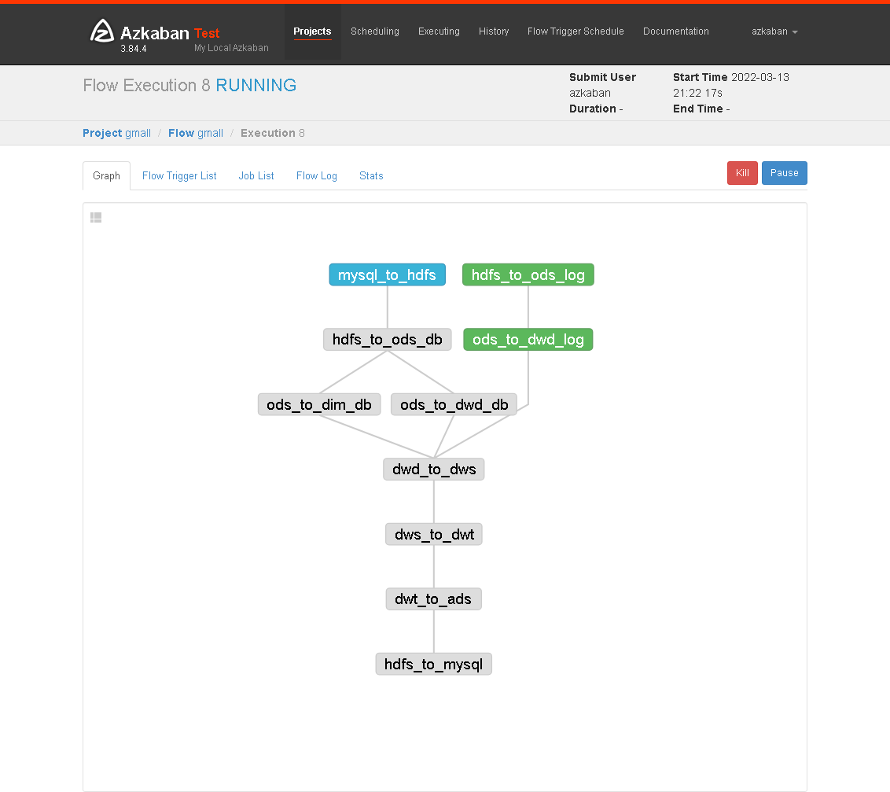

### 安装

##### 配置mysql

```
#解压安装包
tar -zxvf azkaban-db-3.84.4.tar.gz
tar -zxvf azkaban-exec-server-3.84.4.tar.gz
tar -zxvf azkaban-web-server-3.84.4.tar.gz
#必须将这三个模块移到同一个目录下，例如，移动到/opt/module/azkaban下
#安装mysql，创建database及azkaban用户
mysql -uroot -p000000
create database azkaban;
CREATE USER 'azkaban'@'%' IDENTIFIED BY '000000';
GRANT SELECT,INSERT,UPDATE,DELETE ON azkaban.* to 'azkaban'@'%' WITH GRANT OPTION;
#修改MySQL包大小；防止Azkaban连接MySQL阻塞
sudo vim /etc/my.cnf
[mysqld]
max_allowed_packet=1024M
sudo systemctl restart mysqld
```

##### 配置exec

```
vim /opt/module/azkaban/azkaban-exec/conf/azkaban.properties
#内容如下，注意时区，mysql连接，web服务端口
#...
default.timezone.id=Asia/Shanghai
#...
azkaban.webserver.url=http://hadoop102:8081

executor.port=12321
#...
database.type=mysql
mysql.port=3306
mysql.host=hadoop102
mysql.database=azkaban
mysql.user=azkaban
mysql.password=000000
mysql.numconnections=100
#分发到其他机器，用于分布式几点工作，但注意每台机器要有任务需要的软件，如hive、sqoop、
xsync /opt/module/azkaban/azkaban-exec
#进入每台机器
bin/start-exec.sh
#验证exec的状态
curl -G "hadoop102:12321/executor?action=activate" && echo
```

##### 配置webserver

```
vim /opt/module/azkaban/azkaban-web/conf/azkaban.properties
#注意mysql信息
...
default.timezone.id=Asia/Shanghai
...
database.type=mysql
mysql.port=3306
mysql.host=hadoop102
mysql.database=azkaban
mysql.user=azkaban
mysql.password=000000
mysql.numconnections=100
...
azkaban.executorselector.filters=StaticRemainingFlowSize,CpuStatus
#修改web服务的用户信息
vim /opt/module/azkaban/azkaban-web/conf/azkaban-users.xml
<azkaban-users>
  <user groups="azkaban" password="azkaban" roles="admin" username="azkaban"/>
  <user password="metrics" roles="metrics" username="metrics"/>
  <user password="atguigu" roles="admin" username="atguigu"/>
  <role name="admin" permissions="ADMIN"/>
  <role name="metrics" permissions="METRICS"/>
</azkaban-users>
#启动
bin/start-web.sh
到8081端口页面登录即可
```

### 创建新项目

```
#创建azkaban.project，写入如下内容
azkaban-flow-version: 2.0
#创建basic.flow文件，写入如下内容
nodes:
  - name: jobA
    type: command
    config:
      command: echo "Hello World"
将两者打包到同一个zip下，在azkaban创建project时upload即可。
```

###### gmall例子

>一级节点nodes
>
>后续有name，type，config-commond构成，指定任务名称，任务类型，任务的命令。使用depends_on控制任务的依赖关系。dt为可以通过azkaban输入指定的变量，在每次execute flow时可以指定。

```
nodes:
  - name: mysql_to_hdfs
    type: command
    config:
     command: /home/atguigu/bin/mysql_to_hdfs.sh all ${dt}
    
  - name: hdfs_to_ods_log
    type: command
    config:
     command: /home/atguigu/bin/hdfs_to_ods_log.sh ${dt}
     
  - name: hdfs_to_ods_db
    type: command
    dependsOn: 
     - mysql_to_hdfs
    config: 
     command: /home/atguigu/bin/hdfs_to_ods_db.sh all ${dt}
  
  - name: ods_to_dim_db
    type: command
    dependsOn: 
     - hdfs_to_ods_db
    config: 
     command: /home/atguigu/bin/ods_to_dim_db.sh all ${dt}

  - name: ods_to_dwd_log
    type: command
    dependsOn: 
     - hdfs_to_ods_log
    config: 
     command: /home/atguigu/bin/ods_to_dwd_log.sh all ${dt}
    
  - name: ods_to_dwd_db
    type: command
    dependsOn: 
     - hdfs_to_ods_db
    config: 
     command: /home/atguigu/bin/ods_to_dwd_db.sh all ${dt}
    
  - name: dwd_to_dws
    type: command
    dependsOn:
     - ods_to_dim_db
     - ods_to_dwd_log
     - ods_to_dwd_db
    config:
     command: /home/atguigu/bin/dwd_to_dws.sh all ${dt}
    
  - name: dws_to_dwt
    type: command
    dependsOn:
     - dwd_to_dws
    config:
     command: /home/atguigu/bin/dws_to_dwt.sh all ${dt}
    
  - name: dwt_to_ads
    type: command
    dependsOn: 
     - dws_to_dwt
    config:
     command: /home/atguigu/bin/dwt_to_ads.sh all ${dt}
     
  - name: hdfs_to_mysql
    type: command
    dependsOn:
     - dwt_to_ads
    config:
      command: /home/atguigu/bin/hdfs_to_mysql.sh all

```


### 使用效果



```
它可以从整体的角度监控shell任务的执行情况，获取执行的日志，执行到了哪一个流程，并以图形化的方式直观展示。编写好shell脚本后，通过web页面就可以远程管理任务的执行。
```

# Azkaban基础用法

>数据分析系统中包含shell脚本，hive脚本等，这些脚本有前后依赖关系，而且数量众多，使用azkaban可以更好的管理它们的依赖关系，以及监测他们的执行进度，查看错误等。而且还可以定时执行，以及邮件提醒，即使处理异常情况。
>
>简单的任务调度可以通过编写shell脚本和crontab来定义，复杂的任务调度可以使用Ooize、Azkaban、Airflow、DolphinSecheduler等。Ooize比Azkaban更重量级，功能全且复杂。

## 基本架构

>Azkaban可以配置一个master和多个executor，但是每个executor执行shell脚本所需的环境，必须在每个节点都配置，或者通过指定结点让任务在特定结点执行。

## Work Flow编写

>通过编写work flow可以自定义管理任务，将编写好的basic.flow文件和azkaban.project文件压缩为zip，并上传到web项目，就可以完成任务的建立。

```
#azkaban.project内容，指定版本
azkaban-flow-version: 2.0
```

```
#基础实例,type表示执行作业的方式，config未job的配置。
nodes:
  - name: jobA
    type: command
    config:
      command: echo "hello"
#指定依赖
  - name: jobB
    type: command
    dependsOn:
      -jobA
    config:
      command: echo "hello jobB"
#自动重试，重试次数3，重试间隔10000。
   - name: jobC
    type: command
    config:
      command: echo "hello jobB"
      retries: 3
      retry.backoff: 10000
#java程序
   - name: jobC
    type: javaprocess
    config:
      Xms: 50M
      Xmx: 100M
      java.class: com.atguigu.AzTest
#条件执行，当某个参数满足时，执行此任务,wk是输出参数。
#jobA.sh的内容如下，判断的条件参数需要输出到$JOB_OUTPUT_PRO_FILE
echo "{\"wk\":`date+%w`}">$JOB_OUTPUT_PRO_FILE
#条件执行，配置文件如下
  - name: jobC
    type: javaprocess
    config:
      Xms: 50M
      Xmx: 100M
      java.class: com.atguigu.AzTest
    condition: ${jobA:wk}== 1
```


