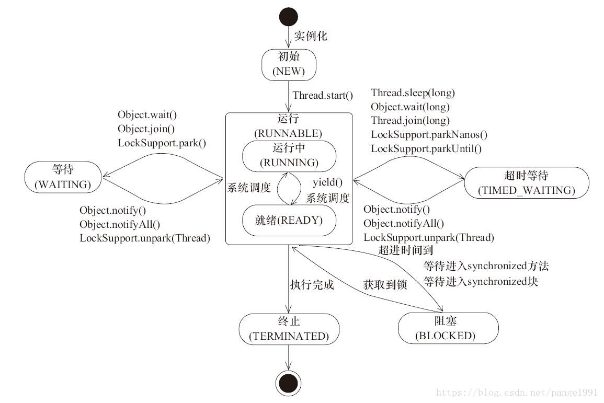

# 八股文面试资源
>https://www.yuque.com/liujie7999/ufyaq4/agdqqs
>https://xiaolincoding.com/
>大数据八股：https://blog.csdn.net/qq_43061290/article/details/124822293

>是什么、组成模块、工作原理（理论八股）？什么功能、场景？怎么使用？（api）

# 求职
>https://www.yingjiesheng.com/zhuanye/jisuanji/wuhan/
>51job:https://xym.51job.com/hyhd/PC/#/home
# 数仓项目
>https://developer.aliyun.com/article/782868

[TOC] 
# 端口
9870 9000 18088  
8088 
8081 

# 配置文件
core-site.xml hdfs-site.xml mapred-site.xml yarn-site.xml capacity-scheduler.xml fail-scheduler.xml 
spark-default.conf spark-env.sh
flink-conf.yml sql-cli-defaults.yaml
workers

# es
>match：分词查询
>term：精确查询
>fuzzy：模糊查询：基于编辑距离
>wildcard：通配符查询
>bool：使用must、should、must_not、filter连接简单查询的逻辑

# 1012理论知识
## mysql存储的数据量过大
>当单表的数据量几千万时，就会影响sql执行的效率。当单表达到百万级别时，性能就会一定程度的下降。可以通过横向拆分、竖向拆分减少每个表中的数据量，从而提升单个表的查询性能，这些表可以被拆分到同一个数据库、也可以放到不同的数据库中，甚至不同的数据库实例中。
>分库不是一个单独的操作，当数据库实例达到了并发上限，并发上限受到机器磁盘、网络和mysql配置的影响。这时就需要创建多个数据库实例，分担并发的读写请求。
## 读写分离，主从复制
>通过开启多台数据库实例，一台作为master，其他作为salve，主数据库负责写请求，从数据库负责读请求。通过开启数据库的binlog功能，主数据库会针对数据的修改生成日志，并开启binlog进程，等待从数据库拉取binlog日志，并同步主数据库的数据。
>适用场景：
>1数据库性能无法满足要求，通过主从复制分担主数据库的读请求的压力。
>2容灾备份，通过在从数据库备份数据，并放置到不同地理位置的机房，实现数据容灾。
>3基于第一条，可以在从数据库上通过读请求进行数据分析，不对主服务造成压力。
### 主从同步时延问题
>当主库并发较高，产生大量binlog，查过了slave单线程的处理能力，机会导致出现延迟。
>1：通过开启多线程，加快处理速度。
>2：通过ack机制，让从库ack后主库才写入成功。
>可以使用show slave status排查主从复制故障
## 慢查询

## 峰值数据写入mysql
## redis的淘汰策略
## git tag
## 索引优化
## kafka为什么快
## flink水位线及对齐
## regionserver如何划分数据
## flink的sql解析原理
## interval join
## 树的度和结点数
## 图的度和结点数
## 数据仓库建模设计
## mysql事务redo，undo，mvcc
## 分布式主键
## 并发访问数据库
## 秒杀

# 面试杂项
## 关注工作的方面
>感兴趣的方面：
>1,数据量，数据量更大的业务场景较为复杂，在处理的过程中会碰到各种问题，解决问题的过程中，提升自己数据处理的能力。
>2，数据仓库建模，数据仓库建模就是确定如何构建表，如何确认更新策略，如何划分事实表和维度表，为了达到更好的性能，并完成业务指标的统计。
>3，（）是很有挑战性的，在处理（）的过程中，可以加深对什么的了解。技术和业务的进步，加深对业务的理解，才能编写出符合业务需求的系统。技术的进步，才能通过技术优化系统的性能，提升系统的健壮性。
## 公司了解
>1，公司的产品和业务，主要做什么的以及使用到什么技术。
>2，领域的前景问题
# 0929 springboot整理
## 后缀表达式
https://www.cnblogs.com/dolphin0520/p/3708602.html
## 分页
### mybatis分页
```
#使用pageHelper实现分页
PageHelper.startPage(pageNum,20);
List<LisaTask> resultList=lisaMapper.getTaskFailed();
return new PageInfo<>(resultList, 5);

#自己计算limit范围
int a=(pageNum-1)*pageSize;
int c=pageSize;
int c=pageNum*pageSize;
取 [a,c]范围内的数据，左闭右开。
select * from test limit a,b

#自己计算navigate pages。
int start=pageNum-navigate_size/2;
int end=pageNum+navigate_size/2;
if(start<=0)
{
    start=1;
}
if(end>pageCount)
{
    end=pageCount;
}
for(int i=start;i<end;i++)
{
    navigate.add(i);
}
```
### 实现分页
```
#根据页码计算需要查询哪些信息

#根据页码计算navigate栏应该显示的页码。
```
## 提交
## 登录

# 0927整理
## grep
>http://c.biancheng.net/linux/grep.html
>grep "leo" /etc/passwd
>grep -v "leo" /etc/passwd
>展示所在行号：grep -n leo /etc/passwd 
>展示统计行数：grep -c leo /etc/passwd
>展示匹配行的下行（After）： grep -A 1 leo passwd      
>展示匹配行的之前行(Before)：grep  -B 1 leo passwd
>展示匹配行的上行和下行:grep -C 1 leo passwd
>忽略大小写:grep -i "LEO" passwd
>查找多个包含特定字符的文件：grep -l "first" *.txt 返回所有包含first的文件名称。
>-L 是查找的取反，返回不包含特定字符的文件：grep -L "first" *.txt
>正则：查找以leo开头的行 grep '^leo' passwd , 查找以bash结尾的行：grep 'bash$' passwd
## String StringBuffer StringBuilder
>String 用于描述字符串，其创建的字符串内容不可变。每次对String的操作生成新的对象，优点：当没有修改操作时，直接引用常量池中的数据，效率高。缺点：修改频繁时，会创建很多对象，且效率低。
>StringBuffer 用于存储字符串，可以变更字符串内容。并且其是线程安全的，使用了sychronized关键字。适用多线程环境使用，有sychronized关键字。
>StringBuilder，可以变更字符串内容，但是线程不安全。适合单线程环境使用，效率高。
### 创建
>如下程序输出 false,true,true。因为str1.intern()返回地仍然是常量池中的数据。
```
String str1="hello";
String str2="hello";
String str3=new String("hello");
String str4=new String("hello");
System.out.println(str3==str4);
System.out.println(str1==str2);
System.out.println(str1.intern()==str1);
```
### intern
>返回String字面量，即在字符串常量池的变量。
>如下程序的执行结果为true，false，true。intern当常量池中存在对应字符串直接返回该存在的值或引用，如果不存在则会将堆字符串实例的引用添加到常量池。因为第二次 “计算机软件”已经在常量池中，并且存储的是堆变量str5的地址，那么str5和str52自然不相等。第三个由于str53.intern()返回的仍然是str5的堆地址，所以为true。

```
        String str5=new StringBuilder("计算机").append("软件").toString();
        System.out.println(str5.intern()==str5);

        String str52=new StringBuilder("计算机").append("软件").toString();
        System.out.println(str52.intern()==str52);

        String str53=new StringBuilder("计算机").append("软件").toString();
        System.out.println(str53.intern()==str5);
```

## try finally return
>有无return，有无异常，数据什么类型。
>执行的顺序，值的修改。
### try中有return
>会先执行try中return之前的语句，然后执行finally中的语句，最后执行try中的语句。
>finally中的修改是否生效：如果是基础类型，不生效。如果是引用类型，可以生效。基本数据类型无法生效，基本类型的封装类都无法修改，因为其的value属性都是final类型的，每次修改都是创建新的对象，所以在finally中修改本质没有修改原来的值。

### finally中带有return
>finally带有return的时候，try中的return会失效，在执行完finally的return之后，就不会再执行try中的return。这种写法可以通过，但是会被警告，破坏了程序的完整性，一旦finally出现异常，会导致catch中的异常被覆盖。即，catch种抛出了异常，但是finally进行了return，上层的调用程序就无法捕获到异常。

### catch有return
>在try中发生异常，那么就会跳转到catch，将catch中return之前的代码执行完，然后执行finally，再执行catch中的return。

## 生产者 消费者 多线程
```

```
## 多线程
>object : sychronized,            wait,notify,notifyALL
>concurrent : ReentrantLock，condition,  await,singnal，singnalAll
>thread:  sleep，join
>
>blocked： sychronized 
>waiting: wait，join，await
>time_waiting: sleep，带时间参数的wait


## 二叉树最大路径
>以及 最大乘积连续子数组
>都是求最值问题，但是其结果出口不同。对于二叉树最大路径，递归的每个节点root，都需要计算一遍最大路径，并与全局的max值比较。
>而最大乘积连续子数组，对于每个状态都需要计算max，与全局值比较。
>这种问题的特点就是，结果可以在任何递归节点产出，也可以在任何状态产出，它是由多个子问题构成的。例如最大路径本质是在求：以任意一个树中的结点为根，经根的最大路径中，挑出最大值，那么只需要遍历这些根，并计算经过根最大路径，而经过根的最大路径可以有左右子树计算出来。

# 0925 Flink安全信息整理
## 爬虫及解析
>网络报告爬虫，恶意软件爬虫，漏洞爬虫
>网络报告从freebuff，安全客获取，再借助nlp技术完成抽取，并放入es数据库中
>恶意软件从virushshare获取，借助沙箱动态行为分析，封装为json也存储到es中
>漏洞从红后，绿盟，安全客获取，通过beautiful解析后，放入es中。

### 碰到的问题
>1,ip被封，使用西刺ip代理地址，从代理池中挑选ip进行代理访问。
>2，accept-encoding:使用br压缩格式，request无法解析，去掉br，保留gzip,default等。
>3，为p2p网络添加tracker，帮助找到更有效的peers节点，加快下载速度。
## web
### 分页信息
### 提交接口
### 导入接口
### 导出接口
### nginx
### 碰到的的问题
>1,spring boot maxfile-size限制multiplart file的上传大小
>2，mysql将rewriteBatchedStatements设为true，减少网络交互次数，提升批量插入效果。
>3，max request body。 错误码500 Internal server error。404 找不到。跨源请求
## 实时指标
>包括攻击者，软件架构，漏洞，软件类型，地区，ip等指标的聚合

# 0922 理论知识
## hive overwrite 动静态分区
```
#静态分区
insert overwrite table dwt_test partition(dt='2022-09-22', part='2')
select id,dt,part from dws_test

#动态分区
insert overwrite table dwt_test partition(dt=dt, part=part)
select id,dt,part from dws_test

#动静结合
insert overwrite table dwt_test partition(dt='2022-09-22', part=part)
select id,dt,part from dws_test
```
## java 顺序表
```
#优先队列
PriorityQueue<Integer> pqueue=new PriorityQueue<>((o1, o2)->( o1.compareTo(o2)));
#栈
Stack<Integer> stack=new Stack<>();
stack.push();stack.peek();stack.pop()
#队列
Queue<Integer> queue=new Queue<>();
queue.offer();queue.peek();queue.poll();
queue.add();queue.elelment();queue.remove();
```
## 排序算法 时间复杂度 稳定性

>10种常见排序

>排序算法        平均时间复杂度   最好情况   最坏情况  空间复杂度   排序稳定性   排序方式

>冒泡            O(n^2)          O(n)       O(n^2)   O(1)       稳定          In-place

>快速排序        O(nlogn)        O(nlogn)    O(n^2)  O(logn)    不稳定         In-place
>
>归并            O(nlogn)        O(nlogn)   O(nlogn) O(n)       稳定          Out-place
>
>堆排序          O(nlongn)       O(nlongn)  O(nlongn) O(1)      不稳定        In-place
>
>选择排序        O（n^2)         O(n^2)     O(n^2)    O(1)      不稳定         In-place
>
>插入排序        O（n^2）        O(n)       O(n^2)    O(1)       稳定          In-place
>
>希尔排序        O(nlogn)    O(n(logn)^2) O(n(logn)^2) O(1)     不稳定         In-place
>
>计数排序        O(n+k)        O(n+k)        O(n+k)     O(k)    稳定          Out-place  
>  
>桶排序          O(n+k)        O(n+k)        O(n^2)     O(n+k)  稳定          Out-place 
> 
>基数排序        O（n*k)       O（n*k)        O（n*k)    O(n+k)   稳定          Out-place
>
>选择排序的不稳定性不来自挑选最大最小值的过程，而是由于要原地排序，所以要交换开头的值和查找到的最大最小值，导致改变了数组顺序。
>
>希尔在分组增量变小时，进行插入排序，但是无法区分两组原始数据相同值元素的顺序。比如1357时一组，他们组间是稳定的，但是当与2468合并时，可能1号值与6号值一样，并且1号值原本在6号值后边，插入排序后就乱序了。

## 浮点数存储
>使用正负号、尾数、指数来表示浮点数，即尾数乘以2的指数次方，再取符号位，就得到了具体值。
>对于4字节浮点数，其符号位占据一位，指数占据8位，其余都是尾数位。
>对于8字节浮点数，其符号位占据一位，指数占据11位，其余都是尾数位。
>关于精度损失的问题：
>由于浮点数无法精确表示十进制的数字，例如0.6，其表示为0.10011001......。因为2进制小数点后为：0.5、0.25、0.125、0.0625、0.03125。也就是说当创建一个浮点数为0.6，那么它存储的就是非精确的值了。

## spark cache、persist、checkpoint
>cache：直接将rdd算子的缓存到计算结点的堆内存种，其也是懒执行的，只有action算子触发后，才会将rdd缓存到内存中。
>persist：可以指定缓存的位置，当指定MEMORY_ONLY时，就是cache一样的功能。还可以指定MEMORY_AND_DISK,DIS_ONLY,以及是否序列化和保存的副本数量。
>checkpoint:将快照保存到外部存储，并切断血缘关系，建议使用checkpoint时也要使用cache，这样可以直接读取cache的数据进行checkpoint，否则checkpoint会从头计算一遍。checkpoint相比于cache：1checkpoint会切断血缘关系2checkcpoint一般使用hdfs等容错性高的存储3

## hdfs组件、yarn组件
>NameNode：管理hdfs目录和文件元信息，元信息包括目录名称、权限、副本等，这些原信息保存在内存中用于快速访问。为了容错，在内存中也有对应快照，使用fsimage和edits文件，两者都在namenode.dir的current目录下。通过定时的合并这两个文件获取最新的fsimage。
>SecondarynameNode：负责帮助NameNode和合并fsimage和edits文件。
>Datanode：存储具体的hdfs block，要保证数据块的完整性和正确性，会通过校验和、摘要算法等进行检测，并定时向NameNode汇报block信息。

>ResourceManager：负责响应应用程序的资源请求，接受NodeManager汇报的结点信息，跟踪集群中活动结点和资源的数量。其主要分为调度器和应用程序管理器，调度器可以使用不同的调度策略分配资源和启动任务。
>NodeManager：负责单台机器的资源管理、任务监视等。包括磁盘、内存、cpu等信息。
>ApplicationMaster：用于请求资源创建task，监视任务执行情况，重启启动失败的任务。
>Container：包括内存、cpu等。应用程序必须运行在container种。
>JobHistoryServer：可以读取存储在hdfs上的日志数据，并提供给页面访问。

## ResourceManager调度器
### 先进先出调度器 FIFO
>单队列，根据作业提交的先后顺序，先来先服务。
>优点：逻辑简单
>缺点：不支持多队列，生产环境使用少
### 容量调度器 Capacity Scheduler
>为不同容量预留资源，支持多队列，为每个队列分配资源，队列内部使用FIFO。
>优点：保证了不同容量的资源都可以执行
>缺点：但是浪费了部分资源，当其中一种资源没有人使用时，仍要占用

### 公平调度器 Fair Scheduler
>通过一个权重分配公平的分配资源，每当提交一个新资源时，之前的程序释放部分资源给新程序使用。当新来的执行完后，会返还资源给之前的应用，知道之前的应用执行完成。可以设置多个队列，并按照百分比分配资源给队列，队列再分配给具体的应用。队列内部，根据公平调度的方法分配资源。
>优点：同队列共享资源，在时间尺度上获得公平的资源
>缺点：多个应用共同执行，降低了执行的效率。

```
#指定调度器
vim yarn-defualt.xml
<property>
    <description>The class to use as the resource scheduler.</description>
    <name>yarn.resourcemanager.scheduler.class</name>
<value>org.apache.hadoop.yarn.server.resourcemanager.scheduler.capacity.CapacityScheduler</value>
</property>
```

```
#配置多队列的容量调度器
#capacity-scheduler.xml中都是关于容量调度器的配置信息，相应地公平调度器也有自己的配置文件，fair-scheduler.xml.
vim capacity-scheduler.xml
<property>
    <name>yarn.scheduler.capacity.root.queues</name>
    <value>default,hive</value>
    <description>
      The queues at the this level (root is the root queue).
    </description>
</property>


<!-- 指定hive队列的资源额定容量 -->
<property>
    <name>yarn.scheduler.capacity.root.hive.capacity</name>
    <value>60</value>
</property>

<!-- 用户最多可以使用队列多少资源，1表示 -->
<property>
    <name>yarn.scheduler.capacity.root.hive.user-limit-factor</name>
    <value>1</value>
</property>

<!-- 指定hive队列的资源最大容量 -->
<property>
    <name>yarn.scheduler.capacity.root.hive.maximum-capacity</name>
    <value>80</value>
</property>

<!-- 启动hive队列 -->
<property>
    <name>yarn.scheduler.capacity.root.hive.state</name>
    <value>RUNNING</value>
</property>

<!-- 哪些用户有权向队列提交作业 -->
<property>
    <name>yarn.scheduler.capacity.root.hive.acl_submit_applications</name>
    <value>*</value>
</property>

<!-- 哪些用户有权操作队列，管理员权限（查看/杀死） -->
<property>
    <name>yarn.scheduler.capacity.root.hive.acl_administer_queue</name>
    <value>*</value>
</property>

<!-- 哪些用户有权配置提交任务优先级 -->
<property>
    <name>yarn.scheduler.capacity.root.hive.acl_application_max_priority</name>
    <value>*</value>
</property>

```

## assic，utf，unicode编码
>ASCII使用7位或8位数表示128种或256种可能的字符，主要表示所有大小写字母，数字0到9、标点符号、美式英语中的特殊控制符号等。不支持中文
>GBK编码：中国人定义了当字符小于127时，与ASSIC相同，但是大于127的字符连接在一起时，就表示一个汉字。第一个字节称为高字节，第二个字节称为低字节。
>Unicode字符集：由于世界国家很多，为了统一编码，ISO组织使用统一的编码方案，它是一套字符集。其规定两个字节表示一个字符，从而表示所有的字符。，
>UTF-8：由于unicode存在浪费空间的问题，定义了一种可以解码和编码的规则，降低了占用的空间和带宽。
## jvm内存参数
>1. -Xms 1024m　　//设置堆的最小值
>2. -Xmx 2048m   //设置堆的最大值
>3. -Xmn 512m    //设置新生代大小
>4. -XX:MetaspaceSize=256m //设置初始Metaspace空间的大小
>5. 永久带的初始值-XX:PermSize及最大值-XX:MaxPermSize
>6. -Xss   每个线程的Stack大小，不熟悉最好保留默认值；
>7. 堆中新生代与老年代的比率，该值可以通过参数 –XX:NewRatio 来指定
>8.  新生代中eden与survivor比率，–XX:SurvivorRatio 

## kafka参数
>buffer.size  生产者缓存队列大小
>linger.ms 生产者触发发送的时间间隔
>batch.size 生产者发送的批次大小，凑满一个batch就发送数据。
>maxRequestSize 请求最大大小

## LCS
>找到一个子序列，index单调递增。并不是前缀，不需要index连续。

## tcp三次握手
>为什么不是两次：如果客户端发起的syn请求，在网络延迟了很久才到达服务端，客户端这时很久没有收到服务端的响应报文，就会认为这个链接请求已过时。而服务端并不知道这是一个延迟的消息，它会直接发送ack报文，并认为建立链接，这就是两次握手的问题，三次握手就不会有这个问题。
>tcp的三次握手时，客户端状态从CLOSED->SYN-SENT->ESTAB-LISHED,服务端从LISTEN->SYN-RCVD->ESTAB-LISHED
>tcp的四次挥手时，客户端状态从ESTAB-LISHED->FIN-WAIT-1->FIN-WAIT-2->TIME-WAIT->CLOSED
>服务端状态从ESTAB-LISHED->CLOSED-WAIT->LAST-ACK->CLOSED
>
>为什么TIME_WAIT状态经过2MSL返回CLOSE：为了防止客户端的ACK报文丢失，导致服务端无法从LAST_ACK切换到CLOSED状态，这时服务端会不断发送FIN报文，客户端收到FIN报文后，就意识到ACK报文丢失了，所以需要重发ACK。所以说需要等待2MSL时间，如果这段时间没有收到重发的FIN说明ACK已经抵达了服务端，可以关闭链接了。


# 0922 Flink推荐整理
## 整个流程
>日志数据在磁盘落盘后，通过flume采集到kafka，日志数据包括页面数据、动作、曝光、启动、错误。业务数据主要是订单表中的数据，包括订单id、商品id、用户id，订单明细表，商品表，用户表。还有登录表的业务数据。评价表的业务数据。
>对于日志数据：
>1.读取到kafka后，使用FlinkTI统计用户日活、uvpv、
>对于业务数据：
>1.使用Flink connector读取，统计topn数据，并将结果写入redis。另外，统计用户和商品的记录到hbase的u_historty和p_history。
>2.统计用户的标签信息到hbase的user表。统计商品的标签信息，将其存储到hbase的prod表中。使用Timer定时执行计算程序，计算用于协同推荐的相似度系数，然后存入mysql中。当需要使用时，直接使用后端读取mysql信息。
>3.topN商品，读取kafka，统计商品数量。
>4.用户首单，读取订单表的 topic，统计首单数量。
>5.使用Flink CEP检测是否有连续登录失败，结果写入redis中，表的信息包括用户id、登录状态、ip、时间戳。
>7.读取评价表的kafka topic，查看是否有非法的keyword，如果有则将结果写入mysql，再进行具体操作。
## 指标计算
### 日志数据
#### 用户日活
>首先将json数据解析为实体类，然后对流中的数据逐条处理，通过在redis中创建一个set对象，set对象中存储userid，表示这个用户是否为今天第一次登录，可设置24小时过期时间，自动失效。当到来数据时，通过sadd添加数据，如果返回1说明是第一次添加为今日第一次活跃。以分区为单位进行处理，创建一次链接，进行多次查询。
#### uvpv
>按照页面id keyby，然后开窗统计每个key分区上聚合有多少.
### 业务数据
#### 用户和商品历史统计数据（用于协同）
>u_history:属性有user_id,product列簇，该列簇下存储product的id等信息。
>p_history:属性有product_id,user列簇，该列簇下存储user的id等信息。
>通过flink任务将信息写入hbase的u_history、p_history表之后，编写一个TimerTask，让其每隔15分钟执行一次。TimerTask内容为，将u_history的部分数据查询出来，为每个user都启动一个线程去计算它与其他用户的相似度。从u_history取决于数据量以及推荐逻辑选取的时间范围，比如推荐认为近一个月的信息比较有效，就只取近一个月的数据出来计算相似度。相似度计算就是对两个用户的向量计算余弦相似度，也可以采用其他表示相似度的方法，例如欧式距离等。

#### 用户标签
>就是将用户购买的商品的属性作为列并，每购买一个具有该属性的商品就increamColumn，属性包括color，style，cuntry。
#### 商品标签
>就是将购买的该商品的用户属性作为列并，每有一个用户购买该商品就increamColumn，属性包括age，sex。

#### 商品topn
>将数据转为实体类，然后添加时间戳水位线assignTimestampsAndWatermarks。通过使用product_id生成keyedStream，再使用滑动窗口并聚合。聚合完成后得到productId，product聚合次数、windowEndTime，这样还缺少排名信息。所以将其按照windowEnd分区，并在分区内根据商品购买次数进行排名。创建keyedStream后，注册一个内存状态List，List保存窗口内的所有商品统计信息，还需要注册一个TimerService，让水位线超过WindowEnd时，触发计算，将List内存状态中的所有数据取出来进行排名。
>
>也可以通过不keyby的windowAll实现聚合，然后自己在process函数中利用Map统计每个商品的数量，然后输出。
#### 用户首单
>使用hbase存储，因为考虑到数据量的问题，以及需要保存的时效问题。hbase中维护已经出现过的首单用户id。
>以分区为单位进行处理，创建一次链接，进行一次查询。在查询结果中比对分区数据，得到今日的首单用户信息。对于同一分区出现了多次同一个user_id，那么只有时间戳最小的为首单。
#### Flink CEP 连续失败检测
>将数据转为实体类，然后使用begin,next,next,where等CEP函数接口，定义检测的规则。
#### Flink广播流实时关键词检测
>为了检测评论中的非法关键词，我们需要对采集到kafka的评论数据进行处理。

# 0918 项目整理
## 电商
### dwd层设计
#### 事务型事实表-增量
>用于只有新增数据，不会对旧数据修改。涉及的表：订单明细表，退单表，评价表
>关于订单明细表：当我们将购买物品时，需要选定好物品后点击“提交订单”，然后就会生成订单号、订单明细，后续还有支付、退款、退单等状态。订单一旦创建，后续的流程并不会修改订单明细表，而是修改订单表的状态，订单明细中存储的是商品id、商品数量、活动id、优惠券id。
```
insert overwrite table dwd_comment_info partition(dt='2020-06-15')
select
    id,
    user_id,
    sku_id,
    spu_id,
    order_id,
    appraise,
    create_time
from ods_comment_info where dt='2020-06-15';
```
#### 周期型快照事实表-全量
>数据量不大，有增加有修改旧数据的。涉及的表：收藏表，加购表，       商品一级品类、二级品类、三级品类，优惠券表，活动表

#### 累积型快照事实表-增量及变化
>数据量大，有增加有旧数据的修改。订单表，支付表，退款表，优惠券领用表。

### 指标计算
#### 用户统计
>用户常规指标聚合：新增用户数、新增下单用户数、下单总金额、下单用户数、未下单用户数
>原本在dwt中，1日，7日，30日粒度的数据在同一行，通过explode可以将array中的元素变为多行。然后再借助login_date_first、order_date_first、order_final_amount计算指标.
```
insert overwrite table ads_user_total
select * from ads_user_total
union
select
    '2020-06-14',
    recent_days,
    sum(if(login_date_first>=recent_days_ago,1,0)) new_user_count,
    sum(if(order_date_first>=recent_days_ago,1,0)) new_order_user_count,
    sum(order_final_amount) order_final_amount,
    sum(if(order_final_amount>0,1,0)) order_user_count,
    sum(if(login_date_last>=recent_days_ago and order_final_amount=0,1,0)) no_order_user_count
from
(
    select
        recent_days,
        user_id,
        login_date_first,
        login_date_last,
        order_date_first,
        case when recent_days=0 then order_final_amount
             when recent_days=1 then order_last_1d_final_amount
             when recent_days=7 then order_last_7d_final_amount
             when recent_days=30 then order_last_30d_final_amount
        end order_final_amount,
        if(recent_days=0,'1970-01-01',date_add('2020-06-14',-recent_days+1)) recent_days_ago
    from dwt_user_topic lateral view explode(Array(0,1,7,30)) tmp as recent_days
    where dt='2020-06-14'
)t1
group by recent_days;

```
#### 留存率
>以2022-09-20的7日留存率为例,即第一次登录是7日前，并且最后一次登录是今天。统计时，一般统计多个，如从7日留存，6日一直到1日。sql语句如下：
``` 
# dwt 该日分区存储的是该日粗粒度的统计及部分属性信息。first_login表示该日进行注册。last_login表示最后一次活跃。
#retention_day 表示留存多少天，6天就是6日留存。retention_count表示留存的人数.all_new_count表示n天前总新增人数。retention_rate表示留存率。
select 
  '2022-09-20' dt,
  first_login create_date,
  datediff('2022-09-20',first_login) retention_day,
  sum(if(last_login='2022-09-20',1,0)) retention_count,
  count(*) all_new_count,
  cast(sum(if(last_login='2022-09-20',1,0))/count(*),decimal(16,2)) retention_rate
from dwt_user_topic 
    where dt='2022-09-20'  first_login>=date_add('2022-09-20',-7) and first_login<'2022-09-20'
group by first_login;
```
#### 流失
>就是last_login=七天前，最后登录时间为7天前，那么就计入今天的流失人数。
```
select
  '2022-09-20'  dt,
  count(*) churn_count,
  from dwt_user_topic
  where dt='2022-09-21'
where last_login=date_add('2022-09-20','-7')
```
#### 回流
>7日之内未活跃，那么称为流失了。那么回流的定义就是8日没有活跃，并且今天活跃了，称为回流。也就是说需要每个用户的倒数第二次登录时间为7日前，最后一次登录为今天。.
```
# dwt 该日分区存储的是该日1，7，30粒度的聚合信息。
#那么这样取，得到的就是2022-09-19日的聚合信息，在19日及之前最后一次登录时间，也就是倒数第二次登录时间。倒数第一次登录时间就是2022-09-20，将两者相减得到相距时间，判断是否>=8天，是否为回流用户。
select  
  user_id,
  count(*)
  from
  (
    (select 
        user_id,
            login_date_last login_date_previous
        from dwt_user_topic
        where dt=date_add('2022-09-20')
    )
    join
    (select
        user_id,
        login_date_last login_date_previous
    from dwt_user_topic
    where dt=date_add('2022-09-20',-1)
    )
    on t1.user_id=t2.user_id
  )t3
  where date_gap>=8;
```
#### 行为漏斗
>进行每个行为的用户数各有多少，进入home页、进入详情页、下单。explode将一行扩充为3行，三组数据分别用于计算不同粒度的行为数。然后对count求和，得到进行不同行为的用户数。
```
    select
        '2020-06-14' dt,
        recent_days,
        sum(if(cart_count>0,1,0)) cart_count,
        sum(if(order_count>0,1,0)) order_count,
        sum(if(payment_count>0,1,0)) payment_count
    from
    (
        select
            recent_days,
            user_id,
            case
                when recent_days=1 then cart_last_1d_count
                when recent_days=7 then cart_last_7d_count
                when recent_days=30 then cart_last_30d_count
            end cart_count,
            case
                when recent_days=1 then order_last_1d_count
                when recent_days=7 then order_last_7d_count
                when recent_days=30 then order_last_30d_count
            end order_count,
            case
                when recent_days=1 then payment_last_1d_count
                when recent_days=7 then payment_last_7d_count
                when recent_days=30 then payment_last_30d_count
            end payment_count
        from dwt_user_topic lateral view explode(Array(1,7,30)) tmp as recent_days
        where dt='2020-06-14'
    )t1
    group by recent_days
```

#### 访客统计
>这里需要划分会话，判断那些记录属于同一个会话。
>当按照ts排序后，每当出现一个last_page_id为空的，说明是新开了会话。所以会话id通过取最后一个last_page_id为空的的记录的时间戳计算，将mid_id和ts拼接起来表示一个会话。
```
 concat(mid_id,'-',last_value(if(last_page_id is null,ts,null),true) over (partition by recent_days,mid_id order by ts)) session_id
```

#### 路径分析
>先通过开窗划分会话，然后通过开窗取下一行作为target， lead(page_id,1,null) over (partition by recent_days,session_id order by ts) target。并且取到step，row_number() over (partition by recent_days,session_id order by ts) step。
```
insert overwrite table ads_page_path
select * from ads_page_path
union
select
    '2020-06-14',
    recent_days,
    source,
    target,
    count(*)
from
(
    select
        recent_days,
        concat('step-',step,':',source) source,
        concat('step-',step+1,':',target) target
    from
    (
        select
            recent_days,
            page_id source,
            lead(page_id,1,null) over (partition by recent_days,session_id order by ts) target,
            row_number() over (partition by recent_days,session_id order by ts) step
        from
        (
            select
                recent_days,
                last_page_id,
                page_id,
                ts,
                concat(mid_id,'-',last_value(if(last_page_id is null,ts,null),true) over (partition by mid_id,recent_days order by ts)) session_id
            from dwd_page_log lateral view explode(Array(1,7,30)) tmp as recent_days
            where dt>=date_add('2020-06-14',-30)
            and dt>=date_add('2020-06-14',-recent_days+1)
        )t2
    )t3
)t4
group by recent_days,source,target;

```

#### 品牌复购率
>用户购买多次某个商品/用户购买一次某个商品。
>先统计每个用户购买了各种商品多少次，然后按照商品group by，通sum(if(order_count>=2,1,0))/sum(if(order_count>=1,1,0))
```
insert overwrite table ads_repeat_purchase
select * from ads_repeat_purchase
union
select
    '2020-06-14' dt,
    recent_days,
    tm_id,
    tm_name,
    cast(sum(if(order_count>=2,1,0))/sum(if(order_count>=1,1,0))*100 as decimal(16,2))
from
(
    select
        recent_days,
        user_id,
        tm_id,
        tm_name,
        sum(order_count) order_count
    from
    (
        select
            recent_days,
            user_id,
            sku_id,
            count(*) order_count
        from dwd_order_detail lateral view explode(Array(1,7,30)) tmp as recent_days
        where dt>=date_add('2020-06-14',-29)
        and dt>=date_add('2020-06-14',-recent_days+1)
        group by recent_days, user_id,sku_id
    )t1
    left join
    (
        select
            id,
            tm_id,
            tm_name
        from dim_sku_info
        where dt='2020-06-14'
    )t2
    on t1.sku_id=t2.id
    group by recent_days,user_id,tm_id,tm_name
)t3
group by recent_days,tm_id,tm_name;
```


# 0918 框架理论知识
## mapreduce reduce
>如果不设置reduce，系统会默认给定一个reduce，该reduce不进行任何数据处理，生成的文件数量等于MapTask的数量。如果不需要此默认reduce，可以将reduce数量设置为0.
```
conf.setNumReduceTasks(0)
```
### mapreduce流程
>当将jar程序提交到hadoop集群后，会向yarn发送资源请求，yarn分配container资源后，在指定机器上启动AM，driver也运行在该台机器。然后对driver程序进行解析执行，先根据InputPath读取输入文件，然后根据文件大小，以及hdfs块大小、设定的最大、最小块大小确定划分，划分完成一块分片对应于一个MapTask。然后根据本地化原则，在最优的机器上启动对应的MapTask，MapTask根据分配的FileSplit信息，去hdfs读取对应于当前MapTask的数据。然后逐行调用map函数进行处理。
>
>map函数每处理完成一个数据，通过context收集结果。数据会先缓冲到kvbuffer中，当到达kvbuffer的设定比例时，开始触发溢写操作，先对kvbuffer进行分区、排序，都写入一个文件中，然后将同一分区放在连续的空间上，并使用一个单独的索引文件记录每个分区在文件中的起始和终止位置，方便在MapTask完成所有任务后进行多个spill溢写文件分区合并。当MapTask完成所有任务后，就会生成n个文件，n是触发溢写的次数，每个文件包含多个分区的数据，为了进行后续的reduce阶段，需要将这些文件的数据按照分区重新整理到对应的文件中，每个文件发往对应的结点，给reduce使用。由于分区内是有序的，只需要根据之前存储的索引文件查询对应分区，然后进行归并排序。
>
Reduce在某个MapTask完成计算后，就开始拉取其计算结果到对应结点，此过程就是Reduce Read。从多个MapTask上读取的数据需要合并到一起，再逐个传递给reduce函数进行处理，同一个key值的数据，会被同一个reduce函数进行处理，再通过context收集每个key处理的结果。

#### 数据本地性
>由于计算需要对应的数据和计算逻辑，可以通过移动计算的逻辑到对应结点，避免数据在节点之间的传输。
>数据本地性有几个级别：
>1当mapTask和数据在同一个结点时，称为本地级别的数据本地性，是最好的场景。
>2机架内的数据本地性。由于本地级别并不是总能实现，数据迁移是不可避免的。在数据迁移时，尽量让数据和计算在同一个机架上。
>3跨机架，是最差的情况。
#### KvBuffer
>内存缓冲区同时存储了键值对数据及其索引数据kvMeta，kvMeta是一个四元组，（key起始位置，value起始位置，value长度，partition），两者在圆形缓冲区内对向增长，当完成一次溢写。再取两者索引的终点为分割线，并掉头增长。partition、sort过程本质是对索引进行处理。
#### Combine
如果设置了Combine类，就会在spill之前进行combine操作，将同key值的数据提前进行规约，减少数据的条数。

## hdfs写入流程绘图
>1先请求NameNode写入文件，NameNode检查写入权限等合法性，如果合法就将操作的元信息写入缓存，当触发刷盘时写入edit_log文件。
>2NN返回同意请求及可用的DN地址列表，
>3client按照block大小切分文件，将切分好的数据与DN地址列表一起发送给最近的DN，以packet=64kb发送给DN。由该DN与地址列表中的多个DN形成pipline管道，此后，client每向第一个DN写入一个packet，DN就会将这个packet传递个后续的DN，并逐级返回ack信息。
>4写入完毕，关闭连接。发送完成信号给NN。
## spark hive 调优
>调优主要从优化rdd 优化，内存优化方面，参数调优。
>### 资源参数调优
>--driver-mrmory
>--num-executors
>--executor-memory
>--executor-cores
### rdd 优化
>1持久化策略达到性能最优：如果一个rdd的计算时间很长或很复杂，都将这个RDD保存到HDFS上，这样更加安全。
>2使用shuffle时，尽量使用带combiner的算子，例如reduceByKey，aggregateByKey，combineByKey，减少map spill磁盘的数据量，以及reduce copy的数据量。
>3优化小表join：使用map join。
>4使用kryo序列化减少序列化对象空间
>5数据本地化：合适的本地化等待时间，可能影响执行时间。
### 内存优化
>1.spark.memory.fraction,存储内存和运行内存的比例
>2.堆外内存，spark底层shuffle使用netty，netty会使用堆外内存


## 导致shuffle的算子
>1.重分区 ： repartition ， coalesce
>2.byKey： reduceByKey，aggregateByKey，combineByKey sortByKey
>3.两表join、集合操作：intersection，subtract，join 
## hive join
>left join,right join,inner join，full outer join，semi join，cross join
## 窗口函数
> 聚合：sum，count()
> 排序：row_number,dense_rank(),rank()
> 取行：lead(),lag()
> over(partition by order by row between 2 rows precedding and 3 rows following) 
## cartesian product 和 full join
>笛卡尔积不判断join条件，是左边任意一个与右边所有相乘。

# 0915 理论知识
## 哈夫曼树
>每次挑选权重最小的两个结点作为左右结点，新生生成的根节点为两节点之和。然后重复此过程。
>加权路径长度为：叶子权重乘以叶子路径长度，再将每个叶子的加权路径长度加起来。
>总结点数=2*叶子结点数-1。
## 操作系统死锁
  -## 死锁的定义
    当发生死锁时，这组死锁进程中的每一个进程，都在等待另一个死锁进程所占有的资源。

  ### 产生死锁的必要条件
    1互斥：在一段时间内，某资源只能被一个进程占有
    2请求和保持：进程持有一个资源，再去请求其他进程占有的资源。
    3不可抢占：进程持有的资源在进程结束前不可分配给其他进程
    4循环等待：发生死锁的进程之间互相等待其他人持有的资源。

### 预防死锁

  - 破坏请求和保持
    1第一种协议
    进程运行前一次性请求所有资源
    2第二种协议
    允许先申请初期所需的资源，使用完后一次全部释放，再申请所需资源。​

  - 破坏不可抢占
    当进程不能获得所有需要的资源时便处于等待状态，等待期间它占用的资源被隐式的释放重新回到系统的资源列表。当重新获得需要的资源时，才重新启动。
  - 破坏循环等待
    给资源规定一个序号级，按照序号递增的顺序请求资源。若需要多个同类资源必须一起请求。若需要序号低的资源，必须放弃当前持有资源。

### 避免死锁问题-银行家算法
>系统对进程发出每一个系统能够满足的资源申请进行动态检查
并根据检查结果决定是否分配资源
如果分配后系统可能发生死锁,则不予分配,否则予以分配。
这是一种保证系统不进入死锁状态的动态策略。
### 系统安全
  允许动态的申请资源，但是在进行资源分配时，先计算资源分配的安全性，防止系统进入不安全状态。所谓安全状态就是，系统可以按照某一顺序推进进程，分配资源，使每个进程都能顺利完成。若无法找到该顺序，则不分配该资源。

### 利用银行家算法避免死锁

  为了实现银行家算法，每个新进程进入系统时，它必须申明在运行过程中，可能需要的每种资源的最大单元数，其总数应不超过系统所拥有的资源总量。当进程请求资源时，系统先确定是否有足够的资源。若有，再进一步计算资源分配给进程后，系统是否会处于不安全状态。如果不会，再分配给他。

  #### 银行家算法数据结构
    1可利用资源向量Available。这是一个含有m个元素的数组，如Available[j]=k,表示j类资源有k个。
    2最大需求矩阵Max。这是一个n×m的矩阵，它定义了系统中n个进程的每一个进程对m类资源的最大需求量。如Max[i,j]=k,表示进程i需要j类资源的最大数目为k。​
    3分配矩阵Allocation。这是一个n×m的矩阵，它定义了系统中每一类资源当前已分配给每一进程的资源数。如Allocation[i,j]=k,表示进程i分到了j类资源k个。
    4需求矩阵need。Need[i,j]表示，进程i还需要j类资源k个才能完成其任务。​
    Need[i,j]=Max[i,j]-Allocation[i,j]

  #### 银行家算法
    Requesti是进程Pi的请求向量，如果Requesti[j]=k,表示Pi需要K个j类资源,Pi发出请求后，系统按如下步骤：
    1若Requesti[j]<=Need[i,j],转向2.否则认为出错。
    2若Requesti[j]<=Available[j],转向3.否则认为尚无足够资源。
    3若把资源分配给Pi，并分配数据结构的值。
    Available[j]=Available[j]-Requesti[j];
    Allocation[i,j]=Allocatin[i,j]+Requesti[j];
    Need[i,j]=Need[i,j]-Requesti[j];
    4检查是否处于安全状态，否则撤销分配。​​​（就是尝试把资源分配给进程，然后等待进程执行完成并释放资源，重复此过程直到全部分配完成。如果所有进程都可以分配，即finish数组全为true，那么就是安全状态，反之就是非安全状态）

### 安全性算法
>（即把资源全部分出去，看看是否有进程没分到（为false），若有即不安全。）

- （1）设置两个向量
  1工作向量Work，表示可提供的系统资源总数，执行安全算法开始时，他等于Available。
  2Finish,他表示系统是否有足够的资源分配，开始时Finishi[i]=false.当有足够资源时，再令Finish[i]=true.

- （2）寻找进程
  从进程集合中找到满足如下条件的进程
  1Finish[i]=false
  2Need[i,j]<=Work[j];
  若找到执行（3），否则执行（4）.​​

- （3）当进程获得资源后，可顺利执行完毕并释放资源，故：
  Work[j]=Work[j]+Allocation[i,j];
  Finish[i]=true;
  go to  step 2;​

- (4)如果所有进程都满足Finish[i]=true,则表示系统处于安全状态。

## http协议头部 accept-code
>Accept-Encoding：浏览器发送给服务器，声明浏览器支持的编码类型。* ： 支持所有类型。compress，gzip: 压缩类型。q：表示指定的编码格式的优先级，当指定多个编码格式时按照q值由大到小分配。
>referer：引荐网页，从何处跳转到当前网页。
>origin：Origin 仅仅包含站点信息，不包含任何路径信息。GET请求不需要携带。

## 数据库
>索引不触发的情况：
>1.使用or连接条件，但是只有部分条件是有索引。
>2.联合索引不使用前列，后序列也无法使用。因为联合索引工作时，按照逐个列查找，先第一列，然后第二列....
>3.like以 %开头
>4.where 字句有数字运算
## 高速缓存
>缓存雪崩：当缓存的key数据同时过期，大量的请求直接打到数据库，压垮数据库。
>缓存击穿：当缓存的某一个key时间到了，关于该key的请求都会到达数据库。
>缓存穿透：当查询一个数据缓存为空，再查询数据库也为空，如果有大量这样的请求，也会压垮数据库。
>解决：
>缓存雪崩：1分散多个key的过期时间，减少峰值的请求量。2不设置过期时间，只进行缓存的覆盖，当有新数据需要进入，覆盖掉旧的数据。
>缓存击穿：1不设置过期时间，只进行缓存的覆盖，当有新数据需要进入，覆盖掉旧的数据。
>缓存穿透：1在缓存中创建key及对应的null值，避免穿透到数据库 2添加后端的过滤器，如果id符合某些规则，将非法的请求过滤掉。
>
>缓存一致性问题：在并发场景下，我们修改数据库和缓存时，可能发生读了脏数据的问题，导致数据不一致。
>解决方法：1先删除缓存，然后修改数据库，这样缓存中不存在时，可以去数据库查询。
>2更新时加锁，让修改的操作无法同时进行，只有前一个修改完成，才可以进行后续事务。

## tcp 粘包
>1,nagle算法：其会将多个小的分组合并到一起发送，导致接收端无法划分边界。
>2，接收端没有及时处理缓存队列，导致多个分段累积到一起，无法划分终止边界。
>解决方案：
>1，定长协议，规定每个报文都是固定长度，方便解析。
>2，特殊字符分隔符协议，通过添加\n,\r\n等进行解析。
>物理层：bit
>数据链路层：帧
>网络层：数据包
>运输层：段segment

## namenode 源文件 怎么弄成xml
>fsimage，edits文件在current
>hdfs oiv -p XML -i fsimage_0000000000000000269 -o ./fsimage.xml
>hdfs oev -p XML -i edits_0000000000000000001-0000000000000000002 -o ./edits.xml


# 0915 算法题
## 重建二叉树
>左子树长度为i-1,左闭右开就是i，i为根节点在中序遍历中的位置。左子树确定后，右子树的下标位置也就确定了。
>root.left=reConstructBinaryTree(Arrays.copyOfRange(pre,1,1+i),Arrays.copyOfRange(vin,0,i));
>root.right=reConstructBinaryTree(Arrays.copyOfRange(pre,i+1,m),Arrays.copyOfRange(vin,i+1,n));

```
import java.util.*;
/**
 * Definition for binary tree
 * public class TreeNode {
 *     int val;
 *     TreeNode left;
 *     TreeNode right;
 *     TreeNode(int x) { val = x; }
 * }
 */
public class Solution {
    public TreeNode reConstructBinaryTree(int [] pre,int [] vin) {
        int m=pre.length;
        int n=vin.length;
        if(m==0 | n==0)
        {
            return null;
        }
        
        TreeNode root=new TreeNode(pre[0]);
        for(int i=0;i<vin.length;i++)
        {
            if(vin[i]==pre[0])
            {
                root.left=reConstructBinaryTree(Arrays.copyOfRange(pre,1,1+i),Arrays.copyOfRange(vin,0,i));
                root.right=reConstructBinaryTree(Arrays.copyOfRange(pre,i+1,m),Arrays.copyOfRange(vin,i+1,n));
            }
        }
        return root;
    }
}
```
## 判断是否为二叉搜索树树的合法后序遍历
>最后一个元素为根节点，找到右子树的起始点，若起始点之后全部大于根节点为true，反之为false。再递归检查左右子树。
```
public boolean checkValid(int [] sequence)
{
    if(sequence.length)
    {
        return true;
    }
    int root=sequence[sequence.length-1];
    for(int i=0;i<sequence.length;i++)
    {
        if(sequence[i]>=root)
        {
            break;
        }
    }
    for(int j=i;j<sequence.length;j++)
    {
          if(sequence[i]<root)
          {
            return false;
          }
    }

    Boolean result1=checkValid(Arrays.copyOfRange(sequence,0,i));
    Boolean result2=checkValid(Arrays.copyOfRange(sequence,i,sequence.length-1));
    return result1 & result2
}
```

## 滑动窗口中位数 lt 480
>给定数组nums，以及大小为k的窗口，每次向右滑动1个数字，请给出窗口每次滑动后的中位数，以数组形式返回。
>通过一个大顶堆和小顶堆维护了窗口的中位数值，直接从堆中取出即可。
```
class Solution {
    public double[] medianSlidingWindow(int[] nums, int k) {
        /*
        滑窗+对顶堆:
        我们创建两个堆left和right,其中left是大顶堆存储小的一半元素,right为小顶堆存储大的一半元素
        假定right存储的元素数目总是>=left存储的元素数目
        1.当窗口元素总数为奇数时:中位数为排序k/2的数字,此时直接right堆顶就是答案
        2.当窗口元素总数为偶数时:中位数为排序k/2与(k-1)/2的均值,此时将left堆顶与right堆顶取均值即可\
        还要注意的是:窗口滑动过程中我们加入与删除元素后记得调整堆使得堆平衡
         */
        int len = nums.length;
        int cnt = len - k + 1;  // 滑窗个数
        double[] res = new double[cnt];
        // Integer.compare(b, a)逻辑为:(x < y) ? -1 : ((x == y) ? 0 : 1) 只比较不会加减
        PriorityQueue<Integer> left = new PriorityQueue<>((a, b) -> Integer.compare(b, a)); // 大顶堆(注意不要b-a防止溢出)
        PriorityQueue<Integer> right = new PriorityQueue<>((a, b) -> Integer.compare(a, b)); // 小顶堆
        // 初始化堆:[0,k-1] 使得right>=left
        for (int i = 0; i < k; i++) {
            right.add(nums[i]);
        }
        for (int i = 0; i < k / 2; i++) {
            left.add(right.poll()); // 弹出最小的数字给left
        }
        // 首个中位数加入res
        res[0] = getMid(left, right);
        // 这里的i代表即将加入窗口的右端元素
        for (int i = k; i < len; i++) {
            int a = nums[i], b = nums[i - k];   // a为即将加入窗口的元素,b为即将退出窗口的元素
            if (a >= right.peek()) {
                right.add(a);
            } else {
                left.add(a);
            }
            if (b >= right.peek()) {
                right.remove(b);
            } else {
                left.remove(b);
            }
            // 调整堆
            adjust(left, right);
            // 该窗口中位数加入结果
            res[i - k + 1] = getMid(left, right);
        }
        return res;
    }

    // 调整堆使得堆平衡
    private void adjust(PriorityQueue<Integer> left, PriorityQueue<Integer> right) {
        while (left.size() > right.size()) right.add(left.poll());  // 左边比右边多,左边必定不符合条件,往右边搬
        while (right.size() > left.size() + 1) left.add(right.poll());  // 右边比左边多1以上,右边必定多了,往左边搬
    }

    // 根据left与right两个堆返回中位数
    private double getMid(PriorityQueue<Integer> left, PriorityQueue<Integer> right) {
        if (left.size() == right.size()) return left.peek() / 2.0 + right.peek() / 2.0; // 范围不知道防止溢出
        else return (double) right.peek();
    }
}
```

## 二叉树前序遍历

```
import java.util.*;

/*
 * public class TreeNode {
 *   int val = 0;
 *   TreeNode left = null;
 *   TreeNode right = null;
 *   public TreeNode(int val) {
 *     this.val = val;
 *   }
 * }
 */

public class Solution {
    /**
     * 代码中的类名、方法名、参数名已经指定，请勿修改，直接返回方法规定的值即可
     *
     * 
     * @param root TreeNode类 
     * @return int整型一维数组
     */
    
    LinkedList<Integer> result=new LinkedList<>();
    public int[] preorderTraversal (TreeNode root) {
        // write code here
        answer(root);
        
        int[] res=new int[result.size()];
        for (int i = 0; i < result.size(); i++) {
            res[i]=result.get(i);
        }
        
        return res;
    }
    public void answer (TreeNode root) {
        if(root==null) return;
        result.add(root.val);
        answer(root.left);
        answer(root.right);
    }
}
```

## 任务分配所需的工人数
>给定二维数组nx2，表示n个任务，2用来表示开始时间和结束时间。例如[[1,3],[2,4]]
>一个工人同时只能处理一个任务，如图所示例子需要两个工人处理。
```
#暴力法：先排序，然后遍历每个任务，查找是否有开始时间小于当前任务结束时间的任务，如果有则表示两者相交，统计出最大相交次数。时间复杂度为O（n^2）。
```
## 给定数组，查找符合要求的数子集
>给定数组，查找三个数，使得他们互相相乘的和最大，输出最大值
>给定数组，查找n个数，使得他们互相相乘的和最大,输出这些数
```
使用回溯法，这是一个子集树空间，第i层表示第i个元素取或者不取。当取到n个数，或者到达数组结尾则退出递归。
```


# 0914 算法题
## leetcode 179 最大数
>给定一个nums数组，请重新排列每个数的顺序，使得其排列组成一个最大的数
>主要熟悉冒泡排序、String的compareTo函数，它是从高位到低位逐位比较大小。
>还有处理00这种情况

```
import java.util.*;
import java.lang.*;
class Solution {
    public String largestNumber(int[] nums) {
        // 冒泡
        int left=0;
        int temp=0;
        for(int i=0;i<nums.length-1;i++)
        {
            for(int j=nums.length-1;j>left;j--)
            {
                // j 大于 j-1
                if(((""+nums[j]+nums[j-1]).compareTo(""+nums[j-1]+nums[j]))>0)
                {
                    temp=nums[j];
                    nums[j]=nums[j-1];
                    nums[j-1]=temp;
                }
            }
        }
        StringBuilder result=new StringBuilder("");
        for(int i=0;i<nums.length;i++)
        {
            result.append(nums[i]);
        }
        //00
        if(result.substring(0,1).equals("0"))
        {
            return "0";
        }
        return result.toString();
    }
}
```

## leetcode nums数组两个数字和为target
>1遍历数组，向后查找是否有与当前下标数和为target的。为了加速查找，可以先排序，在进行查找。时间复杂度为O(nlogn)
>2使用hash表存储nums[i],每次遍历到一个元素，检索hash表中是否有target-nums[i]，如果有则返回该匹配的结果，否则将其放入hash表中。时间复杂度为O(n),空间复杂度为O(n)。
>判断某个值存不存在，一般都有空间换时间的替代解法，使用hashMap，set等。本题是判断target-num[i]是否存在。

## 排序复习
### 冒泡
```
for(int i=0;i<nums.length;i++)
{
    int left=0;
    int temp=0;
    for(int j=nums.length-1;j>left;j--)
    {
        temp=nums[j];
        nums[j]=nums[j-1];
        nums[j-1]=temp;
    }
}
```
### 快速排序
```
#使用了nums[left]作为划分界限，并从nums[left+1]开始排序，最终再把nums[left]和nums[j]交换。

void quicksort(int[] nums,int left,int right)
{
    <!-- 划分 -->
    int i=left;
    int j=right+1;
    int temp=0;
    while(true)
    {
        while(nums[++i]<nums[left] & i<right);
        while(nums[--j]>nums[left]);
        if(i>=j)
        {
            break;
        }
        temp=nums[i];
        nums[i]=nums[j];
        nums[j]=temp;
    }
    temp=nums[left];
    nums[left]=nums[j];
    nums[j]=temp;

    quicksort(nums,left,j);
    quicksort(nums,j+1,right);
}
```

### 堆排序
```
#java 用优先队列实现
#默认是小根堆
PriorityQueue<Integer> queue = new PriorityQueue<>();

# 大根堆
PriorityQueue<Integer> queue = new PriorityQueue<>(new Comparator<Integer>() {
    @Override
    public int compare(Integer o1, Integer o2) {
        return o2.compareTo(o1);
    }
});

#简化写法
PriorityQueue<Integer> queue = new PriorityQueue<>((o1, o2)->o2.compareTo(o1));
Queue<Integer> queue = new PriorityQueue<>(Collections.reverseOrder());

queue.offer(12);
queue.poll();
```

## 牛客 DP18 滑雪
>动态规划 极值类型，求出得到极值的path。这题关键点是确定起点和计算方向，起点是最低的点，计算方向是按照高度增加。
```
import java.util.*;

//     
class HeightAxis{
    public int height;
    public int i;
    public int j;

    public  HeightAxis(int height,int i,int j){
        this.height=height;
        this.i=i;
        this.j=j;
    }
}

public class Main{
//     选出最长的路径，状态值为当前的max长度，依赖为取决于三个方向。起始点为当一个点的四周没有比他低的（排除来路），其max=0。如何取到所有滑道。
    public static void main(String[] args){
        Scanner scanner=new Scanner(System.in);
        int n=0;int m=0;
        n=scanner.nextInt();
        m=scanner.nextInt();
        PriorityQueue<HeightAxis> heightQueue=heightQueue=new PriorityQueue<HeightAxis>((o1,o2)->(o1.height-o2.height));;
        int [][] matrix=new int[n][m];
        for(int i=0;i<n;i++)
        {
            for(int j=0;j<m;j++)
            {
                matrix[i][j]=scanner.nextInt();
                HeightAxis h=new HeightAxis(matrix[i][j],i,j);
                heightQueue.offer(h);
            }
        }
        Main.answer(matrix,n,m,heightQueue);
    }

    public static void answer(int [][] matrix,int n,int m,PriorityQueue<HeightAxis> heightQueue){
        int [] [] dp=new int [n][m];
        int maxResult=Integer.MIN_VALUE;
        while(heightQueue.size()>0){    
                HeightAxis h=heightQueue.poll();
                int i=h.i;
                int j=h.j;
                int max=1;
                if(i-1>=0 && matrix[i][j]>matrix[i-1][j]){
                    max=(dp[i-1][j]+1)>max?(dp[i-1][j]+1):max;
                }
                 if(i+1<n && matrix[i][j]>matrix[i+1][j]){
                    max=(dp[i+1][j]+1)>max?(dp[i+1][j]+1):max;
                }
                 if(j-1>=0 && matrix[i][j]>matrix[i][j-1]){
                     max=(dp[i][j-1]+1)>max?(dp[i][j-1]+1):max;
                }
                 if(j+1<m && matrix[i][j]>matrix[i][j+1]){
                     max=(dp[i][j+1]+1)>max?(dp[i][j+1]+1):max;
                }
                dp[i][j]=max;  
                maxResult=max>maxResult?max:maxResult;
        }
        System.out.println(maxResult);
//     max
    }
}
```

# 0913 理论知识，项目
## 提交模式yarn client ,yarn cluster
>提交模式决定了应用和任务的运行方式。
Yarn Client 用于监控Driver模块在客户端执行，而不是在Yarn中，过程如下；
>1Driver在提交的本地机器启动
>2Driver会与ResourceManager通讯申请启动ApplicationMaster
>3ResourceManager分配contaienr，在正确的NodeManager上启动ApplicationMaster，负责向RM申请Executor内存。
>4RM收到AM资源请求后，分配container，然后AM在分配的NM上启动Executor进程
>5Executor启动后再向Driver反向注册，注册完成后Driver开始执行。
>6到达Action算子时，出发job，并根据stage规则划分，每个stage生成TaskSet，将Task发送到各个Executor上。
>
Yarn Cluster
>1在YARN Cluster模式下，任务提交后回合RM申请AM资源。
>2随后RM分配container，在合适的NM上启动AM，此时的AM就是Driver。
>3Driver启动后相RM申请Executor内存，RM收到后分配container，然后启动Executor。
>4Executor启动后相Driver反向注册，Executor全部注册后开始执行main函数。
>5之后执行到Action算子后，出发一个Job，并划分stage，生成TaskSset，将task发送到Executor执行。

## 用户留存率计算
> 留存率根据第一次登陆日期和最后一次登录日期计算，第一次登录就是注册日期。
> n日留存率就是：n天前注册，且今天登陆了。即first_login_time为n天前，且last_login_time为今天就是留存人数，除以总人数就是留存率。
> 
>DWT 如何得到的last_login，DWT取得什么数据，存储到分区的是什么数据。
>

>HIVE表都是什么类型。取得什么数据，怎么计算的指标，存储到分区的是什么数据。

>ODS层从日志和业务数据库中导入的原生数据，导入数据的方式分为全量，增量，新增及变化。
>
>全量：适合数据量小，可以有插入和修改旧数据。每个当日分区存储了截止该天的全部数据。对应于周期型快照事实表。
>
>增量：适合数据量大，只能有插入。每个当日分区存储了该天新增的数据。对应于事务型事实表。
>
>新增及变化：适合数据量大，可以有插入和旧数据的修改。每个当日分区存储了该天新增及变化的数据。对应于累计型快照事实表。
>

>DWD 存储从ods解析出来的数据，有时需要连接多个ods表进行join。
>事务型事实表： 从ods取出当天分区， 放入当天分区。
>周期型累计快照事实表： 从ods取出当天分区，放入当天分区。
>累积型快照事实表： 从ods取出当天分区，与9999-99-99分区full outer join，然后将时间字段更新，如果有finish_time则表示过期了，并按照finish_time分区。否则说明未到达生命周期终点，将其放入9999-99-99.为了方便sql编写，sql的逻辑为：如果finish_time存在，则取finish_time为time，否则time取9999-99-99，最终按照time字段分区。当天分区存储的是当天完成的记录。


>DIM 主要存储一些变化很小的属性，例如地区，省份等。
>直接从ods查询全量的数据放入当天分区，有些特殊的维表不需要每天查询，因为其基本不变化。
>拉链表：维度缓慢变化的，其数量较大不适用于全量，所以使用拉链表。从ods查出当天新增及变化的数据，然后和9999-99-99分区进行full outer join，join后将new和old数据都存在的那些行挑出，然后将这些行的old部分写入当天分区。再从join后的表中查出所有new 表的数据，写入9999-99-99分区。当天分区存储的是当天过期的数据。

>DWS  从DWD查询数据，按照1天聚合。写入当天分区。
>DWD如果是增量 事务型事实表，分区内存储就是当天的数据，那么直接按照dt和关注的列（user_id,product_id）进行分区聚合。
>如果前边时全量,周期型快照事实表，分区存储了全量数据，那么按照其他时间字段聚合，dt不是所需聚合字段，例如(comment_creat_time)。
>如果前边dwd是新增及变化，累积型快照事实表，分区存储了当天完成的数据，那么可以按照dt和关注的字段。

>DWT DWS已经统一为增量数据了，每天分区就是当天增量的数据，进行聚合统计的结果。

## kafka 精确一次消费
>当使用幂等性和事务时，并满足至少一次的相同条件时（ack=-1，ISR>2,replica>2），就是精确一次。

幂等性就是指Producer不论向Broker发送多少数据，都只会持久化一条，保证了不重复。当这时发生ACK响应信号丢失时，即使producer重发了，也不会导致重复。但是其局限于单会话和单分区，重启producer会生成新的producer会话，可以借助事务实现跨会话跨分区。

消费者精确一次：
>将消费过程与offset提交做原子绑定，要么消费过程和offset都完成，要么没完成且不提交offset。即无论发布发生故障，消费端对所有数据只执行精确一次处理。

### 幂等性原理

>使用<PID,Partition,SeqNumber>确定唯一消息，不可持久化重复的数据。即其保证不重启情况下的单个分区数据幂等性。
>
>PID:producerID，每次kafka重启分配一个新的PID
>
>Partition，表示分区
>
>Sequence Number表示在producer端的编号。
>
>enable.idempotence 默认为true，开启。

### 生产者事务
>开启事务后，当kafka producer故障重启后，仍然能继续处理未完成的事务。如果只commit没有完成消息，说明需要完成该事务。如果两者都有就不用管。
>当producer重启后，根据事务id取trasaction topic中查询是否有未完成的事务，没有则直接继续处理后续的事务，否则需要恢复未提交的事务。
>开启事务必须开启幂等性。

```
// 1 初始化事务
void initTransactions(); 

// 2 开启事务 
void beginTransaction() throws ProducerFencedException;

 // 3 在事务内提交已经消费的偏移量（主要用于消费者） 
void sendOffsetsToTransaction(Map offsets, String consumerGroupId) throws  ProducerFencedException; 

// 4 提交事务 
void commitTransaction() throws ProducerFencedException; 

// 5 放弃事务（类似于回滚事务的操作） 
void abortTransaction() throws ProducerFencedException;

```

```
// 设置事务 id（必须），事务 id 任意起名
 properties.put(ProducerConfig.TRANSACTIONAL_ID_CONFIG, 
"transaction_id_0");
// 初始化事务
 kafkaProducer.initTransactions();
 // 开启事务
 kafkaProducer.beginTransaction();
 try{
    kafkaProducer.send("","") 
    kafkaProducer.commitTransaction();
 }catch(Exception e){
    kafkaProducer.abortTransaction();
 }finally{
    kafkaProducer.close();
 }
```


## sqoop使用碰到的问题


### sqoop map任务划分不均衡
>当没有合理设置split-by字段和-m参数时，会导致任务划分不均衡。例如id时自增的但是删除了部分数据，导致给两个map任务分配的数量不同。通过查看页面的jobs，进入具体的job，然后点击Map，就可以查看所有的mapTask。
>sqoop import工作步骤：1.首先向mysql请求元数据，比如表的结构信息 2.然后提交map-only job到hadoop，通过启动多个map任务，并行copy文件到hdfs。
>在划分map-only字段时，使用split-by字段进行划分，-m参数用于指定生成多少个map任务，即按照split-by字段均匀划分到-m个map任务。具体执行时，map任务的sql通过where id>?取筛选。
>以id作为split-by字段为例，id分布范围为 min(id) max(id) ，将该区间等分到m个分区。如果id在min和max范围内分布不均则会导致任务不均衡。split-by对int支持较好，对varhcar无法切分。

```
BigDecimal,Boolean,Date,Float,Integer

BigDecimalSplitter.java

BooleanSplitter.java

DBSplitter.java

DateSplitter.java

FloatSplitter.java

IntegerSplitter.java

OracleDateSplitter.java

```

### 指定terminated-by、null-string、null-no-string
>--fields-terminated-by '\t' \
>--null-string '\\N' \
>--null-non-string '\\N'

### 驱动缺失
>mysql-connector拷贝到lib目录下

## kafka的作用
>高吞吐量的分布式流处理平台
>1：应用解耦：生产者不用等待消费者处理完并接受返回响应。
>2：流量削峰：生产者可能在某个时间段突然流量加大，导致流量增加。
>3：处理速度不一致：生产者和消费者处理速度不一致，可以通过kafka缓存数据。

## flink实现精确一次
>source(consumer)：内存状态保存了offset，每次checkpoint时也会持久化内存中的offset。source只需要实现至少一次消费的语义，只要提交offset在数据处理之前就可以实现此语义。
>sink（producer）： 在至少一次消费的语义基础上，避免出现offset与已处理的数据不一致的情况，这时如果故障了，再次恢复就会导致外部存储已经有了检查点之后的数据，而offset恢复到了检查点。通过幂等性和事务，可以实现精确一次。幂等性使得重复消费的数据不会对外部存储发生影响，但是其需要程序执行到发生故障的地方，才能让offset和外部存储一直，因为外部存储有了checkpoint到发生故障那一段时间的数据。而事务通过绑定数据处理过程和offset，要么offset成功存储到checkpoint且数据成功处理，要么两者都没有。

## spark实现精确一次消费
>spark可以通过source段的手动提交，即offset提交在数据处理之后，那么就是至少一次语义。
>再通过输出端外部存储幂等性，就实现了精确一次。
>也可以通过事务实现严格的精确一次。

## spark，flink，kafka 精确一次实现对比
>首先是sink和producer:两者都是存储数据到外部kafka，都是为了去重，避免offset和外部数据不一致，重复处理数据，当然kafka是例外，其直接实现了精确一次。
>kafka：借助幂等性idempotence可以实现一定的精确一次，但是受producer session和分区的限制，并且故障恢复之初外部存储与producer认为的已发送数据不一致。借助事务可以实现跨域session和分区限制，并且通过trasaction topic存储commit信息和完成信息，让存储的数据和trasaction_id认为的一致。使用beginTransaction，commit，abort函数实现事务。
>flink：通过外部存储幂等性和Flink支持的事务实现精确一次。Flink提供的kafkaconnector已经实现了事务。自定义事务需要继承TwoPhaseCommitSinkFunction，实现beginTransaction，precommit，commit函数，roolback函数。
>>spark：借助支持幂等性的外部数据库，upsert。借助支持事务的数据库实现事务。

>source和consumer：都是消费数据，实现了至少一次意义，为例避免丢失数据。kafka consumer直接借助事务实现了精确一次。
>kafka：直接也通过事务实现offset和数据处理的一致性，相当于consumer直接实现了精确一次。
>flink：通过算子内存状态存储offset，并定期checkpoint。
>spark：自己编写手动提交offset的逻辑，先处理数据，后提交offset。

## yarn的组件
>ResourceManager NodeManager Container ApplicationMaster
>ResourceManager-NodeManager：监控NodeManager，启动AM。
>ResourceManager-Container：按照策略调度资源，并分区container。
>ResourceManager-ApplicationMaster: 启动AM
>NodeManager：管理该台机器的资源和任务
>NodeManager-ResourceManager，AM:接受来自RM，AM的命令，启动job，杀死job等。
>ApplicationMaster：向RM申请资源启动Task，分配任务到NM，启动NM任务。

## java hashmap
>可以存储元素，实现快速检索。主干使用数据实现，可以实现基于index的常数时间检索。index通过key值的hashcode%length来得到。
插入结点
```
1根据查找树规则确定插入位置
2 若key等于该节点，update值即可。否则，插入x，将x标记为红色。若其为根，标记为黑色。
3插入后的再平衡
  若x的父节点为黑色：直接插入
  若x的父节点是红色：
     若父节点的兄弟结点为红色，则将父节点和其兄弟结点标记为黑色，将祖父标记为红色。并让x与祖父颜色相同。
     若父亲的兄弟结点为黑色，则进行rotation，recolor操作，具体操作方式参考下边的rotation操作。
```

rotation，recolor
```
rotation，recolor操作分为4种情景，分别为左左，左右，右右，右左。
即x在祖父的左边，但在父亲的右边，即为左右。其他相同道理。
左左：祖父右旋
左右：父亲左旋，转换为左左情景，处理父亲
右右：祖父左旋
右左：父亲右旋，转换为右右情景，处理父亲。
```

## shell常用命令
>权限管理：chmod chown 
>文件文件夹： ls，cd，mv，cp，rm，mkdir，vim,cat,grep,head,tail，echo
>网络：ping,netstat -nltp,ipconfig
>操作系统：top,free,du-h,ps，which

```
#检查端口被哪个进程占用,
其中l代表展示listen的端口，.
p代表展示对应的process，
t代表tcp（使用u就只查看udp），使用a表示查看所有
n代表not resolve names，如果添加了会将域名解析为ip。
这几个参数可以自由组合，查看需要的信息。
netstat -lnpt |grep 5672
netstat -alp
netstat -tlp
netstat -ulp
```

## 从数组中挑选n个元素
 对于从数组中挑选n个元素，构造的dfs树有两种方案：
 1.第i层表示取数组中某个数,最终得到取得数 
 2.第i层表示第i个数组元素取不取，最终得到0101的表示。 
 方法2称为子集树，方法1称为排列树，排列会关注顺序，所以同一子集不同顺序path也不同。

## sql
>(CASE 
>     WHEN score>60 THEN "及格" 
>     WHEN score>80 THEN  "良"
>     ELSE "差"
>     END)

## TCP三次握手，4次挥手
>三次握手状态：SYN-SENT,ESTAB-LISHED.      SYN-RCVD
>四次挥手：FIN-WAIT-1,FIN-WAIT-2,TIME-WAIT.        CLOSE-WAIT,LAST-ACK
>为什么三次，不是两次：为了应对失效的链接请求迟到服务端，即客户端的SYN报文在失效时间后到达服务端，然后服务端直接回应同意，就以为建立链接了，等待客户端传输数据，浪费了资源。
>如果第三次握手失败会增样：客户端以为建立链接了，开始发送数据。但是服务端没收到ack，所以在超时前会不断重发SYN-ACK请求，直到到了超时时间，会发送RST报文，关闭链接。

# 日常八股文和刷题
## 理论知识0822
### Java八股
#### equals和==区别，为什么重写equals要重写hashcode
>==是比较两个变量的值是否相等，如果相等返回true否则false。equals则是先比较两个变量的地址，如果相等返回True，否则进一步比较值，如果相等返回true，否则false。equals表示两个变量值是否是相等，hashcode也表示两个变量是否是同一个东西，这两者必须保持一致，也就是equals返回true时，hashcode必须相等，但hashcode一样，不一定equals为true。

>答案：基本类型的变量==直接比较两个值是否相等，引用类型的==是比较的两个变量指向的地址是否相同。这本质上是因为两者在栈中存储的值的意义不同，实际上都是比较其在栈中的值。基本类型的变量在栈中存储的是其真实值，例如1，2.0f等，而引用变量存储的是地址，所以自然比较的也是地址。object对象的equals默认还是比较地址的，继承了object后，需要根据子类的含义重写equals方法，例如String字符串类的equals就是比较两个String的内容是否相等。
>https://blog.csdn.net/weixin_41943637/article/details/105437949
### java集合有哪些
>collection下有List，Set，Map。再细分有ArrayList，LinkedList，HashMap,TreeMap,HashTable,HashSet,TreeSet

### ArrayList和LinkedList区别
>ArrayList底层是基于数组实现的，所有它的随机读写很快，能通过索引快速找到值。但是在删除某一个元素或添加某一个元素到数组中间时，其需要挪动插入位置之后的所有元素，所以复杂度较高。LinkedList底层基于链表，其添加元素和删除元素比较方便，只需要将相邻的链表节点进行修改。但是其在查找元素时，只能顺序遍历链表的节点，所以效率较差。

>答案：补充：ArrayList空间浪费体现在在结尾预留空间，而LinkedList空间花费体现在每一个元素需要花费空间维护信息。
### HashMap默认大小，扩容机制
> HashMap结构是什么样的？什么时候扩容？扩到多少？

>答案：默认capacity为16；loadFactor加载因子，默认是0.75。threshold阈值。阈值=容量*加载因子。默认12，当元素数量超过阈值，触发扩容。扩容到原来的两倍。
### HashMap在哪个版本使用红黑树，之前是使用什么?
> jdk8，之前使用哈希表和链表。

### 线程的创建方式
> 1使用一个类实现Runnable接口，然后调用run方法
> 2直接使用Thread

>答案：1继承Thread类 2实现Runnable接口 3使用线程池例如Executor框架
### 多线程了解
> 线程的状态：NEW,RUNNABLE,BLOCKED,WAITING,TIMED_WAITING,TERMINATED
> 线程状态的转换：当线程试图获取synchronized时，而锁被其他人占用，进入阻塞状态。当线程等待其他线程调度器出现一个条件时，就会计入等待状态。例如wait（），join（）等。以及concurrent中的Lock和Condition锁。当调用带有超时参数的的wait和lock、condition时，就会进入TIME_WAITING状态。
> 多线程的常用编程：线程池的类型、关键参数及使用方法

### MySQL的索引，b树与b+树区别
> MySQL使用b+树构建索引，b+树的每个节点由指向下一层的指针以及值构成，两者互相间隔，指针数比值数目多1。通过与值比较确认所在的子树，从而进入下一层，重复此过程到达叶子节点。b树的查找结果可以分布在非叶子节点，而b+树全部在叶子节点，这样每个查询的时间都相近，保持了查询性能的稳定性。

>答案：b+树相比于b树还使用了链表结构将叶子节点相连，加速遍历的访问速度。b树在有大量热点数据重复访问时，效率更高，因为可以将热点数据放置到离根较近的位置。
### Redis了解

>Redis是一个基于内存实现的键值型数据库，有高并发，高速度的特点，因为其数据都是维持在内存中的，可以保持较高的访问速度。
>Rdis提供了一些常用的数据结构，如String，List，Set，hash，ZSset（有序set）。Redis可以用于一些临时数据的存储，因为其无法保持较高的可靠性，可能导致数据的丢失。可以用来存储当日平台的用户日活信息等，帮助编写实时处理的逻辑。

### 介绍一下Spark
>Spark是一个并行计算框架，其是在Hadoop之后提出的，相比于Hadoop其执行速度获得了很大的提升。因为其使用内存作为存储媒介，减少了磁盘的交互次数，提升了效率，同时也对设备的内存提出了较高的要求。其提出了弹性分布式数据集RDD，RDD是不可变得分布式对象集合，spark的操作都是基于rdd和算子进行的，算子可以对rdd执行各种操作，例如map，reduce，take，show等，当有action算子调用时，就会进行stage、task的划分，并分发到executor上进行计算。
>Spark的架构：Spark的具体任务由executor执行，executor接受来自driver的任务，并在所在机器执行，并返回结果给driver。
>Spark on yarn：Spark on yarn模式通过将yarn作为资源管理器，提供了集群资源管理功能。需要向yarn服务端请求，并在NM中创建AM，AM用于运行driver程序。AM再向RM申请executor的创建需要的资源，然后才能获得创建的权限。

>Spark的核心组件：Driver，Eexecutor  Yan核心组件：ApplicationMaster，ResourceManager，NodeManager
>SparkContext：main程序创建的sc环境，即driver程序，负责DAG解析，task解析。
>ClusterManager：集群管理器，可以是yarn，mesos，或spark自带的资源管理器（通过master节点，worker节点管理）
>Executor节点：运行在worker机器上的jvm进程，负责处理具体的task，并与driver通信。
>
>spark client和spark cluster区别在于，client模式driver运行在提交的机器，cluster的driver运行在集群中机器上。
### RDD为什么弹性
>弹性就是指他能适应集群这种环境1可以在多个节点上分布，适应集群的计算环境，不同集群节点都可以运行同样的rdd程序。2容错性：当发生故障时，rdd可以进行恢复，通过读取持久化的rdd或从头重新计算rdd来恢复计算任务，不会让任务直接崩溃。

>补充：1内存的弹性：内存与磁盘的自动切换 2容错的弹性：数据丢失可以自动恢复 3Task如果失败会自动进行特定次数的重试 4数据分片的高度弹性
### Spark Stage 划分
>Spark程序在rdd上执行算法来完成任务，当执行算子时我们得到一个新的rdd，这两个rdd构成了前后依赖的关系，通过依赖的宽窄来划分，宽依赖是指同一个父RDD的Partition被多个子RDD的Partition依赖，引起shuffle，宽依赖的两个rdd需要很长时间的等待，宽依赖会被划分为两个stage。窄依赖是指一个父RDD最多被子RDD的一个Partition使用。

>Application:初始化一个sc即为一个Application
>Job：一个action算子生成一个job
>stage：宽依赖划分
>Task：一个stage阶段中，最后一个RDD的分区个数就是Task个数
### spark的cache，persist，checkpoint
>cache 是指缓存到内存中，当发生故障时，被缓存过的rdd不需要从头计算，减少了计算的量，不shuffle缓存在各自节点的内存中。
>persist的语义更为丰富，cache就是persist的默认调用。persist的参数可以指定是否存储内存，磁盘，是否使用堆外内存，是否序列化，是否备份。我们可以自定义存储策略等级，也可以使用设定好的部分策略，例如：MEMORY_ONLY,MEMORY_AND_DISK。cache和persist不是action算子，会懒执行。
>checkpoint是指进行快照，保存当前的rdd状态到磁盘中，其会永久保存，但是会切断血缘关系，当容错恢复时无法使用checkpoint作为代替。相比之下，cache和persist是为容错和rdd复用准备的，保留了血缘记录，但是在application结束后都会销毁。

### Spark数据倾斜处理方法
>找到数据倾斜的任务，以及是哪一个key发生了数据倾斜的现象。对这个key增加前缀，1将数据分布到多个分区上去，减少分区的压力。2可以将该key单独拿出来作为一个任务，其他数据量较少的作为一个key，这样数据量少的执行速度不会受到影响。

>当大多数task执行迅速，但是少数task执行时间很长。或者是大部分task执行迅速，少部分task总是OOM，反复执行都是某个task出现OOM。
>1针对key值分配不均，可以将key值数据量较大的数据sample采样，过滤出来单独计算。
>2针对groupbyKey，reduceByKey，可以添加key值前缀，增加task数量，聚合后再去掉前缀并聚合，通过两次聚合解决倾斜。
>3reduce join 转map join，reduce join通过将相同的key值和value拉取到shuffle read task再join，当其中一个rdd较小时，可以系通过广播小rdd的变量+mapjoin解决此问题。
### Linux查看内存，cpu状态，查看进程的内存消耗和cpu消耗
>  free 查看内存
>  top 查看当前cpu，进程的内存消耗的cpu消耗
>  ps -aux

### clickhouse
>clickhouse 是一个olap数据库，可以实时分析所需要的数据。
>olap场景的特点就是绝大多数是读请求，已添加的数据不能修改，可能取很多行但是很少列，需要行的高吞吐量，事务不必须，数据一致性要求低。从数据变化（不修改），查询什么（读请求，行多列少），特性对比（事务不必须，一致性要求低），压缩算法（数据压缩允许在内存中缓存更多数据）

### 参考
>https://www.nowcoder.com/discuss/842391

## 理论知识0823
### jvm内存结构，堆栈区别
>jvm内存结构分为5块，1虚拟机栈 2本地方法栈 3堆内存 4程序计数器 5方法区  除此之外，还可以通过Native函数库分配堆外内存，其不受java堆大小的控制，
>虚拟机栈和程序计数器都是线程私有的，它们的生命周期和线程相同。虚拟机栈就是java方法的内存模型，每个方法被执行时，java虚拟机都会创建一个栈帧存储局部变量表，操作数栈，动态链接，方法出口。每个方法从调用到执行的过程，对应栈帧在虚拟机栈中从入栈到出栈的过程。 堆和方法区是一个线程共享的区域，堆存储对象实例，堆是垃圾收集器管理的内存区域，故也称为GC堆。用于存储已经被虚拟机加载的信息，例如类型信息，常量，静态变量，即时编译的代码缓存等。
### jvm gc算法
>1标记-复制算法
>标记存活的对象，将其复制到新的内存区域，然后清空原来的内存区域。在分代收集算法中，为了方便复制存活对象，将内存分为Eden，From Survivor，To Survivor，每次将存活对象复制到To Survivor后，清空Eden和From Survivor。
> 2标记-清除
> 标记需要回收的对象，直接清除这些对象，容易导致不连续的碎片空间，浪费空间。当需要分配连续的大内存时，无法提供，触发gc。 
> 3标记-整理 
>为了解决不连续的空间碎片问题，标记需要回收的对象，并移动存活的对象，使存活的对象互相相邻。然后清除边界以外的空间。
>对于分代收集算法：新生代使用标记-复制算法  老年代使用标记清除或标记整理
### objects属性和方法
>getClass：获取class对象
>clone：复制当前对象，在内存地址中创建一个新的独立对象，其属性值和当前对象一样。
>equals：比较两个对象是否相等
>hashcode： 计算对象的hash值
>toString：返回对象的字符串表示方式
>finilize：垃圾回收两次确认执行的方法
### equals()和hashcode()
>==：比较基本类型的数值 比较引用类型的地址
>equals objects是比较地址，string重写为比较字符串内容
>hashcode计算对象的hash值，需要与equasl一致
### 场景题：内存只有256M，有两个10G的文件，从这两个文件中找出相同的数字？（用MapReduce实现，只说思路）
>bitmap用于表示一个集合，用2进制第一位表示数字1是否存在，0表示不存在，1表示存在。本题中，使用bitMap表示文件A，再用文件B去比较，如果bitMap中对应位为1，则说明数字在两个文件中都存在。bitMap的占用空间是n位bit，n是有多少个数字。bitMap也具有随机访问的能力，所以能快速比较出是否存在相同数字。
>将10G文件根据哈希值划分为更小的份，然后文件A的每一份与文件B的对应份遍历比较。
### 场景题：要求说出使用的计算框架和存储框架
>（1）实时计算每天各个种类的热门Top10商品
>（2）实时计算每天一小时内各个种类的热门Top10商品
>Top10热门Flink，存储在kafka：
>对于商品信息，一般是从业务数据库中和后端日志采集而来，为了方便进行实时计算，业务数据库一般使用canal、maxwell采集到kafka消息队列，而后端日志可以借助flume采集到kafka。
```
#获取环境，一般有如下几种方法：1直接new出来，例如new SparkContext() 2通过builder方法 SparkSession.conf().build() 3通过提供的get方法 StreamExecution.getExecutionEnvironment();
StreamExecutionEnvironment env=StreamExecution.getExecutionEnvironment();
Properties properties=new Properties();
properties.setProperties("bootstrap.servers","")
properties.setProperties("group.id","")
properties.setProperties("key.deserializer","")
properties.setProperties("value.deserializer","")
DataStream<String> kafkaStream=env.addSource(new FlinkKafkaConsumer<String>("topicname",new SimpleStringSchema(),properties))
<!-- transfer用于解析string到对应的类 -->
kafkaStream=kafkaStream.map(new Transfer()).assignTimestampsAndWatermaks(WatermakStrategy.<Event>forMonotonousTimestamps().withTimestampAssigner(new SerializableTimestampAssigner<Event>(){
	@Override
	public long extractTimestamp(Event element, long recordTimestamp) 
{
 return element.timestamp;
 }
	}))

kafkaStream.keyBy("category","productId").window(SlidingEventTimeWindow(Time.seconds(24*3600),Time.seconds(24*3600)).aggregate(Count(),new WindowResultFunction()).keyBy("windowEnd").process(new TopItems())
```

## 0901算法题
### 链表指定区间反转
```
import java.util.*;

/*
 * public class ListNode {
 *   int val;
 *   ListNode next = null;
 * }
 */

public class Solution {
    /**
     * 
     * @param head ListNode类 
     * @param m int整型 
     * @param n int整型 
     * @return ListNode类
     */
//     将输入的整个链表反转
    public void ReverseList(ListNode head){
        ListNode pre=null;
        ListNode cur=head;
      
        while(cur!=null){
            ListNode nextNode=cur.next;
            cur.next=pre;        
            pre=cur;
            cur=nextNode;
        }
    }

//     思路基本一致啊。
//     改成前后为null，提前存储4个连接点
    public ListNode reverseBetween (ListNode head, int m, int n) {
        // write code here
        ListNode vHead=new ListNode(-1);
        vHead.next=head;
        ListNode temp=vHead;
//         begin left right end
        for(int i=0;i<=m-2;i++)
        {
            temp=temp.next;
        }
        
        ListNode begin=temp;
        ListNode left=begin.next;
        
        for(int i=m-1;i<=n-1;i++)
        {
            temp=temp.next;
        }
        
        ListNode right=temp;
        ListNode end=right.next;
        
//         System.out.println("begin="+begin.val);
//         System.out.println("left="+left.val);
//         System.out.println("right="+right.val);
//         System.out.println("end="+end.val);
        
        begin.next=null;
        right.next=null;
        //         反转局部        

        ReverseList(left);
        // 连接反转部分的头和尾部
        begin.next=right;
        left.next=end;
        
        return vHead.next;

    }
}
```
### 二分查找-I
```
import java.util.*;


public class Solution {
    /**
     * 代码中的类名、方法名、参数名已经指定，请勿修改，直接返回方法规定的值即可
     *
     * 
     * @param nums int整型一维数组 
     * @param target int整型 
     * @return int整型
     */
    public int search (int[] nums, int target) {
        // write code here
        int left=0;
        int right=nums.length-1;
        int mid=(left+right)/2;
        while(left<=right){
            if(nums[mid]==target)
            {
                return mid;
            }
            if(nums[mid]>target){
//                 左边
                right=mid-1;
            }else{
                left=mid+1;
            }
            mid=(left+right)/2;
        }
        return -1;
    }
}
```

## 0906算法题
>数据结构：堆，栈，队列，链表，树，图。
>算法：动态规划，回溯法。
### 用两个栈实现队列
>数据颠倒两次，关键什么时候颠倒。这题没有限制stack的大小，所以等输出的stack2空时颠倒最好，只需要将stack1的值复制到stack2.如果stack限制了大小，就需要在stack1满时尝试合并。
```
import java.util.*;
import java.util.Stack;

public class Solution {
    Stack<Integer> stack1 = new Stack<Integer>();
    Stack<Integer> stack2 = new Stack<Integer>();
    
    public void push(int node) {
        stack1.push(node);
//        左边满了，要合并到右边 
    }
    
    public int pop() {
//     右边没了，要将左边合并到右边
        if(stack2.empty()){
            while(!stack1.empty())
            {
                stack2.push(stack1.pop());
            }
             return stack2.pop();
        }else{
            return stack2.pop();
        }
        
    }
}
```

### 包含min函数的栈
```
此栈包含的方法有：
push(value):将value压入栈中
pop():弹出栈顶元素
top():获取栈顶元素
min():获取栈中最小元素

存储minValue的结构使用栈会比较方便，应为minValue也是在同一段插入和删除的。
import java.util.*;
import java.util.Stack;

public class Solution {

    Stack<Integer> stack=new Stack<Integer>();
    private ArrayList<Integer> minList=new ArrayList();
    private int minValue;
    public void push(int node) {
        if(stack.empty())
        {
            minValue=node;
        }else{
            minValue=node<minValue?node:minValue;
        }
        minList.add(minValue);
        stack.push(node);
    }
    
    public void pop() {
        minList.remove(stack.size()-1);
        int value=stack.pop();
        minValue=minList.get(stack.size()-1);
    }
    
    public int top() {
        return stack.peek();
    }
    
    public int min() {
        return minValue;
    }
}
```

## 0911算法题
### 斐波拉契数列
>dp[n]

```
#动态规划 时间复杂度为O(n),空间复杂度为O(n)
public class Solution {
    public int Fibonacci(int n) {
        int [] dp=new int[41];
        dp[1]=1;dp[2]=1;
        
        
        for(int i=3;i<=n;i++)
        {
            dp[i]=dp[i-1]+dp[i-2];
        }
        return dp[n];
    }
}

#只需要保存两个就行了 时间复杂度为O(n),空间复杂度为O(1)

public class Solution {
    public int Fibonacci(int n) {
        //从0开始，第0项是0，第一项是1
        if(n <= 1)    
             return n;
         int res = 0;
         int a = 0;
         int b = 1;
         //因n=2时也为1，初始化的时候把a=0，b=1
         for (int i = 2; i <= n; i++){
         //第三项开始是前两项的和,然后保留最新的两项，更新数据相加
             res = (a + b);
             a = b;
             b = res;
         }
        return res;
    }
}

```

```
#递归,时间复杂度为O(2^n),空间为O(n),递归栈的最大深度。每个递归产生两个递归，循环往复层层嵌套，也就是n个2相乘，所以是2^n的时间复杂度。
public class Solution {
    public int Fibonacci(int n) {
        if(n==1 || n==2)
        {
            return 1; 
        }
        return Fibonacci(n-1)+Fibonacci(n-2);
    }
}
```

### 跳台阶
>dp求解有不同目标，常见有如下：
>1计数，统计达成目标共有多少种方法路径，例如跳台阶
>2求max，min，从路径中挑选出满足特定要求的一种情况，例如博弈游戏，背包问题
>3存在性，是否存在一条路径满足特定要求
>本题是计数问题，状态记录的是有多少种情况，前后状态的计数通过方程关系起来。
```
public class Solution {
    public int jumpFloor(int target) {
        int [] dp=new int[41];
        dp[0]=0;dp[1]=1;dp[2]=2;
        for(int i=3;i<=target;i++)
        {
            dp[i]=dp[i-1]+dp[i-2];
        }
        return dp[target];
    }
}

#只需要两个n-1、n-2状态
public class Solution {
    public int jumpFloor(int target) {
        if(target==0)
        {
            return 0;
        }
        if(target==1)
        {
            return 1;
        }
        if(target==2)
        {
            return 2;
        }
        int a=1;
        int b=2;
        int ans=0;
        for(int i=3;i<=target;i++)
        {
            ans=a+b;
            a=b;
            b=ans;
        }
        return ans;
    }
}
```

### 最小花费爬楼梯
>本题是一个挑选满足最小花费的状态路径出来
>状态记录的是最小的那个方案，前后状态的最小值通过方程关联起来。这三题状态转移都是类似的，都是线性动态规划。
```
import java.util.*;


public class Solution {
    /**
     * 代码中的类名、方法名、参数名已经指定，请勿修改，直接返回方法规定的值即可
     *
     * 
     * @param cost int整型一维数组 
     * @return int整型
     */
    public int minCostClimbingStairs (int[] cost) {
        // write code here
        int [] dp=new int[cost.length+1];
        dp[0]=0;
        dp[1]=0;
        for(int i=2;i<=cost.length;i++)
        {
            dp[i]=(dp[i-1]+cost[i-1])<(dp[i-2]+cost[i-2])?(dp[i-1]+cost[i-1]):(dp[i-2]+cost[i-2]);
        }
        return dp[cost.length];
    }
}

#去掉状态数组
public class Solution {
    /**
     * 代码中的类名、方法名、参数名已经指定，请勿修改，直接返回方法规定的值即可
     *
     * 
     * @param cost int整型一维数组 
     * @return int整型
     */
    public int minCostClimbingStairs (int[] cost) {
        // write code here
        if(cost.length==0 || cost.length==1)
        {
            return 0;
        }
        int a=0;
        int b=0;
        int ans=0;
        for(int i=2;i<=cost.length;i++)
        {
            ans=(b+cost[i-1])<(a+cost[i-2])?(b+cost[i-1]):(a+cost[i-2]);
            a=b;
            b=ans;
        }
        return ans;
    }
}
```

## 算法题0912
### DP41 【模板】01背包
>这是max最优值的动态规划问题，状态就是最优值。前后依赖，i依赖于i+1，共三种情况，1装不下2装得下但不装3装得下并装。
>背包：可用容量 累积价值  物品：容量 价值
>起点是，当可选物品只有一个时，且容量已知，那么该物品要么装不下，要么装得下直接装。

```
import java.util.*;
public class Main{
    public static void main(String [] args){
        Scanner scanner=new Scanner(System.in);
        int n,V;
        n=scanner.nextInt();
        V=scanner.nextInt();
        
        int [] volume=new int[n+1];
        int [] weight=new int[n+1];
        for(int i=1;i<=n;i++)
        {
            volume[i]=scanner.nextInt();
            weight[i]=scanner.nextInt();
        }
        
        int [] dp=new int[V+1];
//         将第一维省略了，因为此题只用求出max值，不用记录路径，且dp[i]只依赖于dp[i-1]所以省略了一维。
        for(int i=1;i<=n;i++){
            for(int j=V;j>=volume[i];j--)
            {
                dp[j]=dp[j]>dp[j-volume[i]]+weight[i]?dp[j]:dp[j-volume[i]]+weight[i];
            }
        }
        System.out.println(dp[V]);
        
//         正好装满，就是可用空间刚好等于vomume[i],或可用空间为0.其他情况都为不可达，表示无法装满。
        int [] dp1=new int[V+1];
        Arrays.fill(dp1,Integer.MIN_VALUE);
        dp1[0]=0;
        for(int i=1;i<=n;i++)
        {
            for(int j=V;j>=volume[i];j--)
            {
                dp1[j]=dp1[j]>dp1[j-volume[i]]+weight[i]?dp1[j]:dp1[j-volume[i]]+weight[i];
            }
        }
        if(dp1[V]<0)
        {
            dp1[V]=0;
        }
        System.out.println(dp1[V]);
    }
}
```

### DP5 多少个不同的二叉搜索树
>计数类型的动态规划，状态为可构成的二叉搜索树数量，前后依赖此状态。起点为1个节点，两个节点，三个节点。
>已知i，i+1与i的关系为：分解为左右子树的搜索树数量
```
import java.util.*;
public class Main{
    public static void main(String[] args){
        Scanner scanner=new Scanner(System.in);
        int n=scanner.nextInt();
//         
        int dp[]=new int[n+1];
        dp[0]=1;
        dp[1]=1;
        for(int i=2;i<=n;i++)
        {
            for(int root=1;root<=i;root++)
            {
                dp[i]+=dp[root-1]*dp[i-root];
            }
        }
        System.out.println(dp[n]);
    }
}
```
### DP3 跳台阶扩展问题
>可以跳任意阶数，所以就等于前边所有介的累加和，增加的1就是从0号台阶直接跳n级到达n号台阶的跳法。
```
import java.util.*;
public class Main{
    public static void main(String[] args)
    {
        Scanner scanner=new Scanner(System.in);
        int target=scanner.nextInt();
        
        if(target==1)
        {
            System.out.println(1);
            return;
        }
        if(target==2)
        {
            System.out.println(2);
              return;
        }
        int past=3;
        int ans=0;
        for(int i=3;i<=target;i++)
        {
            ans=past+1;
            past=past+ans;
        }
        System.out.println(ans);
    }
}
```

### DP4 最下花费爬楼梯 自输入输出
```
import java.util.*;

public class Main{
    public static void main(String[] args)
    {
        Scanner scanner=new Scanner(System.in);
        int n=scanner.nextInt();
        int [] cost=new int[n];
        for(int i=0;i<n;i++)
        {
            cost[i]=scanner.nextInt();
        }
        
        System.out.println(Main.minCostClimbingStairs(cost));
    }
    public static int minCostClimbingStairs (int[] cost) {
        // write code here
        if(cost.length==0 || cost.length==1)
        {
            return 0;
        }
        int a=0;
        int b=0;
        int ans=0;
        for(int i=2;i<=cost.length;i++)
        {
            ans=(b+cost[i-1])<(a+cost[i-2])?(b+cost[i-1]):(a+cost[i-2]);
            a=b;
            b=ans;
        }
        return ans;
    }
}
```
### DP1 斐波那契数列 自处理输入输出
```
import java.util.*;

public class Main {
    public static void main(String [] args){
        int n;
        Scanner scanner=new Scanner(System.in);
        n=scanner.nextInt();
        System.out.println(Main.Fibonacci(n));
    }
    public static int Fibonacci(int n) {
        //从0开始，第0项是0，第一项是1
        if(n <= 2)    
             return 1;
         int res = 0;
         int a = 1;
         int b = 1;
         //因n=2时也为1，初始化的时候把a=0，b=1
         for (int i = 3; i <= n; i++){
         //第三项开始是前两项的和,然后保留最新的两项，更新数据相加
             res = (a + b);
             a = b;
             b = res;
         }
        return res;
    }
}
```

### DP2爬台阶 自处理输入输出
```
import java.util.*;

public class Main{
    public static void main(String[] args){
        Scanner scanner=new Scanner(System.in);
        int n=scanner.nextInt();
        System.out.println(Main.jumpFloor(n));
    }
    public static int jumpFloor(int target) {
        if(target==0)
        {
            return 0;
        }
        if(target==1)
        {
            return 1;
        }
        if(target==2)
        {
            return 2;
        }
        int a=1;
        int b=2;
        int ans=0;
        for(int i=3;i<=target;i++)
        {
            ans=a+b;
            a=b;
            b=ans;
        }
        return ans;
    }
}
```

# 数据仓库工具箱
## 第10节 金融服务
>金融服务涉及各行业，如信用卡公司，抵押贷款提供商等，日常接触的零售银行。一家银行提供广泛的产品，包括活期存款，储蓄账户，按揭贷款，个人贷款，信用卡以及银行贵重物品保险箱等。
>主要讨论如下概念：
>银行总线矩阵片段
>对维度进行分类以避免维度太少的陷阱
>家庭维度
>用一个账户关联多个客户的桥接表，以及权重因子。
>报表的动态范围值实时

### 银行案列研究与总线矩阵

>业务用户希望看到每个账户5年的，以月为单位的历史快照数据。
>每个账户有一个基本的余额。业务上希望用同一个分析来分组不同类型的账户并比较余额
>每个类型的账户（银行的产品）有一系列自定义维度属性和数值事实，其内容不同的产品差异大
>每个账户认为属于某一家庭。因为婚姻状况变化和其他不同生命阶段因素，导致账户家庭关系产生大量变化（每天都有人死亡，结婚，离婚）
>除了家庭之外，对人口统计信息关注，以个人或家庭为单位。此外，关注每个账户和家庭的行为积分，如存储行为等特征

### 对维度进行分类以避免维度太少的陷阱
>对于用户月快照事实表这个需求，一般需要在dwd层建立一个周期型快照事实表，ods使用全量数据同步。dwd层再去关联其他事实表的维度，例如家庭维度，账户维度，产品维度，账户状态维度。这里的维度数量很多，将他们放在一起是不行的，因为会造成单个表数据量过大，而且在业务场景中家庭，产品这些都是分块的功能。我们可以按照家庭，产品，账户等建立多个表，然后关联到月份周期型快照事实表，这和一个星型模型建模类似，一个事实表关联多个表。

### 家庭维度
>从银行角度，家庭可能由几个账户和独立的账户拥有人构成。构建商业上的家庭需要设计业务规则和算法以将账户分配到家庭中。
>之所以将家庭和账户维度分开是因为，账户维度的大小和家庭维度不一致，如1000万条账户可能只有300万条家庭数据，导致重复存储家庭数据。而且家庭维度中的账户有很大波动性，家庭维度为与事实表关联提供了更小的入口点，不需要遍历1000万条事实表数据。将家庭与账户分开可以应对两者的不同数据量，以及应对家庭关系中的账户发生频繁的变化。

### 多值维度与权重因子
>在账户维度表中，一个账户可以对应多个客户，多个客户共同拥有此账户，显然这种1对n的关系，无法将客户作为账户维度表的一个属性。我们可以再建立一个桥接表，桥接客户和账户，在该表中描述这种1对多的关系，使用客户表主键和账户表主键关联两个表的数据。
>权重因子，为同一个账户的客户分配权重，其和为1。权重因子是为了在计算以客户为基础的一些事实时，给客户分配可加的事实。

### 报表的动态范围值实时
>假设需要查询范围值报表的能力，如需要余额在0-100,100-500,500-550。可以将这一组分组规则存储在一个单独的范围定义表，使用一个lower value和upper value代表一个范围，同一个group_name的是同一组分组规则。范围定义表属性有 lower value,upper value,group name.

# 流批的差别
>流批的差别：
>1流处理是实时的，但是批处理需要设定具体的时间周期，如一天，12小时等。这也导致流处理时，每到来一个元素就要计算。而批处理是等待全量元素都到达后进行计算。流处理同等的对待所有数据，以单个事件为对象编写逻辑。批处理是以一段时间内的全量数据编写逻辑，将结果存储到数据库。
>2需要达到的结果，就是一段时间内的指标统计，例如截止目前，最近一个月，最近一周，截止目前每周。这些结果实际上是周期性的数据，是对一段时间内的所有数据计算得到的，这与批处理结果相同，但是与流计算相悖。
>如果需要某段时间的指标呢，如1月整个月的销售数量。需要什么就和批处理一样，将其单独处理，例如使用groupby将同一月份拿出来。设计处理任务时，该任务就专门统计每个月的数量。
>假设电商的用kappa架构：多层之间的数据，如果需要业务系统使用，就存储到mysql等。如果需要后续的实时数仓使用就存储到kafka。
>两种需求：1统计每个月的2统计截止目前的。对于需求2不用单独编写代码，可以在需求1计算完成后存储到clickhouse等，再轻度聚合。
>Flink实现了流处理和批处理使用统一的接口，使用流处理思想编写的DataStream也能以批处理方式运行。以sql编写的逻辑，也能以流处理方式运行。
# other

```
flink_ti 按照图形界面完成
简历投递
sql和top101
公司对应面经
```
```
计算机基础八股文（算法，网络），八股文(java（jvm，网络，多线程，javase）,框架(hdfs,mr,yarn,hive,spark),javaweb)，项目（数仓（电商场景，TI），web）,笔试（算法题，sql题）
其他：linux环境下的shell及日常使用，git使用，maven使用，nginx，docker
```

```
框架这一块：辅助组件(zookeeper，kafka)，数据采集迁移框架(flume，logtash，sqoop,kettle)，数仓(hadoop,hive)，查询分析框架(spark,kylin,presto,phoenix)，可视化框架(superset)，整体流程控制(azkaban)，数据库（es，mysql）
```

```
常见业务场景：电商，银行证券基金保险，物联网（如温度传感器，网卡设备等，车联网），媒体（短视频，文本等）
```

```
#面经查漏补缺
https://www.nowcoder.com/discuss/792950?channel=-1&source_id=profile_follow_post_nctrack
https://www.nowcoder.com/discuss/719344?source_id=discuss_experience_nctrack&channel=-1
https://www.nowcoder.com/discuss/916657?source_id=discuss_experience_nctrack&channel=-1
https://www.nowcoder.com/discuss/842391?source_id=discuss_experience_nctrack&channel=-1
https://www.nowcoder.com/discuss/868723?source_id=discuss_experience_nctrack&channel=-1
#coursera上的课程，项目
https://www.coursera.org/specializations/big-data
#github iot spark，项目
https://github.com/harsh86/iot-traffic-monitor-flink
```


```
7月提前批，提前批没有笔试，难度较低。
项目一般写相关性强的2-3个项目，项目做了什么，使用了什么技术，要对项目非常熟悉。项目背景，项目挑战，负责内容。
技术栈，项目与实习，奖项，学历

一面：基础知识+算法+项目内容
二面：压力面
基础知识+算法+项目内容，难度加大
表现形式：问的深，连环追击，发散性强，打压
方法：会多少说多少，不会就说不清楚
三面：总监面
开放性问题，
hr面，表现稳定性，合作能力，意愿
反问：团队是做什么，那一个团队

offer选择
流程：意向书->谈薪资（10月中旬开始）->正式offer（10月下旬）
核心业务，薪资，平台

科院内容：根据相关性准备，不相关则不提及。若不相关，但是问及科研内容，主要考察表达能力，只要讲清楚即可。
offershow
银行信息岗：有轮岗
在牛客网搜集信息，查看面经，尝试逐个回答，在官网投递简历。

准备思路清晰的ppt，面试的主动性
```

```
如果需要描述项目的困难和挑战，一般描述技术上的困难、业务场景的困难，不要提逻辑上的困难，没有含量。
如技术上的如何解决倾斜、如何解决并发访问、如何确保精确一次消费、
场景上的如何解决活动流量爆发、地区订单数据倾斜、如何进行订单去重、如何处理UV和PV指标。
```