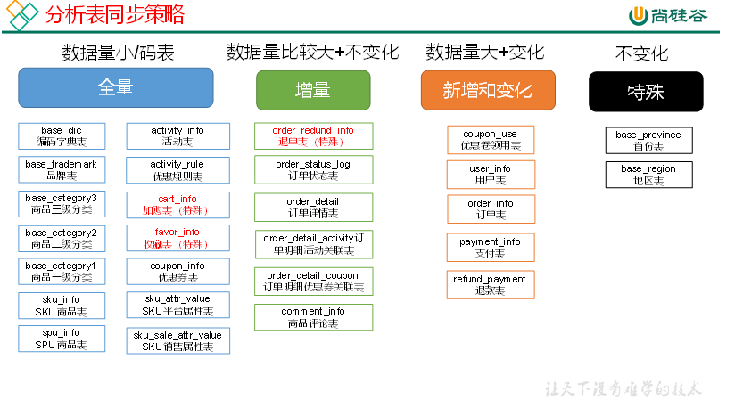
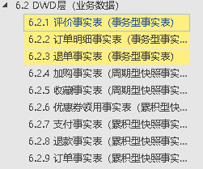

[TOC]
# 离线数仓


## 项目困难

### 离线数仓

#### 数据倾斜

>1找出倾斜点，单独处理该任务再合并
>
>2试图分散其数据

#### 日期间隔连续问题

>借助rank函数获取排名，然后相减获得分组标识。
>
>或者借助lag函数，判断是否是新的一组，达到分组的目的。

### 实时数仓

#### exactly-once 精确一次消费

>输入端精确一次消费
>
>处理程序具有恢复状态功能
>
>输出端满足幂等或事务


>想添加理论部分的内容，例如日志数据采集主流方式，业务数据采集主流方式，日志结构如何设计，拉链表概念，全量增量表的选择等。这些不是属于该项目的，而是属于数据仓库这个领域的，可以写到dw的笔记中，只记录与项目相关的。
>数据采集，数据清洗，数据质量监控，数据可视化，这样分块。每块内部包括代码，该框架的八股文，业务设计思想(日志结构设计，表结构设计，全量增量表的选择)。
>
>## summary

```
zookeeper,kafka,flume,sqoop,superset
支持组件(zookeeper，kafka)，数据采集迁移框架(flume，logtash，sqoop)，数仓(hadoop,hive)，数据分析转换引擎（etl）(kettle,hivesql，spark,kylin,presto)，可视化框架(superset)、调度组件(azkaban)、sql封装工具（phoenix）
```
## 整体架构

>采集数据,离线仓库，迁移数据，可视化。
>
>采集数据时使用sqoop从mysq清洗数据到hdfs，使用flume采集用户行为日志到hdfs。
>
>离线数仓使用hive搭建，包括ods、dwd、dim、dws、dwt、ads层。编写清洗脚本，逐层清洗数据。
>
>迁移数据数据使用sqoop重新存储到mysql数据库，用于可视化和业务使用。
>
>可视化使用superset，借助图表展现数仓统计结果。


## 软件版本


>## 服务器配置

```
三台机器，磁盘为500G。Intel Xeon 16核，共48个slot。内存为3*16GB。
```

## 服务分布

| 机器       | 服务                                                         | 教程机器 |
| ---------- | ------------------------------------------------------------ | -------- |
| 187,hbase  | hive,mysql_hive,flume_file_kafka，azkaban,kylin,presto,superset | 102      |
| 186,hbase1 | flume_file_kafka                                             | 103      |
| 185,hbase2 | mysql_platform,mysql_lisa,flume_kafka_hdfs                   | 104      |
## 组件版本

```
hadoop 3.1.4
hive 3.1.2
hbase-2.3.3
spark 3.1.2-bin-hadoop3.2
flink 1.13.6

zookeeper3.5.7
kafka2.11-2.4.1
sqoop 1.4.6
flume  1.9.0
azkaban 3.84.4
```

## 基本

```
spu，standard product unit，标准化产品单元，描述一个产品的特性，一般是品牌+型号+关键属性确定。
sku,stock keep unit ,库存量单位，不可分割的最小单位，涉及到具体的属性，如颜色、尺寸等。
实时数仓可以快速步骤当前的行为，有时候不需要获得大量的数据，关注当前这一天、一小时的行为，也有很大的价值，越即时越有效。
```

## 目的

```
搭建采集通道，将json格式的用户行为日志文件采集到hdfs上，并进行过滤处理，然后存入hive数据仓库。搭建采集通道，将mysql业务数据采集到hdfs上，并进行过滤处理，然后存入hive数据仓库。搭建hive数据仓库，存储存储用户行为日志和电商平台的业务数据，并合理设计和搭建分层数据仓库，包括ods,dwd,dim,dws,dwt,ads层。实现分析目的，包括活动的分析信息、优惠券的分析信息、订单在省份维度上的分析、订单在spu（商品）上的分析、订单的总体分析、用户的点击路径分析、商品的回购力度分析、用户行为在1、7、30天的分析（）、用户变动信息（回归、离开）、用户停留时间（不同创建日期）、用户1、7、30天总信息分析（下单、上限、）、用户浏览商品信息。并精心设计仓库结构，优化sql和函数，提高处理速度。
```

## 采集
##### 日志结构设计
当日志服务器接收到日志后，将日志输出到本地文件系统的log文件中，然后再使用flume采集到hdfs上。
>
>用于存储行为日志信息，将hdfs上的日志导入该表。
>
>如果需要实时处理，日志服务器还需要将信息发送到kafka队列，可以通过日志服务编程直接发送，或者通过flume采集到kafka，方便后续的实时处理程序读取。


###### 页面

>页面数据主要是记录一个页面的用户访问情况，包括访问时间，停留时间，页面路径等。
>
>page_id:属于哪一种页面，如首页、商品详情、下单结算等。
>
>sourceType:页面来源类型，商品推广，查询结果，促销活动等
>
>during_time:停留时间
>
>ts:跳入时间
>
>
>
>last_page_id:上页
>
>page_item_type:页面对象类型，如活动、购物券等
>
>page_item:页面对象id

###### 事件

>事件数据主要记录应用内一个具体操作行为，包括操作类型，操作对象，操作对象描述
>
>action_id:动作id，表示具体动作，如添加收藏、取消收藏、添加购物车、删除购物车、领取优惠券
>
>item_type:动作目标类型，sku_id商品，coupon_id购物券。
>
>item:动作目标id
>
>ts：动作时间

###### 曝光

>曝光主要记录页面所曝光的内容，包括曝光对象，曝光类型等信息。
>
>displayType：曝光类型，商品推广、促销活动、查询结果商品
>
>item_type:曝光对象，sku_id商品id，activity_id活动id
>
>item:曝光对象id
>
>order：曝光顺序

###### 启动

>启动信息
>
>entry:启动入口，图标、通知、安装后启动
>
>loading_time:启动加载时间
>
>open_ad_id:开屏广告id
>
>open_ad_ms:广告时间
>
>open_ad_skip_ms:跳过时间
>
>ts:时间

###### 错误

>error_code:错误码
>
>msg:错误信息

##### flume
>后端生成的日志会存储到文件系统，使用采集flume将日志采集到kafka，再使用消费的flume从kafka清晰到hdfs对应的文件夹。

###### flume过滤器

```
编写flume过滤器，获取日志Event的时间信息。并将采集的日志文件按照时间戳分文件夹输出，每天放到一个新的文件夹
#如下为flume指定我们自定义的拦截器，它会提取Event的时间并提供给%Y-%m-%d使用。
a1.sources.r1.interceptors.i1.type = com.atguigu.flume.interceptor.TimeStampInterceptor$Builder

a1.sinks,k1.type 控制输出类型
a1.sinks.k1.hdfs.path 控制输出路径,其中%Y-%m-%d为过滤器获取到的Event时间。
a1.sinks.k1.hdfs.filePrefix 控制输出前缀

## 组件
a1.sources=r1
a1.channels=c1
a1.sinks=k1

## source1
a1.sources.r1.type = org.apache.flume.source.kafka.KafkaSource
a1.sources.r1.batchSize = 5000
a1.sources.r1.batchDurationMillis = 2000
a1.sources.r1.kafka.bootstrap.servers = hadoop102:9092,hadoop103:9092,hadoop104:9092
a1.sources.r1.kafka.topics=topic_log
a1.sources.r1.interceptors = i1
a1.sources.r1.interceptors.i1.type = com.atguigu.flume.interceptor.TimeStampInterceptor$Builder

## channel1
a1.channels.c1.type = file
a1.channels.c1.checkpointDir = /opt/module/flume/checkpoint/behavior1
a1.channels.c1.dataDirs = /opt/module/flume/data/behavior1/


## sink1
a1.sinks.k1.type = hdfs
a1.sinks.k1.hdfs.path = /origin_data/gmall/log/topic_log/%Y-%m-%d
a1.sinks.k1.hdfs.filePrefix = log-
a1.sinks.k1.hdfs.round = false

#控制生成的小文件
a1.sinks.k1.hdfs.rollInterval = 10
a1.sinks.k1.hdfs.rollSize = 134217728
a1.sinks.k1.hdfs.rollCount = 0

## 控制输出文件是原生文件。
a1.sinks.k1.hdfs.fileType = CompressedStream
a1.sinks.k1.hdfs.codeC = lzop

## 拼装
a1.sources.r1.channels = c1
a1.sinks.k1.channel= c1

```

##### 解决的困难
###### flume 时间问题
>由于event在传输中会消耗时间，它默认使用的linux本地时间，当一条event于23:59:产生，很可能flume消费时已经第二天了，会将它划分到第二天的数据中，所以需要为其指定生产时间。通过编写拦截器解析json，手动解析timestamp然后放入event头部。
```
实现Interceptor接口，实现它的intercept方法和内部类builder
```
###### flume channel的选择
>FileChannel传输速度过慢，当传输的日志数据达到较大数据量时，flume处理不过来。

###### FileChannel优化
>为FileChannel配置多个路径，路径分属多个硬盘，增加flume吞吐量。
>```
>a1.channels.c1.dataDirs = /opt/module/flume/data/behavior1/
>```

###### flume sink hdfs小文件过多
```
#分别表示roll的间隔时间，roll的间隔大小，roll的间隔event数量
#控制生成的小文件
a1.sinks.k1.hdfs.rollInterval = 10
a1.sinks.k1.hdfs.rollSize = 134217728
a1.sinks.k1.hdfs.rollCount = 0
```

###### flume 内存优化
```
通过修改flume-env.sh，为flume增加内存。
export JAVA_OPTS="-Xms100m -Xmx2000m -Dcom.sun.management.jmxremote"
```

#### hadoop 扩充磁盘
```
首先为服务器扩充磁盘，然后格式化并分区，将其挂载到服务器上。然后修改hdfs-site.xml文件，添加新磁盘的路径，使用","隔开多个文件路径
```

#### hadoop 集群数据均衡
```
#均衡各个节点的磁盘利用率,如下表示各节点不能相差超过10%。注意均衡比较耗费资源，尽量别在NameNode所在机器执行。
start-balancer.sh -threshold 10
stop-balancer.sh

#磁盘间数据均衡
hdfs diskbalancer -plan hadoop103
hdfs diskbalancer -execute hadoop103.plan.json
hdfs diskbalancer -query hadoop103
hdfs diskbalancer -cancel hadoop103.plan.json
```

###### hadoop 配置lzo压缩
```
编译好lzojar包后，将其放入hadoop的share/hadoop/common 库路径中，然后修改core-site.xml。
<configuration>
    <property>
        <name>io.compression.codecs</name>
        <value>
            org.apache.hadoop.io.compress.GzipCodec,
            org.apache.hadoop.io.compress.DefaultCodec,
            org.apache.hadoop.io.compress.BZip2Codec,
            org.apache.hadoop.io.compress.SnappyCodec,
            com.hadoop.compression.lzo.LzoCodec,
            com.hadoop.compression.lzo.LzopCodec
        </value>
    </property>

    <property>
        <name>io.compression.codec.lzo.class</name>
        <value>com.hadoop.compression.lzo.LzoCodec</value>
    </property>
</configuration>

#使用时指定outputformat，inputformat
 hadoop jar share/hadoop/mapreduce/hadoop-mapreduce-examples-3.1.3.jar wordcount -Dmapreduce.output.fileoutputformat.compress=true -Dmapreduce.output.fileoutputformat.compress.codec=com.hadoop.compression.lzo.LzopCodec  /input /output
```

###### hadoop参数调整
```
①yarn.nodemanager.resource.memory-mb  NodeManager使用内存数
②yarn.nodemanager.resource.cpu-vcores NodeManager使用CPU核数
```

###### kafka机器数量计算
```
生产速度单位为M
Kafka机器数量（经验公式）= 2 *（峰值生产速度 * 副本数 / 100）+ 1

kafka压力测试
kafka-consumer-perf-test.sh
kafka-producer-perf-test.sh

#影响生产者吞吐量的参数
同时设置batch.size和 linger.ms，就是哪个条件先满足就都会将消息发送出去

#消费的吞吐量
吞吐量受网络带宽和fetch-size的影响
```

###### flume sink格式

##### 碰到的问题

###### hive无法使用load导入hdfs采集的数据

>flume的hdfs sink有三种类型：SequenceFile,Datastream,CompressedStream，对于hdfs sink数据，如果要导入TEXTFILE格式的hive表，flume sink时必须使用Datastream。

###### vim 本质是创建新文件

>使用flume采集时，如果用vim修改文件进行追加，flume会认为其是新文件，将文件的全部内容进行了发送，所以应该使用echo ”hello“ >>2.txt进行测试，模拟追加文件的功能。

### sqoop
>将mysql表中的数据采集到hdfs中。主要就是写sql语句，把数据从mysql清洗到hdfs，然后再从hdfs放入仓库，当仓库设计好之后，这一步就按照仓库的要求清洗即可。

```
 /opt/module/sqoop/bin/sqoop import --connect jdbc:mysql://hbase:3306/gmall --username root  --password root --target-dir /sqoop_test_19 --delete-target-dir --query "select
                            id,
                            total_amount,
                            order_status,
                            user_id,
                            payment_way,
                            delivery_address,
                            out_trade_no,
                            create_time,
                            operate_time,
                            expire_time,
                            tracking_no,
                            province_id,
                            activity_reduce_amount,
                            coupon_reduce_amount,
                            original_total_amount,
                            feight_fee,
                            feight_fee_reduce
                        from order_info where \$CONDITIONS" --num-mappers 1 --fields-terminated-by '\t' --compress --compression-codec lzop --null-string '\\N' --null-non-string '\\N'
```


## 仓库设计
>按照层，每层有主题相关。主要是设计思想，典型场景的sql用法，比如日活等。

>设计原则，设计技巧
>
>最重要的几个主题：用户，商品，活动，优惠，时间，地区
>知道数据采集，数据仓库设计（每层这么设计的原因，每层设计成什么样了，每个表这么设计的原因，每个表设计成什么样了），etl（sql怎么写的，kettle怎么用），superset（分析了哪些指标，使用了什么图形）
>
>数据仓库获取聚合统计的指标，从整体上对用户、订单、活动、优惠券进行了解，如用户增加与流式、活动的收益、订单的分布情况等，更像是给人（上级、企业）的一份报告，不会作为算法的输入。所以说数仓本质上还是在做报表，少数指标需要数仓统计好之后给算法用。但有些指标不需要聚合统计，如单个用户的行为数据，本来就要以个体为单位。
>
>ods原始数据，dim维度表固定信息，dwd维度表建模join多表，粒度为一条记录，dws_daycount以天为粒度，聚合并join成宽表。dwt以dws为基础聚合1、7、30天数据。ads从各层汇总数据用于分析。

|                | **时间** | **用户** | **地区** | **商品** | **优惠券** | **活动** | **度量值**                      |
| -------------- | -------- | -------- | -------- | -------- | ---------- | -------- | ------------------------------- |
| **订单**       | √        | √        | √        |          |            |          | 运费/优惠金额/原始金额/最终金额 |
| **订单详情**   | √        | √        | √        | √        | √          | √        | 件数/优惠金额/原始金额/最终金额 |
| **支付**       | √        | √        | √        |          |            |          | 支付金额                        |
| **加购**       | √        | √        |          | √        |            |          | 件数/金额                       |
| **收藏**       | √        | √        |          | √        |            |          | 次数                            |
| **评价**       | √        | √        |          | √        |            |          | 次数                            |
| **退单**       | √        | √        | √        | √        |            |          | 件数/金额                       |
| **退款**       | √        | √        | √        | √        |            |          | 件数/金额                       |
| **优惠券领用** | √        | √        |          |          | √          |          | 次数                            |

```
业务DWD如下：
可选的业务过程有：收藏，加购，支付，订单，订单详情，退单，退款，评价，优惠券领用
可选的粒度有：一次交易，一天，一个商品，一次领用
可选的维度有：时间，用户，地区，商品，优惠券，活动。
可选的事实度量值：次数，交易金额。
```

### ODS
>使用sqoop和flume采集到hdfs目录，在导入到ods表中，ods表的设计不用维度建模，参考采集的数据即可。
#### 数据更新策略
>包括全量，增量，新增及变化三种数据更新方式,每个表采用的更新策略如下


dwd的表类型与ods的更新策略相对应，对于全量更新可以周期型



###### 增量同步策略

>每日增量，每天存储一份增量数据，作为一个分区
>
>适用于表的数据量大，而且数据只会有插入的场景，不能进行数据的删除、修改等，对应于事务型事实表。
>
>例如：退单表、订单状态表、订单与活动关联表、商品评论表、支付流水表、订单详情表

###### 全量同步策略

>每日全量，每天存储一份完整数据的快照，作为一个分区。
>
>适用于表数据量不大，且每天会有新数据插入，也会有旧数据修改的场景。
>
>例如：加入购物车表、收藏表、商品三级分类、商品二级分类、商品一级分类、优惠券表、活动表、spu表、sku表

###### 新增及变化策略

>每日新增及变化，存储创建时间或操作时间是今天的数据
>
>适用于表的数据量大，既有新增，又会有变化。例如用户表、订单表、优惠券领用表

###### 特殊策略

>一些特殊表，不用遵循。例如某些不会变化的表，如地区表、省份表、名族表可以只存一分固定值。

>小型公司，为了方便，一般使用全量数据导入。
>
>中大型公司，由于数量比较大，还是严格按照同步策略导入数据。     
>

######

>将hdfs上的origion_data load进入表中，填充ods。

#### 典型sql场景
#### 从hdfs加载数据到hive
>-n 如果字符串长度不为0，为真
>
>-z:长度为0，为真
>
>%F表示格式化为年月日
>
>load data inpath "/origin_data/$APP/log/topic_log/$do_date"  into table   gmall.ods_log  partion(dt='$do_date') 载入hive表
>
>hive -e "$sql"  执行sql
>
>hive  -service hiveserver2
>
>hive -service metastore

```
#!/bin/bash

# 定义变量方便修改
APP=gmall

# 如果是输入的日期按照取输入日期；如果没输入日期取当前时间的前一天
if [ -n "$1" ] ;then
   do_date=$1
else 
   do_date=`date -d "-1 day" +%F`
fi 

echo ================== 日志日期为 $do_date ==================
sql="
load data inpath '/origin_data/$APP/log/topic_log/$do_date' into table ${APP}.ods_log partition(dt='$do_date');
"

hive -e "$sql"

hadoop jar /opt/module/hadoop-3.1.3/share/hadoop/common/hadoop-lzo-0.4.20.jar com.hadoop.compression.lzo.DistributedLzoIndexer /warehouse/$APP/ods/ods_log/dt=$do_date

#执行
hdfs_to_ods_log.sh 2020-06-14
```


### DIM

业务过程：下单业务，支付业务，退款业务，物流业务，一条业务线对应一张事实表，即一张DWD表。
声明粒度：粒度就是行，决定一行代表什么。一般DWD层都是可用的最小粒度，如一次交易，一个商品，一次浏览等。
确认维度：维度就是列，即关心业务过程的哪些特征维度。如下单业务的时间，下单业务的地区，下单业务的用户等。
确认事实：事实就是度量值（次数、个数、件数、金额，可以进行累加），暂时理解为一种特殊的列，也就是特殊的维度。
>三种表类型，事务型事实表，周期型快照事实表，累积型快照事实表。
>实际上（全量，增量，新增及变化）与（周期型，事务型，累积型）是要结合使用的，因为前者控制了ods的数据是什么，后者控制了如何处理ods中的数据，两者结合起来才是自己需要表达的语义。
>例如：我想全量统计购物车，收藏数据到ods，然后用周期型快照事实表统计每天的数量。
>或 增量的统计订单数据到ods，再用事务型事实表增量统计当天的订单数。
>或 新增及变化统计优惠券领用，累积型快照事实表记录整个生命周期。
>当涉及到多方交互多流程的带修改的数据时，就是累积型快照，因为一方提交请求后产生一条记录，但是该记录还需要其他人响应，例如退款，支付，订单，也可能本来就有很多流程，如优惠券领用。有增有修改就用全量周期型快照，如收藏，购物车等。其他的就都是增量了，例如评价，退单等。
>确认有没有修改数据，如果修改了只能全量和增量及修改，在判断数据量。如果没有，就直接增量。

>
>DWD层使用维度建模，一般按照以下四个步骤：
>
>**选择业务过程→声明粒度→确认维度→确认事实**

>拉链表：关注当日新增及变化的部分，并且要与原始全量数据合并，对于变化部分的数据，要控制end_time,控制其生命周期。
>描述几个topic的维度表：用户，商品，活动，优惠，时间，地区。和ads基本一致
>
>
>DIM层信息是从ODS清洗过来的，但是一般情况下DIM表是手动导入的，他是设计者规定的一些信息。
>
>编写sql，然后case选择，最后hive -e 执行。
>
>基本的清洗语句为：
>
>insert overwrite gmall.dim_user_info partition(dt='9999-99-99')
>
>select id,name  
>
>from gmall.ods_user_info
>
>where dt="";
>
>这是是常用的select、insert组合语句。两表的列名也一样，故不用指定插入哪些列。
>
>
>
>使用with as临时表语句和left join
>
>with  spu as
>
>()
>
>insert overwrite table gmall.test
>
>select id,name form
>
>gmall.test1
>
>left join  test2
>
>with as创建的临时表可用于后边的select语句，如语句中的sku临时表。
>
>left join语句以sku为基础连接category1、2、3，spu，连接商标，连接sku属性和属性值
>
>
>
>join（inner join）和left join使用场景
>
>join保存两个表都存在的行，left join以左表为基础，会保留左表所有的行。
#### 表类型
###### 事务事实表
###### 周期快照事实表
###### 累积快照事实表
>将9999分区和ods当日分区进行full outer join，如果有new数据，以new数据为准，没有则以old数据为准。分区时也是先new，没有则按照old，最后按照9999分区。


>日志信息json的结构：公共字段（地区，手机品牌，渠道，是否新增，手机型号，设备id，会员id，app版本），动作数组（目标类型，时间），曝光数组（对象，类型，顺序，位置），页面信息（持续时间，目标id），错误信息
>
>即基本信息（公共字段），进入了什么页面（页面信息），执行了什么操作（操作目标），曝光数组（页面有哪些东西，曝光了什么）
>
>DWD主要分为：启动日志，页面日志，动作日志，曝光日志，错误日志
>

#### 拉链表

```
为每一条信息记录开始时间，和生效的结束时间。当该条信息被修改时，该条信息作废，将失效时间设为当前时间。并创建新记录，该记录失效时间设置为9999-99-99。
如何实现：每天根据全量表的创建时间和操作时间的到改天的用户变化表，将该表与之前的拉链表合并得到新的拉链表。
为什么有全量表了，还创建拉链表。全量表不保留历史的信息，比如我修改了自己的昵称，那么旧的昵称就丢失了，只知道在该天修改了昵称。如果再次进行修改昵称的操作，前一次的修改时间都丢失了，只知道最后一次操作的时间。而我们需要知道每一天，每个用户是什么状态，又不可能为每天都维护一个表，所以使用拉链表，将用户信息按照修改的不同阶段进行信息保留。
如果要池逊某一天的用户状态，使用此where语句where dt>=2022-0311 and dt <=2022-03-11。
```

```

###### 挑选出每天的用户变化表并与原来的拉链表拼接

nvl函数：当参数1为null时，返回参数2.否则直接返回参数1.

```

#### 典型sql场景
#### 拉链表sql

### DWD
```
业务过程：下单业务，支付业务，退款业务，物流业务，一条业务线对应一张事实表，即一张DWD表。
声明粒度：粒度就是行，决定一行代表什么。一般DWD层都是可用的最小粒度，如一次交易，一个商品，一次浏览等。
确认维度：维度就是列，即关心业务过程的哪些特征维度。如下单业务的时间，下单业务的地区，下单业务的用户等。
确认事实：事实就是度量值（次数、个数、件数、金额，可以进行累加），暂时理解为一种特殊的列，也就是特殊的维度。
```

>DIM层DWD层需构建维度模型，一般采用星型模型，呈现的状态一般为星座模型。
>
>DWD层使用维度建模，一般按照以下四个步骤：
>
>**选择业务过程→声明粒度→确认维度→确认事实**

>ods层有很多表，这里把ods的多个表关联起来，形成业务过程的宽表，并将基础粒度作为行粒度。

##### 收藏事实表（周期型快照事实表）

##### 加购事实表（周期型快照事实表）

>购物车是一个主题，加购是一个业务过程。
>
>周期型快照事实表，每日快照。以日期为分区，日期分区存储了当日的全量购物车数据。顾名思义，就是每隔一天就把全量的数据进行一次快照。
>
>而事务型事实表每个分区内是该日的增量数据，如该日的订单、该日的评价。而事务型事实表是将完整的数据分散在多个分区内，不会有冗余数据，类似于常用的业务数据库。
>
>累积性快照，就是每隔一段时间将全量的数据进行快照，但是它会累计在
>
>为什么要使用周期型快照：当我们只关心一个周期结束时的数据状态，那么我们可以使用周期型快照。比如，我们只关心一天结束时购物车里有多少商品，方便后续统计。或者，当我们会对已有的数据进行修改时，如从购物车删除商品，那么也是需要使用周期型快照，因为它会获得完整的全量数据，反映出数据的变化。而事务型快照中，如订单、评价，一般是不需要关注修改和删除的，因为订单一旦发生，就需要统计其金额等信息，删除也只是让用户无法查看，统计时仍然需要计算。
>
>为什么使用累积性快照：方便跟踪业务事实的变化，周期型快照只能关注到数据的增删，而累积性可以关注到数据的修改、字段的变更。

##### 订单明细事实表（事务型事实表）

>将ods层的订单明细活动、订单明细优惠券、订单明细表合并为此表

##### 订单事实表（累积型快照事实表）

>之所以叫累积型，是因为该业务过程有多个步骤和时间节点。
>
>比如订单有创建时间、支付时间、完成时间，分别对应着订单的创建、支付、支付完成
>
>当该日产生一个订单时，如果其完成了整个过程，那么就放入该日的对应分区，否则让如9999-99-99分区，表示当前还未完成整个步骤的记录。
>
>在业务数据库中，其具有多个时间字段，一旦其中一个字段满足等于当前日期，表示其今日进行了修改，将数据取出来。如果其满足完成条件，则放入对应分区，否则放入9999-99-99分区表示没有完成。
>
>他的区别就是，有多个时间字段和阶段，没有完成的会被累计在9999分区中，只有完成的才能增量添加到对应分区中。

##### 支付事实表（累积型快照事实表）

##### 退款事实表（累积型快照事实表）

##### 优惠券领用表（累积型快照事实表）

##### 退单事实表（事务型事实表）

##### 评价事实表（事务型事实表）


#### 典型sql场景

>get_josn_object解析后过滤有start字段的，并查询出对应日期的所需字段写入DWD即可

```
insert overwrite table dwd_start_log partition(dt='2020-06-14')
select
    get_json_object(line,'$.common.ar'),
    get_json_object(line,'$.common.ba'),
    get_json_object(line,'$.common.ch'),
    get_json_object(line,'$.common.is_new'),
    get_json_object(line,'$.common.md'),
    get_json_object(line,'$.common.mid'),
    get_json_object(line,'$.common.os'),
    get_json_object(line,'$.common.uid'),
    get_json_object(line,'$.common.vc'),
    get_json_object(line,'$.start.entry'),
    get_json_object(line,'$.start.loading_time'),
    get_json_object(line,'$.start.open_ad_id'),
    get_json_object(line,'$.start.open_ad_ms'),
    get_json_object(line,'$.start.open_ad_skip_ms'),
    get_json_object(line,'$.ts')
from ods_log
where dt='2020-06-14'
and get_json_object(line,'$.start') is not null;

```


###### dwd_order_detail

>需要连接多个表，如ods_order_detail、ods_order_info、ods_order_detail_activity、ods_order_detail_coupon

### ADS

>DWS,DWT,ADS都与维度建模没有关系了，只有DWD是维度建模的思想。DWS,DWT,ADS是以需求主题进行设计，想统计某个主题就设计对应的表，从DWD取数计算，然后逐层计算一天的，一个月的，到最终的ADS层。

#### 典型sql场景

#### 订单总量

#### ads_order_total

>订单统计，订单数、订单金额、下单人数

>画图：1.订单数量、订单金额、下单人数 2.1、7、30间隔    3.不同日期

```
SELECT dt AS dt,
       sum(order_count) AS `SUM(order_count)`,
       SUM(order_user_count) AS `SUM(order_user_count)`,
       SUM(order_amount/10000) AS `SUM(order_amount/10000)`
FROM gmall_report.ads_order_total
WHERE dt >= STR_TO_DATE('2020-06-15', '%Y-%m-%d')
  AND dt < STR_TO_DATE('2020-06-19', '%Y-%m-%d')
  AND recent_days = 1
GROUP BY dt
ORDER BY `SUM(order_count)` DESC
LIMIT 50000;
```

#### 订单在省份上的分布

>统计订单在省份上的分布，包括地区编码、身份名称、国际标准地区编码、订单数、订单金额

```
SELECT iso_code AS iso_code,
       sum(order_count) AS `SUM(order_count)`
FROM ads_order_by_province
WHERE dt >= STR_TO_DATE('2020-06-14', '%Y-%m-%d')
  AND dt < STR_TO_DATE('2020-06-19', '%Y-%m-%d')
GROUP BY iso_code
ORDER BY `SUM(order_count)` DESC
LIMIT 50000;
```

#### 访客数量


>访客统计

```
SELECT DATE(dt) AS __timestamp,
       sum(uv_count) AS `SUM(uv_count)`,
       sum(page_count) AS `SUM(page_count)`,
       sum(duration_sec) AS `SUM(duration_sec)`
FROM ads_visit_stats
WHERE dt >= STR_TO_DATE('2020-06-14', '%Y-%m-%d')
  AND dt < STR_TO_DATE('2020-06-19', '%Y-%m-%d')
GROUP BY DATE(dt)
ORDER BY `SUM(uv_count)` DESC
LIMIT 10000;
```

#### 用户活跃量，新增量

>用户统计，包括新增用户、新增下单用户数、下单用户数、下单金额、活跃用户未下单用户数

```
SELECT DATE(dt) AS __timestamp,
       sum(new_user_count) AS `SUM(new_user_count)`,
       sum(new_order_user_count) AS `SUM(new_order_user_count)`
FROM ads_user_total
WHERE dt >= STR_TO_DATE('2020-06-14', '%Y-%m-%d')
  AND dt < STR_TO_DATE('2022-04-15', '%Y-%m-%d')
  AND recent_days = 1
GROUP BY DATE(dt)
ORDER BY `SUM(new_user_count)` DESC
LIMIT 50000;
```

#### 用户流失，回流

>用户变动统计，包括流失用户数、回流用户数

```
SELECT DATE(dt) AS __timestamp,
       sum(user_back_count) AS `SUM(user_back_count)`,
       sum(user_churn_count) AS `SUM(user_churn_count)`
FROM ads_user_change
WHERE dt >= STR_TO_DATE('2020-06-13', '%Y-%m-%d')
  AND dt < STR_TO_DATE('2020-06-18', '%Y-%m-%d')
GROUP BY DATE(dt)
ORDER BY `SUM(user_back_count)` DESC
LIMIT 25;
```

#### 用户行为漏斗

>用户行为漏斗分析，浏览首页人数、浏览商品详情页人数、加入购物车人数、下单人数、支付人数

```
SELECT dt AS dt,
       sum(home_count) AS `SUM(home_count)`,
       sum(good_detail_count) AS `SUM(good_detail_count)`,
       sum(cart_count) AS `SUM(cart_count)`,
       sum(order_count) AS `SUM(order_count)`,
       sum(payment_count) AS `SUM(payment_count)`
FROM ads_user_action
WHERE dt >= STR_TO_DATE('2020-06-15', '%Y-%m-%d')
  AND dt < STR_TO_DATE('2020-06-18', '%Y-%m-%d')
GROUP BY dt
ORDER BY `SUM(home_count)` DESC
LIMIT 10000;
```

#### 用户留存

>用户留存率分析，包括留存用户数量、新增用户数量、留存率

```
SELECT create_date AS create_date,
       sum(retention_rate) AS `SUM(retention_rate)`,
       sum(retention_day) AS `SUM(retention_day)`
FROM ads_user_retention
GROUP BY create_date
ORDER BY `SUM(retention_rate)` DESC
LIMIT 10000;
```


#### 商品复购率

>品牌复购率，品牌ID、品牌名称、复购率

```
SELECT tm_name AS tm_name,
       sum(order_repeat_rate) AS `SUM(order_repeat_rate)`
FROM ads_repeat_purchase
WHERE dt >= STR_TO_DATE('2020-06-14', '%Y-%m-%d')
  AND dt < STR_TO_DATE('2020-06-15', '%Y-%m-%d')
  AND recent_days = 30
GROUP BY tm_name
ORDER BY `SUM(order_repeat_rate)` DESC
LIMIT 10000;
```

#### 商品销量

>商品统计，包括商品ID、商品名称、品牌ID、品牌名称、三级品类ID、三级品类名称、二级品类ID、二级品类名称、一级品类ID、一级品类名称、订单数、订单金额。

```
SELECT tm_name AS tm_name,
       sum(order_count) AS `SUM(order_count)`
FROM ads_order_spu_stats
WHERE dt >= STR_TO_DATE('2020-06-14', '%Y-%m-%d')
  AND dt < STR_TO_DATE('2020-06-15', '%Y-%m-%d')
GROUP BY tm_name
ORDER BY `SUM(order_count)` DESC
LIMIT 10000;
```


#### 页面路径分析

>页面路径分析

```

```


#### 优惠金额，次数

>优惠券统计，包括优惠券ID、优惠券名称、开始日期、优惠规则、领用次数、使用次数、使用优惠券订单原始金额、优惠金额、补贴率

```
SELECT coupon_name AS coupon_name,
       sum(order_original_amount) AS `SUM(order_original_amount)`
FROM ads_coupon_stats
GROUP BY coupon_name
ORDER BY `SUM(order_original_amount)` DESC
LIMIT 25;
```

#### 活动订单金额

>活动统计，包括活动ID、活动名称、参与活动订单数、参与活动订单金额、参与活动订单最终金额、补贴率。

```
SELECT activity_name AS activity_name,
       sum(order_original_amount) AS `SUM(order_original_amount)`
FROM ads_activity_stats
GROUP BY activity_name
ORDER BY `SUM(order_original_amount)` DESC
LIMIT 10000;
```


## hdfs导出数据到mysql
```
/bin/sqoop export \
--connect "jdbc:mysql://hadoop102:3306/${mysql_db_name}?useUnicode=true&characterEncoding=utf-8"  \
--username root \
--password 000000 \
--table $1 \
--num-mappers 1 \
--export-dir /warehouse/$hive_db_name/ads/$1 \
--input-fields-terminated-by "\t" \
--update-mode allowinsert \
--update-key $2 \
--input-null-string '\\N'    \
--input-null-non-string '\\N'
}
```

## 脚本任务调度

>使用azkaban管理清洗数据的脚本，azkaban可以有效管理任务之间的依赖，查看任务执行进度，检查错误等。通过编写basic.flow文件，我们可以管理自己的调度任务。


## 数据质量管理

>数据质量管理，是指从对数据从计划、获取、存储、共享、维护、应用、消亡生命周期的各个阶段可能引发的各类数据质量问题，进行识别、度量、监控、预警等一系列管理活动，并通过改善和提高组织的管理水平是的数据质量获得进一步提高。
>
>数据质量管理是循环管理过程，其最终目标是通过可靠的数据提升数据在使用中的价值。

### 数据质量评价指标

>数据质量的目标是改善，如何评估改善的结果呢，通常包括以下内容。

| 评价标准 | 描述                                         | 监控项                                            |
| -------- | -------------------------------------------- | ------------------------------------------------- |
| 唯一性   | 指主键保持唯一                               | 字段唯一性检查                                    |
| 完整性   | 主要包括记录缺失和字段值缺失等方面           | 字段枚举值检查     字段记录数检查                 |
| 精确性   | 数据生成的正确性，数据在整个链路流转的正确性 | 波动阈值检查                                      |
| 合法性   | 主要包括格式、类型、阈值的合法性             | 字段日期格式检查      字段长度检查   字段值域检查 |
| 时效性   | 主要包括数据处理的时效性                     | 批处理是否按时完成                                |

### 数据质量管理实操

#### 需求分析

>数仓4.0主要监控以下指标：
>ODS层数据量，每日环比和每周同比变化不能超过一定范围
>
>DIM层不能出现id控制，重复值。
>
>DWD层不能出现id空值，重复值。
>
>id列：重复值、空值，其他相关列：值域检查，行：数据总量同比、环比增长。

| 表                | **检查项目**   | **依据**     | **异常值下限** | **异常值上限** |      |
| ----------------- | -------------- | ------------ | -------------- | -------------- | ---- |
| ods_order_info    | **同比增长**   | 数据总量     | -10%           | 10%            |      |
| ods_order_info    | **环比增长**   | 数据总量     | -10%           | 50%            |      |
| ods_order_info    | **值域检查**   | final_amount | 0              | 100            |      |
| dwd_order_info    | **空值检查**   | id           | 0              | 10             |      |
| dwd_order_info    | **重复值检查** | id           | 0              | 5              |      |
| dwd_order_info    | **空值检查**   | id           | 0              | 10             |      |
| **dim_user_info** | **重复值检查** | id           | 0              | 5              |      |

#### 功能分块

>数据统计模块：使用shell脚本，统计数据仓库中的指标，然后插入mysql数据库
>
>可视化模块：使用superset读取myslq数据库，可视化告警结果。
>
>告警模块：使用python读取mysql的数据，判断是否需要告警，并发送邮件。
>
>调度模块：使用azkaban监控数仓清洗任务状态，如果有新的清洗任务，就执行 数据统计模块  和 告警模块，检测数据质量。

#### 数据统计模块

##### 空id检查脚本


##### 重复id检查脚本

```
RESULT=$($HIVE_ENGINE -e "set hive.cli.print.header=false;select count(1) from (select $COL from $HIVE_DB.$TABLE where dt='$DT' group by $COL having count($COL)>1) t1;")

# 将结果插入MySQL
mysql -h"$mysql_host" -u"$mysql_user" -p"$mysql_passwd" \
  -e"INSERT INTO $mysql_DB.$mysql_tbl VALUES('$DT', '$TABLE', '$COL', $RESULT, $MIN, $MAX, $LEVEL)
ON DUPLICATE KEY UPDATE \`value\`=$RESULT, value_min=$MIN, value_max=$MAX, notification_level=$LEVEL;"
```

##### 值域检查脚本

```
# 查询不在规定值域的值的个数
RESULT=$($HIVE_ENGINE -e "set hive.cli.print.header=false;select count(1) from $HIVE_DB.$TABLE where dt='$DT' and $COL not between $RANGE_MIN and $RANGE_MAX;")

# 将结果写入MySQL
mysql -h"$mysql_host" -u"$mysql_user" -p"$mysql_passwd" \
  -e"INSERT INTO $mysql_DB.$mysql_tbl VALUES('$DT', '$TABLE', '$COL', $RESULT, $RANGE_MIN, $RANGE_MAX, $MIN, $MAX, $LEVEL)
ON DUPLICATE KEY UPDATE \`value\`=$RESULT, range_min=$RANGE_MIN, range_max=$RANGE_MAX, value_min=$MIN, value_max=$MAX, notification_level=$LEVEL;"

```

##### 数据量环比检查脚本

```
# 昨日数据量
YESTERDAY=$($HIVE_ENGINE -e "set hive.cli.print.header=false; select count(1) from $HIVE_DB.$TABLE where dt=date_add('$DT',-1);")

# 今日数据量
TODAY=$($HIVE_ENGINE -e "set hive.cli.print.header=false;select count(1) from $HIVE_DB.$TABLE where dt='$DT';")

# 计算环比增长值
if [ "$YESTERDAY" -ne 0 ]; then
  RESULT=$(awk "BEGIN{print ($TODAY-$YESTERDAY)/$YESTERDAY*100}")
else
  RESULT=10000
fi

# 将结果写入MySQL表格
mysql -h"$mysql_host" -u"$mysql_user" -p"$mysql_passwd" \
  -e"INSERT INTO $mysql_DB.$mysql_tbl VALUES('$DT', '$TABLE', $RESULT, $MIN, $MAX, $LEVEL)
ON DUPLICATE KEY UPDATE \`value\`=$RESULT, value_min=$MIN, value_max=$MAX, notification_level=$LEVEL;"

```

##### 数据量同比检查脚本

```
# 上周数据量
LASTWEEK=$($HIVE_ENGINE -e "set hive.cli.print.header=false;select count(1) from $HIVE_DB.$TABLE where dt=date_add('$DT',-7);")

# 本周数据量
THISWEEK=$($HIVE_ENGINE -e "set hive.cli.print.header=false;select count(1) from $HIVE_DB.$TABLE where dt='$DT';")

# 计算增长
if [ $LASTWEEK -ne 0 ]; then
  RESULT=$(awk "BEGIN{print ($THISWEEK-$LASTWEEK)/$LASTWEEK*100}")
else
  RESULT=10000
fi

# 将结果写入MySQL
mysql -h"$mysql_host" -u"$mysql_user" -p"$mysql_passwd" \
  -e"INSERT INTO $mysql_DB.$mysql_tbl VALUES('$DT', '$TABLE', $RESULT, $MIN, $MAX, $LEVEL)
ON DUPLICATE KEY UPDATE \`value\`=$RESULT, value_min=$MIN, value_max=$MAX, notification_level=$LEVEL;"

```

##### ODS层

```
#!/usr/bin/env bash
DT=$1
[ "$DT" ] || DT=$(date -d '-1 day' +%F)

#检查表 ods_order_info 数据量日环比增长
#参数： -t 表名
#      -d 日期
#      -s 环比增长下限
#      -x 环比增长上限
#      -l 告警级别
bash day_on_day.sh -t ods_order_info -d "$DT" -s -10 -x 10 -l 1

#检查表 ods_order_info 数据量周同比增长
#参数： -t 表名
#      -d 日期
#      -s 同比增长下限
#      -x 同比增长上限
#      -l 告警级别
bash week_on_week.sh -t ods_order_info -d "$DT" -s -10 -x 50 -l 1

#检查表 ods_order_info 订单异常值
#参数： -t 表名
#      -d 日期
#      -s 指标下限
#      -x 指标上限
#      -l 告警级别
#      -a 值域下限
#      -b 值域上限
bash range.sh -t ods_order_info -d "$DT" -c final_amount -a 0 -b 100000 -s 0 -x 100 -l 1 

```

##### DWD层

```
#!/usr/bin/env bash
DT=$1
[ "$DT" ] || DT=$(date -d '-1 day' +%F)

# 检查表 dwd_order_info 重复ID
#参数： -t 表名
#      -d 日期
#      -c 检查重复值的列
#      -s 异常指标下限
#      -x 异常指标上限
#      -l 告警级别
bash duplicate.sh -t dwd_order_info -d "$DT" -c id -s 0 -x 5 -l 0

#检查表 dwd_order_info 的空ID
#参数： -t 表名
#      -d 日期
#      -c 检查空值的列
#      -s 异常指标下限
#      -x 异常指标上限
#      -l 告警级别
bash null_id.sh -t dwd_order_info -d "$DT" -c id -s 0 -x 10 -l 0

```

##### DIM层

```
#!/usr/bin/env bash
DT=$1
[ "$DT" ] || DT=$(date -d '-1 day' +%F)

#检查表 dim_user_info 的重复ID
#参数： -t 表名
#      -d 日期
#      -c 检查重复值的列
#      -s 异常指标下限
#      -x 异常指标上限
#      -l 告警级别
bash duplicate.sh -t dim_user_info -d "$DT" -c id -s 0 -x 5 -l 0

#检查表 dim_user_info 的空ID
#参数： -t 表名
#      -d 日期
#      -c 检查空值的列
#      -s 异常指标下限
#      -x 异常指标上限
#      -l 告警级别
bash null_id.sh -t dim_user_info -d "$DT" -c id -s 0 -x 10 -l 0

```

##### 告警模块

>使用python读取数据，判断是否需要告警，发送邮件

## 可视化

>活动的分析信息、优惠券的分析信息、订单在省份维度上的分析、订单在spu（商品）上的分析、订单的总体分析、用户的点击路径分析、商品的回购力度分析、用户行为在1、7、30天的分析（）、用户变动信息（回归、离开）、用户停留时间（不同创建日期）、用户1、7、30天总信息分析（下单、上限、）、用户浏览商品信息

# 尚硅谷spark-streaming实时数仓
>api写法scala，写一遍，sparkstreaming基础总结一遍。
>尚硅谷SparkStreaming实时数仓。使用canal、maxwell采集mysql数据库的数据到kafka，使用日志服务器后端将采集到的数据落盘并发送到kafka，使用sparkStreaming编写程序进行处理。统计以下几个指标，当日日活数量、当日首单用户数量。

## 日志采集后端

>为了模拟生产中的场景，开启了一个sprinboot后端服务作为日志服务器，负责接收来自前段的日志，并存储到logfile，并发送到对应的kafka的topic，topic包括日志topic，事件topic。

### 日志模拟生成

>这里前端用一个java程序模拟代替，其源源不断的向后端日志服务器发送模拟的数据。发送的速度为每秒100条，因为设置的每条日志发送的延迟为10ms。

```
#使用okhttp将数据发送到日志服务器的后端接口。
#日志格式如下，第一层的key有common和start，start下是启动的信息，common是其他信息，如浏览的品牌等。
#启动信息：loading_time,open_ad_id,open_ad_ms,open_ad_skip_ms
{"common":{"ar":"110000","ba":"Redmi","ch":"oppo","md":"Redmi k30","mid":"mid_168","os":"Android 11.0","uid":"337","vc":"v2.1.132"},"start":{"entry":"notice","loading_time":17874,"open_ad_id":2,"open_ad_ms":2467,"open_ad_skip_ms":0},"ts":1594652955000}
```


```
#一个示例
#创建azkaban.project，写入如下内容
azkaban-flow-version: 2.0
#创建basic.flow文件，写入如下内容
nodes:
  - name: jobA
    type: command
    config:
      command: echo "jobA"
  - name: jobB
    type: command
    dependsOn:
     - jobA
    config:
     command: echo "jobB"
将两者打包到同一个zip下，在azkaban创建project时upload即可。
```


### Logback

>1创建logback.xml，在其中控制日志的输出级别的输出节点root，logger，以及输出源appender。
>
>2为类添加@Slf4j注解

```
<appender name="console" class="ch.qos.logback.core.ConsoleAppender">
    <encoder>
    	<pattern>%msg%n</pattern>
    </encoder>
</appender>

<!-- 将某一个包下日志单独打印日志 -->
<logger name="com.atguigu.logger.controller.LoggerController" level="INFO" additivity="false">
    <appender-ref ref="rollingFile" />
    <appender-ref ref="console" />
</logger>

#当没有子节点logger，会调用root
 <root level="error" additivity="false">
 	<appender-ref ref="console" />
 </root>
```

### Kafka发送

>使用springframework提供的spring-kafka链接kafka。
>
>1首先配置好springframework-kafka的pom依赖，然后编写application.properties填写bootstrap-server,key-serializer,value-serializer。
>
>2然后在代码中创建KafkaTemplate对象，使用Autowired注入对象。
>
>3使用：kafkaTemplate.send(topic,jsonObject);

## 业务数据采集

>主要有以下几个表，使用maxwell、canal采集到kafka对应topic，每个表对应一个topic。
>
>这些表按照业务大致划分为：事实表：活动、优惠券、收藏、加入购物车、下单、支付、退款 、  维度表：商品信息、地区信息、品类信息、地区信息、日期信息
>
>安装好canal、maxwell后，配置好mysql地址，并为canal、maxwell创建好mysql账户，给予权限，为两者配置kafka地址，及发送的topic。

### binlog格式

>binlog支持以下格式：
>
>1row格式，一行为单位保存记录，仅仅保存那条记录被修改，可以不记录sql语句的信息。
>
>2statement，将每一条会修改数据的sql记录在binlog中。不需要记录每一行的变化，减少了日志量。还需要记录每条语句执行时候的一些信息，确保在slave节点上执行时候获得相同的结果。
>
>3Mixed格式
>
>该格式是以上两种level的混合使用

### maxwell的格式

```
#指明数据库，表名，data字段中携带表中的数据，old字段中携带旧的字段值，时间戳，xid（对应的sql的id）。
#maxwell以影响的数据为单位发送日志，每一条数据产生一条日志，如果想知道是否来自同一条sql，可以通过xid判断。
{
"database":"gmall-2020-04",
"table":"z_user_info",
"type":"insert",
"ts":1589385314,
"xid":82982,
"xoffset":0,
"data":{"id":30,
"user_name":"zhang3",
"tel":"1381000101
0"
}
}
```

## nginx反代

>使用nginx反向代理三台日志服务器，因为用户的客户端操作日志数据量很大，使用nginx创建upstream，负载均衡三台机器，这样可以向nginx动态的替换机器，在需要重启服务时，可以逐个重启服务，保证upstream中有一个可用的结点。让用户无法感知服务器已经进行了重启和更新。

## 需求1日活统计

>日活统计要求统计当日登录的人数，通过采集的登录日志进行统计。需要借助redis进行去重，比如某个用户进行了多次登录，只能记作一个活跃用户。然后将去重的日活记录插入到ES数据库中，用于可视化和查询。如果不需要使用kibana可以写入MySQL，给业务使用，也可以用sql统计后提供给其他可视化工具，如DataV、QuickBI。这一部分代码在DauApp类中完成，即day active user。

### 读取kafka的启动日志topic

#### 精确一次消费

>精确一次消费可以通过两种形式达到：
>
>1使用事务，让两步操作必须同时失败或成功。
>
>2手动提交+幂等性，在存储好数据后在提交offset，避免offset成功但数据没存储的情况。然后，确保数据存储是幂等性的操作，也就是说offset提交失败时，虽然会重试数据存储的操作，但是无论重试多少次都是结果一样的，会进行覆盖，例如es相同的id会进行覆盖。

>为了达到精确一次消费，需要进行手动提交及读取offset，避免出现offset提交了，但是数据还没有存储的情况。然后借助es的幂等性达到精确一次消费。

>kafka默认5秒提交一次偏移。
>
>enable.auto.commit 的默认值是 true；就是默认采用自动提交的机制。 
>
>auto.commit.interval.ms 的默认值是 5000，单位是毫秒。

```
#首先,从redis取出kafka偏移量
#获取jedis客户端
val prop = MyPropertiesUtil.load("config.properties")
val host = prop.getProperty("redis.host")
val port = prop.getProperty("redis.port")

val jedisPoolConfig: JedisPoolConfig = new JedisPoolConfig
jedisPoolConfig.setMaxTotal(100)  //最大连接数
jedisPoolConfig.setMaxIdle(20)   //最大空闲
jedisPoolConfig.setMinIdle(20)     //最小空闲
jedisPoolConfig.setBlockWhenExhausted(true)  //忙碌时是否等待
jedisPoolConfig.setMaxWaitMillis(5000)//忙碌时等待时长 毫秒
jedisPoolConfig.setTestOnBorrow(true) //每次获得连接的进行测试

jedisPool=new JedisPool(jedisPoolConfig,host,port.toInt)
jedis=jedisPool.getResource
val offsetMap: util.Map[String, String]=jedis.hgetAll(offsetKey)
```

```
#从kafka创建sparkstreaming输入流
kafkaParam("group.id")=groupId
val dStream = KafkaUtils.createDirectStream[String,String](
      ssc,
      LocationStrategies.PreferConsistent,
      //这句话将整个topic,groupid传递进去,也就是所有partition的offset都传递进去了,这表示,consumer(topic,groupid)接受所有传递进去的分区的消息.
      ConsumerStrategies.Subscribe[String,String](Array(topic),kafkaParam,offsets))
      dStream
```

```
#从kafka读取偏移量。
var offsetRanges: Array[OffsetRange] = Array.empty[OffsetRange]

    val offsetDStream: DStream[ConsumerRecord[String, String]] = recordDStream.transform {
      rdd => {
        //因为recodeDStream底层封装的是KafkaRDD，混入了HasOffsetRanges特质，这个特质中提供了可以获取偏移量范围的方法
        offsetRanges = rdd.asInstanceOf[HasOffsetRanges].offsetRanges
        rdd
      }
    }
```

### 借助redis去重

```
#使用sadd函数，如果存在插入元素，返回0，否则返回1并插入。
val isNew:lang.Long=jedisClient.sadd(dauKey,mid)
去重这一部分使用了mapPartitions函数，对于每个分区创建了一次jedisClient，对于分区内每个记录请求了一次redis服务。
#然后得到首次登录的用户列表。
#将首次登录的用户信息封装好之后，插入ES。
#使用了foreachPartition方法，将整个分区的数据封装好后，借助ES bulk insert批量插入。
```

#### foreachPartition mapPartition

>1foreachPartition是action算子，用于数据处理的结尾，获取处理的结果，并将结果插入es，hbase等数据库中，它不会返回一个新的数据流rdd。mapPartition是转换操作，返回一个可以继续操作的rdd

### 写入结果数据

#### 精确一次消费

## 需求2首单分析

>ods，dwd
>
>交易的每一条记录都在mysql中，使用canal、maxwell采集到kafka，然后使用sparkStreaming对数据分流，放入不同的topic。这一部分分流的代码在BaseDBMaxwellApp。
>
>基础的dim维度信息，由dim层的流处理app处理。
>
>使用hbase过滤掉不是首单的用户，如果是首单还需要修改hbase的标记，最终将首单的信息写入数据库。由于是否首单需要统计历史数据，数据量比较大，如果使用redis内存压力比较大，而且是否首单需要保存很久，不是24小时过期的数据，需要修改hbase的标记，需要是key-value模式的查询，综合上边三点，适合保存在hbase中。这一部分代码在orderInfoApp中。
>
>具体流程：读取ods_order_info，从hbase查出所有ods_order_info中存在的user_id信息，然后将ods_order_info中斗胆用户的标记为1，然后对ods_order_info中同一个用户后续提交的标记为0，最终稿将过滤好的首单结果与省份表、用户表拼接得到宽表，将首单信息写入es，将首单标记写入hbase。

```
#用maxWell采集数据到kafka
#取table字段，根据表名称发送到不同的kafka topic，作为ods层
if(
                ("order_info".equals(tableName)&&"insert".equals(opType))
                  || (tableName.equals("order_detail") && "insert".equals(opType))
                  ||  tableName.equals("base_province")
                  ||  tableName.equals("user_info")
                  ||  tableName.equals("sku_info")
                  ||  tableName.equals("base_trademark")
                  ||  tableName.equals("base_category3")
                  ||  tableName.equals("spu_info")
              ){
                //拼接要发送到的主题
                var sendTopic = "ods_" + tableName
                MyKafkaSink.send(sendTopic,dataJsonObj.toString)
              }
              
#从ods_order_info的kafka主题中创建directStream

#借助phoenix从hbase读取首单信息
Class.forName("org.apache.phoenix.jdbc.PhoenixDriver")
    //建立连接
    val conn: Connection = DriverManager.getConnection("jdbc:phoenix:hbase,hbase1,hbase2:2181")
    //创建数据库操作对象
val ps: PreparedStatement = conn.prepareStatement(sql)
    //执行SQL语句
val rs: ResultSet = ps.executeQuery()

#后去es链接
jestFactory = new JestClientFactory
    jestFactory.setHttpClientConfig(new HttpClientConfig
        .Builder("http://172.18.65.187:9200")
        .multiThreaded(true)
        .maxTotalConnection(20)
        .connTimeout(10000)
        .readTimeout(1000).build())
jestFactory.getObject
```

## 需求3实付分摊金额及交易额统计

>购买商品有时会有优惠，但优惠一般是以订单为单位，现在需要以商品为单位，计算每个商品优惠了多少，进一步计算出每个商品的实付金额。对于除法除不尽的情况，不是最后一件商品的分摊金额使用乘除法比例计算，最后一件商品的分摊金额使用减法计算，用实付金额减去前边计算的其他商品的金额得到。

### 双流join

>由于两个流的数据是独立保存的，独立消费，很有可能同一业务的数据，分布在不同的批次。因为join算子只join同一批次的数据，如果只用简单的join流方式，会丢掉不同批次的数据。
>
>可以通过缓存的形式处理这种情况，将没有匹配join成功的数据放入该流的缓存中，当其需要匹配的数据到来时，再进行join。但是其编写逻辑负责。
>
>也可以通过滑动窗口+数据去重，这种方式处理代码简单，但是会造成数据重复，滑动窗口每次会覆盖一些重复数据，如果使用滚动窗口，每次窗口的数据不重复，无法解决join问题。

### Elasticsearch可视化

>添加indexpattern，添加dashboard

## 需求4ADS聚合及可视化

>将dws的数据进行聚合，插入mysql。编写发布接口，让阿里云DataV使用发布的接口。

## Exactly once

>为了实现精确一次消费，有两种方案。1.使用具有幂等性的操作，如es，redis等，在数据操作完成后，再提交offset。2使用mysql事务，将数据操作和索引操作进行绑定，达到原子性事务。

## kafka分层

>对输入的不同类别的原始日志进行处理

## ods

>将maxwell采集到kafka的数据取出，再根据表名称写入对应的ods消息队列。

## dwd

>读取对应的ods消息队列，将订单、订单明细写入dwd消息队列

## dws

>拼接维度形成宽表

## ads

>将数据从dws取出并处理，结果写入mysql、es等。

## 使用的DStream算子

>按照无状态，有状态，窗口，输出区分。

### 无状态

```
transform
mapPartitions
map
join
```

### 窗口

```
window(windowDuration,slideDuration)
```

### 输出DStream

```
foreachRDD
```

# 搭建docker可视化

>由于集群在内网，无法展示效果，且出于安全等因素考虑，不搭建内网穿透。所以，将可视化的模块从庞大的数仓集群独立出来，在个人电脑上使用docker搭建一个小服务，对外开放。只保留关键的ads数据库、后端、前段可视化展示。包括如下服务：es，mysql，superset。为了方便管理这些零散的服务，使用docker-compose将其制作成镜像。
>
>服务搭建完成后，进行数据导入。
>
>mysql的数据用navicate导出为sql，再导入docker中的新数据库。
>
>elasticsearch借助logstash导入到新的es数据库。

## docker-compose

```
version: "2"
services:
  mysql:
    image: vs-mysql
    build:
      context: ./docker/mysql
      dockerfile: ./Dockerfile
    environment:
      - MYSQL_ROOT_PASSWORD=root
      - MYSQL_USER=vsserver
      - MYSQL_PASSWORD=vsserver
      - MYSQL_DATABASE=gmall_report
    volumes:
      - "./data/mysqldb:/var/lib/mysql"
    ports:
      - 3307:3306
    networks:
      vs_server_net:
        ipv4_address: 172.42.1.10
  superset:
    image: vs-superset
    build:
      context: ./docker/superset
      dockerfile: ./Dockerfile
    ports:
      - 8787:8787
    networks:
      vs_server_net:
        ipv4_address: 172.42.1.11
  elasticsearch:
    image: vs-elasticsearch
    build:
      context: ./docker/elasticsearch
      dockerfile: ./Dockerfile
    deploy:
      resources:
        limits:
          memory: 4096M
    ulimits:
      memlock:
        soft: -1
        hard: -1
    volumes:
      - "./data/elasticsearch:/usr/share/elasticsearch/data"
 #     - "./data/kibana:/usr/local/kibana-7.11.1-linux-x86_64/"
    ports:
      - 9201:9200
      - 5602:5601
    networks:
      vs_server_net:
        ipv4_address: 172.42.1.12
networks:
  vs_server_net:
    ipam:
      driver: default
      config:
        - subnet: 172.42.1.0/24
```

## Dockerfile

### mysql

>platform.sql中是自己的建表语句

```
FROM mariadb:latest
USER root
COPY ./platform.sql /docker-entrypoint-initdb.d
RUN chown -R mysql:mysql /docker-entrypoint-initdb.d/
```

>platform.sql创建ads表，sql内容较长，放到结尾。

### superset

>如下的dockerfile主要是为了安装python的依赖，将python和pip编译并安装好。然后使用pip安装superset及gunicorn其依赖。其中gunicorn是superset的后端http服务

```
FROM centos:7
ENV FLASK_APP=superset
RUN useradd -m platform \
&& yum install -y gcc gcc-c++ libffi-devel \
MySQL-python mysql-devel python-devel \
python-devel python-pip python-wheel python-setuptools\
 openssl-devel cyrus-sasl-devel openldap-devel bzip2-devel expat-devel\
gdbm-devel readline-devel sqlite-devel automake  autoconf libtool make \
libffi-devel wget
RUN cd /usr/local/ \

#编译安装python
&& wget https://www.python.org/ftp/python/3.7.0/Python-3.7.0.tgz\
&&tar -zxvf Python-3.7.0.tgz \
&& cd /usr/local/Python-3.7.0/ \
&& ./configure --prefix=/usr/local/python3\
&& make && make install\
&&mv /usr/bin/python /usr/bin/python_bak\
&&ln -s /usr/local/python3/bin/python3 /usr/bin/python\
&& cd /usr/local\
&& wget https://bootstrap.pypa.io/get-pip.py\
&&  python get-pip.py\
&&ln -s /usr/local/python3/bin/pip3 /usr/bin/pip


Run  pip install --upgrade setuptools pip -i https://pypi.douban.com/simple/ 
Run pip install apache-superset==0.36.0  -i https://pypi.douban.com/simple/ \
markupsafe==2.0.1 -i https://pypi.douban.com/simple/ \
WTForms==2.3.3 \
sqlalchemy==1.3.24  \
pymysql
COPY   --chown=platform:platform  ./entrypoint.sh /home/platform/
USER root
CMD ["sh","/home/platform/entrypoint.sh"]
#CMD ["python3","-m","http.server","8888"]
```

```
#第一次启动还要进行如下操作
#superset需要创建数据库，指定登陆web界面的用户和密码，及后续的gunicorn这一部分需要如下手动完成。
先使用ln -s将superset、gunicorn的可执行文件链接到/usr/bin，然后：
superset db upgrade
export FLASK_APP=superset
superset fab create-admin
superset init

#配置前端页面,其中ip为容器ip
pip install gunicorn -i https://pypi.douban.com/simple/
gunicorn --workers 5 --timeout 120 --bind ip:8787  "superset.app:create_app()"

#关于为什么可以直接在终端使用superset命令，因为它将site-packages/superset/bin/superset软连接到了/usr/bin或添加了环境变量。有时候其可执行文件不是放在对应安装包的bin目录下，而是在python环境的bin目录，gunicorn就是这样，其可执行文件放在conda/env/my_python/bin/gunicorn
```

### elasticsearch kibana

>将elasticsearch拷贝进去，修改配置文件，启动
>
>导入数据

```
FROM centos:7

ADD ./jdk-11.0.10_linux-x64_bin.tar.gz /usr/local/java/
ENV JAVA_HOME /usr/local/java/jdk-11.0.10
ENV PATH $JAVA_HOME/bin:$PATH
RUN useradd -m elasticsearch
ADD ./kibana-7.11.1-linux-x86_64.tar.gz  /usr/local
COPY --chown=elasticsearch:elasticsearch ./elasticsearch /usr/share/elasticsearch
COPY --chown=elasticsearch:elasticsearch ./kibana.yml /usr/local/kibana-7.11.1-linux-x86_64/config
COPY  --chown=elasticsearch:elasticsearch  ./entrypoint.sh /usr/local
USER elasticsearch
ENTRYPOINT  ["/usr/local/entrypoint.sh"]
```

>entrypoint.sh启动脚本

```
#!/bin/bash
/usr/share/elasticsearch/bin/elasticsearch -d
/usr/local/kibana-7.11.1-linux-x86_64/bin/kibana
```

## 迁移数据

>mysql中的数据分为两块，
>
>一块是gmall_report，是数据仓库的的统计结果ads。
>
>另一块是data_supervisor,是数据质量控制的统计结果。这两块借助navicate的导出导入功能迁移数据
>
>elasticsearch主要是spakrstreaming的统计结果，可以使用logstash将数据从集群采集到docker中的elasticsearch中。

```
#mysql
使用navicate选中数据库，右键转储为sql文件。
或使用终端，mysqldump --opt -h<ip>  -uusername -ppassword --skip-lock-tables databasename>database.sql
#然后到docker的myql中执行该sql
source database.sql
```

```
#elasticsearch使用其配套的logstash导入,host1,host2分别是源ip和目的ip
vim demo.conf
#添加如下内容
input {
  elasticsearch {
    hosts => ["host1:9200"]
    index => "gmall0523_order_info_20220410"
    size => 1000
    scroll => "5m"
  }
}
filter {}
output {
    elasticsearch{
      hosts => ["host2:9200"]
      index => "gmall0523_order_info_20220410"
    }
}

#创建好文件后，执行logstash
bin/logstash -f config/demo.conf
```

## 花生壳映射

>到官网下载软件并安装，免费用户可以使用两个映射，并且只能使用http，每个月有1G免费流量。
>
>点击添加映射，输入服务所在的ip和端口，然后开启映射，就可以复制它的映射地址，通过公网访问了。
>
>如果你是在window电脑上创建虚拟机，然后在虚拟机内部使用的docker，需要将docker的端口映射到外部的虚拟机端口，然后将花生壳映射配置为虚拟机的端口。

## 其他

>platform.sql

```
#用户(访客，用户流失，回流)，页面浏览（浏览路径），商品（sku销量），订单（下单，支付，退单，退款），    时间，地区    活动，优惠券(与商品销量组合)

use gmall_report;
DROP TABLE IF EXISTS ads_visit_stats;

访客
CREATE TABLE `ads_visit_stats` (
  `dt` DATE NOT NULL COMMENT '统计日期',
  `is_new` VARCHAR(255) NOT NULL COMMENT '新老标识,1:新,0:老',
  `recent_days` INT NOT NULL COMMENT '最近天数,1:最近1天,7:最近7天,30:最近30天',
  `channel` VARCHAR(255) NOT NULL COMMENT '渠道',
  `uv_count` BIGINT(20) DEFAULT NULL COMMENT '日活(访问人数)',
  `duration_sec` BIGINT(20) DEFAULT NULL COMMENT '页面停留总时长',
  `avg_duration_sec` BIGINT(20)  DEFAULT NULL COMMENT '一次会话，页面停留平均时长',
  `page_count` BIGINT(20) DEFAULT NULL COMMENT '页面总浏览数',
  `avg_page_count` BIGINT(20) DEFAULT NULL COMMENT '一次会话，页面平均浏览数',
  `sv_count` BIGINT(20) DEFAULT NULL COMMENT '会话次数',
  `bounce_count` BIGINT(20) DEFAULT NULL COMMENT '跳出数',
  `bounce_rate` DECIMAL(16,2) DEFAULT NULL COMMENT '跳出率',
  PRIMARY KEY (`dt`,`recent_days`,`is_new`,`channel`)
) ENGINE=INNODB DEFAULT CHARSET=utf8;

用户页面行为
DROP TABLE IF EXISTS ads_page_path;
CREATE TABLE `ads_page_path` (      
  `dt` DATE NOT NULL COMMENT '统计日期',
  `recent_days` BIGINT(20) NOT NULL COMMENT '最近天数,1:最近1天,7:最近7天,30:最近30天',
  `source` VARCHAR(255) DEFAULT NULL COMMENT '跳转起始页面',
  `target` VARCHAR(255) DEFAULT NULL COMMENT '跳转终到页面',
  `path_count` BIGINT(255) DEFAULT NULL COMMENT '跳转次数',
  UNIQUE KEY (`dt`,`recent_days`,`source`,`target`) USING BTREE     
) ENGINE=INNODB DEFAULT CHARSET=utf8 ROW_FORMAT=DYNAMIC;

所有用户
DROP TABLE IF EXISTS ads_user_total;
CREATE TABLE `ads_user_total` (          
  `dt` DATE NOT NULL COMMENT '统计日期',
  `recent_days` BIGINT(20) NOT NULL COMMENT '最近天数,0:累积值,1:最近1天,7:最近7天,30:最近30天',
  `new_user_count` BIGINT(20) DEFAULT NULL COMMENT '新注册用户数',
  `new_order_user_count` BIGINT(20) DEFAULT NULL COMMENT '新增下单用户数',
  `order_final_amount` DECIMAL(16,2) DEFAULT NULL COMMENT '下单总金额',
  `order_user_count` BIGINT(20) DEFAULT NULL COMMENT '下单用户数',
  `no_order_user_count` BIGINT(20) DEFAULT NULL COMMENT '未下单用户数(具体指活跃用户中未下单用户)',
  PRIMARY KEY (`dt`,`recent_days`)           
) ENGINE=INNODB DEFAULT CHARSET=utf8;

用户流失和回流
DROP TABLE IF EXISTS ads_user_change;
CREATE TABLE `ads_user_change` (
  `dt` DATE NOT NULL COMMENT '统计日期',
  `user_churn_count` BIGINT(20) DEFAULT NULL  COMMENT '流失用户数',
  `user_back_count` BIGINT(20) DEFAULT NULL  COMMENT '回流用户数',
  PRIMARY KEY (`dt`)
) ENGINE=INNODB DEFAULT CHARSET=utf8;

用户行为
DROP TABLE IF EXISTS ads_user_action;
CREATE TABLE `ads_user_action` (
  `dt` DATE NOT NULL COMMENT '统计日期',
  `recent_days` BIGINT(20) NOT NULL COMMENT '最近天数,1:最近1天,7:最近7天,30:最近30天',
  `home_count` BIGINT(20) DEFAULT NULL COMMENT '浏览首页人数',
  `good_detail_count` BIGINT(20) DEFAULT NULL COMMENT '浏览商品详情页人数',
  `cart_count` BIGINT(20) DEFAULT NULL COMMENT '加入购物车人数',
  `order_count` BIGINT(20) DEFAULT NULL COMMENT '下单人数',
  `payment_count` BIGINT(20) DEFAULT NULL COMMENT '支付人数',
  PRIMARY KEY (`dt`,`recent_days`) USING BTREE
) ENGINE=INNODB DEFAULT CHARSET=utf8 ROW_FORMAT=DYNAMIC;

用户留存
DROP TABLE IF EXISTS ads_user_retention;
CREATE TABLE `ads_user_retention` (      
  `dt` DATE DEFAULT NULL COMMENT '统计日期',
  `create_date` VARCHAR(255) NOT NULL COMMENT '用户新增日期',
  `retention_day` BIGINT(20) NOT NULL COMMENT '截至当前日期留存天数',
  `retention_count` BIGINT(20) DEFAULT NULL COMMENT '留存用户数量',
  `new_user_count` BIGINT(20) DEFAULT NULL COMMENT '新增用户数量',
  `retention_rate` DECIMAL(16,2) DEFAULT NULL COMMENT '留存率',
  PRIMARY KEY (`create_date`,`retention_day`) USING BTREE        
) ENGINE=INNODB DEFAULT CHARSET=utf8 ROW_FORMAT=DYNAMIC;

订单所有
DROP TABLE IF EXISTS ads_order_total;
 CREATE TABLE `ads_order_total` (   
  `dt` DATE NOT NULL COMMENT '统计日期', 
  `recent_days` BIGINT(20) NOT NULL COMMENT '最近天数,1:最近1天,7:最近7天,30:最近30天',
  `order_count` BIGINT(255) DEFAULT NULL COMMENT '订单数', 
  `order_amount` DECIMAL(16,2) DEFAULT NULL COMMENT '订单金额', 
  `order_user_count` BIGINT(255) DEFAULT NULL COMMENT '下单人数',
  PRIMARY KEY (`dt`,`recent_days`)  
) ENGINE=INNODB DEFAULT CHARSET=utf8 ROW_FORMAT=DYNAMIC;

订单省份
DROP TABLE IF EXISTS ads_order_by_province;
CREATE TABLE `ads_order_by_province` (
  `dt` DATE NOT NULL,
  `recent_days` BIGINT(20) NOT NULL COMMENT '最近天数,1:最近1天,7:最近7天,30:最近30天',
  `province_id` VARCHAR(255) NOT NULL COMMENT '统计日期',
  `province_name` VARCHAR(255) DEFAULT NULL COMMENT '省份名称',
  `area_code` VARCHAR(255) DEFAULT NULL COMMENT '地区编码',
  `iso_code` VARCHAR(255) DEFAULT NULL COMMENT '国际标准地区编码',
  `iso_code_3166_2` VARCHAR(255) DEFAULT NULL COMMENT '国际标准地区编码',
  `order_count` BIGINT(20) DEFAULT NULL COMMENT '订单数',
  `order_amount` DECIMAL(16,2) DEFAULT NULL COMMENT '订单金额',
  PRIMARY KEY (`dt`, `recent_days` ,`province_id`) USING BTREE       
) ENGINE=INNODB DEFAULT CHARSET=utf8 ROW_FORMAT=DYNAMIC;

复购
DROP TABLE IF EXISTS ads_repeat_purchase;
CREATE TABLE `ads_repeat_purchase` (         
  `dt` DATE NOT NULL COMMENT '统计日期',
  `recent_days` BIGINT(20) NOT NULL COMMENT '最近天数,1:最近1天,7:最近7天,30:最近30天',
  `tm_id` VARCHAR(255) NOT NULL COMMENT '品牌ID',
  `tm_name` VARCHAR(255) DEFAULT NULL COMMENT '品牌名称',
  `order_repeat_rate` DECIMAL(16,2) DEFAULT NULL COMMENT '复购率',
  PRIMARY KEY (`dt` ,`recent_days`,`tm_id`)          
) ENGINE=INNODB DEFAULT CHARSET=utf8 ROW_FORMAT=DYNAMIC;

spu销量订单等
DROP TABLE IF EXISTS ads_order_spu_stats;
CREATE TABLE `ads_order_spu_stats` (
  `dt` DATE NOT NULL COMMENT '统计日期',
  `recent_days` BIGINT(20) NOT NULL COMMENT '最近天数,1:最近1天,7:最近7天,30:最近30天',
  `spu_id` VARCHAR(255) NOT NULL COMMENT '商品ID',
  `spu_name` VARCHAR(255) DEFAULT NULL COMMENT '商品名称',
  `tm_id` VARCHAR(255) NOT NULL COMMENT '品牌ID',
  `tm_name` VARCHAR(255) DEFAULT NULL COMMENT '品牌名称',
  `category3_id` VARCHAR(255) NOT NULL COMMENT '三级品类ID',
  `category3_name` VARCHAR(255) DEFAULT NULL COMMENT '三级品类名称',
  `category2_id` VARCHAR(255) NOT NULL COMMENT '二级品类ID',
  `category2_name` VARCHAR(255) DEFAULT NULL COMMENT '二级品类名称',
  `category1_id` VARCHAR(255) NOT NULL COMMENT '一级品类ID',
  `category1_name` VARCHAR(255) NOT NULL COMMENT '一级品类名称',
  `order_count` BIGINT(20) DEFAULT NULL COMMENT '订单数',
  `order_amount` DECIMAL(16,2) DEFAULT NULL COMMENT '订单金额', 
  PRIMARY KEY (`dt`,`recent_days`,`spu_id`)  
) ENGINE=INNODB DEFAULT CHARSET=utf8;

活动
DROP TABLE IF EXISTS ads_activity_stats;
CREATE TABLE `ads_activity_stats` (
  `dt` DATE NOT NULL COMMENT '统计日期',
  `activity_id` VARCHAR(255) NOT NULL COMMENT '活动ID',
  `activity_name` VARCHAR(255) DEFAULT NULL COMMENT '活动名称',
  `start_date` DATE DEFAULT NULL COMMENT '开始日期',
  `order_count` BIGINT(11) DEFAULT NULL COMMENT '参与活动订单数',
  `order_original_amount` DECIMAL(16,2) DEFAULT NULL COMMENT '参与活动订单原始金额',
  `order_final_amount` DECIMAL(16,2) DEFAULT NULL COMMENT '参与活动订单最终金额',
  `reduce_amount` DECIMAL(16,2) DEFAULT NULL COMMENT '优惠金额',
  `reduce_rate` DECIMAL(16,2) DEFAULT NULL COMMENT '补贴率',
  PRIMARY KEY (`dt`,`activity_id` )
) ENGINE=INNODB DEFAULT CHARSET=utf8 ROW_FORMAT=DYNAMIC;

优惠券
DROP TABLE IF EXISTS ads_coupon_stats;
CREATE TABLE `ads_coupon_stats` (
  `dt` DATE NOT NULL COMMENT '统计日期',
  `coupon_id` VARCHAR(255) NOT NULL COMMENT '优惠券ID',
  `coupon_name` VARCHAR(255) DEFAULT NULL COMMENT '优惠券名称',
  `start_date` DATE DEFAULT NULL COMMENT '开始日期',  
  `rule_name`  VARCHAR(200) DEFAULT NULL COMMENT '优惠规则',
  `get_count`  BIGINT(20) DEFAULT NULL COMMENT '领取次数',
  `order_count` BIGINT(20) DEFAULT NULL COMMENT '使用(下单)次数',
  `expire_count`  BIGINT(20) DEFAULT NULL COMMENT '过期次数',
  `order_original_amount` DECIMAL(16,2) DEFAULT NULL COMMENT '使用优惠券订单原始金额',
  `order_final_amount` DECIMAL(16,2) DEFAULT NULL COMMENT '使用优惠券订单最终金额',
  `reduce_amount` DECIMAL(16,2) DEFAULT NULL COMMENT '优惠金额',
  `reduce_rate` DECIMAL(16,2) DEFAULT NULL COMMENT '补贴率',
  PRIMARY KEY (`dt`,`coupon_id` )
) ENGINE=INNODB DEFAULT CHARSET=utf8 ROW_FORMAT=DYNAMIC;
```


