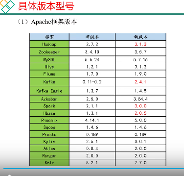

# 项目

### 基本

```
spu，standard product unit，标准化产品单元，描述一个产品的特性，一般是品牌+型号+关键属性确定。
sku,stock keep unit ,库存量单位，不可分割的最小单位，涉及到具体的属性，如颜色、尺寸等。
实时数仓可以快速步骤当前的行为，有时候不需要获得大量的数据，关注当前这一天、一小时的行为，也有很大的价值，越即时越有效。
```


### 目的

```
搭建采集通道，将json格式的用户行为日志文件采集到hdfs上，并进行过滤处理，然后存入hive数据仓库。搭建采集通道，将mysql业务数据采集到hdfs上，并进行过滤处理，然后存入hive数据仓库。搭建hive数据仓库，存储存储用户行为日志和电商平台的业务数据，并合理设计和搭建分层数据仓库，包括ods,dwd,dim,dws,dwt,ads层。实现分析目的，包括活动的分析信息、优惠券的分析信息、订单在省份维度上的分析、订单在spu（商品）上的分析、订单的总体分析、用户的点击路径分析、商品的回购力度分析、用户行为在1、7、30天的分析（）、用户变动信息（回归、离开）、用户停留时间（不同创建日期）、用户1、7、30天总信息分析（下单、上限、）、用户浏览商品信息。并精心设计仓库结构，优化sql和函数，提高处理速度。
```

### 采集

##### flume

###### flume配置

```

```

###### flume过滤器

```
时间戳分文件夹放好
```

### sqoop

```
```


### 仓库设计

>设计原则，设计技巧
>
>最重要的几个主题：用户，商品，活动，优惠，时间，地区

|                | **时间** | **用户** | **地区** | **商品** | **优惠券** | **活动** | **度量值**                      |
| -------------- | -------- | -------- | -------- | -------- | ---------- | -------- | ------------------------------- |
| **订单**       | √        | √        | √        |          |            |          | 运费/优惠金额/原始金额/最终金额 |
| **订单详情**   | √        | √        | √        | √        | √          | √        | 件数/优惠金额/原始金额/最终金额 |
| **支付**       | √        | √        | √        |          |            |          | 支付金额                        |
| **加购**       | √        | √        |          | √        |            |          | 件数/金额                       |
| **收藏**       | √        | √        |          | √        |            |          | 次数                            |
| **评价**       | √        | √        |          | √        |            |          | 次数                            |
| **退单**       | √        | √        | √        | √        |            |          | 件数/金额                       |
| **退款**       | √        | √        | √        | √        |            |          | 件数/金额                       |
| **优惠券领用** | √        | √        |          |          | √          |          | 次数                            |

```
业务DWD如下：
可选的业务过程有：收藏，加购，支付，订单，订单详情，退单，退款，评价，优惠券领用
可选的粒度有：一次交易，一天，一个商品，一次领用
可选的维度有：时间，用户，地区，商品，优惠券，活动。
可选的事实度量值：次数，交易金额。
```


##### ODS

>使用sqoop和flume采集到hdfs目录，在导入到ods表中，ods表的设计不用维度建模，参考采集的数据即可。
>
>ods是原生的数据，没有所谓的维度。可以通过维度建模的维度来考虑和设计这些表，并进行一定扩展。如维度包括优惠券，订单，商品，可扩展为优惠券信息表、优惠券领用表，订单表、订单明细优惠券关联表，商品表、商品销售属性表（如白色，4英寸等属性）。
>
>时间是常用的列，如创建，使用，取消，支付等

表清单：行为记录表（ods_log），其他业务表（每个对应一个mysql数据库表）

###### ods_log

```
行为日志DWD如下：
CREATE EXTERNAL TABLE ods_log (`line` string)
PARTITIONED BY (`dt` string) -- 按照时间创建分区
STORED AS -- 指定存储方式，读数据采用LzoTextInputFormat；
  INPUTFORMAT 'com.hadoop.mapred.DeprecatedLzoTextInputFormat'
  OUTPUTFORMAT 'org.apache.hadoop.hive.ql.io.HiveIgnoreKeyTextOutputFormat'
LOCATION '/warehouse/gmall/ods/ods_log'  -- 指定数据在hdfs上的存储位置
;
原则：直接一条json进去，没啥好说的。
技巧：使用时间分区，使用lzo文件压缩。
```

###### ods_activity_info

```
CREATE EXTERNAL TABLE ods_activity_info(
    `id` STRING COMMENT '编号',
    `activity_name` STRING  COMMENT '活动名称',
    `activity_type` STRING  COMMENT '活动类型',
    `start_time` STRING  COMMENT '开始时间',
    `end_time` STRING  COMMENT '结束时间',
    `create_time` STRING  COMMENT '创建时间'
) COMMENT '活动信息表'
PARTITIONED BY (`dt` STRING)
ROW FORMAT DELIMITED FIELDS TERMINATED BY '\t'
STORED AS
  INPUTFORMAT 'com.hadoop.mapred.DeprecatedLzoTextInputFormat'
  OUTPUTFORMAT 'org.apache.hadoop.hive.ql.io.HiveIgnoreKeyTextOutputFormat'
LOCATION '/warehouse/gmall/ods/ods_activity_info/';
原则：活动该维度的基本属性，如时间、类型、名称。
技巧：使用时间分区。
```

###### ods_activity_rule

```
CREATE EXTERNAL TABLE ods_activity_rule(
    `id` STRING COMMENT '编号',
    `activity_id` STRING  COMMENT '活动ID',
    `activity_type` STRING COMMENT '活动类型',
    `condition_amount` DECIMAL(16,2) COMMENT '满减金额',
    `condition_num` BIGINT COMMENT '满减件数',
    `benefit_amount` DECIMAL(16,2) COMMENT '优惠金额',
    `benefit_discount` DECIMAL(16,2) COMMENT '优惠折扣',
    `benefit_level` STRING COMMENT '优惠级别'
) COMMENT '活动规则表'
原则：活动规则的要素有，满减规则（满减件数，满减金额），优惠多少（优惠金额，优惠折扣）。
技巧：较为固定，不使用时间分区。
```

###### ods_base_category1

```
CREATE EXTERNAL TABLE ods_base_category1(
    `id` STRING COMMENT 'id',
    `name` STRING COMMENT '名称'
) COMMENT '商品一级分类表'
PARTITIONED BY (`dt` STRING)
ROW FORMAT DELIMITED FIELDS TERMINATED BY '\t'
STORED AS
  INPUTFORMAT 'com.hadoop.mapred.DeprecatedLzoTextInputFormat'
  OUTPUTFORMAT 'org.apache.hadoop.hive.ql.io.HiveIgnoreKeyTextOutputFormat'
LOCATION '/warehouse/gmall/ods/ods_base_category1/';
原则：品类名称。
技巧：商品上新，变动大数量多，使用时间分区。
```

###### ods_base_category2

###### ods_base_category3

```
这三个ods_base_category类似，连接到上一级ods_base_category即可，只有两个基本属性，id和name。
```

###### ods_base_dic

```
CREATE EXTERNAL TABLE ods_base_dic(
    `dic_code` STRING COMMENT '编号',
    `dic_name` STRING COMMENT '编码名称',
    `parent_code` STRING COMMENT '父编码',
    `create_time` STRING COMMENT '创建日期',
    `operate_time` STRING COMMENT '操作日期'
) COMMENT '编码字典表'
PARTITIONED BY (`dt` STRING)
ROW FORMAT DELIMITED FIELDS TERMINATED BY '\t'
STORED AS
  INPUTFORMAT 'com.hadoop.mapred.DeprecatedLzoTextInputFormat'
  OUTPUTFORMAT 'org.apache.hadoop.hive.ql.io.HiveIgnoreKeyTextOutputFormat'
LOCATION '/warehouse/gmall/ods/ods_base_dic/';
原则：编号与编码名称的对应，父编码。
技巧：使用时间分区。
```

###### ods_base_province

```
CREATE EXTERNAL TABLE ods_base_province (
    `id` STRING COMMENT '编号',
    `name` STRING COMMENT '省份名称',
    `region_id` STRING COMMENT '地区ID',
    `area_code` STRING COMMENT '地区编码',
    `iso_code` STRING COMMENT 'ISO-3166编码，供可视化使用',
    `iso_3166_2` STRING COMMENT 'IOS-3166-2编码，供可视化使用'
)  COMMENT '省份表'
ROW FORMAT DELIMITED FIELDS TERMINATED BY '\t'
STORED AS
  INPUTFORMAT 'com.hadoop.mapred.DeprecatedLzoTextInputFormat'
  OUTPUTFORMAT 'org.apache.hadoop.hive.ql.io.HiveIgnoreKeyTextOutputFormat'
LOCATION '/warehouse/gmall/ods/ods_base_province/';
省份信息包括：身份名称、编号、地区编码、地区id、可视化编码
```

###### ods_base_region

```
CREATE EXTERNAL TABLE ods_base_region (
    `id` STRING COMMENT '编号',
    `region_name` STRING COMMENT '地区名称'
)  COMMENT '地区表'
ROW FORMAT DELIMITED FIELDS TERMINATED BY '\t'
STORED AS
  INPUTFORMAT 'com.hadoop.mapred.DeprecatedLzoTextInputFormat'
  OUTPUTFORMAT 'org.apache.hadoop.hive.ql.io.HiveIgnoreKeyTextOutputFormat'
LOCATION '/warehouse/gmall/ods/ods_base_region/';
地区编号、地区名称
```

###### ods_base_trademark 

```
CREATE EXTERNAL TABLE ods_base_trademark (
    `id` STRING COMMENT '编号',
    `tm_name` STRING COMMENT '品牌名称'
)  COMMENT '品牌表'
PARTITIONED BY (`dt` STRING)
ROW FORMAT DELIMITED FIELDS TERMINATED BY '\t'
STORED AS
  INPUTFORMAT 'com.hadoop.mapred.DeprecatedLzoTextInputFormat'
  OUTPUTFORMAT 'org.apache.hadoop.hive.ql.io.HiveIgnoreKeyTextOutputFormat'
LOCATION '/warehouse/gmall/ods/ods_base_trademark/';
品牌名称，品牌编号
```

###### ods_cart_info

```
CREATE EXTERNAL TABLE ods_cart_info(
    `id` STRING COMMENT '编号',
    `user_id` STRING COMMENT '用户id',
    `sku_id` STRING COMMENT 'skuid',
    `cart_price` DECIMAL(16,2)  COMMENT '放入购物车时价格',
    `sku_num` BIGINT COMMENT '数量',
    `sku_name` STRING COMMENT 'sku名称 (冗余)',
    `create_time` STRING COMMENT '创建时间',
    `operate_time` STRING COMMENT '修改时间',
    `is_ordered` STRING COMMENT '是否已经下单',
    `order_time` STRING COMMENT '下单时间',
    `source_type` STRING COMMENT '来源类型',
    `source_id` STRING COMMENT '来源编号'
) COMMENT '加购表'
PARTITIONED BY (`dt` STRING)
ROW FORMAT DELIMITED FIELDS TERMINATED BY '\t'
STORED AS
  INPUTFORMAT 'com.hadoop.mapred.DeprecatedLzoTextInputFormat'
  OUTPUTFORMAT 'org.apache.hadoop.hive.ql.io.HiveIgnoreKeyTextOutputFormat'
LOCATION '/warehouse/gmall/ods/ods_cart_info/';
用户id，价格，sku名称，  创建时间，修改时间，是否下单，下单时间
```

###### ods_comment_info

```
CREATE EXTERNAL TABLE ods_comment_info(
    `id` STRING COMMENT '编号',
    `user_id` STRING COMMENT '用户ID',
    `sku_id` STRING COMMENT '商品sku',
    `spu_id` STRING COMMENT '商品spu',
    `order_id` STRING COMMENT '订单ID',
    `appraise` STRING COMMENT '评价',
    `create_time` STRING COMMENT '评价时间'
) COMMENT '商品评论表'
PARTITIONED BY (`dt` STRING)
ROW FORMAT DELIMITED FIELDS TERMINATED BY '\t'
STORED AS
  INPUTFORMAT 'com.hadoop.mapred.DeprecatedLzoTextInputFormat'
  OUTPUTFORMAT 'org.apache.hadoop.hive.ql.io.HiveIgnoreKeyTextOutputFormat'
LOCATION '/warehouse/gmall/ods/ods_comment_info/';
编号，用户id，商品sku，商品spu，订单id，   评价，评价时间
```

###### ods_coupon_info

```
CREATE EXTERNAL TABLE ods_coupon_info(
    `id` STRING COMMENT '购物券编号',
    `coupon_name` STRING COMMENT '购物券名称',
    `coupon_type` STRING COMMENT '购物券类型 1 现金券 2 折扣券 3 满减券 4 满件打折券',
    `condition_amount` DECIMAL(16,2) COMMENT '满额数',
    `condition_num` BIGINT COMMENT '满件数',
    `activity_id` STRING COMMENT '活动编号',
    `benefit_amount` DECIMAL(16,2) COMMENT '减金额',
    `benefit_discount` DECIMAL(16,2) COMMENT '折扣',
    `create_time` STRING COMMENT '创建时间',
    `range_type` STRING COMMENT '范围类型 1、商品 2、品类 3、品牌',
    `limit_num` BIGINT COMMENT '最多领用次数',
    `taken_count` BIGINT COMMENT '已领用次数',
    `start_time` STRING COMMENT '开始领取时间',
    `end_time` STRING COMMENT '结束领取时间',
    `operate_time` STRING COMMENT '修改时间',
    `expire_time` STRING COMMENT '过期时间'
) COMMENT '优惠券表'
PARTITIONED BY (`dt` STRING)
ROW FORMAT DELIMITED FIELDS TERMINATED BY '\t'
STORED AS
  INPUTFORMAT 'com.hadoop.mapred.DeprecatedLzoTextInputFormat'
  OUTPUTFORMAT 'org.apache.hadoop.hive.ql.io.HiveIgnoreKeyTextOutputFormat'
LOCATION '/warehouse/gmall/ods/ods_coupon_info/';
购物券编号，购物券名称，类型（满减，满件打折，现金，折扣）， 满减数，满减件，折扣，减金额，范围类型（品牌，品类，商品），时间（创建，开始领取，结束领取，修改，过期）
```

###### ods_coupon_use

```
CREATE EXTERNAL TABLE ods_coupon_use(
    `id` STRING COMMENT '编号',
    `coupon_id` STRING  COMMENT '优惠券ID',
    `user_id` STRING  COMMENT 'skuid',
    `order_id` STRING  COMMENT 'spuid',
    `coupon_status` STRING  COMMENT '优惠券状态',
    `get_time` STRING  COMMENT '领取时间',
    `using_time` STRING  COMMENT '使用时间(下单)',
    `used_time` STRING  COMMENT '使用时间(支付)',
    `expire_time` STRING COMMENT '过期时间'
) COMMENT '优惠券领用表'
PARTITIONED BY (`dt` STRING)
ROW FORMAT DELIMITED FIELDS TERMINATED BY '\t'
STORED AS
  INPUTFORMAT 'com.hadoop.mapred.DeprecatedLzoTextInputFormat'
  OUTPUTFORMAT 'org.apache.hadoop.hive.ql.io.HiveIgnoreKeyTextOutputFormat'
LOCATION '/warehouse/gmall/ods/ods_coupon_use/';
编号，商品spu，商品sku，  时间（领取，过期，下单，支付）
```

###### ods_favor_info

```
CREATE EXTERNAL TABLE ods_favor_info(
    `id` STRING COMMENT '编号',
    `user_id` STRING COMMENT '用户id',
    `sku_id` STRING COMMENT 'skuid',
    `spu_id` STRING COMMENT 'spuid',
    `is_cancel` STRING COMMENT '是否取消',
    `create_time` STRING COMMENT '收藏时间',
    `cancel_time` STRING COMMENT '取消时间'
) COMMENT '商品收藏表'
PARTITIONED BY (`dt` STRING)
ROW FORMAT DELIMITED FIELDS TERMINATED BY '\t'
STORED AS
  INPUTFORMAT 'com.hadoop.mapred.DeprecatedLzoTextInputFormat'
  OUTPUTFORMAT 'org.apache.hadoop.hive.ql.io.HiveIgnoreKeyTextOutputFormat'
LOCATION '/warehouse/gmall/ods/ods_favor_info/';
用户id，sku，spu   时间（收藏，取消）
```

###### ods_order_detail

>一项订单记录是一件商品，维护一个用户与多件同类商品的映射。
>
>来源类型是指收藏、购物车之类的？
>
>将此表与订单表联系起来，此表包含了 商品的详细信息，如名称，id，数量，金额，所以称为明细。

```
CREATE EXTERNAL TABLE ods_order_detail(
    `id` STRING COMMENT '编号',
    `order_id` STRING  COMMENT '订单号',
    `sku_id` STRING COMMENT '商品id',
    `sku_name` STRING COMMENT '商品名称',
    `order_price` DECIMAL(16,2) COMMENT '商品价格',
    `sku_num` BIGINT COMMENT '商品数量',
    `create_time` STRING COMMENT '创建时间',
    `source_type` STRING COMMENT '来源类型',
    `source_id` STRING COMMENT '来源编号',
    `split_final_amount` DECIMAL(16,2) COMMENT '分摊最终金额',
    `split_activity_amount` DECIMAL(16,2) COMMENT '分摊活动优惠',
    `split_coupon_amount` DECIMAL(16,2) COMMENT '分摊优惠券优惠'
) COMMENT '订单详情表'
PARTITIONED BY (`dt` STRING)
ROW FORMAT DELIMITED FIELDS TERMINATED BY '\t'
STORED AS
  INPUTFORMAT 'com.hadoop.mapred.DeprecatedLzoTextInputFormat'
  OUTPUTFORMAT 'org.apache.hadoop.hive.ql.io.HiveIgnoreKeyTextOutputFormat'
LOCATION '/warehouse/gmall/ods/ods_order_detail/';
编号，用户id，商品id，商品名称，商品价格，商品数量    时间（创建）、分摊（金额，活动优惠，优惠券优惠）
```

###### ods_order_detail_activity

>对应订单明细中的活动优惠、优惠券优惠
>
>没有使用外键链接，专门创了一个关联表？为什么
>
>活动 与活动规则表（满减、满件、金额、折扣等详细信息）

```
CREATE EXTERNAL TABLE ods_order_detail_activity(
    `id` STRING COMMENT '编号',
    `order_id` STRING  COMMENT '订单号',
    `order_detail_id` STRING COMMENT '订单明细id',
    `activity_id` STRING COMMENT '活动id',
    `activity_rule_id` STRING COMMENT '活动规则id',
    `sku_id` BIGINT COMMENT '商品id',
    `create_time` STRING COMMENT '创建时间'
) COMMENT '订单详情活动关联表'
PARTITIONED BY (`dt` STRING)
ROW FORMAT DELIMITED FIELDS TERMINATED BY '\t'
STORED AS
  INPUTFORMAT 'com.hadoop.mapred.DeprecatedLzoTextInputFormat'
  OUTPUTFORMAT 'org.apache.hadoop.hive.ql.io.HiveIgnoreKeyTextOutputFormat'
LOCATION '/warehouse/gmall/ods/ods_order_detail_activity/';
订单号、活动那个id、商品id、活动规则id   时间（创建）
```

######  ods_order_detail_coupon

```
CREATE EXTERNAL TABLE ods_order_detail_coupon(
    `id` STRING COMMENT '编号',
    `order_id` STRING  COMMENT '订单号',
    `order_detail_id` STRING COMMENT '订单明细id',
    `coupon_id` STRING COMMENT '优惠券id',
    `coupon_use_id` STRING COMMENT '优惠券领用记录id',
    `sku_id` STRING COMMENT '商品id',
    `create_time` STRING COMMENT '创建时间'
) COMMENT '订单详情活动关联表'
PARTITIONED BY (`dt` STRING)
ROW FORMAT DELIMITED FIELDS TERMINATED BY '\t'
STORED AS
  INPUTFORMAT 'com.hadoop.mapred.DeprecatedLzoTextInputFormat'
  OUTPUTFORMAT 'org.apache.hadoop.hive.ql.io.HiveIgnoreKeyTextOutputFormat'
LOCATION '/warehouse/gmall/ods/ods_order_detail_coupon/';
将订单与优惠券领用表联系起来
```

###### ods_order_info

>订单明细：订单，用户，商品，活动，优惠的关联
>
>订单表：订单（状态（已取消，已购买），金额），用户，商品，活动，支付，物流 （运费，运费减免） 地区（省份ID），    时间（创建，）
>
>这两个表分开有什么意义？

```
CREATE EXTERNAL TABLE ods_order_info (
    `id` STRING COMMENT '订单号',
    `final_amount` DECIMAL(16,2) COMMENT '订单最终金额',
    `order_status` STRING COMMENT '订单状态',
    `user_id` STRING COMMENT '用户id',
    `payment_way` STRING COMMENT '支付方式',
    `delivery_address` STRING COMMENT '送货地址',
    `out_trade_no` STRING COMMENT '支付流水号',
    `create_time` STRING COMMENT '创建时间',
    `operate_time` STRING COMMENT '操作时间',
    `expire_time` STRING COMMENT '过期时间',
    `tracking_no` STRING COMMENT '物流单编号',
    `province_id` STRING COMMENT '省份ID',
    `activity_reduce_amount` DECIMAL(16,2) COMMENT '活动减免金额',
    `coupon_reduce_amount` DECIMAL(16,2) COMMENT '优惠券减免金额',
    `original_amount` DECIMAL(16,2)  COMMENT '订单原价金额',
    `feight_fee` DECIMAL(16,2)  COMMENT '运费',
    `feight_fee_reduce` DECIMAL(16,2)  COMMENT '运费减免'
) COMMENT '订单表'
PARTITIONED BY (`dt` STRING)
ROW FORMAT DELIMITED FIELDS TERMINATED BY '\t'
STORED AS
  INPUTFORMAT 'com.hadoop.mapred.DeprecatedLzoTextInputFormat'
  OUTPUTFORMAT 'org.apache.hadoop.hive.ql.io.HiveIgnoreKeyTextOutputFormat'
LOCATION '/warehouse/gmall/ods/ods_order_info/';

```

###### ods_order_refund_info

>退单是支付之后发生的行为，未支付就推出是订单表的订单状态为取消。

```
CREATE EXTERNAL TABLE ods_order_refund_info(
    `id` STRING COMMENT '编号',
    `user_id` STRING COMMENT '用户ID',
    `order_id` STRING COMMENT '订单ID',
    `sku_id` STRING COMMENT '商品ID',
    `refund_type` STRING COMMENT '退单类型',
    `refund_num` BIGINT COMMENT '退单件数',
    `refund_amount` DECIMAL(16,2) COMMENT '退单金额',
    `refund_reason_type` STRING COMMENT '退单原因类型',
    `refund_status` STRING COMMENT '退单状态',--退单状态应包含买家申请、卖家审核、卖家收货、退款完成等状态。此处未涉及到，故该表按增量处理
    `create_time` STRING COMMENT '退单时间'
) COMMENT '退单表'
PARTITIONED BY (`dt` STRING)
ROW FORMAT DELIMITED FIELDS TERMINATED BY '\t'
STORED AS
  INPUTFORMAT 'com.hadoop.mapred.DeprecatedLzoTextInputFormat'
  OUTPUTFORMAT 'org.apache.hadoop.hive.ql.io.HiveIgnoreKeyTextOutputFormat'
LOCATION '/warehouse/gmall/ods/ods_order_refund_info/';
订单，金额，商品（件数，id），原因类型  退单状态  时间（退单）
```

###### ods_order_status_log

```
CREATE EXTERNAL TABLE ods_order_status_log (
    `id` STRING COMMENT '编号',
    `order_id` STRING COMMENT '订单ID',
    `order_status` STRING COMMENT '订单状态',
    `operate_time` STRING COMMENT '修改时间'
)  COMMENT '订单状态表'
PARTITIONED BY (`dt` STRING)
ROW FORMAT DELIMITED FIELDS TERMINATED BY '\t'
STORED AS
  INPUTFORMAT 'com.hadoop.mapred.DeprecatedLzoTextInputFormat'
  OUTPUTFORMAT 'org.apache.hadoop.hive.ql.io.HiveIgnoreKeyTextOutputFormat'
LOCATION '/warehouse/gmall/ods/ods_order_status_log/';
订单（id，状态）   时间
```

###### ods_payment_info

```
CREATE EXTERNAL TABLE ods_payment_info(
    `id` STRING COMMENT '编号',
    `out_trade_no` STRING COMMENT '对外业务编号',
    `order_id` STRING COMMENT '订单编号',
    `user_id` STRING COMMENT '用户编号',
    `payment_type` STRING COMMENT '支付类型',
    `trade_no` STRING COMMENT '交易编号',
    `payment_amount` DECIMAL(16,2) COMMENT '支付金额',
    `subject` STRING COMMENT '交易内容',
    `payment_status` STRING COMMENT '支付状态',
    `create_time` STRING COMMENT '创建时间',
    `callback_time` STRING COMMENT '回调时间'
)  COMMENT '支付流水表'
PARTITIONED BY (`dt` STRING)
ROW FORMAT DELIMITED FIELDS TERMINATED BY '\t'
STORED AS
  INPUTFORMAT 'com.hadoop.mapred.DeprecatedLzoTextInputFormat'
  OUTPUTFORMAT 'org.apache.hadoop.hive.ql.io.HiveIgnoreKeyTextOutputFormat'
LOCATION '/warehouse/gmall/ods/ods_payment_info/';
订单（id），业务（id），用户（id），支付（编号，金额，类型，状态），时间（创建，支付）
```

###### ods_refund_payment

```
CREATE EXTERNAL TABLE ods_refund_payment(
    `id` STRING COMMENT '编号',
    `out_trade_no` STRING COMMENT '对外业务编号',
    `order_id` STRING COMMENT '订单编号',
    `sku_id` STRING COMMENT 'SKU编号',
    `payment_type` STRING COMMENT '支付类型',
    `trade_no` STRING COMMENT '交易编号',
    `refund_amount` DECIMAL(16,2) COMMENT '支付金额',
    `subject` STRING COMMENT '交易内容',
    `refund_status` STRING COMMENT '支付状态',
    `create_time` STRING COMMENT '创建时间',
    `callback_time` STRING COMMENT '回调时间'
)  COMMENT '支付流水表'
PARTITIONED BY (`dt` STRING)
ROW FORMAT DELIMITED FIELDS TERMINATED BY '\t'
STORED AS
  INPUTFORMAT 'com.hadoop.mapred.DeprecatedLzoTextInputFormat'
  OUTPUTFORMAT 'org.apache.hadoop.hive.ql.io.HiveIgnoreKeyTextOutputFormat'
LOCATION '/warehouse/gmall/ods/ods_refund_payment/';
订单（），商品（sku），支付（金额，类型，），时间（创建）
```

######  ods_sku_attr_value

```
CREATE EXTERNAL TABLE ods_sku_attr_value(
    `id` STRING COMMENT '编号',
    `attr_id` STRING COMMENT '平台属性ID',
    `value_id` STRING COMMENT '平台属性值ID',
    `sku_id` STRING COMMENT '商品ID',
    `attr_name` STRING COMMENT '平台属性名称',
    `value_name` STRING COMMENT '平台属性值名称'
) COMMENT 'sku平台属性表'
PARTITIONED BY (`dt` STRING)
ROW FORMAT DELIMITED FIELDS TERMINATED BY '\t'
STORED AS
  INPUTFORMAT 'com.hadoop.mapred.DeprecatedLzoTextInputFormat'
  OUTPUTFORMAT 'org.apache.hadoop.hive.ql.io.HiveIgnoreKeyTextOutputFormat'
LOCATION '/warehouse/gmall/ods/ods_sku_attr_value/';
将商品和属性及属性值连接
```

###### ods_sku_info

>库存量单位
>
>大小关系：类目 >（品牌）品类>  型号（spu） > sku

```
CREATE EXTERNAL TABLE ods_sku_info(
    `id` STRING COMMENT 'skuId',
    `spu_id` STRING COMMENT 'spuid',
    `price` DECIMAL(16,2) COMMENT '价格',
    `sku_name` STRING COMMENT '商品名称',
    `sku_desc` STRING COMMENT '商品描述',
    `weight` DECIMAL(16,2) COMMENT '重量',
    `tm_id` STRING COMMENT '品牌id',
    `category3_id` STRING COMMENT '品类id',
    `is_sale` STRING COMMENT '是否在售',
    `create_time` STRING COMMENT '创建时间'
) COMMENT 'SKU商品表'
PARTITIONED BY (`dt` STRING)
ROW FORMAT DELIMITED FIELDS TERMINATED BY '\t'
STORED AS
  INPUTFORMAT 'com.hadoop.mapred.DeprecatedLzoTextInputFormat'
  OUTPUTFORMAT 'org.apache.hadoop.hive.ql.io.HiveIgnoreKeyTextOutputFormat'
LOCATION '/warehouse/gmall/ods/ods_sku_info/';
sku,spu,价格，商品属性（重量，描述，名称），品牌，品类（如华为有耳机、手机等品类）    时间（创建）
```

###### ods_sku_sale_attr_value

>销售属性是指品类、型号确认后的相关属性，如颜色等，以此确定库存。

```
CREATE EXTERNAL TABLE ods_sku_sale_attr_value(
    `id` STRING COMMENT '编号',
    `sku_id` STRING COMMENT 'sku_id',
    `spu_id` STRING COMMENT 'spu_id',
    `sale_attr_value_id` STRING COMMENT '销售属性值id',
    `sale_attr_id` STRING COMMENT '销售属性id',
    `sale_attr_name` STRING COMMENT '销售属性名称',
    `sale_attr_value_name` STRING COMMENT '销售属性值名称'
) COMMENT 'sku销售属性名称'
PARTITIONED BY (`dt` STRING)
ROW FORMAT DELIMITED FIELDS TERMINATED BY '\t'
STORED AS
  INPUTFORMAT 'com.hadoop.mapred.DeprecatedLzoTextInputFormat'
  OUTPUTFORMAT 'org.apache.hadoop.hive.ql.io.HiveIgnoreKeyTextOutputFormat'
LOCATION '/warehouse/gmall/ods/ods_sku_sale_attr_value/';
将商品（sku，spu）和销售属性及销售属性值连接
```

###### ods_spu_info

```
CREATE EXTERNAL TABLE ods_spu_info(
    `id` STRING COMMENT 'spuid',
    `spu_name` STRING COMMENT 'spu名称',
    `category3_id` STRING COMMENT '品类id',
    `tm_id` STRING COMMENT '品牌id'
) COMMENT 'SPU商品表'
PARTITIONED BY (`dt` STRING)
ROW FORMAT DELIMITED FIELDS TERMINATED BY '\t'
STORED AS
  INPUTFORMAT 'com.hadoop.mapred.DeprecatedLzoTextInputFormat'
  OUTPUTFORMAT 'org.apache.hadoop.hive.ql.io.HiveIgnoreKeyTextOutputFormat'
LOCATION '/warehouse/gmall/ods/ods_spu_info/';
spuid,品牌，品类
```

###### ods_user_info

```
CREATE EXTERNAL TABLE ods_user_info(
    `id` STRING COMMENT '用户id',
    `login_name` STRING COMMENT '用户名称',
    `nick_name` STRING COMMENT '用户昵称',
    `name` STRING COMMENT '用户姓名',
    `phone_num` STRING COMMENT '手机号码',
    `email` STRING COMMENT '邮箱',
    `user_level` STRING COMMENT '用户等级',
    `birthday` STRING COMMENT '生日',
    `gender` STRING COMMENT '性别',
    `create_time` STRING COMMENT '创建时间',
    `operate_time` STRING COMMENT '操作时间'
) COMMENT '用户表'
PARTITIONED BY (`dt` STRING)
ROW FORMAT DELIMITED FIELDS TERMINATED BY '\t'
STORED AS
  INPUTFORMAT 'com.hadoop.mapred.DeprecatedLzoTextInputFormat'
  OUTPUTFORMAT 'org.apache.hadoop.hive.ql.io.HiveIgnoreKeyTextOutputFormat'
LOCATION '/warehouse/gmall/ods/ods_user_info/';
用户的信息（昵称，手机号，姓名，等级，性别）   时间（创建，操作）
```


##### DIM

>描述几个topic的维度表：用户，商品，活动，优惠，时间，地区。和ads基本一致

###### dim_sku_info

```
CREATE EXTERNAL TABLE dim_sku_info (
    `id` STRING COMMENT '商品id',
    `price` DECIMAL(16,2) COMMENT '商品价格',
    `sku_name` STRING COMMENT '商品名称',
    `sku_desc` STRING COMMENT '商品描述',
    `weight` DECIMAL(16,2) COMMENT '重量',
    `is_sale` BOOLEAN COMMENT '是否在售',
    `spu_id` STRING COMMENT 'spu编号',
    `spu_name` STRING COMMENT 'spu名称',
    `category3_id` STRING COMMENT '三级分类id',
    `category3_name` STRING COMMENT '三级分类名称',
    `category2_id` STRING COMMENT '二级分类id',
    `category2_name` STRING COMMENT '二级分类名称',
    `category1_id` STRING COMMENT '一级分类id',
    `category1_name` STRING COMMENT '一级分类名称',
    `tm_id` STRING COMMENT '品牌id',
    `tm_name` STRING COMMENT '品牌名称',
    `sku_attr_values` ARRAY<STRUCT<attr_id:STRING,value_id:STRING,attr_name:STRING,value_name:STRING>> COMMENT '平台属性',
    `sku_sale_attr_values` ARRAY<STRUCT<sale_attr_id:STRING,sale_attr_value_id:STRING,sale_attr_name:STRING,sale_attr_value_name:STRING>> COMMENT '销售属性',
    `create_time` STRING COMMENT '创建时间'
) COMMENT '商品维度表'
PARTITIONED BY (`dt` STRING)
STORED AS PARQUET
LOCATION '/warehouse/gmall/dim/dim_sku_info/'
TBLPROPERTIES ("parquet.compression"="lzo");
品牌，123级分类，（名称，重量，描述是否在售），spu，sku
```

###### dim_coupon_info

```
CREATE EXTERNAL TABLE dim_coupon_info(
    `id` STRING COMMENT '购物券编号',
    `coupon_name` STRING COMMENT '购物券名称',
    `coupon_type` STRING COMMENT '购物券类型 1 现金券 2 折扣券 3 满减券 4 满件打折券',
    `condition_amount` DECIMAL(16,2) COMMENT '满额数',
    `condition_num` BIGINT COMMENT '满件数',
    `activity_id` STRING COMMENT '活动编号',
    `benefit_amount` DECIMAL(16,2) COMMENT '减金额',
    `benefit_discount` DECIMAL(16,2) COMMENT '折扣',
    `create_time` STRING COMMENT '创建时间',
    `range_type` STRING COMMENT '范围类型 1、商品 2、品类 3、品牌',
    `limit_num` BIGINT COMMENT '最多领取次数',
    `taken_count` BIGINT COMMENT '已领取次数',
    `start_time` STRING COMMENT '可以领取的开始日期',
    `end_time` STRING COMMENT '可以领取的结束日期',
    `operate_time` STRING COMMENT '修改时间',
    `expire_time` STRING COMMENT '过期时间'
) COMMENT '优惠券维度表'
PARTITIONED BY (`dt` STRING)
STORED AS PARQUET
LOCATION '/warehouse/gmall/dim/dim_coupon_info/'
TBLPROPERTIES ("parquet.compression"="lzo");

```

###### dim_activity_rule_info

```
CREATE EXTERNAL TABLE dim_activity_rule_info(
    `activity_rule_id` STRING COMMENT '活动规则ID',
    `activity_id` STRING COMMENT '活动ID',
    `activity_name` STRING  COMMENT '活动名称',
    `activity_type` STRING  COMMENT '活动类型',
    `start_time` STRING  COMMENT '开始时间',
    `end_time` STRING  COMMENT '结束时间',
    `create_time` STRING  COMMENT '创建时间',
    `condition_amount` DECIMAL(16,2) COMMENT '满减金额',
    `condition_num` BIGINT COMMENT '满减件数',
    `benefit_amount` DECIMAL(16,2) COMMENT '优惠金额',
    `benefit_discount` DECIMAL(16,2) COMMENT '优惠折扣',
    `benefit_level` STRING COMMENT '优惠级别'
) COMMENT '活动信息表'
PARTITIONED BY (`dt` STRING)
STORED AS PARQUET
LOCATION '/warehouse/gmall/dim/dim_activity_rule_info/'
TBLPROPERTIES ("parquet.compression"="lzo");

```

######  dim_base_province

```
CREATE EXTERNAL TABLE dim_base_province (
    `id` STRING COMMENT 'id',
    `province_name` STRING COMMENT '省市名称',
    `area_code` STRING COMMENT '地区编码',
    `iso_code` STRING COMMENT 'ISO-3166编码，供可视化使用',
    `iso_3166_2` STRING COMMENT 'IOS-3166-2编码，供可视化使用',
    `region_id` STRING COMMENT '地区id',
    `region_name` STRING COMMENT '地区名称'
) COMMENT '地区维度表'
STORED AS PARQUET
LOCATION '/warehouse/gmall/dim/dim_base_province/'
TBLPROPERTIES ("parquet.compression"="lzo");

```

###### dim_date_info

```
CREATE EXTERNAL TABLE dim_date_info(
    `date_id` STRING COMMENT '日',
    `week_id` STRING COMMENT '周ID',
    `week_day` STRING COMMENT '周几',
    `day` STRING COMMENT '每月的第几天',
    `month` STRING COMMENT '第几月',
    `quarter` STRING COMMENT '第几季度',
    `year` STRING COMMENT '年',
    `is_workday` STRING COMMENT '是否是工作日',
    `holiday_id` STRING COMMENT '节假日'
) COMMENT '时间维度表'
STORED AS PARQUET
LOCATION '/warehouse/gmall/dim/dim_date_info/'
TBLPROPERTIES ("parquet.compression"="lzo");

```


##### DWD

>DIM层DWD层需构建维度模型，一般采用星型模型，呈现的状态一般为星座模型。
>
>DWD层使用维度建模，一般按照以下四个步骤：
>
>**选择业务过程→声明粒度→确认维度→确认事实**

```
业务过程：下单业务，支付业务，退款业务，物流业务，一条业务线对应一张事实表，即一张DWD表。
声明粒度：粒度就是行，决定一行代表什么。一般DWD层都是可用的最小粒度，如一次交易，一个商品，一次浏览等。
确认维度：维度就是列，即关心业务过程的哪些特征维度。如下单业务的时间，下单业务的地区，下单业务的用户等。
确认事实：事实就是度量值（次数、个数、件数、金额，可以进行累加），暂时理解为一种特殊的列，也就是特殊的维度。
```

##### DWS

##### DWT

>DWS层和DWT层统称宽表层，这两层的设计思想大致相同。
>
>一般来说DWT中存储的数据的粒度比DWS大，是DWS的汇总数据，如DWS是一天的订单金额，则DWT是一周、一个月的金额。
>
>设计原则：
>
>1.需要建哪些宽表：以维度为基准。（哪些公用的维度，如都关注地区，但是关注）
>
>2.宽表里面的字段：是站在不同维度的角度去看事实表，重点关注事实表聚合后的度量值。


##### ADS

>对电商系统各大主题指标分别进行分析。
>
>如

### hivesql脚本

>sql含义，使用的sql技巧，扩展场景

##### ODS

>将hdfs上的origion_data load进入表中，填充ods。

###### ods_log

>-n 如果字符串长度不为0，为真
>
>-z:长度为0，为真
>
>%F表示格式化为年月日
>
>load data inpath "/origin_data/$APP/log/topic_log/$do_date"  into table   gmall.ods_log  partion(dt='$do_date') 载入hive表
>
>hive -e "$sql"  执行sql
>
>hive  -service hiveserver2
>
>hive -service metastore
>
>

```
#!/bin/bash

# 定义变量方便修改
APP=gmall

# 如果是输入的日期按照取输入日期；如果没输入日期取当前时间的前一天
if [ -n "$1" ] ;then
   do_date=$1
else 
   do_date=`date -d "-1 day" +%F`
fi 

echo ================== 日志日期为 $do_date ==================
sql="
load data inpath '/origin_data/$APP/log/topic_log/$do_date' into table ${APP}.ods_log partition(dt='$do_date');
"

hive -e "$sql"

hadoop jar /opt/module/hadoop-3.1.3/share/hadoop/common/hadoop-lzo-0.4.20.jar com.hadoop.compression.lzo.DistributedLzoIndexer /warehouse/$APP/ods/ods_log/dt=$do_date

#执行
hdfs_to_ods_log.sh 2020-06-14
```

###### ods_db

>ods层都是load data语句，没啥好解释的。然后hive -e执行sql语句就行了。

```
#!/bin/bash

APP=gmall

if [ -n "$2" ] ;then
   do_date=$2
else 
   echo "请传入日期参数"
   exit
fi 

ods_order_info=" 
load data inpath '/origin_data/$APP/db/order_info/$do_date' OVERWRITE into table ${APP}.ods_order_info partition(dt='$do_date');"

ods_order_detail="
load data inpath '/origin_data/$APP/db/order_detail/$do_date' OVERWRITE into table ${APP}.ods_order_detail partition(dt='$do_date');"

ods_sku_info="
load data inpath '/origin_data/$APP/db/sku_info/$do_date' OVERWRITE into table ${APP}.ods_sku_info partition(dt='$do_date');"

ods_user_info="
load data inpath '/origin_data/$APP/db/user_info/$do_date' OVERWRITE into table ${APP}.ods_user_info partition(dt='$do_date');"

ods_payment_info="
load data inpath '/origin_data/$APP/db/payment_info/$do_date' OVERWRITE into table ${APP}.ods_payment_info partition(dt='$do_date');"

ods_base_category1="
load data inpath '/origin_data/$APP/db/base_category1/$do_date' OVERWRITE into table ${APP}.ods_base_category1 partition(dt='$do_date');"

ods_base_category2="
load data inpath '/origin_data/$APP/db/base_category2/$do_date' OVERWRITE into table ${APP}.ods_base_category2 partition(dt='$do_date');"

ods_base_category3="
load data inpath '/origin_data/$APP/db/base_category3/$do_date' OVERWRITE into table ${APP}.ods_base_category3 partition(dt='$do_date'); "

ods_base_trademark="
load data inpath '/origin_data/$APP/db/base_trademark/$do_date' OVERWRITE into table ${APP}.ods_base_trademark partition(dt='$do_date'); "

ods_activity_info="
load data inpath '/origin_data/$APP/db/activity_info/$do_date' OVERWRITE into table ${APP}.ods_activity_info partition(dt='$do_date'); "

ods_cart_info="
load data inpath '/origin_data/$APP/db/cart_info/$do_date' OVERWRITE into table ${APP}.ods_cart_info partition(dt='$do_date'); "

ods_comment_info="
load data inpath '/origin_data/$APP/db/comment_info/$do_date' OVERWRITE into table ${APP}.ods_comment_info partition(dt='$do_date'); "

ods_coupon_info="
load data inpath '/origin_data/$APP/db/coupon_info/$do_date' OVERWRITE into table ${APP}.ods_coupon_info partition(dt='$do_date'); "

ods_coupon_use="
load data inpath '/origin_data/$APP/db/coupon_use/$do_date' OVERWRITE into table ${APP}.ods_coupon_use partition(dt='$do_date'); "

ods_favor_info="
load data inpath '/origin_data/$APP/db/favor_info/$do_date' OVERWRITE into table ${APP}.ods_favor_info partition(dt='$do_date'); "

ods_order_refund_info="
load data inpath '/origin_data/$APP/db/order_refund_info/$do_date' OVERWRITE into table ${APP}.ods_order_refund_info partition(dt='$do_date'); "

ods_order_status_log="
load data inpath '/origin_data/$APP/db/order_status_log/$do_date' OVERWRITE into table ${APP}.ods_order_status_log partition(dt='$do_date'); "

ods_spu_info="
load data inpath '/origin_data/$APP/db/spu_info/$do_date' OVERWRITE into table ${APP}.ods_spu_info partition(dt='$do_date'); "

ods_activity_rule="
load data inpath '/origin_data/$APP/db/activity_rule/$do_date' OVERWRITE into table ${APP}.ods_activity_rule partition(dt='$do_date');" 

ods_base_dic="
load data inpath '/origin_data/$APP/db/base_dic/$do_date' OVERWRITE into table ${APP}.ods_base_dic partition(dt='$do_date'); "

ods_order_detail_activity="
load data inpath '/origin_data/$APP/db/order_detail_activity/$do_date' OVERWRITE into table ${APP}.ods_order_detail_activity partition(dt='$do_date'); "

ods_order_detail_coupon="
load data inpath '/origin_data/$APP/db/order_detail_coupon/$do_date' OVERWRITE into table ${APP}.ods_order_detail_coupon partition(dt='$do_date'); "

ods_refund_payment="
load data inpath '/origin_data/$APP/db/refund_payment/$do_date' OVERWRITE into table ${APP}.ods_refund_payment partition(dt='$do_date'); "

ods_sku_attr_value="
load data inpath '/origin_data/$APP/db/sku_attr_value/$do_date' OVERWRITE into table ${APP}.ods_sku_attr_value partition(dt='$do_date'); "

ods_sku_sale_attr_value="
load data inpath '/origin_data/$APP/db/sku_sale_attr_value/$do_date' OVERWRITE into table ${APP}.ods_sku_sale_attr_value partition(dt='$do_date'); "

ods_base_province=" 
load data inpath '/origin_data/$APP/db/base_province/$do_date' OVERWRITE into table ${APP}.ods_base_province;"

ods_base_region="
load data inpath '/origin_data/$APP/db/base_region/$do_date' OVERWRITE into table ${APP}.ods_base_region;"

case $1 in
    "ods_order_info"){
        hive -e "$ods_order_info"
    };;
    "ods_order_detail"){
        hive -e "$ods_order_detail"
    };;
    "ods_sku_info"){
        hive -e "$ods_sku_info"
    };;
    "ods_user_info"){
        hive -e "$ods_user_info"
    };;
    "ods_payment_info"){
        hive -e "$ods_payment_info"
    };;
    "ods_base_category1"){
        hive -e "$ods_base_category1"
    };;
    "ods_base_category2"){
        hive -e "$ods_base_category2"
    };;
    "ods_base_category3"){
        hive -e "$ods_base_category3"
    };;
    "ods_base_trademark"){
        hive -e "$ods_base_trademark"
    };;
    "ods_activity_info"){
        hive -e "$ods_activity_info"
    };;
    "ods_cart_info"){
        hive -e "$ods_cart_info"
    };;
    "ods_comment_info"){
        hive -e "$ods_comment_info"
    };;
    "ods_coupon_info"){
        hive -e "$ods_coupon_info"
    };;
    "ods_coupon_use"){
        hive -e "$ods_coupon_use"
    };;
    "ods_favor_info"){
        hive -e "$ods_favor_info"
    };;
    "ods_order_refund_info"){
        hive -e "$ods_order_refund_info"
    };;
    "ods_order_status_log"){
        hive -e "$ods_order_status_log"
    };;
    "ods_spu_info"){
        hive -e "$ods_spu_info"
    };;
    "ods_activity_rule"){
        hive -e "$ods_activity_rule"
    };;
    "ods_base_dic"){
        hive -e "$ods_base_dic"
    };;
    "ods_order_detail_activity"){
        hive -e "$ods_order_detail_activity"
    };;
    "ods_order_detail_coupon"){
        hive -e "$ods_order_detail_coupon"
    };;
    "ods_refund_payment"){
        hive -e "$ods_refund_payment"
    };;
    "ods_sku_attr_value"){
        hive -e "$ods_sku_attr_value"
    };;
    "ods_sku_sale_attr_value"){
        hive -e "$ods_sku_sale_attr_value"
    };;
    "ods_base_province"){
        hive -e "$ods_base_province"
    };;
    "ods_base_region"){
        hive -e "$ods_base_region"
    };;
    "all"){
        hive -e "$ods_order_info$ods_order_detail$ods_sku_info$ods_user_info$ods_payment_info$ods_base_category1$ods_base_category2$ods_base_category3$ods_base_trademark$ods_activity_info$ods_cart_info$ods_comment_info$ods_coupon_info$ods_coupon_use$ods_favor_info$ods_order_refund_info$ods_order_status_log$ods_spu_info$ods_activity_rule$ods_base_dic$ods_order_detail_activity$ods_order_detail_coupon$ods_refund_payment$ods_sku_attr_value$ods_sku_sale_attr_value$ods_base_province$ods_base_region"
    };;
esac


#执行shell
hdfs_to_ods_db_init.sh all 2020-06-14
```


##### DIM

>DIM层信息是从ODS清洗过来的，但是一般情况下DIM表是手动导入的，他是设计者规定的一些信息。
>
>编写sql，然后case选择，最后hive -e 执行。
>
>基本的清洗语句为：
>
> insert overwrite gmall.dim_user_info partition(dt='9999-99-99')
>
>select id,name  
>
>from gmall.ods_user_info
>
>where dt="";
>
>这是是常用的select、insert组合语句。两表的列名也一样，故不用指定插入哪些列。
>
>
>
>#使用with as临时表语句和left join
>
>with  spu as
>
>()
>
>insert overwrite table gmall.test
>
>select id,name form
>
>gmall.test1
>
>left join  test2
>
>with as创建的临时表可用于后边的select语句，如语句中的sku临时表。
>
>left join语句以sku为基础连接category1、2、3，spu，连接商标，连接sku属性和属性值
>
>
>
>#join（inner join）和left join使用场景
>
>


```
#!/bin/bash

APP=gmall

if [ -n "$2" ] ;then
   do_date=$2
else 
   echo "请传入日期参数"
   exit
fi 

dim_user_info="
set hive.input.format=org.apache.hadoop.hive.ql.io.HiveInputFormat;
insert overwrite table ${APP}.dim_user_info partition(dt='9999-99-99')
select
    id,
    login_name,
    nick_name,
    md5(name),
    md5(phone_num),
    md5(email),
    user_level,
    birthday,
    gender,
    create_time,
    operate_time,
    '$do_date',
    '9999-99-99'
from ${APP}.ods_user_info
where dt='$do_date';
"

dim_sku_info="
set hive.input.format=org.apache.hadoop.hive.ql.io.HiveInputFormat;
with
sku as
(
    select
        id,
        price,
        sku_name,
        sku_desc,
        weight,
        is_sale,
        spu_id,
        category3_id,
        tm_id,
        create_time
    from ${APP}.ods_sku_info
    where dt='$do_date'
),
spu as
(
    select
        id,
        spu_name
    from ${APP}.ods_spu_info
    where dt='$do_date'
),
c3 as
(
    select
        id,
        name,
        category2_id
    from ${APP}.ods_base_category3
    where dt='$do_date'
),
c2 as
(
    select
        id,
        name,
        category1_id
    from ${APP}.ods_base_category2
    where dt='$do_date'
),
c1 as
(
    select
        id,
        name
    from ${APP}.ods_base_category1
    where dt='$do_date'
),
tm as
(
    select
        id,
        tm_name
    from ${APP}.ods_base_trademark
    where dt='$do_date'
),
attr as
(
    select
        sku_id,
        collect_set(named_struct('attr_id',attr_id,'value_id',value_id,'attr_name',attr_name,'value_name',value_name)) attrs
    from ${APP}.ods_sku_attr_value
    where dt='$do_date'
    group by sku_id
),
sale_attr as
(
    select
        sku_id,
        collect_set(named_struct('sale_attr_id',sale_attr_id,'sale_attr_value_id',sale_attr_value_id,'sale_attr_name',sale_attr_name,'sale_attr_value_name',sale_attr_value_name)) sale_attrs
    from ${APP}.ods_sku_sale_attr_value
    where dt='$do_date'
    group by sku_id
)

insert overwrite table ${APP}.dim_sku_info partition(dt='$do_date')
select
    sku.id,
    sku.price,
    sku.sku_name,
    sku.sku_desc,
    sku.weight,
    sku.is_sale,
    sku.spu_id,
    spu.spu_name,
    sku.category3_id,
    c3.name,
    c3.category2_id,
    c2.name,
    c2.category1_id,
    c1.name,
    sku.tm_id,
    tm.tm_name,
    attr.attrs,
    sale_attr.sale_attrs,
    sku.create_time
from sku
left join spu on sku.spu_id=spu.id
left join c3 on sku.category3_id=c3.id
left join c2 on c3.category2_id=c2.id
left join c1 on c2.category1_id=c1.id
left join tm on sku.tm_id=tm.id
left join attr on sku.id=attr.sku_id
left join sale_attr on sku.id=sale_attr.sku_id;
"

dim_base_province="
set hive.input.format=org.apache.hadoop.hive.ql.io.HiveInputFormat;
insert overwrite table ${APP}.dim_base_province
select
    bp.id,
    bp.name,
    bp.area_code,
    bp.iso_code,
    bp.iso_3166_2,
    bp.region_id,
    br.region_name
from ${APP}.ods_base_province bp
join ${APP}.ods_base_region br on bp.region_id = br.id;
"

dim_coupon_info="
set hive.input.format=org.apache.hadoop.hive.ql.io.HiveInputFormat;
insert overwrite table ${APP}.dim_coupon_info partition(dt='$do_date')
select
    id,
    coupon_name,
    coupon_type,
    condition_amount,
    condition_num,
    activity_id,
    benefit_amount,
    benefit_discount,
    create_time,
    range_type,
    limit_num,
    taken_count,
    start_time,
    end_time,
    operate_time,
    expire_time
from ${APP}.ods_coupon_info
where dt='$do_date';
"

dim_activity_rule_info="
set hive.input.format=org.apache.hadoop.hive.ql.io.HiveInputFormat;
insert overwrite table ${APP}.dim_activity_rule_info partition(dt='$do_date')
select
    ar.id,
    ar.activity_id,
    ai.activity_name,
    ar.activity_type,
    ai.start_time,
    ai.end_time,
    ai.create_time,
    ar.condition_amount,
    ar.condition_num,
    ar.benefit_amount,
    ar.benefit_discount,
    ar.benefit_level
from
(
    select
        id,
        activity_id,
        activity_type,
        condition_amount,
        condition_num,
        benefit_amount,
        benefit_discount,
        benefit_level
    from ${APP}.ods_activity_rule
    where dt='$do_date'
)ar
left join
(
    select
        id,
        activity_name,
        start_time,
        end_time,
        create_time
    from ${APP}.ods_activity_info
    where dt='$do_date'
)ai
on ar.activity_id=ai.id;
"

case $1 in
"dim_user_info"){
    hive -e "$dim_user_info"
};;
"dim_sku_info"){
    hive -e "$dim_sku_info"
};;
"dim_base_province"){
    hive -e "$dim_base_province"
};;
"dim_coupon_info"){
    hive -e "$dim_coupon_info"
};;
"dim_activity_rule_info"){
    hive -e "$dim_activity_rule_info"
};;
"all"){
    hive -e "$dim_user_info$dim_sku_info$dim_coupon_info$dim_activity_rule_info$dim_base_province"
};;
esac
#ods_to_dim_db_init.sh all 2020-06-14
```


##### DWD

##### DWS

##### DWT

##### ADS

##### azkaban

### ketttle

>基本操作，操作技巧

##### DIM

### superset图表

>活动的分析信息、优惠券的分析信息、订单在省份维度上的分析、订单在spu（商品）上的分析、订单的总体分析、用户的点击路径分析、商品的回购力度分析、用户行为在1、7、30天的分析（）、用户变动信息（回归、离开）、用户停留时间（不同创建日期）、用户1、7、30天总信息分析（下单、上限、）、用户浏览商品信息

### 采集脚本

##### sqoop

##### flume

# summary

```
zookeeper,kafka,flume,sqoop,superset
支持组件(zookeeper，kafka)，数据采集迁移框架(flume，logtash，sqoop)，数仓(hadoop,hive)，数据分析转换引擎（etl）(kettle,hivesql，spark,kylin,presto)，可视化框架(superset)、调度组件(azkaban)、sql封装工具（phoenix）
```

# 服务分布

| 机器       | 服务                                       | 教程机器 |
| ---------- | ------------------------------------------ | -------- |
| 187,hbase  | hive,mysql_hive,flume_file_kafka           | 102      |
| 186,hbase1 | flume_file_kafka                           | 103      |
| 185,hbase2 | mysql_platform,mysql_lisa,flume_kafka_hdfs | 104      |

# 软件版本



##### 
