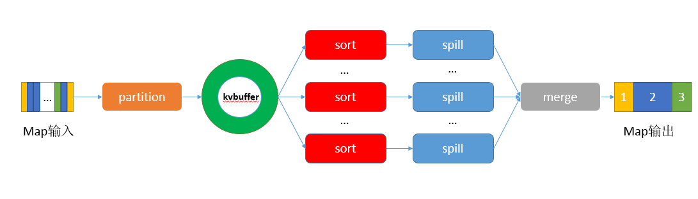
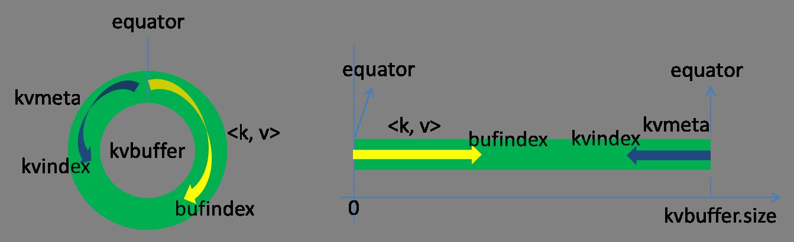
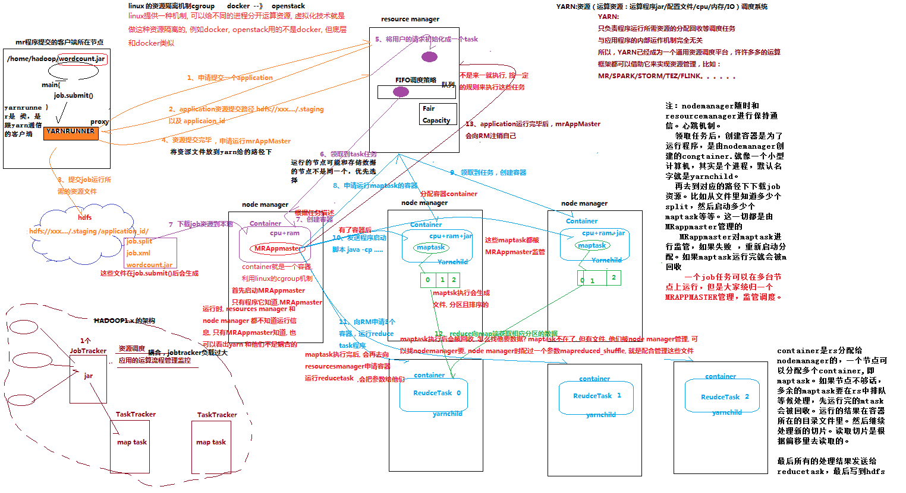
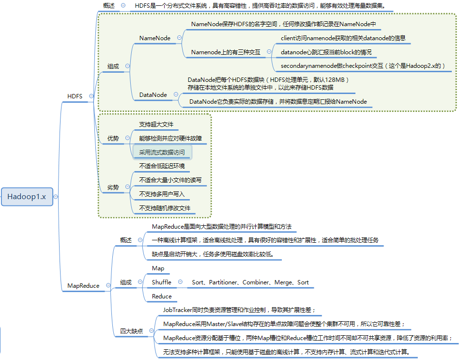

# 相关组件版本

```
hadoop3.1.4
hbase-2.3.3
hive-3.1.2
zookeeper3.5.9
mysql-5.7.28
kafka_2.12-2.1.1
flume 1.9.0
```

# 端口

```
namenode rpc  8020
webui 9870
9000d
```

# CONFIG

```
mapred.job.maps：一个job可以分配到map数量。这里的map数量和InputSplit控制能的map数量相同，用户不同直接设置此参数，由InputSplit决定，可通过设置mapred.min.split.sizej。InputSplit控制mapTask任务的数量，RecordReader控制输入数据的读取来控制map函数调用次数。而此处的maps是指有多少个核心可用于map任务槽，用来同时执行map任务。
```

# hadoop服务器搭建

>软件及系统版本：hadoop3.1.4,centos7.2，idea2019.3.3，maven为idea的bundle版本。
>
>参考官方文档3.1.4
>
>参考的视频https://www.bilibili.com/video/BV1cW411r7c5
>
>过程中碰到的问题总结在最后

### 初步安装

1进入http://hadoop.apache.org/下载hadoop3.1.4.tar.gz并解压缩。

2服务器终端输入vim  /etc/ profile 。在profile中添加如下内容,添加java和hadoop的环境变量。注意替换自己的JAVA_HOME和HADOOP_HOME目录：

```
#JAVA_HOME
export JAVA_HOME=/usr/lib/jvm/java-1.8.0-openjdk-1.8.0.181-7.b13.el7.x86_64
export PATH=$PATH:$JAVA_HOME/bin

#HADOOP_HOME
export HADOOP_HOME=/root/module/hadoop-3.1.4
export PATH=$PATH:$HADOOP_HOME/bin
export PATH=$PATH:$HADOOP_HOME/sbin

```

终端运行source /etc/profile，载入修改的配置。

3给hadoop配置java目录

```
vim  etc/hadoop/hadoop-env.sh
添加如下：
export JAVA_HOME=/usr/lib/jvm/java-1.8.0-openjdk-1.8.0.181-7.b13.el7.x86_64
```

source   etc/hadoop/hadoop-env.sh

4终端运行hadoop，显示为帮助信息，即配置成功。

帮助信息以如下文字结尾：

```
SUBCOMMAND may print help when invoked w/o parameters or with -h.
```

### 单机模式运行

官方文档：https://hadoop.apache.org/docs/r3.1.4/hadoop-project-dist/hadoop-common/SingleCluster.html

进入hadoop安装的根目录，执行如下命令。在output目录下生成结果文件，即为成功。注意output由hadoop自动创建，不要手动。

```
mkdir input
cp etc/hadoop/*.xml input
bin/hadoop jar share/hadoop/mapreduce/hadoop-mapreduce-examples-3.1.4.jar grep input output 'dfs[a-z.]+'
cat output/*
```

如上命令的功能：将etc/hadoop下的以xml为后缀的文件，复制到input文件夹下面。

然后用hadoop-mapreduce-examples-3.1.4.jar中的java程序统计input下的所有文件，再对结果进行'dfs[a-z.]+'正则匹配，将结果输出到output文件夹。

### 伪分布式

1vim    etc/hadoop/core-site.xml，修改为如下内容，指定默认文件系统路径。:

```
<configuration>
    <property>
        <name>fs.defaultFS</name>
        <value>hdfs://localhost:9000</value>
    </property>
</configuration>
```

2vim etc/hadoop/hdfs-site.xml，修改为如下内容:

```
<configuration>
    <property>
        <name>dfs.replication</name>
        <value>1</value>
    </property>
</configuration>
```

3执行如下命令，使得ssh localhost无需密码。

```
cd 用户根目录
cd .ssh
ssh-keygen -t rsa
ssh-copy-id localhost
输入密码即可
ssh-copy-id -i ~/.ssh/id_rsa.pub root@要拷贝到的机器ip

```

执行ssh localhost无需密码，即为成功。

4进入hadoop根目录，执行如下，格式化namenode，启动hdfs：

```
 $ bin/hdfs namenode -format
 $ sbin/start-dfs.sh
```

服务器本机访问 `http://localhost:9870/`即可查看hdfs系统

关闭防火墙后，外部也可访问。

5执行mapreduce作业

创建hdfs文件目录：

```
bin/hdfs dfs -mkdir /user
bin/hdfs dfs -mkdir /user/<username>
```

创建input文件夹，复制一些文件到input中

```
 bin/hdfs dfs -mkdir input
 bin/hdfs dfs -put etc/hadoop/*.xml input
```

执行mapreduce

```
bin/hadoop jar share/hadoop/mapreduce/hadoop-mapreduce-examples-3.1.4.jar grep input output 'dfs[a-z.]+'
```

获取hdfs中结果文件存储到本地

```
bin/hdfs dfs -get output output
cat output/*
```

注意，必须使用hdfs命令创建，删除，修改文件目录。hdfs的目录和本地是相互独立的。

6关闭hdfs

```
 sbin/stop-dfs.sh
```

### 完全分布式搭建

>编写好scp分发脚本,快速同步etc配置文件到其他集群机器.
>
>编写好删除日志，data，tmp文件的脚本。当需要初始化时需要删除这些文件，然后格式化namenode再启动
>
>编写脚本参见bili视频
>
>以三台机器为例，同bili视频

我的三台机器对应如下

| ip主机号         | 190               | 189                         | 188                        |
| ---------------- | ----------------- | --------------------------- | -------------------------- |
| 我的hostname     | hbase             | hbase1                      | hbase2                     |
| bili的hostname : | hadoop102         | hadoop103                   | hadoop104                  |
| hdfs分工：       | namenode,datanode | datanode                    | secondarynamenode,datanode |
| hadoop分工:      | nodemanager       | resourcemanager,nodemanager | nodemanager                |

##### 配置环境

>主要配置这些firewall,hosts,hostname,ssh.
>
>java_home,hadooop_home,hadoop-env.sh

进入190主机，即hbase。

用单机模式的方法配置好，java环境变量，hadoop环境变量，hadoop的java_home。

关闭firewall:

```
systemctl stop firewalld.service
```

手动分配服务器ip,可省略。

hosts修改ip和域名映射:

```
vim /etc/hosts
追加如下内容：
0.0.0.0 hbase  #此处是个坑，不要配置为localhost，按此配置。
111.111.111.189 hbase1
111.111.111.188 hbase2

```

hostname改为对应域名:

```
vim /etc/sysconfig/network
修改为ip对应的hostname，我的190对应为
hbase
#也可使用此命令
hostname -b hbase2
```

ssh配置使用公私钥不用密码：

```
cd 用户根目录
cd .ssh
ssh-keygen -t rsa
ssh-copy-id hbase
输入密码即可
ssh-copy-id hbase1
输入密码即可
ssh-copy-id hbase2
输入密码即可
```

此时hbase访问hbase1和hbase2都不需要密码。这样，之后才能控制hbase1和hbase2，启动运行在他们之上的hdfs结点。

配置ssh公钥的例子：

希望机器a可以无密码访问机器b。进行如下操作，进入a机器用户根目录下的.ssh文件夹，执行ssh-keygen -t  rsa。随后执行ssh-copy-id   b的ip，然后输入账号密码即可。可以进入b机器的.ssh的authorized_hosts查看，发现已经添加成功。希望a访问某台机器，使用同上方法拷贝到对应机器即可。

##### 配置etc下的文件

>配置env和xml，workers等。

1hadoop-env.sh引入java_home:

```
export JAVA_HOME=/usr/lib/jvm/java-1.8.0-openjdk-1.8.0.181-7.b13.el7.x86_64
```

2core-site.xml:

```
<configuration>
        <property>
                <name>fs.defaultFS</name>
                <value>hdfs://hbase:9000</value>
        </property>
        <property>
                <name>hadoop.tmp.dir</name>
                <value>/root/hadoop/dfs/tmp</value>
        </property>
</configuration>
```

为了在网页界面可以操作文件夹，需要配置代理用户及staticuser。完整的配置文件如下。

```
<?xml version="1.0" encoding="UTF-8"?>
<?xml-stylesheet type="text/xsl" href="configuration.xsl"?>

<configuration>
	<!-- 指定NameNode的地址 -->
    <property>
        <name>fs.defaultFS</name>
        <value>hdfs://hadoop102:8020</value>
</property>
<!-- 指定hadoop数据的存储目录 -->
    <property>
        <name>hadoop.tmp.dir</name>
        <value>/opt/module/hadoop-3.1.3/data</value>
</property>

<!-- 配置HDFS网页登录使用的静态用户为atguigu -->
    <property>
        <name>hadoop.http.staticuser.user</name>
        <value>atguigu</value>
</property>

<!-- 配置该atguigu(superUser)允许通过代理访问的主机节点 -->
    <property>
        <name>hadoop.proxyuser.atguigu.hosts</name>
        <value>*</value>
</property>
<!-- 配置该atguigu(superUser)允许通过代理用户所属组 -->
    <property>
        <name>hadoop.proxyuser.atguigu.groups</name>
        <value>*</value>
</property>
<!-- 配置该atguigu(superUser)允许通过代理的用户-->
    <property>
        <name>hadoop.proxyuser.atguigu.users</name>
        <value>*</value>
</property>
</configuration>

```


3hdfs-site.xml:

```
<configuration>
        <property>
                <name>dfs.replicatin</name>
                <value>3</value>
        </property>
        <property>
                <name>dfs.namenode.secondary.http-address</name>
                <value>hbase2:50090</value>
        </property>
        <property>
                <name>dfs.namenode.name.dir</name>
                <value>/root/hadoop/dfs/name</value>
        </property>
        <property>
                <name>dfs.datanode.data.dir</name>
                <value>/root/hadoop/dfs/data</value>
        </property>
</configuration>

```

4etc/workers,3.x由slaves更名为workers。

```
vim workers
改为：
hbase
hbase1
hbase2
```

##### 转发hadoop到其他机器

1转发hadoop-3.1.4到hbase1，hbase2（也可以直接克隆整个虚拟机，但注意要修改ip，hostname，hosts文件）

```
scp hadoop-3.1.4  root@hbase1:`pwd`
scp hadoop-3.1.4  root@hbase2:`pwd`
```

如果修改配置文件，需要再次同步：

```
cd    hadoop-3.1.4/etc/hadoop
scp core-site.xml root@hbase1:`pwd`
scp core-site.xml root@hbase2:`pwd`
```

2配置hbase1，hbase2

对于hbase1和hbase2我们只需修改/etc/hosts,/etc/sysconfg/network,其他部分保持和hbase一致。

以hbase1为例子，主要改一下hostname和ip与域名对应关系。

hbase1的hosts修改ip和域名映射:

```
vim /etc/hosts
追加如下内容：
111.111.111.190  hbase  #此 处是个坑，不要配置为localhost，按此配置。
0.0.0.0        hbase1
111.111.111.188  hbase2

```

hbase1的hostname改为对应域名:

```
vim /etc/sysconfig/network
修改为ip对应的hostname，我的189对应为
hbase1
```

hbase2原理同上

##### 格式化namenode并启动

注意：若之前启动过hdfs，格式化时必须停止所有模块，并删除data，logs，tmp文件夹。

进入namenode所在的服务器，即hbase，执行如下命令。

```
hdfs namenode -format
sbin/start-dfs.sh
```

会看到他按照配置文件，在三台不同机器启动了不同node。

访问hbase的9870端口，可查看hdfs存储情况。

##### 启动yarn

进入resourcemanager所在的服务器，执行sbin/start-yarn.sh

访问resourcemanager所在机器的ip的8088端口,查看mapreduce执行情况。

##### 测试

```
上传文件，可在9870查看
hdfs dfs -put filename
执行mr，可在8088查看
bin/hadoop jar share/hadoop/mapreduce/hadoop-mapreduce-examples-3.1.4.jar grep input output 'dfs[a-z.]+'
```

##### 开启historyjob server

yarn-site.xml：

```
<!--配置历史服务器-->
<property>  
<name>mapreduce.jobhistory.address</name>  
 <value>hbase:10020</value>  
</property>  
<property>  
<name>mapreduce.jobhistory.webapp.address</name>  
<value>hbase:19888</value>  
</property>
```

```
cd  $HADOOP_HOME/sbin
mr-jobhistory-daemon.sh start historyserver
```


### hdfs

```
Configuration configuration = new Configuration();
configuration.set("fs.hdfs.impl", org.apache.hadoop.hdfs.DistributedFileSystem.class.getName());
configuration.set("fs.file.impl", org.apache.hadoop.fs.LocalFileSystem.class.getName());
FileSystem fs = FileSystem.get(URI.create(hdfsPath), configuration);
FSDataOutputStream out = fs.create(new Path(hdfsPath));//创建一个输出流
InputStream in = new FileInputStream(new File(localPath));//从本地读取文件
IOUtils.copyBytes(in, out, 100, true);
System.out.println("上传完毕");
```


# MapReduce开发环境搭建

1官网下载hadoop3.1.4.tar.gz并解压缩

下载hadoop.dll及winexe，下载链接：

https://github.com/ordinaryload/Hadoop-tools

将hadoop.dll,winexe复制到hadoop-3.1.4/bin

2编写程序，按照bili视频编写map,reduce,driver类。

也可按照此博客，使用源码示例，博客地址：

https://www.cnblogs.com/xingluo/p/9512961.html

3添加NativeIO，由于win10摒弃此函数，需自己创建。

参考此博客处理：https://blog.csdn.net/weixin_42229056/article/details/82686172

4直接运行driver的main函数，直接将输入输出目录写死在程序中，不使用控制台输入参数。

##### 源码

driver:

```
package com.weitao.mr.wordcount;

import org.apache.hadoop.conf.Configuration;
import org.apache.hadoop.fs.Path;
import org.apache.hadoop.io.IntWritable;
import org.apache.hadoop.io.Text;
import org.apache.hadoop.mapreduce.Job;
import org.apache.hadoop.mapreduce.lib.input.FileInputFormat;
import org.apache.hadoop.mapreduce.lib.output.FileOutputFormat;

import java.io.IOException;

public class WordCountDriver {
    public static void main(String[] args) throws IOException, ClassNotFoundException, InterruptedException {
        System.setProperty("hadoop.home.dir", "C:\\Users\\asus\\Desktop\\hadoop-3.1.4\\hadoop-3.1.4");
        //获取job对象
        Configuration conf=new Configuration();
        Job job=Job.getInstance(conf);
        //设置jar位置
        job.setJarByClass(WordCountDriver.class);
        //关联map和reduce
        job.setMapperClass(WordCountMapper.class);
        job.setReducerClass(WordCountReducer.class);

        //设置mapper阶段输出数据key和value类型
        job.setMapOutputKeyClass(Text.class);
        job.setMapOutputValueClass(IntWritable.class);
        //设置最终数据输出的key和value类型
        job.setOutputKeyClass(Text.class);
        job.setOutputValueClass(IntWritable.class);

        //设置输入路径和输出路径
        FileInputFormat.setInputPaths(job, new Path("C:\\Users\\asus\\Desktop\\words.txt"));
        FileOutputFormat.setOutputPath(job, new Path("C:\\Users\\asus\\Desktop\\output"));
        //提交job
        boolean result=job.waitForCompletion(true);
        System.exit(result?0:1);
    }
}

```

reducer:

```
package com.weitao.mr.wordcount;

import org.apache.hadoop.io.IntWritable;
import org.apache.hadoop.io.Text;
import org.apache.hadoop.mapreduce.Reducer;

import java.io.IOException;

public class WordCountReducer extends Reducer<Text, IntWritable,Text,IntWritable> {
    IntWritable v=new IntWritable();
    @Override
    protected void reduce(Text key, Iterable<IntWritable> values, Context context) throws IOException, InterruptedException {
        //合并相同key
        int sum=0;
        for(IntWritable value:values)
        {
            sum+=value.get();
        }

        v.set(sum);
        context.write(key,v);
    }
}
```

mapper

```
package com.weitao.mr.wordcount;

import org.apache.hadoop.io.IntWritable;
import org.apache.hadoop.io.LongWritable;
import org.apache.hadoop.io.Text;
import org.apache.hadoop.mapreduce.Mapper;

import java.io.IOException;

public class WordCountMapper extends Mapper<LongWritable, Text,Text, IntWritable> {
    Text k=new Text();
    IntWritable v=new IntWritable(1);
    @Override
    protected void map(LongWritable key, Text value, Context context) throws IOException, InterruptedException {
        //1转为string并切分
        String line=value.toString();
        String[] words=line.split(" ");
        //循环写出
        for(String word:words)
        {
            k.set(word);
            context.write(k,v);
        }
    }
}
```

pom.xml

```
<?xml version="1.0" encoding="UTF-8"?>
<project xmlns="http://maven.apache.org/POM/4.0.0"
         xmlns:xsi="http://www.w3.org/2001/XMLSchema-instance"
         xsi:schemaLocation="http://maven.apache.org/POM/4.0.0 http://maven.apache.org/xsd/maven-4.0.0.xsd">
    <modelVersion>4.0.0</modelVersion>

    <groupId>org.weitao.mr</groupId>
    <artifactId>mapreduce_start</artifactId>
    <version>1.0-SNAPSHOT</version>

    <dependencies>
        <dependency>
            <groupId>org.apache.logging.log4j</groupId>
            <artifactId>log4j-core</artifactId>
            <version>2.8.2</version>
        </dependency>
        <dependency>
            <groupId>org.apache.hadoop</groupId>
            <artifactId>hadoop-common</artifactId>
            <version>3.1.4</version>
        </dependency>
        <dependency>
            <groupId>org.apache.hadoop</groupId>
            <artifactId>hadoop-client</artifactId>
            <version>3.1.4</version>
        </dependency>
        <!-- https://mvnrepository.com/artifact/org.apache.hadoop/hadoop-hdfs -->
        <dependency>
            <groupId>org.apache.hadoop</groupId>
            <artifactId>hadoop-hdfs</artifactId>
            <version>3.1.4</version>
        </dependency>
        <dependency>
            <groupId>org.apache.hadoop</groupId>
            <artifactId>hadoop-mapreduce-client-core</artifactId>
            <version>3.1.4</version>
        </dependency>
        <dependency>
            <groupId>org.apache.hadoop</groupId>
            <artifactId>hadoop-mapreduce-client-jobclient</artifactId>
            <version>3.1.4</version>
            <scope>provided</scope>
        </dependency>
        <dependency>
            <groupId>org.apache.hadoop</groupId>
            <artifactId>hadoop-mapreduce-client-common</artifactId>
            <version>3.1.4</version>
        </dependency>
        <dependency>
            <groupId>org.apache.hive</groupId>
            <artifactId>hive-jdbc</artifactId>
            <version>3.1.2</version>
        </dependency>
        <dependency>
            <groupId>org.apache.hive</groupId>
            <artifactId>hive-exec</artifactId>
            <version>3.1.2</version>
        </dependency>
        <dependency>
            <groupId>org.apache.hive</groupId>
            <artifactId>hive-metastore</artifactId>
            <version>3.1.2</version>
        </dependency>
        <dependency>
            <groupId>org.apache.kafka</groupId>
            <artifactId>kafka-clients</artifactId>
            <version>2.4.1</version>
        </dependency>
    </dependencies>

    <repositories>
        <repository>
            <id>aliyun</id> <!-- id可以随便取，只要不重名即可 -->
            <url>https://mvnrepository.com/</url>
        </repository>
    </repositories>
    <build>
        <plugins>
            <plugin>
                <groupId>org.apache.maven.plugins</groupId>
                <artifactId>maven-compiler-plugin</artifactId>
                <version>3.8.1</version>
                <configuration>
                    <source>8</source>
                    <target>8</target>
                    <encoding>UTF-8</encoding>
                </configuration>
            </plugin>
            <plugin>
                <groupId>org.apache.maven.plugins</groupId>
                <artifactId>maven-shade-plugin</artifactId>
                <version>3.2.0</version>
                <executions>
                    <execution>
                        <phase>package</phase>
                        <goals>
                            <goal>shade</goal>
                        </goals>
                        <configuration>
                            <transformers>
                                <transformer implementation="org.apache.maven.plugins.shade.resource.ManifestResourceTransformer">
                                    <mainClass>com.ti.mr.getSingleInfo.utils.ConsumeHdfs</mainClass>
                                </transformer>
                            </transformers>
                            <filters>
                                <filter>
                                    <artifact>*:*</artifact>
                                    <excludes>
                                        <exclude>META-INF/*.SF</exclude>
                                        <exclude>META-INF/*.DSA</exclude>
                                        <exclude>META-INF/*.RSA</exclude>
                                    </excludes>
                                </filter>
                            </filters>
                        </configuration>
                    </execution>
                </executions>
            </plugin>
        </plugins>
    </build>

</project>
```


# MapReduce更多功能

### 杀死yarn任务

```
yarn application -list
for i in  `yarn application  -list | grep -w  ACCEPTED | awk '{print $1}' | grep application_`; do yarn  application -kill $i; done
```


### NLineInputFormat

driver:

```
#5行为一个分片，共有  总行数/5个split分片。
NLineInputFormat.setNumLinesPerSplit(job,5);
job.setInputFormatClass(NLineInputFormat.class);
```

### 自定义InputFormat

>一次读取一个文件，一个文件作为一个分片
>
>控制map，让map一次读取整个文件，即多行。
>
>NullWritable用于填充空白，如不想要key，key就写NullWritable类型。对于部分无需reduce的程序，也可以不写reducer。但仍要设置OutputKeyClass,OutputValueClass，其值和MapOutputKeyClass,MapOutputValueClass一致。
>
>要想控制单次map的输入就要重写NextKeyValue方法，修改Context中的key和value，这样在调用Context.NextKeyValue()时，才能控制是否执行map，并控制map读取的key和value。getCurrentKey()和getCurrentValue()返回，在重写的NextKeyValue中修改后的值。
>
>```
>public void run(Mapper<KEYIN, VALUEIN, KEYOUT, VALUEOUT>.Context context) throws IOException, InterruptedException {
>    this.setup(context);
>
>    try {
>        while(context.nextKeyValue()) {
>            this.map(context.getCurrentKey(), context.getCurrentValue(), context);
>        }
>    } finally {
>        this.cleanup(context);
>    }
>
>}
>```

WholeFileInputFormat

```jAVA
package com.weitao.mr.wordcount;

import org.apache.hadoop.fs.Path;
import org.apache.hadoop.io.BytesWritable;
import org.apache.hadoop.io.Text;
import org.apache.hadoop.mapreduce.InputSplit;
import org.apache.hadoop.mapreduce.JobContext;
import org.apache.hadoop.mapreduce.RecordReader;
import org.apache.hadoop.mapreduce.TaskAttemptContext;
import org.apache.hadoop.mapreduce.lib.input.FileInputFormat;

import java.io.IOException;

public class WholeFileInputFormat extends FileInputFormat<Text, Text> {
    @Override
    protected boolean isSplitable(JobContext context, Path filename) {
        return false;
    }

    @Override
    public RecordReader<Text,Text> createRecordReader(InputSplit inputSplit, TaskAttemptContext taskAttemptContext) throws IOException, InterruptedException {
        WholeRecordReader recordReader=new WholeRecordReader();
        recordReader.initialize(inputSplit,taskAttemptContext);
        return recordReader;
    }
}

```

WholeRecordReader

```java
package com.weitao.mr.wordcount;

import org.apache.hadoop.conf.Configuration;
import org.apache.hadoop.fs.FSDataInputStream;
import org.apache.hadoop.fs.FileSystem;
import org.apache.hadoop.fs.Path;
import org.apache.hadoop.io.BytesWritable;
import org.apache.hadoop.io.Text;
import org.apache.hadoop.mapreduce.InputSplit;
import org.apache.hadoop.mapreduce.RecordReader;
import org.apache.hadoop.mapreduce.TaskAttemptContext;
import org.apache.hadoop.mapreduce.lib.input.FileSplit;
import sun.misc.IOUtils;

import java.io.BufferedReader;
import java.io.FileInputStream;
import java.io.IOException;
import java.io.InputStreamReader;

public class WholeRecordReader extends RecordReader<Text, Text> {
    FileSplit split;
    Configuration configuration;
    Text k;
    Text v;
    boolean isProgress;
    @Override
    public void initialize(InputSplit inputSplit, TaskAttemptContext taskAttemptContext) throws IOException, InterruptedException {
        this.split=(FileSplit)inputSplit;
        System.out.println("name:"+this.split.getPath().getName());
        this.configuration=taskAttemptContext.getConfiguration();
        k=new Text();
        v=new Text();
        isProgress=true;
    }

    @Override
    public boolean nextKeyValue() throws IOException, InterruptedException {
        if(isProgress)
        {
        	/*根据path读取文件流，一次性将所有内容读出。并设置到context的K和v中。控制返回值，使得一个文件只读取一次*/
            Path path=split.getPath();
            String path_str=path.toString();
            path_str = path_str.substring(6);
            BufferedReader bufferedReader = new BufferedReader(new InputStreamReader(new FileInputStream(path_str)));
            StringBuffer json=new StringBuffer();
            String tem="";
            while(true){
                tem = bufferedReader.readLine();
                if (tem != null) {
                    json.append(tem);
                } else break;
            }
            v.set(json.toString());
            k.set(path.toString());
            isProgress=false;
            return true;
        }
        return false;
    }

    @Override
    public Text getCurrentKey() throws IOException, InterruptedException {

        return k;
    }

    @Override
    public Text getCurrentValue() throws IOException, InterruptedException {
        return v;
    }

    @Override
    public float getProgress() throws IOException, InterruptedException {
        return 0;
    }

    @Override
    public void close() throws IOException {

    }
}
```

driver

```
job.setInputFormatClass(WholeFileInputFormat.class);
```

### 自定义分区

>控制结果按照条件输出到不同文件

driver

```
#reduce的个数和partitioner的逻辑对应。
job.setPartionerClass(SelfPartitioner);
job.setNumReduceTask(2);
```

PartionClass

```
package com.weitao.mr.wordcount;

import org.apache.hadoop.io.Text;
import org.apache.hadoop.mapreduce.Partitioner;

public class SelfPartitioner extends Partitioner<Text, Text> {

    @Override
    public int getPartition(Text text, Text text2, int i) {
        int partition;
        if(true){
            partition=0;
        }else
        {
            partition=1;
        }
        return partition;
    }
}
```

# 其他

### 大数据之源

Google的GFS、MapReduce、BigTable

### 常用配置文件

##### 文件夹

etc/hadoop:环境配置sh文件，各组件配置xml文件。

sbin：启动，停止各组件控制sh文件。

bin：执行mapreduce任务的sh文件。

share：基础配置模板等。

##### core-site.xml

配置hdfs的ip和端口

hdfs的存储文件夹

##### hdfs-site.xml

配置hdfs的详细信息，例如hdfs的replication，namenode位置和datanode的位置。

##### hadoop-env.sh,mapred-env.sh,yarn-env.sh

环境配置，至少配置JAVA_HOME绝对路径。

##### mapred-site.xml

指定管理框架，如yarn

##### yarn-site.xml

配置resourceManagers

### 常用端口

9870  用户查看hdfs节点信息，hdfs的http端口

  8088  用户查看YARN的http端口，显示任务执行信息，查找错误等。

| 端口  | 用途                                                         |
| ----- | ------------------------------------------------------------ |
| 9000  | fs.defaultFS，如：hdfs://172.25.40.171:9000                  |
| 9001  | dfs.namenode.rpc-address，DataNode会连接这个端口             |
| 50070 | dfs.namenode.http-address                                    |
| 50470 | dfs.namenode.https-address                                   |
| 50100 | dfs.namenode.backup.address                                  |
| 50105 | dfs.namenode.backup.http-address                             |
| 50090 | dfs.namenode.secondary.http-address，如：172.25.39.166:50090 |
| 50091 | dfs.namenode.secondary.https-address，如：172.25.39.166:50091 |
| 50020 | dfs.datanode.ipc.address                                     |
| 50075 | dfs.datanode.http.address                                    |
| 50475 | dfs.datanode.https.address                                   |
| 50010 | dfs.datanode.address，DataNode的数据传输端口                 |
| 8480  | dfs.journalnode.rpc-address                                  |
| 8481  | dfs.journalnode.https-address                                |
| 8032  | yarn.resourcemanager.address                                 |
| 8090  | yarn.resourcemanager.webapp.https.address                    |
| 8030  | yarn.resourcemanager.scheduler.address                       |
| 8031  | yarn.resourcemanager.resource-tracker.address                |
| 8033  | yarn.resourcemanager.admin.address                           |
| 8042  | yarn.nodemanager.webapp.address                              |
| 8040  | yarn.nodemanager.localizer.address                           |
| 8188  | yarn.timeline-service.webapp.address                         |
| 10020 | mapreduce.jobhistory.address                                 |
| 19888 | mapreduce.jobhistory.webapp.address                          |
| 2888  | ZooKeeper，如果是Leader，用来监听Follower的连接              |
| 3888  | ZooKeeper，用于Leader选举                                    |
| 2181  | ZooKeeper，用来监听客户端的连接                              |
| 60010 | hbase.master.info.port，HMaster的http端口                    |
| 60000 | hbase.master.port，HMaster的RPC端口                          |
| 60030 | hbase.regionserver.info.port，HRegionServer的http端口        |
| 60020 | hbase.regionserver.port，HRegionServer的RPC端口              |
| 8080  | hbase.rest.port，HBase REST server的端口                     |
| 10000 | hive.server2.thrift.port                                     |
| 9083  | hive.metastore.uris                                          |

### 基本分工lstm

1，平台。搭建平台，集群调优

2，数据仓库。sqlboy

3，数据挖掘。算法

4，开发。java开发


# 理论知识

>github面经：https://github.com/CheckChe0803/BigData-Interview
>
>IBM技术社区：https://developer.ibm.com/?q=deeplearning
>
>github参考此文章：http://matt33.com/2018/07/15/hdfs-architecture-learn/#HDFS-2-0-%E7%9A%84-HA-%E5%AE%9E%E7%8E%B0

### HDFS架构

##### NameNode

>dfs.namenode.name.dir控制存储元数据位置 在current目录下
>
>edits_inprocess标记的就是当前的edits，说明fsimage已经加载到了它之前的一个版本。

```
NameNode,文件系统的管理节点，管理文件系统的命名空间，维护文件系统树及整棵树内所有的文件和目录。这些信息以两个文件的形式永久保存在本地磁盘上：命名空间镜像文件（fsimage）和编辑日志文件（edit logs）
```

```
fsimage-它是namenode启动时对整个文件系统命名空间的快照
edit logs-他是namenode启动后，对文件系统命名空间的改动序列。
每次启动时，NameNode拉取fsimage和edit logs并合并，得到新的fsimage。将新的fsimage存入fsimage，在后续有更改命名空间时，先修改edit logs，再执行修改操作。以此循环往复。NameNode什么时候改动edit logs，当DataNode触发写操作时，会与NameNode通信，告知block信息和放置位置。
但是，在生产环境中，NameNode一般不重启，所以fsimage越来越旧，edit logs越来越大，如果发生挂掉的情况，fsimage过于陈旧，借助edit logs重启需要花费很多时间。
```

##### Secondary NameNode

```
Secondary NameNode用于解决fsimage过旧的问题，它定时拉取、合并NameNode的edit logs到fsimage中，再把新的fsimage推送给NameNode。NameNode如果重启，则使用新的fsimage，减少启动时间。
```

##### 实现NameNode容错

```
容错：容许namenode挂掉，即fsimage和edit logs所在机器无法工作了。
1多写入一份持久状态，存储在远程的网络文件系统。
2运行辅助NameNode，此NameNode定期合并、存储fsimage，但是由于是定期，难免丢失部分数据。
```

##### 块缓存

```
频繁访问的文件，其对应的块放在datanode的堆外缓存中。
```

##### hdfs高可用性

```
1.Active NameNode 和 Standby NameNode：两台 NameNode 形成互备，一台处于 Active 状态，为主 NameNode，另外一台处于 Standby 状态，为备 NameNode，只有主 NameNode 才能对外提供读写服务；
2.共享存储系统：共享存储系统是实现 NameNode 的高可用最为关键的部分，共享存储系统保存了 NameNode 在运行过程中所产生的 HDFS 的元数据。主 NameNode 和备 NameNode 通过共享存储系统实现元数据同步。在进行主备切换的时候，新的主 NameNode 在确认元数据完全同步之后才能继续对外提供服务。
3.DataNode 节点：因为主 NameNode 和备 NameNode 需要共享 HDFS 的数据块和 DataNode 之间的映射关系，为了使故障切换能够快速进行，DataNode 会同时向主 NameNode 和备 NameNode 上报数据块的位置信息。
4.Zookeeper 集群：为主备切换控制器提供主备选举支持；
5.ZKFailoverController（主备切换控制器，FC）：ZKFailoverController 作为独立的进程运行，对 NameNode 的主备切换进行总体控制。ZKFailoverController 能及时检测到 NameNode 的健康状况，在主 NameNode 故障时借助 Zookeeper 实现自动的主备选举和切换（当然 NameNode 目前也支持不依赖于 Zookeeper 的手动主备切换）；
```

##### 其他问题

>NN、DN结构，作用，读写过程（能说到API最好），读写容错，HA，联邦这些

### Yarn架构

##### resourceManager

>RM是全局资源管理器，负责整个系统的资源管理和分配，主要包括两个组件。
>
>1调度器：Scheduler
>
>2应用程序管理器：Applications Manager，ASM。

##### 调度器

```
调度器仅根据各个应用程序的资源需求进行资源分配，而资源分配单位用一个抽象概念 资源容器(Resource Container，也即 Container)，Container 是一个动态资源分配单位，它将内存、CPU、磁盘、网络等资源封装在一起，从而限定每个任务使用的资源量。
此外，该调度器是一个可插拔的组件，用户可根据自己的需求设计新的调度器，YARN 提供了多种直接可用的调度器，比如 Fair Scheduler 和 Capacity Schedule 等。
```

###### FIFO 

```
队列式，先来后到，阻塞严重。
```

###### Fair Scheduler

```
谁来了都要执行，从已经在用的资源中那一部分给新来的使用。需要停用之前的应用，迁移应用和资源，可能花费较多的时间。
```

###### Capacity Sechedule

```
资源按照不同使用capacity的要求进行预留，大容量的不可以使用小容量的，小的来了之后直接使用预留的。容易造成资源浪费。
```

##### 应用程序管理器

>应用程序管理器是任务调度的核心，与mr执行过程密切相关。包括jobtracker、tasktracker。
>
>https://blog.csdn.net/weixin_30736301/article/details/98025380

```
负责管理所有应用程序，包括提交、于RM协商、监控Application Master的状态并在失败时重启它。
```


##### NodeManager

NM是每个结点上运行的资源和任务管理器，负责向RM汇报本节点container资源情况和应用运行状况；另一方面，接受来自AM的启动/停止请求。

##### ApplicationMaster（AM）

```
每个提交的作业都有一个AM，在获得第一个container后，在对应节点创建启动AM，主要功能有：
1，与RM协商资源，获得container
2，将得到的任务分配给内部的任务，切分后，分配个不同节点。
3，与NM通信处理启动/停止请求
4，监控任务运行状态，失败时申请资源并重启。
```

##### Container

```
是资源的抽象，包括CPU、内存、磁盘、网络等，当 AM 向 RM 申请资源时，RM 为 AM 返回的资源便是用 Container 表示的。 YARN 会为每个任务分配一个 Container 且该任务只能使用该 Container 中描述的资源。
```

##### Jobtracker

```
每个提交的整个任务都有一个jobtracker，其也管理tasktracker
```

##### TaskTracker

```
每个task任务对应一个tasktracker,负责向jobtracker发送心跳信息、接受杀死任务的
```

##### cgroup

>cpu资源是弹性资源，不会影响到程序的死亡，因此cpu的资源隔离方案采用了Linux Kernel提供的轻量级资源隔离技术Cgroup。

>cpu资源隔离，内存资源隔离

### MapReduce架构及原理

>很详细：https://blog.csdn.net/u014374284/article/details/49205885
>
>为什么对于很简单的json解析任务，mr任务执行很慢，hive sql使用mapreduce引擎时也是同理：
>
>主要时间花费在网络传输、磁盘读写、计算花费，具体如下。map阶段和reduce前的shuffle阶段都需要拉取其他节点的数据，这是网络传输。map开始时要读磁盘数据，shuffle阶段要写磁盘、reduce要读磁盘，这是磁盘读写。shuffle阶段要partion、key排序，要merge sort，reduce也需要merge不同节点的输出，这是计算花费。
>
>MapTask：当所有节点的Application都获取到Container资源，拉取资源进行map操作。拉取什么资源，怎么划分，map函数都是一样的。随后进行map-shuffle-reduce.

##### InputSplit

>理解InputSplit和RecordReader才能理解maptask的map函数的参数来源，真正明白maptask的划分，map函数的调用，inputfomat如何自定义等问题。
>
>我们都知道，当一个文件上传到hdfs时，其会按照blocksize进行切分，让每一块block不大于blocksize，并给切分的块给予编号。那么，当mapreduce执行任务时，根据splitsize的确定原则，其size值为max(blocksize,maxsize,minsize)，如何划分呢，split可以根据逻辑文件读取一定量的数据，且其值不超过size值。将split划分好之后，传递给RecordReader，RecordReader读取split中划分的信息，这些信息不是真的数据，而是数据的逻辑文件的路径标识，以及在逻辑文件内的偏移标识，这些标识由dataNode转换为具体的block及偏移，并根据nextKey，nextValue确定读取split中的哪个block的哪一行信息。也就是说，split是和逻辑文件息息相关的，split中记录的数据本质就是，在哪个路径的逻辑文件，这个逻辑文件的哪里开始、大小是多少，这说明其不会跨越逻辑文件，也不会把两个逻辑文件拼在一起达到size值，combineInputFormat是例外。一般情况下，不会设置与blokcsize不同的分片值，因为其导致读取的数据在不同的block，甚至在不同的结点上，造成数据的通信。即切分只根据，size，逻辑文件数量，使用的inputformat。在忽略combineInputFormat的情况下，一个逻辑文件至少是一个分片，当其超过分片大小时，切分为多个分片。
>
>切分总结：逻辑文件小于size，直接一个maptask。大于size，切分即可，使用逻辑文件路径和偏移标识切分结果。切分不会拼接不同逻辑文件，注意从逻辑文件理解切分，切分完了再转换为block信息，切分是不去管你的block怎么存储的。举例500M文件，切分size为100，存储blokc为128M，那第一块要拆下来28，再到第二块拆下来一块72M，组成逻辑文件的数据，此数据对应于InputSplit(paths=逻辑文件名，startoffset=100)。也是说，对于InputSplit来说block是透明的，它只理解逻辑文件，不知道你的block存储形式,所以它描述时也是用逻辑文件形式描述。
>
>split关键属性：startoffset,paths，逻辑文件路径，文件内偏移。

##### Map

```
1.input,根据输入文件计算input split，每个输入分片对应一个map任务。
2.input,读取input split数据，操作后写入<key,value>中。
map任务执行
3.partion，计算map结果发送到哪个reduce端。partion数等于reducer数，一般用hashPartion。
4.spill，分为sort阶段和combine阶段。分区数据经过排序写入环形内存缓冲区，在达到阈值后守护线程将数据溢出到分区文件。
  sort，在写入环形缓冲区之前，对数据排序<key,value,partion>格式排序，即先排partion，后排key。
  combine(可选). 在溢出文件之前,提前开始combine,相当于本地化的reduce操作
5.merge.spill结果有很多输出结果，但最终输出只有一个,故有一个merge操作会合并所有的本地文件,并且该文件会有一个对应的索引文件.
```

##### Reduce

```
1.copy ,拉取数据,reduce启动数据copy线程(默认5个),通过Http请求对应节点的map task输出文件,copy的数据也会先放到内部缓冲区.之后再溢写,类似map端操作
2.merge,合并多个copy的多个map端的数据.在一个reduce端先将多个map端的数据溢写到本地磁盘,之后再将多个文件合并成一个文件. 数据经过 内存->磁盘 , 磁盘->磁盘的过程.
3.output,merge阶段最后会生成一个文件,将此文件转移到内存中,shuffle阶段结束
4.reduce,开始执行reduce任务,最后结果保留在hdfs上.
```

##### shuffle

```
map输出为kv键值对，需要交给对应reduce处理，必须进行排序和分割，这个整体过程统称为Shuffle。分为map shuffle和reduce shuffle。
```

##### Map shuffle

```
在Map端的shuffle过程是对Map的结果进行分区、排序、分割，然后将属于同一划分（分区）的输出合并在一起并写在磁盘上，最终得到一个分区有序的文件，分区有序的含义是map输出的键值对按分区进行排列，具有相同partition值的键值对存储在一起，每个分区里面的键值对又按key值进行升序排列（默认）

```



###### partion

```
对于map输出的每一个键值对，系统都会给定一个partition，partition值默认是通过计算key的hash值后对Reduce task的数量取模获得。如果一个键值对的partition值为1，意味着这个键值对会交给第一个Reducer处理。
```

###### collector



>Map输出的结果由collector处理，每个map任务将键值对输出到内存中的环形缓冲区。
>
>环形缓冲区是字节数组Kvbuffer，分别存储buffer和kvmeta，两者的index对向增长，类似环形队列。
>
>Kvbuffer的容量都是有限的，当内存中数据到达设定阈值时，需要放入磁盘即spill（溢出），默认大小为100m。当然，最终数据没有达到阈值，最后步骤还是要写入磁盘。
>
>io.sort.mb，默认100M，Kvbuffer的容量。
>
>io.sort.spill.percent，默认是0.8，控制spill百分比。

###### sort

```
当Spill触发后，SortAndSpill先把Kvbuffer中的数据按照partition值和key两个关键字升序排序，移动的只是索引数据，排序结果是Kvmeta中数据按照partition为单位聚集在一起，同一partition内的按照key有序。
```

###### spill

```
Spill线程为这次Spill过程创建一个磁盘文件，根据kvmeta的分区、key排序结果，将数据写入磁盘文件中，直到把所有数据写入。一个partion在文件中对应的数据也叫段segment。这个过程如果配置了combiner会进行combine，相当于map端的reduce，可以减少spill数据量，但是只适用于那种Reduce的输入key/value与输出key/value类型完全一致，且不影响最终结果的场景。比如累加，最大值等。
partion都放入一个文件中，还需要构建index索引，知道每个partion的起始位置，此索引一般放入内存，放不下再写入磁盘，默认1M空间。
当触发spill时，环形缓冲区取kvindex和buffer取空闲区域的中点作为起点，再背向增长index下标。
```


###### **Merge**

```
一台机器可能进行了多次溢写，因为环形缓冲区只有100M,当需要merge时，全盘扫描找到spill文件和其对应索引。将索引读入内存，然后为merge创建一个磁盘文件和磁盘索引文件，将同一分区的多个溢写的segment合并为一个，并构建索引。
```

##### Reduce shuffle

###### copy

```
Reduce任务通过HTTP向各个Map任务拖取它所需要的数据。当一个map任务结束后，通知其对应的TaskTracker，TaskTracker进而通知JobTracker，所以JobTracker能记录Map输出和TaskTracker的映射关系。Reduce会定期向JobTracker获取Map的输出位置，一旦拿到输出位置，Reduce任务就会从此输出对应的TaskTracker上复制输出到本地，而不会等到所有的Map任务结束。
```

###### merge sort

```
合并排序，将拉取的数据放入内存，如果未达到阈值，在内存中直接合并排序。如果超过，溢写到磁盘。当全部拉取完毕，将磁盘读出，进行磁盘合并排序。
一般Reduce是一边copy一边sort，即copy和sort两个阶段是重叠而不是完全分开的。最终Reduce shuffle过程会输出一个整体有序的数据块。
```


### Yarn调度MapReduce

```
粗略的过程：
1yarnruner申请资源
2等待队列调度，启动AM
3AM申请运行的Container，在其他机器创建容器。
4拉取运行所需的jar包、数据、container资源配置文件
5启动程序，运行java程序或python等。
6申请reduce容器，拉取资源并运行。
下图比较详细
原文链接：https://blog.csdn.net/qq_26442553/article/details/78699759
```



### hdfs写流程

```
1Client调用DistributedFileSystem与NameNode进行远程调用，便于NameNode维护edits元数据信息。
2通过FSDataOutputStream向DataNode写入数据，先写入FSDataOutputStream的buffer，再划分为package，使用socket发送到一组pipline的DataNode节点上，确保所有DataNode都收到此package。如果失败了，则删除失败的DataNode，构建新的pipline，并重新发送。
3等待DataNode反向确认ack，调用close，调用DistributedFileSystem complete方法。
```

```
Configuration configuration = new Configuration();
        fileSystem = FileSystem.get(new URI("hdfs://192.168.107.141:9000"), configuration, "root");
```

### hdfs读流程

```
1Client调用DistributedFileSystem与NameNode进行远程调用，获取block元数据信息。NameNode 返回存储的每个块的 DataNode 列表；
2Client 将连接到列表中最近的 DataNode；Client 开始从 DataNode 并行读取数据；
3旦 Client 获得了所有必须的 block，它就会将这些 block 组合起来形成一个文件。
```


### hdfs创建一个文件的流程

```
1通过ClientProtocol协议向RpcServer发起创建文件的RPC请求。
2RpcServer调用FSNamesystem中的相关方法以创建目录
3FSNamesystem调用FSDirectory中的相关方法在目录树中创建目标文件，并通过日志系统备份文件系统的修改。
4最后，RpcServer将RPC响应返回给客户端。
```

### hadoop1.x和hadoop2.x的区别



##### hadoop1.x的缺点

>1. JobTracker存在单点故障的隐患
>2. 任务调度和资源管理全部是JobTracker来完成,单点负担过重
>3. TaskTracker以Map/Reduce数量表示资源太过简单
>4. TaskTracker 分Map Slot 和 Reduce Slot, 如果任务只需要map任务可能会造成资源浪费


### hadoop 的常用配置文件有哪些，自己实际改过哪些？

```
hadoop-env.sh: 用于定义hadoop运行环境相关的配置信息，比如配置JAVA_HOME环境变量、为hadoop的JVM指定特定的选项、指定日志文件所在的目录路径以及master和slave文件的位置等；

core-site.xml: 用于定义系统级别的参数，如HDFS URL、Hadoop的临时目录以及用于rack-aware集群中的配置文件的配置等，此中的参数定义会覆盖core-default.xml文件中的默认配置；

hdfs-site.xml: HDFS的相关设定，如文件副本的个数、块大小及是否使用强制权限等，此中的参数定义会覆盖hdfs-default.xml文件中的默认配置；

mapred-site.xml：HDFS的相关设定，如reduce任务的默认个数、任务所能够使用内存的默认上下限等，此中的参数定义会覆盖mapred-default.xml文件中的默认配置；
```


### 小文件过多有什么危害，如何避免？

```
NameNode内存中需要存储文件的元信息，如存储路径、备份信息、划分块信息，压垮NameNode的内存。
每个元数据对象约占150byte，所以如果有1千万个小文件，每个文件占用一个block，则NameNode大约需要2G空间。如果存储1亿个文件，则NameNode需要20G空间.
显而易见的解决这个问题的方法就是合并小文件,可以选择在客户端上传时执行一定的策略先合并,或者是使用Hadoop的CombineFileInputFormat<K,V>实现小文件的合并
harfile压缩小文件
```

# yarn用法

### application

```
#查看application
yarn application -list
yarn application -list -appStates FINISHED
#查看尝试运行的任务，及状态
yarn applicationattempt -list application_1612577921195_0001
yarn applicationattempt -status appattempt_1612577921195_0001_000001
#杀死
yarn application -kill application_164661545125154
#查看日志
yarn logs -applicationId application_1612577921195_0001
```

### container

```
yarn container -list appattempt_1612577921195_0001_000001
yarn container -status container_1612577921195_0001_01_000001
```

### node

```
yarn node -list -all
#查看队列
 yarn queue -status default
```

### scheduler

##### 添加队列

```
#添加多队列后执行此命令刷新
yarn rmadmin -refreshQueues
#指定队列提交
hadoop jar share/hadoop/mapreduce/hadoop-mapreduce-examples-3.1.3.jar wordcount -D mapreduce.job.queuename=hive /input /output
#java api设置
 conf.set("mapreduce.job.queuename","hive");
```

##### 配置优先级

```
#开启
<property>
    <name>yarn.cluster.max-application-priority</name>
    <value>5</value>
</property>
#分发配置文件后重启yarn
#指定优先级
hadoop jar /opt/module/hadoop-3.1.3/share/hadoop/mapreduce/hadoop-mapreduce-examples-3.1.3.jar pi  -D mapreduce.job.priority=5 5 2000000
#修改已提交的任务优先级
yarn application -appID application_1611133087930_0009 -updatePriority 5
```


### 配置文件

```
#增加队列，指定多队列
<property>
    <name>yarn.scheduler.capacity.root.queues</name>
    <value>default,hive</value>
    <description>
      The queues at the this level (root is the root queue).
    </description>
</property>
```

```
<!-- 降低default队列资源额定容量为40%，默认100% -->
<property>
    <name>yarn.scheduler.capacity.root.default.capacity</name>
    <value>40</value>
</property>

<!-- 降低default队列资源最大容量为60%，默认100% -->
<property>
    <name>yarn.scheduler.capacity.root.default.maximum-capacity</name>
    <value>60</value>
</property>
```

```
#为hive 队列添加必须属性
<property>
    <name>yarn.scheduler.capacity.root.hive.capacity</name>
    <value>60</value>
</property>

<!-- 用户最多可以使用队列多少资源，1表示 -->
<property>
    <name>yarn.scheduler.capacity.root.hive.user-limit-factor</name>
    <value>1</value>
</property>

<!-- 指定hive队列的资源最大容量 -->
<property>
    <name>yarn.scheduler.capacity.root.hive.maximum-capacity</name>
    <value>80</value>
</property>

<!-- 启动hive队列 -->
<property>
    <name>yarn.scheduler.capacity.root.hive.state</name>
    <value>RUNNING</value>
</property>
```

```
<!-- 哪些用户有权向队列提交作业 -->
<property>
    <name>yarn.scheduler.capacity.root.hive.acl_submit_applications</name>
    <value>*</value>
</property>

<!-- 哪些用户有权操作队列，管理员权限（查看/杀死） -->
<property>
    <name>yarn.scheduler.capacity.root.hive.acl_administer_queue</name>
    <value>*</value>
</property>

<!-- 哪些用户有权配置提交任务优先级 -->
<property>
    <name>yarn.scheduler.capacity.root.hive.acl_application_max_priority</name>
    <value>*</value>
</property>
```

```
<!-- 任务的超时时间设置：yarn application -appId appId -updateLifetime Timeout
参考资料：https://blog.cloudera.com/enforcing-application-lifetime-slas-yarn/ -->

<!-- 如果application指定了超时时间，则提交到该队列的application能够指定的最大超时时间不能超过该值。 
-->
<property>
    <name>yarn.scheduler.capacity.root.hive.maximum-application-lifetime</name>
    <value>-1</value>
</property>

<!-- 如果application没指定超时时间，则用default-application-lifetime作为默认值 -->
<property>
    <name>yarn.scheduler.capacity.root.hive.default-application-lifetime</name>
    <value>-1</value>
</property>
```


# mapreduce用法

### map

>#时间=计算时间+网络时间+磁盘io时间，此处讨论计算时间，其包括Maptask初始化、销毁时间，和真实的计算时间，目的就是缩小两者之和，maptask越多，初始化时间越多，计算时间并行度越高，真实计算时间越少。
>计算出整个集群的插槽数，占用的越多，并行度越高，但是要留出部分资源给系统和集群自身使用。
>MapTask数量在合理范围内越多，并行度越高。但是，对于每个Maptask，其执行时间不能过短，如果是极小的文件，只执行几秒，初始化和销毁却需要更多时间，那么更多的MapTask反而降低速度。那如果MapTask数量超过slot呢，这就是我之前ti的json文件的情况，每个文件都会初始化一个maptask，前边执行完了会销毁掉maptask，再为后边的json文件创建新的maptask，而不是一直利用同一个slot上的maptask调用map函数。

##### 配置文件

```
mapred.map.tasks  不可以直接设置此参数，通过split size决定
mapred.min.split.size 决定每个Input Split的最小值，可以修改这个参数，并改变map task的数量。
```

##### InputFormat

>FileInputFormat,TextInputFormat,CombineTextInputFormat

###### CombineTextInputFormat

>CombineTextInputFormat修改了InputSplit的组成方式，将多个小文件组合为一个InputSplit。但是其recordReader仍然只读取一行，所以如果需要一次读取整个文件，需要重写recordReader。但是不知道inputSplit是否存储了文件的划分信息，如果没有，那只能自己写一个CombineTextInputFormat

##### RecorderReader

###### 读写整个文件的RecorderReader

```
public class WholeRecordReader extends RecordReader<Text, Text> {
    FileSplit split;
    Configuration configuration;
    Text k;
    Text v;
    boolean isProgress;
    @Override
    public void initialize(InputSplit inputSplit, TaskAttemptContext taskAttemptContext) throws IOException, InterruptedException {
        this.split=(FileSplit)inputSplit;
        this.configuration=taskAttemptContext.getConfiguration();
        k=new Text();
        v=new Text();
        isProgress=true;
    }

    @Override
    public boolean nextKeyValue() throws IOException, InterruptedException {
        if(isProgress)
        {
            Path path=split.getPath();
            FileSystem fileSystem=path.getFileSystem(configuration);
            InputStream inputStream=fileSystem.open(path);
            BufferedReader bufferedReader = new BufferedReader(new InputStreamReader(inputStream));
            StringBuffer json=new StringBuffer();
            String tem="";
            while(true){
                tem = bufferedReader.readLine();
                if (tem != null) {
                    json.append(tem);
                } else break;
            }
            v.set(json.toString());
            k.set(path.toString());
            isProgress=false;
            return true;
        }
        return false;
    }

    @Override
    public Text getCurrentKey() throws IOException, InterruptedException {

        return k;
    }

    @Override
    public Text getCurrentValue() throws IOException, InterruptedException {
        return v;
    }

    @Override
    public float getProgress() throws IOException, InterruptedException {
        return 0;
    }

    @Override
    public void close() throws IOException {

    }
}

```

##### ti json文件

```
对于100个小文件，三台16核的机器，48个slot，maptask过多的情况就是一个文件一个maptask，过少就是1个处理所有，中等就是5、6等，每台处理20个文件。无论怎么设置，maptask的初始化时间占比都很大，因为100个文件单机本来就只需要1s来处理。本质就是maptask初始化时间、maptask执行时间无法适配，对于一个job，其总时间是1s，无论如何调度，都是让并行时间比单机长。所以干脆就一个maptask，不超过128M，直接一个maptask处理。
```

##### map join

```
map join用于处理小表，在hive中需要将小表放在左侧，map端会缓存小表，在map阶段完成连接，可reduce join避免数据倾斜，让数据在reduce端分布不均匀。map join就是在map端读取对应列，直接拼接好，用制表符输出到文件。而reduce join是将所需的信息，按照连接键作为key，并将value扩充为一样结构的，没有的字段写空字符串或空，然后统一交给reduce处理。
```

### map shuffle

>partion sort,key sort,combiner,spill

##### partition  sort

>默认partition sort是用key对分区数取余,就映射到了不同分区.

###### 自定义分区

```
继承Partion<Text,FlowBean>类，改写getPartion即可，其默认为(key.hashCode() & Integer.MAX_VALUE)%numReduceTasks,在job中setPartion,并设置正确分区数目。
```

##### sort

###### 自定义bean大小比较

```
修改自定义类的compareTo方法，可规定大小定义，返回1，0控制大小。这个bean设置为k，进一步影响partion sort和key sort。
```

##### combiner

```
类似于reduce，他是在map端的局部reduce。
```

##### spill

```
当环形缓冲区满后，执行spill操作，通过配置文件控制百分比。
```

##### 配置文件

```
#缓冲区设置，因为是磁盘io，并且和sort密切相关，设置环形缓冲区大小和比例。
io.sort.mb，默认100M，Kvbuffer的容量。
io.sort.spill.percent，默认是0.8，控制spill百分比。
```

### reduce

>mapred.reduce.tasksg个数

##### output

###### 自定义outputformat

```
继承outputRecordReader，重写构造函数和write函数，创建outputformat。
```


##### 配置文件

```
mapred.reduce.tasks 决定reduce并行度，默认为1。
reduce task 数量根据（nodes*mapred.tasktracker.reduce.tasks.maximum）决定, mapred.tasktracker.reduce.tasks.maximum的数量一般为各节点cpu core数量，即同时计算的slot数量。reduce越多并行度越高，分区越多，输出文件个数越多。

```


### join

# hdfs用法

### java api

##### 开发依赖pom

>hadoop-common,hadoop-client

```
<dependency>
            <groupId>org.apache.hadoop</groupId>
            <artifactId>hadoop-common</artifactId>
            <version>3.1.4</version>
        </dependency>
        <dependency>
            <groupId>org.apache.hadoop</groupId>
            <artifactId>hadoop-client</artifactId>
            <version>3.1.4</version>
        </dependency>
```


##### 读写文件

>与java io一样

```
#创建输出流
Configuration configuration = new Configuration();
configuration.set("dfs.replication", "2");
FileSystem fs = FileSystem.get(new URI("hdfs://hadoop102:8020"), configuration, "atguigu");

#从hdfs读出文件
fs.copyToLocalFile(false, new Path("/xiyou/huaguoshan/sunwukong.txt"), new Path("d:/sunwukong2.txt"), true);

#从本地磁盘写入hdfs
fs.copyFromLocalFile(new Path("d:/sunwukong.txt"), new Path("/xiyou/huaguoshan"));
#或使用IOUtils，直接在输入流和输出流之间拷贝

#更名和移动
fs.rename(new Path("/xiyou/huaguoshan/sunwukong.txt"), new Path("/xiyou/huaguoshan/meihouwang.txt"));

#删除文件和目录
fs.delete(new Path("/xiyou"), true);
	
#遍历hdfs目录
RemoteIterator<LocatedFileStatus> listFiles = fs.listFiles(new Path("/"), true);

	while (listFiles.hasNext()) {
		LocatedFileStatus fileStatus = listFiles.next();

		System.out.println("========" + fileStatus.getPath() + "=========");
		System.out.println(fileStatus.getPermission());
		System.out.println(fileStatus.getOwner());
		System.out.println(fileStatus.getGroup());
		System.out.println(fileStatus.getLen());
		System.out.println(fileStatus.getModificationTime());
		System.out.println(fileStatus.getReplication());
		System.out.println(fileStatus.getBlockSize());
		System.out.println(fileStatus.getPath().getName());

		// 获取块信息
		BlockLocation[] blockLocations = fileStatus.getBlockLocations();
		System.out.println(Arrays.toString(blockLocations));
	}
```

### shell

#### 基本文件操作

>hadoop fs:可以操作任何文件系统，不局限于dfs
>
>hadoop dfs,hdfs dfs：局限于dfs文件系统

```
#写文件
hadoop fs  -moveFromLocal ./1.txt /temp
hadoop fs -copyFromLocal weiguo.txt /sanguo
hadoop fs -put ./wuguo.txt /sanguo
hadoop fs -appendToFile liubei.txt /sanguo/shuguo.txt
#读文件
hadoop fs -copyToLocal /sanguo/shuguo.txt ./
hadoop fs -get /sanguo/shuguo.txt ./shuguo2.txt
#管理文件夹、文件夹权限
hadoop fs /temp
hadoop fs -cat /1.txt
hadoop fs -chmod 777 ./1.txt
hadoop fs -cp ./1.txt ./temp
hadoop fs -mv ./1.txt ./temp
hadoop fs -tail /jinguo/shuguo.txt
hadoop fs -rm -r /sanguo
#统计文件夹大小
hadoop fs -du  -h /jinguo
hadoop fs -du -s -h /jinguo
#设置副本数
hadoop fs -setrep 10 /jinguo/shuguo.txt
```

#### 文件夹功能

>bin：管理脚本的基础实现
>
>sbin：关闭开启应用服务
>
>etc：配置文件
>
>lib：依赖库如jar包
>
>logs：运行的日志，一般由namenode/datanode/rm/nm/snn进行划分。历史服务器承担一部分日志功能。
>
>include：对外提供的编程库头文件，由c++定义，用于c++访问hafs和mr。
>
>share：各个模块编译后的jar包

### 常用命令

##### 文件管理

```
#查看损坏缺失的文件
hdfs fsck /
#删除损坏缺失的文件
hadoop fsck -delete
```

##### hdfs

```
hdfs dfs -put filename  hdsf_path
hdfs dfs -mkdir directoryname
hdfs dfs -rm -r directoryname
hdfs dfs -ls 
hadoop fs -ls
```


##### mapreduce

合并多个文件

```
CombineTextInputFormat.setMaxInputSplitSize(job,20971520);
job.setInputFormatClass(CombineTextInputFormat.class);
```

读取多行，使用自定义或NLine，不能两全。

希望多个文件公用mapper，一个文件一次map取完（NLine可能？）。

key为从文件头处的偏移量

文件数目，文件读写数目，mapper数目，分片尺寸，map数目

默认格式：文件数=文件读写数目=分片数目=mapper数目  map数目=行数

WhomeFileInputFormat：文件数=文件读写数目=分片数目=mapper数目   map数目等于=控制行数

setMaxInputSplitSize:文件数=读写数  mapper数目= 分片数=根据分片尺寸，按照规则所得    map数目=行数

设置最大分片尺寸，控制mapper数量。

使用默认inputformat,mapper执行多少次，map执行次数等于行数

setup，cleanup每个mapper只执行一次。

一个maptask对应一个分片。通过LineInputFormat，NLineInputFormat控制分片数量。

通过重写InputFormat类，实现自己的类。重写RecordReader中的NextKeyValue控制map一次读取的行数。

# problem

##### There are 25866 missing blocks. The following files may be corrupted:

```
```


##### source core-site.xml第一行未预期的错误,newline。

不必理会

##### sbin/strat-dfs.sh报错

解决：对于start-dfs.sh和stop-dfs.sh文件，添加下列参数：

```
#!/usr/bin/env bash
HDFS_DATANODE_USER=root
HADOOP_SECURE_DN_USER=hdfs
HDFS_NAMENODE_USER=root
HDFS_SECONDARYNAMENODE_USER=root
```

对于start-yarn.sh和stop-yarn.sh文件，添加下列参数：

```
#!/usr/bin/env bash
YARN_RESOURCEMANAGER_USER=root
HADOOP_SECURE_DN_USER=yarn
YARN_NODEMANAGER_USER=root
```

##### 9000端口未启动

端口也没有被占用就是没有启动服务。

解决:在hosts中添加如下设置:0.0.0.0 hbase

相应的core-site.xml应设置如下:fs.defaultFS的value为hdfs://hbase:9000。随后，使用sbin/stop-all.sh停止服务，使用sbin/start-all.sh开启即可。

相关，查看hadoop官方configuration，其默认的设置ip的确为0。但使用其他教程修改了

##### outputfile already exists

在本地用rm -rf这种方式删除output文件夹是错误的，在hdfs系统中仍能查看到output文件存在。应使用hadoop指令删除相关文件。如下 bin/hdfs -rm -r -f  /user/root/output.

##### 重启dfs

停止进程，删除dfs的data。删除hadoop的logs和tmp。再重启

##### 无法访问9870

1关闭selinux和防火墙

2使用http访问，不支持https

##### no such file

 hadoop fs -mkdir -p /user/root/

##### Exception in thread "main"java.lang.UnsatisfiedLinkError:org.apache.hadoop.io.nativeio.NativeIO$Windows.access0(Ljava/lang/String;I)Z

解决：参考此博客处理：https://blog.csdn.net/weixin_42229056/article/details/82686172

也可能：缺少hadoop.dll和winexe组件，下载winexe和hadoop.dll放到hadoop3.1.4的bin目录下。下载链接：https://github.com/ordinaryload/Hadoop-tools

##### Retrying connect to server: 0.0.0.0/0.0.0.0:8032. Already tried 0 time(s); retry policy is...

在yarn-master执行mr无错误，其他机器有错误

修改yanr-site.xml:

```
<property>
    <name>yarn.resourcemanager.address</name>
    <value>master:8032</value>
  </property>
  <property>
    <name>yarn.resourcemanager.scheduler.address</name>
    <value>master:8030</value>
  </property>
  <property>
    <name>yarn.resourcemanager.resource-tracker.address</name>
    <value>master:8031</value>
  </property>
```

##### 启动后无法访问web页面

查看日志发现是由于只修改了一台的core-site.xml，没有同步。

##### 修改hadoop默认ssh端口

hadoop-env.sh

```
export HADOOP_SSH_OPTS="-p 52542"
```

##### problem

     chmod g-w /home/your_user # 或　chmod 0755 /home/your_user
     chmod 700 /home/your_user/.ssh
     
     chmod 600 /home/your_user/.ssh/authorized_keys

 然后重启ssh服务，就可以免密码登陆了。原因在于ssh服务会检查文件权限码，如777这种，会被认为不安全。

##### 克隆后删除旧网卡

/etc/sysconfig/network-scripts/ifcfg-exxx，

ip addr查看网卡

单节点配置文件

#####  is running 626469376B beyond the 'VIRTUAL' memory limit. Current usage: 208.7 MB of 1 GB physical memory used; 2.7 GB of 2.1 GB virtual memory used. Killing container.

mapreduce

```
For our example cluster, we have the minimum RAM for a Container (yarn.scheduler.minimum-allocation-mb) = 2 GB. We’ll thus assign 4 GB for Map task Containers, and 8 GB for Reduce tasks Containers.

In mapred-site.xml:

mapreduce.map.memory.mb: 4096

mapreduce.reduce.memory.mb: 8192

Each Container will run JVMs for the Map and Reduce tasks. The JVM heap size should be set to lower than the Map and Reduce memory defined above, so that they are within the bounds of the Container memory allocated by YARN.

In mapred-site.xml:

mapreduce.map.java.opts: -Xmx3072m

mapreduce.reduce.java.opts: -Xmx6144m

The above settings configure the upper limit of the physical RAM that Map and Reduce tasks will use.

```

##### stop-dfs.sh失效

```
需要通过pid来停止程序，但是pid存储在temp文件夹中，linux定期将其清理了，所以无法正常停止，可修改pid存储位置。修改hadoop-env.sh
export HADOOP_PID_DIR=/usr/local/hadoop/pids/
```

##### safemode

```
bin/hadoop dfsadmin -safemode leave
```


##### spark解决

```
yarn.nodemanager.resource.memory-mb 
```

# HADOOP数据分片及MapTask并行度

>MapReduce进行数据处理时，首先，需要从hdfs读取数据借助**getSplits()**方法进行分片；然后，创建和分片数量一致的**Maptask**，并为每个**MapTask**分配一个数据分片；最后，再借助**RecordReader**类读取分配的数据分片，以**key，value**的形式传递给**map**函数使用。分片数量决定了**MapTask**数量，进一步决定了Map任务的并行度。InputFormat的**getSplits()**方法和**RecordReader**是数据分片的关键函数。

### InputSplit对象

>FileSplit用于描述分片的结果信息，是getSplits方法的处理结果，其部分类属性如下。
>
>其中file为分片对应的文件的hdfs路径或本地文件系统file路径，
>
>start表示从file的哪一个字节开始属于此分片，
>
>length表示file中从start取多少字节数据。

```java
private Path file;
private long start;
private long length;
```

### getSplits()方法

>getSplits方法对输入的文件进行分片，并将分片的结果信息封装到InputSplit对象中。主要根据文件的数量，文件的大小进行文件的分片。以分片大小设置为100M为例，对于文件大小不超过100M的，直接作为一个单独数据分片。对于超过100M超过的文件，将其切分为多个数据分片，每个分片小于等于100M。

```java
#此处以TextInputFormat的代码为例
#getSplits方法的简略代码如下,其中bytesRemaining表示文件还剩多少字节，如果剩下的大小还超过分片大小，就截取splitSize长度的文件创建新分片，直到剩下的字节小于等于分片大小。
while (((double) bytesRemaining)/splitSize > =1) {
          splits.add(new FileSplit(file=path, start=length-bytesRemaining, length=splitSize);     
          bytesRemaining -= splitSize;        //剩余的大小
        }
```

>下边对分片过程进行举例说明，使用getSplits方法获得InputSplit对象结果。
>
>例如，对于两个文件：1.txt,2.txt，分片大小为100M。1.txt大小为180M，2.txt大小为280M。其分片结果为，
>
>InputSplit(file="1.txt",start=0,length=100x1024x1024)  InputSplit(file="1.txt",start=80x1024x1024,length=80x1024x1024)   
>
>
>
>InputSplit(file="2.txt",start=0,length=100x1024x1024)
>
>InputSplit(file="2.txt",start=100x1024x102,length=100x1024x1024)
>
>InputSplit(file="2.txt",start=200x1024x102,length=80x1024x1024)
>
>这样共产生了5个数据分片，举例说明第一个分片，它是来自1.txt，开始索引为0，长度为100x1024x1024字节，即100M。实际上不同文件的分片结果互不影响，只用关注单个文件的分片过程即可。

### MapTask

>MapTask是map任务的执行者，有多少MapTask就有多少个并行执行的任务，即并行度。每个MapTask对应一个FileSplit，两者关系为一对一，MapTask通过调用RecordReader的nextKey，NextValue逐个读取FileSplit中的数据。

```
#contenxt.getCurrentKey，context.getCurrentValue本质就是调用的RecordReader的getCurrentKey，getCurrentValue，通过循环调用nextKeyValue()进行取值，直到nextKeyValue()返回false，到达数据分片的结尾。
while (context.nextKeyValue()) {
        map(context.getCurrentKey(), context.getCurrentValue(), context);
      }
```

### RecordReader

>RecordReader用于控制如何读取MapTask的InputSplit对象数据，并传递给Map函数。关键函数为NextKeyValue（），getCurrentKey（），getCurrentValue（）。NextKeyValue（）返回true或false，表示是否读取到结尾，getCurrentKey（），getCurrentValue（）用于获取key、value的值。

```
#以TextInputFormat使用的LineRecordReader的简略代码为例，其NextKeyValue（）如下，每次调用NextKeyValue（）它会读取InputSplit的一行数据
key=new LongWritable()
value=new Text()
newSize = in.readLine(value, maxLineLength, maxBytesToConsume(pos));  //读取的结果引用传递给value
pos=pos+newSize  //pos表示读取到那里了，即在数据分片中的偏移量
k.set(pos)

#之后MapTask会调用getCurrentKey（），getCurrentValue（）获取刚刚NextKeyValue（）生成的key和value。并传递给map函数使用
 @Override
  public LongWritable getCurrentKey() {
    return key;
  }

  @Override
  public Text getCurrentValue() {
    return value;
  }
```

### 其他分片方式

##### CombineTextInputFormat

>CombineTextInputFormat使用TextRecordReaderWrapper作为RecordReader，将CombineFileSplit作为TextRecordReaderWrapper的输入，且CombineTextInputFormat实现了自己的getSplits，他会将多个小文件合并为一个分片，直到达到分片大小，可以有效解决小文件过多，MapTask过多降低效率的问题。

##### 自定义RecordReader

>为了实现小文件合并，并且每次调用map函数，读取一个小文件的全部内容，编写一个类继承了CombineTextInputFormat，并重写了createRecordReader方法，编写一个类继承了RecordReader类，重写了三个关键方法。

```
public boolean nextKeyValue() throws IOException, InterruptedException {
//        split包括逻辑文件路径，文件内偏移。根据FileSplit的getPaths属性取出路径，然后一次全部读取到value中，并设置key和value。
        if(fileIndex<split.getPaths().length)
        {
            Path path=split.getPath(fileIndex);
            System.out.println("CombineWholeRecordReader read whole json file in:"+path+" startOffset is "+split.getOffset(fileIndex));
            FileSystem fileSystem=path.getFileSystem(configuration);
            InputStream inputStream=fileSystem.open(path);
            BufferedReader bufferedReader = new BufferedReader(new InputStreamReader(inputStream));
            StringBuffer json=new StringBuffer();
            String tem="";
            while(true){
                tem = bufferedReader.readLine();
                if (tem != null) {
                    json.append(tem);
                } else break;
            }
            k.set(fileIndex);
            v.set(json.toString());
            isProgress=false;
            fileIndex++;
            return true;
        }
        return false;
    }
```

### 分片优化

##### HADOOP分块

>HDFS的文件在物理上是分块存储的(Block)，块的大小可以通过配置参数dfs.blocksize来规定，Hadoop3中默认块大小为128M。当存储一个大于128M的文件时，hdfs会将其划分为Block1，Block2... ...，每一块最大为128M，而文件与划分后地Block的对应关系由NameNode进行存储和维护。DataNode负责存储实际地数据块Block，执行数据块地读写操作。

>在分片完成后，MapTask数据需要获取自身所需的分片数据，一般情况下对应的Block都在本地，无需进行网络沟通。但是，如果将分片尺寸设置的与Blocksize 不同，便会将Block切分开，发送到不同结点上的MapTask，所以会造成网络开销，故一般将两者设置的一样大。

##### 处理核心数

>处理核心数=结点机器数*每台机器的核心数
>
>可参考此参数和输入数据的规模设计分片规则，让机器的到最大利用，并且挑选合适的并行度用于削减执行时间，注意执行时间与数据传输时间、初始化时间的占比。
