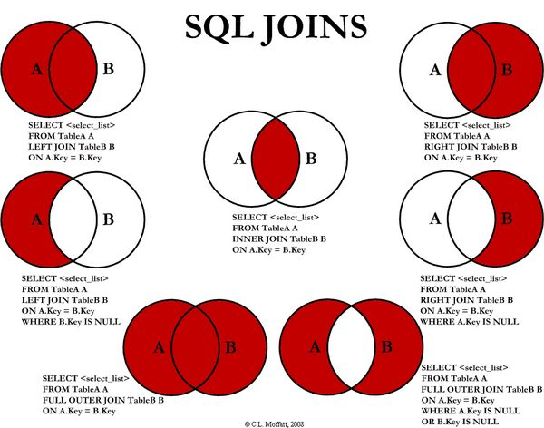
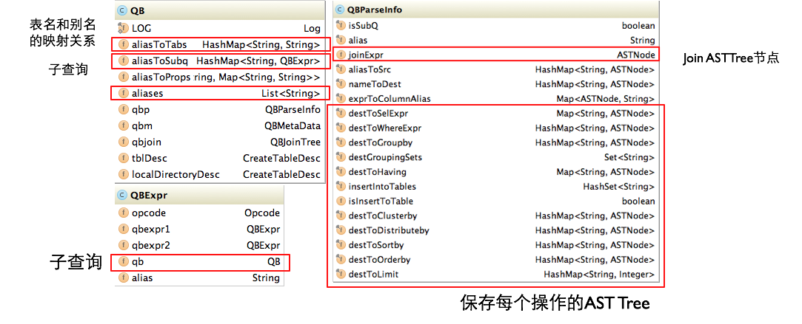
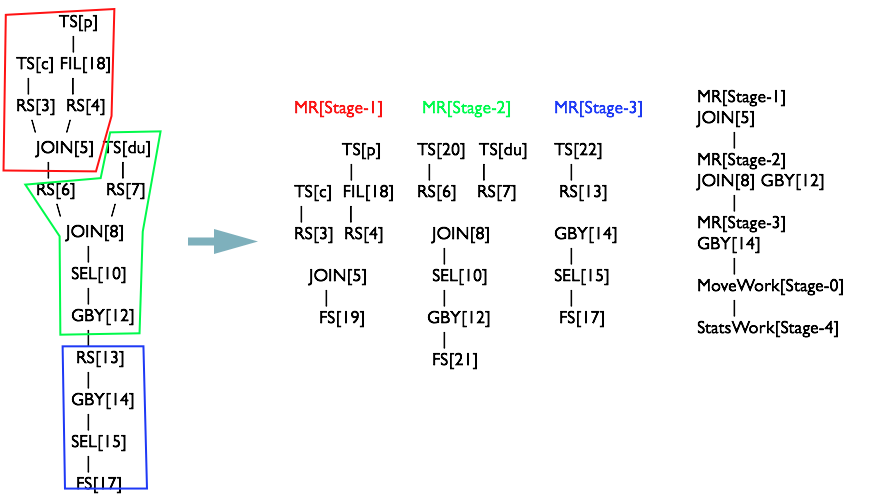

[TOC]
# HIVE用法
>hive(hdfs)+hive sql(mr)
>
>hive本质是hdfs文件，对于文件变动和查询性能很差，增删改。它唯一的作用就是存储，它的存储作用是由hdfs分布式文件体现的，与它无关。另一个作用就是将sql翻译为执行引擎的语言，所以说它不能称为存储组件，而是辅助分析插件，因为其没有添加存储架构，没有修改文件的增删改查性能，其性能与hdfs文件完全相同。

### DDL数据定义语言

```
show databases；
```

##### 创建数据库

```
create database userdb;
```

##### 建表语句

```
create table test(id int,name nchar(4));
```

##### 删表语句

```
drop table if exists test;
```

##### 清空表格数据，保留表格结构

```
truncate table sample;
```

##### 修改表结构

```
ALTER TABLE test_table ADD COLUMNS (new_col INT);
ALTER TABLE invites ADD COLUMNS (new_col2 INT COMMENT 'a comment');
ALTER TABLE test REPLACE COLUMNS(id BIGINT, name STRING);
#改表名称
ALTER TABLE events RENAME TO new_events;
#为表添加主键

```

##### 创建视图

```
create view dim_sku_info_view
as
select
    id,
    price,
    sku_name,
    sku_desc,
    weight,
    is_sale,
    spu_id,
    spu_name,
    category3_id,
    category3_name,
    category2_id,
    category2_name,
    category1_id,
    category1_name,
    tm_id,
    tm_name,
    create_time
from dim_sku_info;
```


### DML数据操作语言

>https://www.cnblogs.com/starzy/p/11441131.html

##### 设置主键

```
https://www.cnblogs.com/sabertobih/p/14031047.html#gallery-1
```

##### 查询

```
select * from   sample where architecture="x86";
```

##### 聚合统计

```
#加入count后，比只使用*慢了很多，用了22s。使用*查询所有列，0.3s查出了1045行数据。
select count(*)  from   sample where architecture="x86";
#改成architecture后仍然很慢，1045条统计了半天。
select count(architecture)  from   sample where architecture="x86";
```


##### 插入数据

```
#插入很慢，25s左右，和聚合统计一样慢。是调用mapreduce实现的，就算是一条也很慢。
insert into sample(architecture) values("test_arch");
```

```
#load data是直接迁移数据文件，所以比insert快。
LOAD DATA [LOCAL] INPATH 'filepath' [OVERWRITE] INTO TABLE tablename [PARTITION (partcol1=val1, partcol2=val2 ...)]
```


##### 删除数据

```
#同插入与修改，hive本质是hdfs文件，对于文件变动和查询性能很差，增删改。它唯一的作用就是存储，它的存储作用是由hdfs分布式文件体现的，与它无关。另一个作用就是将sql翻译为执行引擎的语言，所以说它不能称为存储组件，而是辅助分析插件，因为其没有添加存储架构，没有修改文件的增删改查性能，其性能与hdfs文件完全相同。
delete
```

```
#借助insert overrite删除数据
insert overwrite table t_table1 select * from t_table1 where 1=0;
#xxxx为要保留的数据
insert overwrite table t_table1 select * from t_table1 where XXXX;
#按照分区删除
ALTER TABLE test1  DROP PARTITION (dt='2016-04-29');
```


##### 修改数据

```
#速度极慢，因为hive本质是hdfs文件，当执行修改操作时，先读取原文件，在程序中修改后再写一份新文件，如果文件很大，则需要大量IO操作。
update
```


### DCL数据控制语言

>(GRANT，REVOKE，COMMIT，ROLLBACK)

### JAVA API

hive java api:https://cwiki.apache.org/confluence/display/Hive/HiveServer2+Clients

### 

### Shell

```shell
#-e常用于etl脚本，执行清洗sql
hive -e "select ... ..."
#-f 执行文件中的sql
hvie -f /opt/1.sql
#exit、quit  退出
#在hive shell中查看hdfs目录
dfs -ls /
#查看历史命令
cat .hivehistory
#查看所有配置信息
set;
#启动时设置参数 
-hiveconf param=value
-hiveconf mapred.reduce.tasks=10
#查看参数
set mapred.reduce.tasks
#使用set声明参数，仅对本次hive启动有效
set mapred.reduce.tasks=100
#配置的优先级顺序：参数声明>命令行参数>配置文件

```


### 自定义函数

>自定义函数分为以下几类：UDF、UDAF、UDTF
>
>UDF:一进一出，用户定义函数
>
>UDAF：用户定义聚集函数，多进一处
>
>UDTF:用户定义table generating函数，类似lateral view explode（）
>
>分别继承：org.apache.hadoop.hive.ql.udf.generic.GenericUDF、org.apache.hadoop.hive.ql.udf.generic.GenericUDTF;

##### 编写自定义函数jar包

```java
#引入maven依赖
<dependencies>
    <dependency>
        <groupId>org.apache.hive</groupId>
        <artifactId>hive-exec</artifactId>
        <version>3.1.2</version>
    </dependency>
</dependencies>

#创建一个类继承GenericUDF，然后重写initial函数、evaluate函数、getDisplayString
package com.atguigu.hive;
import org.apache.hadoop.hive.ql.exec.UDFArgumentException;
import org.apache.hadoop.hive.ql.exec.UDFArgumentLengthException;
import org.apache.hadoop.hive.ql.exec.UDFArgumentTypeException;
import org.apache.hadoop.hive.ql.metadata.HiveException;
import org.apache.hadoop.hive.ql.udf.generic.GenericUDF;
import org.apache.hadoop.hive.serde2.objectinspector.ObjectInspector;
import 
org.apache.hadoop.hive.serde2.objectinspector.primitive.PrimitiveObjectIn
spectorFactory;
/**
* 自定义 UDF 函数，需要继承 GenericUDF 类
* 需求: 计算指定字符串的长度
*/
public class MyStringLength extends GenericUDF {
 /**
 *
 * @param arguments 输入参数类型的鉴别器对象
 * @return 返回值类型的鉴别器对象
 * @throws UDFArgumentException
 */
 @Override
 public ObjectInspector initialize(ObjectInspector[] arguments) throws 
UDFArgumentException {
 // 判断输入参数的个数
 if(arguments.length !=1){
 throw new UDFArgumentLengthException("Input Args Length 
Error!!!");
 }
 // 判断输入参数的类型
 
if(!arguments[0].getCategory().equals(ObjectInspector.Category.PRIMITIVE)
){
 throw new UDFArgumentTypeException(0,"Input Args Type 
Error!!!");
 }
 //函数本身返回值为 int，需要返回 int 类型的鉴别器对象
 return PrimitiveObjectInspectorFactory.javaIntObjectInspector;
 }
 /**
 * 函数的逻辑处理
 * @param arguments 输入的参数
 * @return 返回值
 * @throws HiveException
 */
 @Override
 public Object evaluate(DeferredObject[] arguments) throws 
HiveException {
 if(arguments[0].get() == null){
 return 0;
 }
 return arguments[0].get().toString().length();
 }
 @Override
 public String getDisplayString(String[] children) {
 return "";
 }
}
    
```


##### 创建函数

```
add jar /root/1.jar
create function test_explode_json_array_from_hdfs1 as 'com.atguigu.gmall.hive.udtf.ExplodeJSONArray';
```

```
create function explode_json_array  as 'com.atguigu.gmall.hive.udtf.ExplodeJSONArray' using jar 'hdfs://hbase:9000/user/hive/jars/gmall-udtf-1.0-SNAPSHOT.jar';

```

##### 删除函数

```
show functions like '*explode*'
desc function add_months;
desc function extended add_months;
drop [temporary] function [if exists] [dbname.]function_name;
```


# 数仓4.0 SQL 练习

>https://www.gairuo.com/p/hive-sql-tutorial
>
>更多练习：https://www.gairuo.com/p/hive-sql-case

## 日常练习

### 220714

>非技术快速入门板块

```
#数据去重
#方法1
select  distinct university from user_profile;
select  university from user_profile group by university;
```

```
#分组后字段使用having过滤，且挑选字段时需要聚合函数，比如下边的max函数，除非该字段是唯一分组字段。
select max(gender),max(university),count(gender) user_num,avg(active_days_within_30) avg_active_days_within_30,avg(question_cnt) avg_question_cnt from user_profile group by gender,university;
```

### 220715

>非技术快速入门板块

```
#查找去重后个数，使用count(distinct device_id)
select university,count(*)/count(distinct device_id)  from (select  question_practice_detail.device_id,question_practice_detail.question_id,question_practice_detail.result,university from question_practice_detail  
left join  (select device_id,university from user_profile) t2  on question_practice_detail.device_id=t2.device_id) t3 group by university;
```

```
```
### 220716
```
SQL23：多表联查，注意要将表名.字段的格式重命名，方便groupby，例如： max(t4.university) university
select max(t4.university) university,max(t3.difficult_level) difficult_level,count(t3.device_id)/count(distinct t3.device_id)  device_id from 
   (select device_id,t1.question_id,result,difficult_level from  
        question_practice_detail t1 
    left join (select question_id,difficult_level from question_detail) t2 on t1.question_id=t2.question_id) t3   
left join  user_profile t4 on t3.device_id=t4.device_id group by university,difficult_level
```

```
SQL24:多表联查，确定表的链接字段和需要聚合的字段。inner join确保不出现None。
select max(t3.university) university,max(t4.difficult_level) difficult_level,count(*)/count(distinct t3.device_id) avg_answer_cnt from (select t1.device_id device_id,t1.question_id question_id,t2.university university from question_practice_detail t1 inner join 
    (select device_id,university from user_profile where university="山东大学")t2  on t1.device_id=t2.device_id)t3
left join (select question_id,difficult_level from question_detail)t4 on  t3.question_id=t4.question_id group by university,difficult_level
    ;
```
## gmall项目

##### ads_order_spu_status 商品主题详细流程

>已知所有表如下所示，编写脚本实现从ods层至ads的数据流动。具体表结构查看datagrip。ods层数据为原始数据，对应一条订单，最小粒度。dwd也为一条订单的粒度，但是其关联了支付、退款等信息。dws为一天的粒度，dwt为1，7，30等不同粒度的统计，ads为最终数据聚合。
>
>     ods_order_detail，ods_order_info，ods_order_detail_activity，ods_order_detail_coupon
>     dwd_order_detail，dwd_order_refund_info，dwd_payment_info，dwd_refund_payment
>             dws_sku_action_daycount，dim_sku_info   
>                   dwt_sku_topic，dim_sku_info
>                      ads_order_spu_stats
>订单，订单明细，订单活动关联，订单优惠券关联         
>交易的订单信息，退款订单信息，支付信息，退款顺序
>dwd层的工作量很大，需要聚合很多表，整合成单条记录形式，最小粒度。后边的dws，dwt基本基于dwd处理，不会连接太多表。
>sku行为以天为粒度，列和DWS一样的。sku维度表
>sku主题表，下单次数（是否参与活动，是否使用优惠券），下单件数（是否参与活动，是否使用优惠券），下单原始金额（活动优惠金额，优惠券优惠金额），下单最终金额，退款，评价（好评，差评，中评），购物车，收藏，以及1，7，30粒度的统计。sku维度表
>dwt这一层太宽了吧，这么多列。
>spu的订单聚合信息，对于指定spu商品，其订单金额，订单数目，最近天数（1，7，30）

###### dwd_order_detail

```
#首先确定一下每一列来自那个ods表
id
order_id:四个表的连接列
user_id:来自ods_order_info表
sku_id:来自ods_order_detail
province_id:ods_order_info
activitity_id:ods_order_detail_activity
activity_rule_id:ods_order_detail_activity
coupon_id:ods_order_detail_coupon
create_time:ods_order_info
source_type:ods_order_detail
source_id:ods_order_detail
sku_num:ods_order_detail

original_amount:ods_order_detail
split_final_amount:ods_order_detail
split_activity_amount:ods_order_detail
split_coupon_amount:ods_order_detail
dt:日期，来自ods_order_detail
```

###### dwd_order_detail 清洗sql

>注意dwd_order_detail聚合的行粒度是一个订单明细，不是一个订单，所以left join用order_detail_id进行连接。一个订单包含多个订单明细。

```sql
INSERT OVERWRITE TABLE dwd_order_detail_my_practice
SELECT od.id,od.order_id,oi.user_id,od.sku_id,oi.province_id,oda.activity_id,oda.activity_rule_id,odc.coupon_id,oi.create_time,od.source_type,od.source_id,od.sku_num,od.order_price,od.split_final_amount,od.split_activity_amount,od.split_coupon_amount, date_format(create_time,'yyyy-MM-dd')
FROM
(SELECT id,order_id,sku_id,sku_num,source_type,source_id,order_price,split_final_amount,split_activity_amount,split_coupon_amount FROM ods_order_detail)od
LEFT JOIN
(SELECT id,user_id,province_id,create_time FROM ods_order_info )oi
 ON od.order_id=oi.id
LEFT JOIN
(SELECT order_detail_id,activity_id,activity_rule_id FROM ods_order_detail_activity)oda
ON od.id=oda.order_detail_id
LEFT JOIN
(SELECT order_detail_id,coupon_id FROM ods_order_detail_coupon)odc
ON od.id=odc.order_detail_id
```

###### dwd_order_refund_info清洗sql

```sql
#查看有哪些列，使用哪些表，哪些需要聚合。查两个表就行了，无聚合操作。主要是多表join。
INSERT OVERWRITE TABLE dwd_order_refund_info_my_pratice
SELECT ori.id,oi.user_id,ori.order_id,sku_id,oi.province_id,ori.refund_type,ori.refund_num,ori.refund_amount,ori.refund_reason_type,ori.create_time, date_format(ori.create_time,'yyyy-MM-dd')
FROM
    (SELECT id,order_id,sku_id,refund_type,refund_amount,refund_num,refund_reason_type,create_time FROM ods_order_refund_info)ori
     LEFT JOIN
     (SELECT id,user_id,province_id FROM ods_order_info)oi
    ON ori.order_id=oi.id
```

###### dwd_payment_info清洗sql

```sql
SELECT pi.id,order_id,pi.user_id,oi.province_id,pi.trade_no,pi.out_trade_no,pi.payment_type,pi.payment_amount,pi.payment_status,pi.create_time,pi.callback_time,nvl(date_format(pi.callback_time,"yyyy-MM-dd"),"9999-99-99") FROM
(SELECT * FROM ods_payment_info)pi
LEFT JOIN
(SELECT * FROM ods_order_info)oi
ON pi.order_id=oi.id
```

##### 商品ads 主题

###### dws_sku_action_daycount

>dwd进行了多表join，dws需要进行聚合统计。
>
>这张表是对sku的信息进行统计，粒度为一天，包括下单、支付、退单、退款、评价与收藏这几个板块。在下单板块内包括下单件数、下单次数、下单金额，以及参与活动和使用优惠券的情况下，这次数、件数指标的计算，还有活动优惠金额、优惠券优惠金额，被下单原始金额，被下单最终金额。在支付板块，有支付件数、支付次数、支付金额。在退单板块有退单次数、件数、金额。退款板块有退款次数、件数、金额。评价好、中、查次数、默认评价数，收藏次数，购物车次数。

拆开逐个看吧

>count代表次数，num代表该sku的件数，amount代表该sku的金额

```
#被下单次数，被下单件数，参与活动被下单件数，参与活动被下单件数，使用优惠券被下单次数，使用优惠券被下单件数，优惠金额（活动），优惠金额（优惠券）
select
        date_format(create_time,'yyyy-MM-dd') dt,
        sku_id,
        count(*) order_count,
        sum(sku_num) order_num,
        sum(if(split_activity_amount>0,1,0)) order_activity_count,
        sum(if(split_coupon_amount>0,1,0)) order_coupon_count,
        sum(split_activity_amount) order_activity_reduce_amount,
        sum(split_coupon_amount) order_coupon_reduce_amount,
        sum(original_amount) order_original_amount,
        sum(split_final_amount) order_final_amount
    from dwd_order_detail
    group by date_format(create_time,'yyyy-MM-dd'),sku_id

```

```
被支付金额，被支付件数，被支付件数
 select
        date_format(callback_time,'yyyy-MM-dd') dt,
        sku_id,
        count(*) payment_count,
        sum(sku_num) payment_num,
        sum(split_final_amount) payment_amount
    from dwd_order_detail od
    join
    (
        select
            order_id,
            callback_time
        from dwd_payment_info
        where callback_time is not null
    )pi on pi.order_id=od.order_id
    group by date_format(callback_time,'yyyy-MM-dd'),sku_id
```

```
#退单次数，退单金额
select
        date_format(create_time,'yyyy-MM-dd') dt,
        sku_id,
        count(*) refund_order_count,
        sum(refund_num) refund_order_num,
        sum(refund_amount) refund_order_amount
    from dwd_order_refund_info
    group by date_format(create_time,'yyyy-MM-dd'),sku_id
#
```

```
#退款次数，退款金额
select
        date_format(callback_time,'yyyy-MM-dd') dt,
        rp.sku_id,
        count(*) refund_payment_count,
        sum(ri.refund_num) refund_payment_num,
        sum(refund_amount) refund_payment_amount
    from
    (
        select
            order_id,
            sku_id,
            refund_amount,
            callback_time
        from dwd_refund_payment
    )rp
    left join
    (
        select
            order_id,
            sku_id,
            refund_num
        from dwd_order_refund_info
    )ri
    on rp.order_id=ri.order_id
    and rp.sku_id=ri.sku_id
    group by date_format(callback_time,'yyyy-MM-dd'),rp.sku_id
```

```
# 购物车，收藏
select
        dt,
        item sku_id,
        sum(if(action_id='cart_add',1,0)) cart_count,
        sum(if(action_id='favor_add',1,0)) favor_count
    from dwd_action_log
    where action_id in ('cart_add','favor_add')
    group by dt,item
),

```

```
#评价次数
select
        date_format(create_time,'yyyy-MM-dd') dt,
        sku_id,
        sum(if(appraise='1201',1,0)) appraise_good_count,
        sum(if(appraise='1202',1,0)) appraise_mid_count,
        sum(if(appraise='1203',1,0)) appraise_bad_count,
        sum(if(appraise='1204',1,0)) appraise_default_count
    from dwd_comment_info
    group by date_format(create_time,'yyyy-MM-dd'),sku_id

```

```
将5大板块通过dt加sku_id分组查询出来后，没有使用join，而是使用union all合并，不存在的字段使用0，方便后续的sum求和。union的优势
```

###### dwt_sku_topic

>确定列来源的表，连接粒度，分块。分块基本按照业务流程划分，如下单、支付、退单、退款，然后这些块内部的属性，如金额、次数、联系上优惠券、活动属性。另外，DWT表还要负责更高粒度的统计，如1粒度、7粒度、30粒度。维度组合多了，看的很混乱，脑袋疼。总结以下固定顺序吧，按照如下顺序逐个处理: 选择业务过程(确认维度)→声明粒度→确认事实,与dws相似，但是dwt的一个表的维度可以是多个业务，比如包括下单、退款等等。选中业务后，确认此业务关注的列，以下单为例子，其维度可以通过组合确认，即（金额、次数）（原始金额、使用优惠券优惠的、活动优惠的）（时间跨度），。粒度一般为主题的最小单位，如sku、user_id、coupon_id、activity_id。确认事实这一步多余，因为有多个事实，如前边提到的金额、次数。以此表为例，业务分为下单、支付、退款、退单，组合维度如上所示

```sql
#将四块业务用全是一个表的即dws_sku_aciton_daycount，再用nvl处理。可以发现下单件数、下单件数的sql基本一样，只用切换列名即可，其他的查询也是这样，全是重复类似操作。
#下单 次数  1、7、30天
select sku_id,sum(if(dt="2020-06-14",order_num,0)) order_last_1day_count ,sum(if(dt>date_add("2020-06-14",-6),order_num,0)) order_last_7day_count,sum(if(dt>date_add("2020-06-14",-29),order_num,0)) order_last_30day_count
from dws_sku_action_daycount
 group by sku_id
#下单 件数  1、7、30天
select sku_id,sum(if(dt="2020-06-14",order_count,0)) order_last_1day_count ,sum(if(dt>date_add("2020-06-14",-6),order_count,0)) order_last_7day_count,sum(if(dt>date_add("2020-06-14",-29),order_count,0)) order_last_30day_count
from dws_sku_action_daycount
 group by sku_id
 下边的业务维度也是一样的，只用替换列名
#下单 参与活动的件数  1、7、30天
#下单 参与优惠券的件数  1、7、30天
#下单 活动优惠的金额  1、7、30天
#下单 优惠券优惠的金额  1、7、30天
#下单  原始金额   1、7、30天
#下单  最终的金额  1、7、30天

#支付
#退款
#退单
```

###### ads_order_spu_stats

>确定有哪些业务、维度列，行的单位还是sku，多个事实列
>
>（下单） （次数、金额）  （最近1、7、30天）

```sql
#下边是核心语句，查出来后与事实表拼接，然后用行粒度分组并聚合统计即可。
select
        recent_days,
        sku_id,
        case
            when recent_days=1 then order_last_1d_count
            when recent_days=7 then order_last_7d_count
            when recent_days=30 then order_last_30d_count
        end order_count,
        case
            when recent_days=1 then order_last_1d_final_amount
            when recent_days=7 then order_last_7d_final_amount
            when recent_days=30 then order_last_30d_final_amount
        end order_amount
    from dwt_sku_topic lateral view explode(Array(1,7,30)) tmp as recent_days
    where dt='2020-06-14'

```


###### ads_repeat_purchase

>品牌复购率计算，业务维度如下，每行的粒度是由唯一的user_id sku_id recent_days确定的，事实是回购率，中间的临时表事实是购买次数。
>
>（购买）（品牌复购率）  （最近1、7、30天）
>
>复购率的含义，至少买过2次及以上的人所占的比列，即（买两次的用户数）/(买两次的用户数+买一次的用户数)
>

```sql
#利用explode将dwd_order_detail表的数据复制三份，分别用于1、7、30的recent_days的select，然后借助date_add(now_date,-recent_days+1)对三组数据进行筛选。
select
            recent_days,
            user_id,
            sku_id,
            count(*) order_count
        from dwd_order_detail lateral view explode(Array(1,7,30)) tmp as recent_days
        where dt>=date_add('2020-06-14',-29)
        and dt>=date_add('2020-06-14',-recent_days+1)
        group by recent_days, user_id,sku_id
```

```
#查出来后，再与dim_sku_info使用join，拼接获得sku的品牌名称和id。
#然后计算大于1的，以及大于2的，再相除。
cast(sum(if(order_count>=2,1,0))/sum(if(order_count>=1,1,0))*100 as decimal(16,2))
```


##### 订单主题

###### ads_order_total

>业务维度，每行粒度，事实列
>
>（下单） （订单数、人数、金额） （统计日期，最近1、7、30） ， 单个订单  ，  人数、金额

```
#核心语句，查出1、7、30天，这个when recent_days=0个人认为是无意义的，可能写错了，因为recent_days是自己创建的，明明只有1、7、30几个数。
 select
        recent_days,
        user_id,
        case when recent_days=0 then order_count
             when recent_days=1 then order_last_1d_count
             when recent_days=7 then order_last_7d_count
             when recent_days=30 then order_last_30d_count
        end order_count,
        case when recent_days=0 then order_final_amount
             when recent_days=1 then order_last_1d_final_amount
             when recent_days=7 then order_last_7d_final_amount
             when recent_days=30 then order_last_30d_final_amount
        end order_final_amount
    from dwt_user_topic lateral view explode(Array(1,7,30)) tmp as recent_days
    where dt='2020-06-14'

#行粒度分组统计
```

###### ads_order_by_province

>（下单）  （订单数、订单金额）  （1、7、30）      单个地区       订单数、订单金额

```sql
#太明显了，就是dwt查出来，然后进行分组聚合订单数、订单金额，然后与dim事实表拼接。最后，union ads_order_by_province表中原始的数据
insert overwrite table ads_order_by_province
select * from ads_order_by_province
union
select
    dt,
    recent_days,
    province_id,
    province_name,
    area_code,
    iso_code,
    iso_3166_2,
    order_count,
    order_amount
from
(
    select
        '2020-06-14' dt,
        recent_days,
        province_id,
        sum(order_count) order_count,
        sum(order_amount) order_amount
    from
    (
        select
            recent_days,
            province_id,
            case
                when recent_days=1 then order_last_1d_count
                when recent_days=7 then order_last_7d_count
                when recent_days=30 then order_last_30d_count
            end order_count,
            case
                when recent_days=1 then order_last_1d_final_amount
                when recent_days=7 then order_last_7d_final_amount
                when recent_days=30 then order_last_30d_final_amount
            end order_amount
        from dwt_area_topic lateral view explode(Array(1,7,30)) tmp as recent_days
        where dt='2020-06-14'
    )t1
    group by recent_days,province_id
)t2
join dim_base_province t3
on t2.province_id=t3.id;

```

##### 访客统计

##### 用户统计

###### ads_user_total

>（下单、新增）  （金额数、用户数） （1、7、30天）    中间表是单个用户user_id和recent_days，最终是     recent_days   用户数、金额数
>
>这个几个关键变量：login_date_first,表示该用户第一次登录，即新增的日期。login_date_last，最后登陆日期。order_date_first，表示第一次下单的用户，即新增下单用户。order_date_last，最后一次购物。order_final_mount代表周期内的下单金额。

```sql
#所有用户的下单金额
sum(order_final_amount) order_final_amount,
#所有用户的下单次数
sum(if(order_final_amount>0,1,0)) order_user_count,
#最近周期内第一次登陆
sum(if(login_date_first>=recent_days_ago,1,0)) new_user_count,
#最近周期内第一次购物
sum(if(order_date_first>=recent_days_ago,1,0)) new_order_user_count,
#最近活跃，但是就是不购物，白嫖怪。
sum(if(login_date_last>=recent_days_ago and order_final_amount=0,1,0)) no_order_user_count

#通过如下语句组装需要的几个关键变量
(select user_id,recent_days,login_date_first,login_date_last,order_date_first,
       case when recent_days=0 then order_final_amount
            when recent_days=1 then order_last_1d_final_amount
            when recent_days=7 then order_last_7d_final_amount
            when recent_days=30 then order_last_30d_final_amount
        end order_final_mount,
        if(recent_days=0,"1997-01-01",date_add('2020-06-14',-recent_days+1)) recent_days_ago
from dwt_user_topic lateral view explode(Array(0,1,7,30)) tmp as recent_days
where dt='2020-06-14')t1
```

###### ads_user_change

>统计流失用户、回流用户
>
>（登录  ）  （用户数）统计日期                中间表是
>
>流失：最后活跃时间是7日前这一天，即为流失。
>
>回流：今日登录，且7日内没有登录

```sql
#回流筛选
 where datediff(login_date_last,login_date_previous)>=8
 #流失筛选
 where dt='2020-06-14'
    and login_date_last=date_add('2020-06-14',-7)
```

###### ads_user_retention

>（新增用户 ）   （留存天数，留存用户数量，留存率）   行粒度：7天内的每个单个日期（create_date），中间表是单个user_id，通过第一次登录日期聚合即可    事实列：用户数量、天数  
>
>留存天数：7天内注册，今天减去第一次登录日期，就是留存日期
>
>留存用户数：7天内注册，最后登陆日期是今天，记为留存
>
>留存率：留存用户数/留存用户数+今天未登录
>
>中间表的列为：留存天数、用户id、新增日期
>
>结果表：group by dt

```sql
select
    '2020-06-14',
    login_date_first create_date,
    datediff('2020-06-14',login_date_first) retention_day,
    sum(if(login_date_last='2020-06-14',1,0)) retention_count,
    count(*) new_user_count,
    cast(sum(if(login_date_last='2020-06-14',1,0))/count(*)*100 as decimal(16,2)) retention_rate
from dwt_user_topic
where dt='2020-06-14'
and login_date_first>=date_add('2020-06-14',-7)
and login_date_first<'2020-06-14'
group by login_date_first;
```

##### 优惠券主题

###### ads_coupon_stats

>（领取、下单、过期）    （次数，原始金额，优惠金额，补贴率）               粒度是优惠券id

```sql
select coupon_id,order_original_amount,order_final_amount,order_reduce_amount,
        cast(order_reduce_amount/order_original_amount as decimal(16,2)) reduce_rate
       from dwt_coupon_topic
```

##### 活动主题

###### ads_activity_stats

>（下单）  （下单原始金额，最终金额，优惠金额，补贴率）  活动id  

```sql
 select
        activity_id,
        sum(order_count) order_count,
        sum(order_original_amount) order_original_amount,
        sum(order_final_amount) order_final_amount,
        sum(order_reduce_amount) reduce_amount,
        cast(sum(order_reduce_amount)/sum(order_original_amount)*100 as decimal(16,2)) reduce_rate
    from dwt_activity_topic
    where dt='2020-06-14'
    group by activity_id
```


## 聚合查询

##### 指定商品带来的复购

>运营人员上架了一种专门用来拉新的商品，这些商品不管从需求还是价格都具有吸引力，目标是刺激用户快速下单这些商品，完成拉新。接下来，就要分析这些用户成为新用户后是否再有购买，形成复购的情况。

数据表位于 `dwd.order_detail`：

| p_day    | uid    | order_id   | create_time             | sku_id |
| -------- | ------ | ---------- | ----------------------- | ------ |
| 20190410 | 23424  | 3325264322 | 2019-04-10 14:55:37.300 | 1111   |
| 20190513 | 454121 | 9725372353 | 2019-05-13 13:54:17.300 | 23421  |
| 20190511 | 4234   | 5345433525 | 2019-05-11 10:15:31.300 | 21322  |
| 20190315 | 32546  | 5354378679 | 2019-03-15 08:01:41.667 | 14325  |
| 20190515 | 2525   | 6436438692 | 2019-05-15 19:05:55.000 | 1111   |

```
各字段说明：

p_day：hive 库以日期分片，下单日期
uid：用户的注册 id
order_id：下单订单号
create_time：订单创建时间，不重复
sku_id：商品 ID，其中 1111 是拉新的活动商品
数据表是一个以订单-商品为粒度的流水表。
```

## sql优化

# 仓库规范

>ODS Operation Data Store
>
>DIM 维度层
>
>DWD Data Warehouse Detail
>
>DWS Data Warehouse Service
>
>DWT Data Warehouse Topic
>
>ADS Application Data Store


### 范式理论

```
第一范式，属性不可分割
第二范式，不可存在部分依赖。如（学号，班级）->姓名，其中姓名部分依赖于学号，班级是多余的主键。
第三范式，不可存在传递依赖。如学号->班级->班主任。
关系建模符合第三范式，能减少冗余数据，避免数据不一致。
维度建模使用事实表和维度表，可以不符合范式，容忍冗余数据，是为了提高查询效率，避免太多join操作。
```

### 维度建模模型分类

>星型模型、雪花模型、星座模型。
>
>雪花模型多级，而星型模型一般只有一级。
>
>星座模型基于多个事实表，他们之间是否共享维度表，星座不星座反映是否有多个事实表。


### 维度表

一般是对事实的**描述信息**。每一张维表对应现实世界中的一个对象或者概念。  例如：用户、商品、日期、地区等。

维表的范围很宽（具有多个属性、列比较多）

跟事实表相比，行数相对较小：通常< 10万条

内容相对固定：编码表

### 事实表

非常的大

内容相对的窄：列数较少（主要是外键id和度量值）

经常发生变化，每天会新增加很多。

##### **周期型快照事实表**

>周期型快照事实表中**不会保留所有数据**，**只保留固定时间间隔的数据**，例如每天或者每月的销售额，或每月的账户余额等。

##### **累积型快照事实表**

>**累计快照事实表用于跟踪业务事实的变化。**例如，数据仓库中可能需要累积或者存储订单从下订单开始，到订单商品被打包、运输、和签收的各个业务阶段的时间点数据来跟踪订单声明周期的进展情况。当这个业务过程进行时，事实表的记录也要不断更新。

### lzo压缩

>https://cwiki.apache.org/confluence/display/Hive/LanguageManual+LZO

```
#创建lzo索引
hadoop jar /path/to/jar/hadoop-lzo-cdh4-0.4.15-gplextras.jar com.hadoop.compression.lzo.LzoIndexer /path/to/HDFS/dir/ contains/lzo/files
```

### 分区

>https://zhuanlan.zhihu.com/p/65442409
>
>分区列（Partition columns）是虚拟列，使用分区列显著加快分析速度。常用的有DATE

```
分区是指将hive的hdfs文件进行切分，
#单值分区
导入数据时手动指定分区
#单值动态分区
导入数据时，系统可以动态判断目标分区
```

##### 分区语法

```
#分区语法，在PARTITI1ONED BY后面跟上分区键、类型即可（指定的分区键不能出现在定义列名中）
CREATE [EXTERNAL] TABLE <table_name>
    (<col_name> <data_type> [, <col_name> <data_type> ...])
    -- 指定分区键和数据类型
    PARTITIONED BY  (<partition_key> <data_type>, ...) 
    [CLUSTERED BY ...] 
    [ROW FORMAT <row_format>] 
    [STORED AS TEXTFILE|ORC|CSVFILE]
    [LOCATION '<file_path>']    
   [TBLPROPERTIES ('<property_name>'='<property_value>', ...)];
```

##### 静态分区写入

```
-- 覆盖写入
INSERT OVERWRITE TABLE <table_name> 
    PARTITION (<partition_key>=<partition_value>[, <partition_key>=<partition_value>, ...]) 
    SELECT <select_statement>;

-- 追加写入
INSERT INTO TABLE <table_name> 
    PARTITION (<partition_key>=<partition_value>[, <partition_key>=<partition_value>, ...])
    SELECT <select_statement>;
```

##### 动态分区写入


```
#dpk必须放在spk后边，如下spk即static partition key（静态分区键），dpk为dynamic partition key（动态分区键）
CREATE TABLE <table_name>
 PARTITIONED BY ([<spk> <data_type>, ... ,] <dpk> <data_type>, [<dpk>
<data_type>,...]);
```

```
-- 开启动态分区支持，并设置最大分区数
set hive.exec.dynamic.partition=true;
//set hive.exec.dynamic.partition.mode=nostrict;
set hive.exec.max.dynamic.partitions=2000;

insert into table1 select 普通字段 分区字段 from table2
```


### 分桶

>对Hive(Inceptor)表分桶可以将表中记录按分桶键的哈希值分散进多个文件中，这些小文件称为桶。
>
>每个分区中的数据又可以基于表的某一列的散列函数的值被划分为桶,如对id进行hash分桶。

##### 分桶语法

```
CREATE [EXTERNAL] TABLE <table_name>
    (<col_name> <data_type> [, <col_name> <data_type> ...])]
    [PARTITIONED BY ...] 
    CLUSTERED BY (<col_name>) 
        [SORTED BY (<col_name> [ASC|DESC] [, <col_name> [ASC|DESC]...])] 
        
        INTO <num_buckets> BUCKETS  
        
    [ROW FORMAT <row_format>] 
    [STORED AS TEXTFILE|ORC|CSVFILE]
    [LOCATION '<file_path>']    
    [TBLPROPERTIES ('<property_name>'='<property_value>', ...)];
```

### 分层

```
当仓库分为多层，有的达到5层，如果源头输入新的数据，从第一层到最后一层需要多久？其耗费的时间说明，这种结构只适用于离线。那么即席查询的意思就是开发离线模型的demo，用于演示，而不是“实时查询”，因为它的“即席”是建立在数据已经从源头流入最后一层的基础上的，也就是已经处理完成了，这并不实时。
```

### json格式

```
json格式要实现主键查询，非主键查询，所有键的聚合。实际上查询的功能应该由hbase来做。
```

# 常用端口

```
hive.metastore.uri=thrift://hadoop102:9083
web port 10002

```


# hive自动映射到hbase

```
https://blog.csdn.net/weixin_44694973/article/details/98845551
hadoop.hive.hbase.HBbaseStorageHandler
```

```
CREATE TABLE cctable (key int, value string) STORED BY 'org.apache.hadoop.hive.hbase.HBaseStorageHandler' WITH SERDEPROPERTIES ("hbase.columns.mapping" = ":key,cf:val") TBLPROPERTIES ("hbase.table.name" = "cc");
```

# HIVE SQL用法

### 基本类型

###### 数值型

```
TINYINT—1 byte integer（1 个字节的整形型）
SMALLINT—2 byte integer（2 个字节的整形型）
INT—4 byte integer（4 个字节的整形型）
BIGINT—8 byte integer（8 个字节的整形型）

FLOAT—single precision（单精度）
DOUBLE—Double precision（双精度）
```

###### 字符型

```
STRING — 指定字符集中的字符序列
VARCHAR — 指定字符集中具有最大长度的字符序列
CHAR — 指定字符集中具有最大长度的字符序列
```

###### 布尔型

```
BOOLEAN—TRUE/FALSE（只有真/假两个种取值）
```

###### 日期时间型

```
TIMESTAMP — 没有时区的日期和时间 ("LocalDateTime" 语意)
TIMESTAMP WITH LOCAL TIME ZONE — 精度到纳秒的时间点 ("Instant" 语意)
DATE — 一个日期
```

###### 二进制型

```
BINARY — 字节序列
```


### 运算符

>https://www.gairuo.com/p/hive-sql-operators

##### 算术运算符

| 操作符 | 描述                                               | 示例         |
| ------ | -------------------------------------------------- | ------------ |
| +      | 相加：将符号两边的数值加起来。                     | a + b 得 30  |
| -      | 相减：从最边的操作数中减去右边的操作数。           | a - b 得 -10 |
| *      | 相乘：将两边的操作数相乘。                         | a * b 得 200 |
| /      | 相除：用右边的操作数除以左边的操作数。             | b / a 得 2   |
| %      | 取余：用右边的操作数除以左边的操作数，并返回余数。 | b % a 得 0   |

以下运算符支持对操作数的各种常见算术运算。 所有返回数字类型； 如果任何操作数为NULL，则结果也为 NULL。

| **Operator** | **Operand types** | **Description**                                              |
| ------------ | ----------------- | ------------------------------------------------------------ |
| A + B        | All number types  | Gives the result of adding A and B. The type of the result is the same as the common parent(in the type hierarchy) of the types of the operands. For example since every integer is a float, therefore float is a containing type of integer so the + operator on a float and an int will result in a float. |
| A - B        | All number types  | Gives the result of subtracting B from A. The type of the result is the same as the common parent(in the type hierarchy) of the types of the operands. |
| A * B        | All number types  | Gives the result of multiplying A and B. The type of the result is the same as the common parent(in the type hierarchy) of the types of the operands. Note that if the multiplication causing overflow, you will have to cast one of the operators to a type higher in the type hierarchy. |
| A / B        | All number types  | Gives the result of dividing A by B. The result is a double type in most cases. When A and B are both integers, the result is a double type except when the [hive.compat](https://cwiki.apache.org/confluence/display/Hive/Configuration+Properties#ConfigurationProperties-hive.compat) configuration parameter is set to "0.13" or "latest" in which case the result is a decimal type. |
| A DIV B      | Integer types     | Gives the integer part resulting from dividing A by B. E.g 17 div 3 results in 5. |
| A % B        | All number types  | Gives the reminder resulting from dividing A by B. The type of the result is the same as the common parent(in the type hierarchy) of the types of the operands. |
| A & B        | All number types  | Gives the result of bitwise AND of A and B. The type of the result is the same as the common parent(in the type hierarchy) of the types of the operands. |
| A \| B       | All number types  | Gives the result of bitwise OR of A and B. The type of the result is the same as the common parent(in the type hierarchy) of the types of the operands. |
| A ^ B        | All number types  | Gives the result of bitwise XOR of A and B. The type of the result is the same as the common parent(in the type hierarchy) of the types of the operands. |
| ~A           | All number types  | Gives the result of bitwise NOT of A. The type of the result is the same as the type of A. |

```
可以对列值进行计算
select chinese+math from students
```

##### 关系运算符

以下运算符比较传递的操作数，并根据操作数之间的比较是否成立来生成TRUE或FALSE值。

| **操作**                 | **操作数类型**                   | **说明**                                                     |
| ------------------------ | -------------------------------- | ------------------------------------------------------------ |
| A = B                    | All primitive types 所有原始类型 | 如果表达式A等于表达式B，则为TRUE，否则为FALSE。              |
| A == B                   | All primitive types              | = 运算符的同义词。                                           |
| A <=> B                  | All primitive types              | 对于非空操作数，使用EQUAL（=）运算符返回相同的结果，但如果两个均为NULL，则返回TRUE，如果其中之一为NULL，则返回FALSE。(As of version [0.9.0](https://issues.apache.org/jira/browse/HIVE-2810).) |
| A <> B                   | All primitive types              | NULL if A or B is NULL, TRUE if expression A is NOT equal to expression B, otherwise FALSE. |
| A != B                   | All primitive types              | Synonym for the <> operator.                                 |
| A < B                    | All primitive types              | NULL if A or B is NULL, TRUE if expression A is less than expression B, otherwise FALSE. |
| A <= B                   | All primitive types              | NULL if A or B is NULL, TRUE if expression A is less than or equal to expression B, otherwise FALSE. |
| A > B                    | All primitive types              | NULL if A or B is NULL, TRUE if expression A is greater than expression B, otherwise FALSE. |
| A >= B                   | All primitive types              | NULL if A or B is NULL, TRUE if expression A is greater than or equal to expression B, otherwise FALSE. |
| A [NOT] BETWEEN B AND C  | All primitive types              | NULL if A, B or C is NULL, TRUE if A is greater than or equal to B AND A less than or equal to C, otherwise FALSE. This can be inverted by using the NOT keyword. (As of version [0.9.0](https://issues.apache.org/jira/browse/HIVE-2005).) |
| A IS NULL                | All types                        | TRUE if expression A evaluates to NULL, otherwise FALSE.     |
| A IS NOT NULL            | All types                        | FALSE if expression A evaluates to NULL, otherwise TRUE.     |
| A IS [NOT] (TRUE\|FALSE) | Boolean types                    | Evaluates to TRUE only if A mets the condition. (since:[3.0.0](https://issues.apache.org/jira/browse/HIVE-13583) ) Note: NULL is UNKNOWN, and because of that (UNKNOWN IS TRUE) and (UNKNOWN IS FALSE) both evaluates to FALSE. |
| A [NOT] LIKE B           | strings                          | NULL if A or B is NULL, TRUE if string A matches the SQL simple regular expression B, otherwise FALSE. The comparison is done character by character. The _ character in B matches any character in A (similar to . in posix regular expressions) while the % character in B matches an arbitrary number of characters in A (similar to .* in posix regular expressions). For example, 'foobar' like 'foo' evaluates to FALSE whereas 'foobar' like 'foo_ _ _' evaluates to TRUE and so does 'foobar' like 'foo%'. |
| A RLIKE B                | strings                          | NULL if A or B is NULL, TRUE if any (possibly empty) substring of A matches the Java regular expression B, otherwise FALSE. For example, 'foobar' RLIKE 'foo' evaluates to TRUE and so does 'foobar' RLIKE '^f.*r$'. |
| A REGEXP B               | strings                          | Same as RLIKE.                                               |

##### 逻辑运算符

以下运算符为创建逻辑表达式提供支持。 它们都根据操作数的布尔值返回布尔值TRUE，FALSE或NULL。 NULL表现为“未知”标志，因此，如果结果取决于未知状态，则结果本身是未知的。

| **Operator**               | **Operand types** | **Description**                                              |
| -------------------------- | ----------------- | ------------------------------------------------------------ |
| A AND B                    | boolean           | TRUE if both A and B are TRUE, otherwise FALSE. NULL if A or B is NULL. |
| A OR B                     | boolean           | TRUE if either A or B or both are TRUE, FALSE OR NULL is NULL, otherwise FALSE. |
| NOT A                      | boolean           | TRUE if A is FALSE or NULL if A is NULL. Otherwise FALSE.    |
| ! A                        | boolean           | Same as NOT A.                                               |
| A IN (val1, val2, ...)     | boolean           | TRUE if A is equal to any of the values. As of Hive 0.13 [subqueries](https://cwiki.apache.org/confluence/display/Hive/LanguageManual+SubQueries) are supported in IN statements. |
| A NOT IN (val1, val2, ...) | boolean           | TRUE if A is not equal to any of the values. As of Hive 0.13 [subqueries](https://cwiki.apache.org/confluence/display/Hive/LanguageManual+SubQueries) are supported in NOT IN statements. |
| [NOT] EXISTS (subquery)    |                   | TRUE if the the subquery returns at least one row. Supported as of [Hive 0.13](https://cwiki.apache.org/confluence/display/Hive/LanguageManual+SubQueries). |

##### 字符串运算符

| **Operator** | **Operand types** | **Description**                                              |
| ------------ | ----------------- | ------------------------------------------------------------ |
| A \|\| B     | strings           | Concatenates the operands - shorthand for `concat(A,B)` . Supported as of [Hive 2.2.0](https://issues.apache.org/jira/browse/HIVE-14580). |

##### 复杂类型构造函数

| Constructor Function | Operands                          | Description                                                  |
| -------------------- | --------------------------------- | ------------------------------------------------------------ |
| Constructor Function | Operands                          | Description                                                  |
| map                  | (key1, value1, key2, value2, ...) | Creates a map with the given key/value pairs.                |
| struct               | (val1, val2, val3, ...)           | Creates a struct with the given field values. Struct field names will be col1, col2, .... |
| named_struct         | (name1, val1, name2, val2, ...)   | Creates a struct with the given field names and values. (As of Hive [0.8.0](https://issues.apache.org/jira/browse/HIVE-1360).) |
| array                | (val1, val2, ...)                 | Creates an array with the given elements.                    |
| create_union         | (tag, val1, val2, ...)            | Creates a union type with the value that is being pointed to by the tag parameter. |

##### 复杂类型的运算符

| **Operator** | **Operand types**                   | **Description**                                              |
| ------------ | ----------------------------------- | ------------------------------------------------------------ |
| A[n]         | A is an Array and n is an int       | Returns the nth element in the array A. The first element has index 0. For example, if A is an array comprising of ['foo', 'bar'] then A[0] returns 'foo' and A[1] returns 'bar'. |
| M[key]       | M is a Map<K, V> and key has type K | Returns the value corresponding to the key in the map. For example, if M is a map comprising of {'f' -> 'foo', 'b' -> 'bar', 'all' -> 'foobar'} then M['all'] returns 'foobar'. |
| S.x          | S is a struct                       | Returns the x field of S. For example for the struct foobar {int foo, int bar}, foobar.foo returns the integer stored in the foo field of the struct. |


### 关键字

##### DISTINCT

```
我们取到某列数据后发现有重复的内容，但需求可能是需要知道有几个不重复的内容。Select 里 DISTINCT 可用于对数据进行去重。
1distinct 必须放在开头
2如果值中有 NULL，会保留一个 NULL
3如果有多个列，则对这几个列组合去重
```

##### CASE

```
select c_1,
       CASE
           WHEN condition1 THEN result1
           WHEN condition2 THEN result2
           WHEN conditionN THEN resultN
           ELSE result_else
           END as c_name
from tab_name
-由 CASE 开始 END 结束
-最好起一个别名（as c_name，c_name 为别名），不然此列没有可读性名称
-WHEN 和 THEN 成对出现，WHEN 后边为条件，可以使用表中的所有字段，THEN 后为最终输出的值
-ELSE 为兜底逻辑，直接给出值，ELSE 可以没有
-没有被条件覆盖的值为 null
```

##### order by

```
order by (CASE
              WHEN b_year < 1990 THEN math+20
              ELSE math
    END) DESC
ascending desending 
```

```
#用序号代表字段
SELECT item_id, uesr_id
         ^^^^        ^^^^
          1           2
FROM tab
ORDER BY 1;
```

##### sort by

>hive支持,reduce局部排序，比order by性能消耗少。

##### distribute by

>distribute 意为分发、分配。
>
>特别的，因为distribute by 通常和sort by 一起用，所以当distribute by 遇上 sort by时，distribute by要放在前面，这个不难理解，因为要先通过 distribute by 将待处理的数据从map端做分发，这样，sort by 这个擅长局部排序的才能去放开的干活。

```
FROM records
SELECT year, temperature
DISTRIBUTE BY year
SORT BY year DESC, temperature DESC
```

##### cluster by

>- order by：全部数据进行全局排序，只会启动一个 reducer
>- sort by：局部排序，会根据数据量大小启动一到多个 reducer
>- distribute by：控制 map 结果的分发 
>- cluster by：如果 distribute by 和 sort by 的列相同可以用 cluster by 简写

```
# cluster by = distribute by + sort by 
#但是cluster by 指定的列只能是降序，不能指定 asc 和 desc,例如：
select * from students cluster by b_year
等价于：
select * from students distribute by b_year sort by b_year
```

##### sum

```
#可以将 case 语句用在 sum 函数中，实现分段统计：
select sum(case when math > 80 then 1 else 0 end)  as 大于90,
       sum(case when math < 60 then 1 else 0 end)  as 小于60,
       sum(case when math <= 80 then 1 else 0 end) as 小于等于80
from students
#将要统计的分类映射为 1，不统计的为 0，sum 相加就是最终要统计的分类。
select
    sum(case when gender = "男" then 1 else 0 end) as boy_qty,
    sum(case when gender = "女" then 1 else 0 end) as girl_qty
from students
```

##### where

```
SELECT column, another_column, etc
FROM mytable
WHERE condition
    AND/OR another_condition
    AND/OR another_condition;
-WHERE 子句仅用于提取满足指定条件的那些记录
-条件子句可以是单个逻辑也可以是由 and or 组成的复杂条件表达式
-WHERE 子句不仅在 SELECT 语句中使用，还在 UPDATE，DELETE 语句等中使用
```

以下 Where 子句中的逻辑操作符号,包括数值，列表，字符

| 操作                   | 条件说明           | SQL 样例                   |
| ---------------------- | ------------------ | -------------------------- |
| =, !=, <>, < <=, >, >= | 数字及逻辑         | class != 3; math > 80      |
| IS NULL                | 值为 NULL          | name IS NULL               |
| IS NOT NULL            | 值不为 NULL        | name IS NOT NULL           |
| BETWEEN … AND …        | 包含两端的数字范围 | math BETWEEN 60 AND 80     |
| NOT BETWEEN … AND …    | 上述的不包含       | math NOT BETWEEN 60 AND 80 |
| IN (…)                 | 内容在指定的列表中 | class IN (1,2)             |
| NOT IN (…)             | 不在指定的列表中   | class NOT IN (1,2)         |
| LIKE …                 | 按内容搜索匹配     | name LIKE "张%"            |
| NOT LIKE …             | 不匹配此规则       | name NOT LIKE "张%"        |

```
-!= 和 <> 都是不等于
-判断是空字符串为 a = ''
-LIKE 可以用 % 和 _ 通配符等进行匹配
-In 不能滥用，in 里面只能有几个（如枚举），不能有几千几万几十万个，容易卡死系统。更好的办法是不用 in ，使用 join 处理
```

##### AND, OR 和 NOT 逻辑连接

| 符号 | 逻辑             | 举例                           |
| ---- | ---------------- | ------------------------------ |
| AND  | 和，全部为真     | b_year > 2000 and math > 80    |
| OR   | 或，只要一个为真 | b_year = 2010 and chinese > 80 |
| NOT  | 非，与逻辑值相反 | not gender == '男'             |

##### LIMIT 和 OFFSET 限制结果数量

>- limit Y： 从头取 Y 个数据
>- limit X, Y ：跳过 X 个数据，读取 Y 个数据
>- limit Y offset X ：跳过 X 个数据，选取 Y 个数据

```
select name, math
from students
order by math desc
limit 3, 4
-- 以上从第 3 条（不含）开始取 4 条。
-- 取3条，从第 5 个开始
select name from students limit 3 offset 4
-- 取4条，从第 4 个开始
select name from students limit 3, 4
```

##### 常用聚合统计函数

>分组依据的列直接可以输出，非分组列需要聚合计算才能输出。

| 函数              | 功能描述 | 其他                                          |
| ----------------- | -------- | --------------------------------------------- |
| count()           | 条数     | 不计 null 值                                  |
| sum()             | 求和     | True 按 1 处理，False 按 0 处理，忽略 null 值 |
| max()             | 最大值   | 时间字段代表最近最晚的时间                    |
| min()             | 最小值   | 时间字段代表最早的时间                        |
| avg()             | 平均值   | 忽略 null 值, sum 除以非空值的计数 count      |
| collect_list(col) |          | 返回具有重复项的对象列表（array）             |
| collect_set(col)  |          | 返回去除了重复元素的一组对象（array）         |


```
count() 经常与 DISTINCT 组合使用，表示去重后的总数量：
-- 有几个班：3
select count(distinct class) as class_qty from students
-- 有几个性别：2
select count(distinct gender) as gender_qty from students
```

```
select (case
            when b_year >= 2000 then '00后'
            when b_year >= 1990 then '90后'
            else '其他'
    end)         as gap,
       avg(math) as avg_math
from students
group by (case
              when b_year >= 2000 then '00后'
              when b_year >= 1990 then '90后'
              else '其他'
    end)
'''
gap|avg_math|
---+--------+
00后|    73.0|
90后|    55.0|
其他|    77.4|
'''
以上按年龄分组再进行聚合。
```

##### HAVING

```
#HAVING 可以在聚合后对聚合的结果进行条件筛选，因为聚合后的字段不是数据表里的真实字段。
select class as class, -- 班级
       avg(2020 - b_year) as avg_age -- 平均年龄
from students
group by class
having avg_age > 30
order by avg_age
'''
class|avg_age|
-----+-------+
    3|   31.5|
    1|   39.5|
'''
```

### 语句的执行顺序

```
在 hive 和 mysql 中都可以通过 explain+sql 语句，来查看执行顺序。对于一条标准 sql 语句，它的书写顺序是这样的：
select … from … where … group by … having … order by … limit …
（1）mysql 语句执行顺序：
from... where...group by... having.... select ... order by... limit …
（2）hive 语句执行顺序：
FROM —> WHERE —> GROUP BY—> 聚合函数 —> HAVING—> SELECT —> ORDER BY —> LIMIT
```

```
hive 基于 MapReduce 程序，它的执行顺序决定了 hive 语句的执行顺序，Map 阶段：

执行 from 加载，进行表的查找与加载
执行 where 过滤，进行条件过滤与筛选
执行 select 查询：进行输出项的筛选
执行 group by 分组：描述了分组后需要计算的函数
map 端文件合并：map 端本地溢出写文件的合并操作，每个 map 最终形成一个临时文件。
然后按列映射到对应的 reduceReduce 阶段：

group by：对map端发送过来的数据进行分组并进行计算。
select：最后过滤列用于输出结果
limit：排序后进行结果输出到HDFS文件
```

###### 优化要点

```
根据执行顺序，我们平时编写时需要记住以下几点：

使用分区剪裁、列剪裁，分区一定要加
少用 COUNT DISTINCT，group by 代替 distinct
是否存在多对多的关联
连接表时使用相同的关键词，这样只会产生一个 job
减少每个阶段的数据量，只选出需要的，在 join 表前就进行过滤
大表放后面
谓词下推：where 谓词逻辑都尽可能提前执行，减少下游处理的数据量
sort by 代替 order by
```


### 多表查询

##### where

```
select students.name, class.teacher, students.math
from students,
     class
where students.class = class.class
```

##### join

>共有七种结果，其中inner join，full join，left join，right join是基本的结果
>
>再通过添加where可以取到另外三种不同的集合结果。

| 连接方式   | 逻辑说明                                         |
| ---------- | ------------------------------------------------ |
| JOIN       | 即 INNER JOIN                                    |
| INNER JOIN | 将两个表公共都有的部分组成新表                   |
| FULL JOIN  | 包含左右两表的所有行， 对应左右表没有的都为 Null |
| LEFT JOIN  | 左表的全集及右表有的值，无值则为 Null            |
| RIGHT JOIN | 与 LEFT JOIN 相反                                |




```
JOIN
LEFT OUTER JOIN
RIGHT OUTER JOIN
FULL OUTER JOIN
```

###### semi join

>Semi Join，也叫半连接。Semi-join从一个表中返回的行与另一个表中数据行进行不完全联接查询（查找到匹配的数据行就返回，不再继续查找）。

###### cross join

>CROSS JOIN 会让左右表排列组合，产生笛卡尔积，效果如图示：


##### UNION 数据拼接

```
将学生和老师名单拼接在一起：
select class, teacher as name from class
union
select class,name as name from students
```

###### UNION ALL

UNION ALL 允许重复内容，会如实保留。

##### with as 临时中间表

```
-- with table_name as(子查询语句) 其他sql
with temp as (
    select * from xxx
)
select * from temp;
```

### 窗口函数

>窗口函数和 Group By 聚合函数区别在于：窗口函数仅仅只会将结果附加到当前的结果上，它不会对已有的行或列做任何修改。而 Group By 的做法完全不同：对于各个 Group 它仅仅会保留一行聚合结果。

```
SELECT
    id,
    avg(chinese) over()
FROM
    students
    id|avg(chinese) over()|
--|-------------------|
 1|  79.33333333333333|
 2|  79.33333333333333|
 3|  79.33333333333333|
 4|  79.33333333333333|
 5|  79.33333333333333|
 6|  79.33333333333333|
 7|  79.33333333333333|
 8|  79.33333333333333|
 9|  79.33333333333333|
'''
```

###### partition by 子句

```
如果我们按班级对语文求平均数呢？这就要使用 partition by 语句，partition by 的作用和 group by 是类似，用于分组，在 over() 中使用。

SELECT
    id,
    avg(chinese) over(PARTITION by class) as avg_class
FROM
    students
'''
id|avg_class|
--|---------|
 1|     82.5|
 3|     82.5|
 6|     82.5|
 8|     82.5|
 2|     84.0|
 4|     84.0|
 7|     84.0|
 5|     66.0|
 9|     66.0|
'''
就是按班级分组，计算出每班的平均语文成绩，最后显示在对应同学的后边。avg_class 列的意义为当前行同学 ID 所在班的语文平均成绩。
```

```
在每个窗口（分组）内，如果我们想按每个人的语文成绩排序，可以使用 order by 子句，这里我们用 RANK() 指定序号，同样的分数是相同的序号：

SELECT
    id,
    class,
    chinese,
    RANK() over(PARTITION by class ORDER by chinese DESC) as odr
FROM
    students
'''
id|class|chinese|odr|
--|-----|-------|---|
 6|    1|     99|  1|
 8|    1|     99|  1|
 1|    1|     77|  3|
 3|    1|     55|  4|
 2|    2|     99|  1|
 4|    2|     87|  2|
 7|    2|     66|  3|
 5|    3|     66|  1|
 9|    3|     66|  1|
'''
```

```
当 order by 与聚合函数一起使用时，会形成顺序聚合，如 sum 聚合与 order by 结合使用时，就实现类似于累计和的效果：

SELECT
    id,
    class,
    sum(id) over(PARTITION by class ORDER by id DESC) as sums
FROM
    students
'''
id|class|sums|
--|-----|----|
 8|    1|   8|
 6|    1|  14|
 3|    1|  17|
 1|    1|  18|
 7|    2|   7|
 4|    2|  11|
 2|    2|  13|
 9|    3|   9|
 5|    3|  14|
'''
```

### hive专用窗口函数

### Hive SQL 函数介绍

>日期函数，类型转换函数，集合函数，数学函数，表生成函数（UDTF）

### sql优化

查看执行计划

```
explain select * from dwd_action_log;
#加入extended展示计划更详细
explain extended select * from dwd_action_log;
```

```
Fetch Operator
TableScan
Select Operator
limit: -1
ListSink
```

### hive UDF函数

##### get_json_object

```
```

##### explode_json

```

```

### 触发器

```
一种特殊的存储过程，存储过程一般通过定义的名字直接调用，而触发器是通过增、删、改进行触发执行的。会在事件发生时自动强制执行。
常见触发器：after（for）或 instead of 用于 insert、update、delete事件。
```

```
create trigger 触发器的名字   on 操作表
　　for|after      instead of
　　update|insert|delete
　　as

　　SQL语句
#举例，
create trigger tr_delete on work
    for
    insert
    as
delete * from work where id=(select id from inserted);
创建了这个触发器，当我对表work进行insert操作完后，会自动执行delete * from work where id=(select id from inserted);将刚插入的数据删除（inserted这个是临时表并且只会存储最后一次操作的数据）；
```


### 存储过程

>hive没有存储过程
>
>存储过程（Stored Procedure）是在大型[数据库系统](https://baike.baidu.com/item/数据库系统/215176)中，一组为了完成特定功能的SQL 语句集，它存储在数据库中，一次[编译](https://baike.baidu.com/item/编译/1258343)后永久有效，用户通过指定存储过程的名字并给出参数（如果该存储过程带有参数）来执行它。存储过程是数据库中的一个重要对象。在数据量特别庞大的情况下利用存储过程能达到倍速的效率提升。

```
CREATE PROCEDURE order_tot_amt
@o_id int,
@p_tot int output
AS
SELECT @p_tot = sum(Unitprice*Quantity)
FROM orderdetails
WHERE orderid=@o_id
GO
该例子是建立一个简单的存储过程order_tot_amt,这个存储过程根据用户输入的订单ID号码(@o_id),由订单明细表 (orderdetails)中计算该订单销售总额[单价(Unitprice)*数量(Quantity)],这一金额通过@p_tot这一参数输出给调用这一存储过程的程序。
```


# HIVE 理论知识

## hive文件存储格式

>包括TEXTFILE,SEQUENCEFILE,RCFILE,ORCFILE，PARQUET。
>
>TEXTFILE为默认格式，如果使用TEXTFILE作为建表格式，即STORED AS 。那么load data导入的文件必须是TEXTFILE，不然会导入报错。hive的TEXTFILE对应于flume hdfs.fileType=DataStream

## 优缺点及使用场景

>优点：1使用SQL语法开发ETL程序，提高开发效率，降低门槛。避免学习mapreduce，减少学习成本。
>
>2执行延迟高，主要用于离线分析，优势在于处理大量数据。支持自定义函数。
>
>缺点：1sql的表达能力有限，只适合join、聚合等操作。无法表示迭代式算法。
>
>2hive自动生成的mapreduce作业，通常不够智能。调优困难，粒度太大。

## hive解析组件

### 解析器 SQL Parser

>将SQL字符串转换为AST抽象语法树，借助antlr判断语法是否正确。

### 编译器 Physical Plan

>将AST编译生成逻辑执行计划

### 优化器 Query Optimizer

>对逻辑执行计划进行优化

### 执行器 Execution

>及那个逻辑执行计划转换为物理计划，对于hive来所就是spark/MR

### MR任务翻译

>美团：https://tech.meituan.com/2014/02/12/hive-sql-to-mapreduce.html
>
>https://blog.csdn.net/qq_36039236/article/details/107818720

>如果现在有个hql，是select count(*) from 表，这个是怎么翻译为MR任务的（就解释了一下计算key的方法，map并行执行任务，reduce的一个过程）

#### join实现原理

```
select u.name,o.orderid from order o join user u on o.uid=u.uid
```

>在map的输出value为不同表的数据打上tag，在reduce阶段根据tag判断数据来源。key值是on的键值，也就是uid，但是在value中多加一个tag，区分来自user表还是order表。

#### group by实现原理

```
select rank, isonline, count(*) from city group by rank, isonline;
```

>将groupBy的字段组合为map的输出key值，利用Mapreduce的排序，在reduce阶段保存LastKey区分不同的key。

#### Distinct实现原理

```
select dealid, count(distinct uid) num from order group by dealid;
```

>当只有一个distinct时，如果不考虑map阶段的hash groupby，只需要将groupby字段和distinct字段组合为map输出key，利用mapreduce排序，然后将groupby字段作为reduce的key，在reduce阶段保存lastkey即可完成去重。

```
select dealid, count(distinct uid), count(distinct date) from order group by dealid;
```

>也就是将dealid,uid,date 三元组的一条记录分成两条，并且加上一个标记区分两条数据
>
>划分成如下：其中0,1是标记tag
>
>dealid,uid,date      1004,101,0401
>
>dealid uid   tag      1004,101,0
>
>dealid  date tag     1004,0401,1

#### SQL转换为Mapreduce过程

>1**Antlr**定义SQL的语法规则，完成SQL词法，语法解析，将SQL转化为抽象语法树**AST Tree**
>2遍历AST Tree，抽象出查询的基本组成单元**QueryBlock**
>3遍历QueryBlock，翻译为执行操作树**OperatorTree**
>4逻辑层优化器进行OperatorTree变换，合并不必要的**ReduceSinkOperator**，减少shuffle数据量
>5遍历**OperatorTree**，翻译为MapReduce任务
>6物理层优化器进行**MapReduce**任务的变换，生成最终的执行计划
>
>
>
>QueryBlock：三元组：输入源，计算过程，输出.
>OperatorTree：由QueryBlock组成的树结构
>ReduceSinkOperator：优化tree结构

##### 抽象语法树AST Tree

>Abstract Syntax Tree
>
>具有层级目录的树，不依赖于语言细节，抽象表示源代码。借助AST可以进行优化等功能。
>
>Hive中根据Antlr编写了语法规则，存储在hive.g中，后来拆分为多个文件，分别为词法规则HiveLexer.g和语法规则SelectClauseParser.g,FromClauseParser.g,IdentifierParser.g,HiveParser.g

###### 实例

>下边是SelectStatement的语法规则，从中可以看出select，from，where，groupby，having，orderby等字句。

```
selectStatement
   :
   selectClause
   fromClause
   whereClause?
   groupByClause?
   havingClause?
   orderByClause?
   clusterByClause?
   distributeByClause?
   sortByClause?
   limitClause? -> ^(TOK_QUERY fromClause ^(TOK_INSERT ^(TOK_DESTINATION ^(TOK_DIR TOK_TMP_FILE))
                     selectClause whereClause? groupByClause? havingClause? orderByClause? clusterByClause?
                     distributeByClause? sortByClause? limitClause?))
   ;
```

##### QueryBlock

>QueryBlock是一条SQL最基本的组成单元，包括三部分：输入源，计算过程，输出，简单来讲QueryBlock就是一个子查询。
>
>QB  包括aliasToSubq，qbm，qbp,

>**QB#aliasToSubq**（表示QB类的aliasToSubq属性）**保存子查询的QB对象**，aliasToSubq key值是子查询的别名
>
>**QB#qbm**保存每个输入表的元信息，比如表在HDFS上的路径，保存表数据的文件格式等。
>
>**QB#qbp**就是**QBParseInfo**对象，它保存一个基本SQL单元中的给个操作部分的**AST Tree结构**，QBParseInfo#nameToDest这个HashMap保存查询单元的输出，key的形式是inclause-i（由于Hive支持Multi Insert语句，所以可能有多个输出），value是对应的ASTNode节点，即TOK_DESTINATION节点。类QBParseInfo其余HashMap属性分别保存输出和各个操作的ASTNode节点的对应关系。
>
>**QBExpr**这个对象是为了表示Union操作。



##### OperatorTree

>既然是树，那就是确定节点是什么，子节点是什么，边是什么。
>
>Hive最终生成的MapReduce任务，Map阶段和Reduce阶段均由OperatorTree组成。逻辑操作符，就是在Map阶段或者Reduce阶段完成单一特定的操作。
>
>基本的操作符包括TableScanOperator，SelectOperator，FilterOperator，JoinOperator，GroupByOperator，ReduceSinkOperator
>
>从名字就能猜出各个操作符完成的功能，TableScanOperator从MapReduce框架的Map接口原始输入表的数据，控制扫描表的数据行数，标记是从原表中取数据。JoinOperator完成Join操作。FilterOperator完成过滤操作
>
>ReduceSinkOperator将Map端的字段组合序列化为Reduce Key/value, Partition Key，只可能出现在Map阶段，同时也标志着Hive生成的MapReduce程序中Map阶段的结束。
>
>Operator在Map Reduce阶段之间的数据传递都是一个流式的过程。每一个Operator对一行数据完成操作后之后将数据传递给childOperator计算。

##### 样例

```
#以此sql为例讲解转换过程
FROM
( 
  SELECT
    p.datekey datekey,
    p.userid userid,
    c.clienttype
  FROM
    detail.usersequence_client c
    JOIN fact.orderpayment p ON p.orderid = c.orderid
    JOIN default.user du ON du.userid = p.userid
  WHERE p.datekey = 20131118 
) base
INSERT OVERWRITE TABLE `test`.`customer_kpi`
SELECT
  base.datekey,
  base.clienttype,
  count(distinct base.userid) buyer_count
GROUP BY base.datekey, base.clienttype
```

###### sql生成AST Tree

>Antlr堆sql进行解析，HiveLexerX，HiveParser分别是词法解析和语法解析类。
>
>AST Tree的结构类似多叉树，每个节点是一个关键操作，如TOK_QUERY，TOK_SELECT，TOK_FROM，TOK_INSERT，TOK_INSERT也可以是元素，如TOK_TABREF,TOK_DESTINATION

###### sql基本组成单元QueryBlock

>AST Tree仍然非常复杂，无法直接翻译为mapreduce，需要转化为queryBlock进一步抽象。
>
>AST Tree生成QueryBlock的过程是一个递归的过程，先序遍历AST Tree，即根->左->右。遇到不同的TOK（Token）节点，保存到QueryBlock对象的对应属性。主要包括以下几个过程：
>
>TOK_QUERY,创建QB对象，循环递归子节点
>
>TOK_FROM，将表名语法部分保存到QB对象的aliasToTabs等属性中
>
>TOK_INSERT，循环递归子节点
>
>TOK_DESTINATION，将输出部分的语法部分保存在QBParseInfo对象的nameToDest属性中
>
>TOK_SELECT,分别将查询表达式的语法部分destToSelExpr，destToAggregationExprs，destToDistinctFuncExprs三个属性中
>
>TOK_WHERE，将where部分的语法保存在QBParserInfo对象的destToWhereExpr属性中
>
>最终SQL生成两个QB对象，QB对象的关系如下，QB1是外层查询，QB2是子查询。

```
QB1
   \
     QB2
```

###### QueryBlock生成Operator Tree

>QueryBlock生成Operator Tree就是遍历上一个过程中生成的QB和QBParseInfo对象的保存语法的属性，包含如下几个步骤：
>
>QB#aliasToSubq => 有子查询，递归调用
>
>QB#aliasToTabs => TableScanOperator
>
>QBParseInfo#joinExpr => QBJoinTree => ReduceSinkOperator + JoinOperator
>
>QBParseInfo#destToWhereExpr => FilterOperator
>
>QBParseInfo#destToGroupby => ReduceSinkOperator + GroupByOperator
>
>QBParseInfo#destToOrderby => ReduceSinkOperator + ExtractOperator
>
>最终的结果是生成一个树状图，树状图是使用各种operator进行描述的。就是将queryBlock中的各种属性，如qbp转换为operator形式。下图对应的是例子中的子查询对应的operatorTree。每个join前都需要调用rs，用于生成reduce所用的key，value。
>
>***图中 TS=TableScanOperator RS=ReduceSinkOperator JOIN=JoinOperator\***


###### 逻辑层优化

>大部分逻辑层优化器通过变换OperatorTree，合并操作符，达到减少MapReduce Job，减少shuffle数据量的目的。

| 名称                      | 作用                                                   |
| :------------------------ | :----------------------------------------------------- |
| ② SimpleFetchOptimizer    | 优化没有GroupBy表达式的聚合查询                        |
| ② MapJoinProcessor        | MapJoin，需要SQL中提供hint，0.11版本已不用             |
| ② BucketMapJoinOptimizer  | BucketMapJoin                                          |
| ② GroupByOptimizer        | Map端聚合                                              |
| ① ReduceSinkDeDuplication | 合并线性的OperatorTree中partition/sort key相同的reduce |
| ① PredicatePushDown       | 谓词前置                                               |
| ① CorrelationOptimizer    | 利用查询中的相关性，合并有相关性的Job，HIVE-2206       |
| ColumnPruner              | 字段剪枝                                               |

###### OperatorTree生成MapReduce Job的过程

开始扫描

>首先挑选出根节点，然后让根节点入栈，在逐个向下遍历，当栈中元素满足如下条件时，进行操作。

合并stage

>扫描其他根节点，如果发现后续的节点已经在扫描之前的根节点时添加过了，就讲其合并为一个mr stage。

切分mapreduce阶段

>从rs（reducesinkoperator）处断开，生成maptask和reducetask



###### 物理层优化器

| 名称                                 | 作用                             |
| :----------------------------------- | :------------------------------- |
| Vectorizer                           | HIVE-4160，将在0.13中发布        |
| SortMergeJoinResolver                | 与bucket配合，类似于归并排序     |
| SamplingOptimizer                    | 并行order by优化器，在0.12中发布 |
| CommonJoinResolver + MapJoinResolver | MapJoin优化器                    |

## 数据类型

>对应的java数据类型
>
>单精度和双精度：https://www.zhihu.com/question/26022206

##### 基本数据类型

| hive 数据类型 | java数据类型 | 长度                        |
| ------------- | ------------ | --------------------------- |
| TINYINT       | byte         | 1byte有符号整数             |
| SMALLINT      | short        | 2byte有符号整数             |
| INT           | int          | 4byte有符号整数             |
| LONG          | long         | 8byte有符号整数             |
| BOOLEAN       | boolean      | 布尔类型，true和false       |
| FLOAT         | float        | 单精度浮点数，32位（4字节） |
| DOUBLE        | double       | 双精度浮点数，64位（8字节） |
| STRING        | string       | 字符系列                    |
| TIMESTAMP     |              | 时间类型                    |
| BINARY        |              | 字节数组                    |

##### 集合数据类型

| 数据类型 | 描述                                                         | 语法示例                                   |
| -------- | ------------------------------------------------------------ | ------------------------------------------ |
| STRUCT   | 结构体，使用.访问元素内容。如STRUCT{name STRING,major STRING} | struct() struct<street:string,city:string> |
| MAP      | 键值对，通过下标访问，如person["name"]                       | map()  map<string,int>                     |
| ARRAY    | 数组，person_list[0]                                         | Array() array<string>                      |

>创建表的时候，我们可以为表的列指定集合数据类型，但是load数据时，必须按照一定的格式。
>
>对于如下表结构，需要构造如下的输入文件进行load

```json
{
   "name": "songsong",
 	"friends": ["bingbing" , "lili"] , //列表 Array, 
 	"children": { //键值 Map,
             "xiao song": 18 ,
             "xiaoxiao song": 19
     }
     "address": { //结构 Struct,
             "street": "hui long guan",
             "city": "beijing"
     }
}
#用于导入的文件，其中_用于连接两个同级的元素。
songsong,bingbing_lili,xiao song:18_xiaoxiao song:19,hui long 
guan_beijing
yangyang,caicai_susu,xiao yang:18_xiaoxiao yang:19,chao yang_beijing
```

## 常用函数

##### CAST

```sql
CAST ('1' AS INT)
CAST (1 AS DECIMAL(10,2))
```

##### EXPLODE

```
将Array数组的元素展开，与原始表每行记录拼接。例如Array包含1，2，3，三个元素，那么原始记录的一行就会展开为三行，并分别具有1，2，3这几个值。
```

##### 日期类函数

```
date_add()
add_month()
datediff()
date_sub()
date_format()
```

##### 数值函数

```
ceil
floor
```

##### 字符函数

```
upper
lowwer
```


## 外部表内部表

>https://blog.csdn.net/qq_36743482/article/details/78393678
>
>使用external修饰的即为外部表，内部表数据由hive自身管理，外部表数据由hdfs管理。
>
>内部表数据存储的位置是hive.metastore.warehouse.dir。外部表数据的存储位置由自己制定（如果没有LOCATION，Hive将在HDFS上的/user/hive/warehouse文件夹下以外部表的表名创建一个文件夹，并将属于这个表的数据存放在这里）；
>
>删除内部表会直接删除元数据（metadata）及存储数据；删除外部表仅仅会删除元数据，HDFS上的文件并不会被删除；
>
>对内部表的修改会将修改直接同步给元数据，而对外部表的表结构和分区进行修改，则需要修复（MSCK REPAIR TABLE table_name;）

##### 内部表与外部表转换

```
alter table student2 set tblproperties('EXTERNAL'='FALSE');
```


### hive四种排序方式的区别

```
order by order by 是要对输出的结果进行全局排序，这就意味着只有一个reducer才能实现（多个reducer无法保证全局有序）但是当数据量过大的时候，效率就很低。如果在严格模式下（hive.mapred.mode=strict）,则必须配合limit使用

sort by sort by 不是全局排序，只是在进入到reducer之前完成排序，只保证了每个reducer中数据按照指定字段的有序性，是局部排序。配置mapred.reduce.tasks=[nums]可以对输出的数据执行归并排序。可以配合limit使用，提高性能

distribute by distribute by 指的是按照指定的字段划分到不同的输出reduce文件中，和sort by一起使用时需要注意， distribute by必须放在前面

cluster by

cluster by 可以看做是一个特殊的distribute by+sort by，它具备二者的功能，但是只能实现倒序排序的方式,不能指定排序规则为asc 或者desc
```

## metastore服务

>https://www.itcast.cn/news/20190829/12032894477.shtml

##### 内嵌模式

>使用hive自带的Derby数据库存储元数据

##### 本地模式

>配置了mysql，但是依赖于hive的服务无法远程访问metastore

##### **远程模式**

>配置了mysql，可通过hive.metastore.uris远程访问metastore,例如使用kylin进行访问。

```
#修改配置文件
<property>
    <name>hive.metastore.uris</name>
    <value>thrift://node-1:9083</value>
</property>
```

```
#启动metastore服务
nohup /export/servers/hive/bin/hive --service metastore &
nohup /export/servers/hive/bin/hive --service hiveserver2 &
```

## HIVE UDF

```
一般分为UDAF（用户自定义聚合函数）和UDTF（用户自定义表生成函数）
Hive有两个不同的接口编写UDF程序。一个是基础的UDF接口，一个是复杂的GenericUDF接口。
org.apache.hadoop.hive.ql. exec.UDF 基础UDF的函数读取和返回基本类型，即Hadoop和Hive的基本类型。如，Text、IntWritable、LongWritable、DoubleWritable等。udf接口已经弃用了。
```

```
org.apache.hadoop.hive.ql.udf.generic.GenericUDF 复杂的GenericUDF可以处理Map、List、Set类型。
```

```
UDTF（用户自定义表生成函数）用于表级函数，如lateral view explode。
```

## 数据倾斜

>计算数据时，数据分散度不够，导致大量计算集中到某几台机器上，而其他机器没有工作，这样导致计算速度变慢。
>
>博客总结：https://blog.csdn.net/u010039929/article/details/55044407

### 现象

>经典表现有：
>
>1hadoop计算时reduce阶段卡在99%，有多个reduce卡住，OOM报错很多，任务被kill。
>
>2sparkstreaming计算时，executor出现OOM的错误，但是其余executor内存利用率很低。

### 如何解决

>比如统计城市的销量，结果groupby导致部分城市数据量倾斜。
>
>思路有：1业务逻辑上改变，如单独计算热门城市
>
>2程序sql层面，控制reduce数量，在count（distinct）时添加group再count。
>
>3调整参数集群参数

#### 业务逻辑改变

>1找到异常数据，过滤为0的
>
>2对分布不均匀的单独计算
>
>3对key值重新调整，如将keyhash掉，让其均匀分布。

#### 参数优化

>1mapjoin
>
>2为此下推
>
>3group 代替count distinct
>
>4left semi join
>
>5控制map段输出，中间结果压缩

## 其他题目

### 1

>一个文件有十亿行，要找topK，有什么好办法（就按照MR的思想答的，然后说了一下可以堆排，取topK）
>
>为什么用堆排、堆排时间复杂度

>建立一个10000个元素的小顶堆，然后逐个添加剩余的元素，如果大于堆顶，则插入，并调整结构。
>
>借助mr并行，可以对任务拆分，然后分别求前10000，再合并结果。mr本地使用堆计算即可。
>
>堆排序时间复杂度是o(nlogn),空间复杂度为o(1)，当插入一个新元素，从底部开始网上推元素，把最大的或最小的推到顶部。然后再把

>https://blog.csdn.net/zyq522376829/article/details/47686867

### 2

>一亿级别数据量的话怎么优化，数据倾斜的话怎么优化，自连接笛卡尔积怎么优化

# SGG_DW教程

### 建表语句

```
#日志ods表
drop table if exists ods_log;
CREATE EXTERNAL TABLE ods_log (`line` string)
PARTITIONED BY (`dt` string) -- 按照时间创建分区
STORED AS -- 指定存储方式，读数据采用LzoTextInputFormat；
  INPUTFORMAT 'com.hadoop.mapred.DeprecatedLzoTextInputFormat'
  OUTPUTFORMAT 'org.apache.hadoop.hive.ql.io.HiveIgnoreKeyTextOutputFormat'
LOCATION '/warehouse/gmall/ods/ods_log'  -- 指定数据在hdfs上的存储位置
;
#活动信息表
DROP TABLE IF EXISTS ods_activity_info;
CREATE EXTERNAL TABLE ods_activity_info(
    `id` STRING COMMENT '编号',
    `activity_name` STRING  COMMENT '活动名称',
    `activity_type` STRING  COMMENT '活动类型',
    `start_time` STRING  COMMENT '开始时间',
    `end_time` STRING  COMMENT '结束时间',
    `create_time` STRING  COMMENT '创建时间'
) COMMENT '活动信息表'
PARTITIONED BY (`dt` STRING)
ROW FORMAT DELIMITED FIELDS TERMINATED BY '\t'
STORED AS
  INPUTFORMAT 'com.hadoop.mapred.DeprecatedLzoTextInputFormat'
  OUTPUTFORMAT 'org.apache.hadoop.hive.ql.io.HiveIgnoreKeyTextOutputFormat'
LOCATION '/warehouse/gmall/ods/ods_activity_info/';

#活动规则表
DROP TABLE IF EXISTS ods_activity_rule;
CREATE EXTERNAL TABLE ods_activity_rule(
    `id` STRING COMMENT '编号',
    `activity_id` STRING  COMMENT '活动ID',
    `activity_type` STRING COMMENT '活动类型',
    `condition_amount` DECIMAL(16,2) COMMENT '满减金额',
    `condition_num` BIGINT COMMENT '满减件数',
    `benefit_amount` DECIMAL(16,2) COMMENT '优惠金额',
    `benefit_discount` DECIMAL(16,2) COMMENT '优惠折扣',
    `benefit_level` STRING COMMENT '优惠级别'
) COMMENT '活动规则表'
PARTITIONED BY (`dt` STRING)
ROW FORMAT DELIMITED FIELDS TERMINATED BY '\t'
STORED AS
  INPUTFORMAT 'com.hadoop.mapred.DeprecatedLzoTextInputFormat'
  OUTPUTFORMAT 'org.apache.hadoop.hive.ql.io.HiveIgnoreKeyTextOutputFormat'
LOCATION '/warehouse/gmall/ods/ods_activity_rule/';

#一级品类表
DROP TABLE IF EXISTS ods_base_category1;
CREATE EXTERNAL TABLE ods_base_category1(
    `id` STRING COMMENT 'id',
    `name` STRING COMMENT '名称'
) COMMENT '商品一级分类表'
PARTITIONED BY (`dt` STRING)
ROW FORMAT DELIMITED FIELDS TERMINATED BY '\t'
STORED AS
  INPUTFORMAT 'com.hadoop.mapred.DeprecatedLzoTextInputFormat'
  OUTPUTFORMAT 'org.apache.hadoop.hive.ql.io.HiveIgnoreKeyTextOutputFormat'
LOCATION '/warehouse/gmall/ods/ods_base_category1/';

#二级品类表
DROP TABLE IF EXISTS ods_base_category2;
CREATE EXTERNAL TABLE ods_base_category2(
    `id` STRING COMMENT ' id',
    `name` STRING COMMENT '名称',
    `category1_id` STRING COMMENT '一级品类id'
) COMMENT '商品二级分类表'
PARTITIONED BY (`dt` STRING)
ROW FORMAT DELIMITED FIELDS TERMINATED BY '\t'
STORED AS
  INPUTFORMAT 'com.hadoop.mapred.DeprecatedLzoTextInputFormat'
  OUTPUTFORMAT 'org.apache.hadoop.hive.ql.io.HiveIgnoreKeyTextOutputFormat'
LOCATION '/warehouse/gmall/ods/ods_base_category2/';

#三级品类表
DROP TABLE IF EXISTS ods_base_category3;
CREATE EXTERNAL TABLE ods_base_category3(
    `id` STRING COMMENT ' id',
    `name` STRING COMMENT '名称',
    `category2_id` STRING COMMENT '二级品类id'
) COMMENT '商品三级分类表'
PARTITIONED BY (`dt` STRING)
ROW FORMAT DELIMITED FIELDS TERMINATED BY '\t'
STORED AS
  INPUTFORMAT 'com.hadoop.mapred.DeprecatedLzoTextInputFormat'
  OUTPUTFORMAT 'org.apache.hadoop.hive.ql.io.HiveIgnoreKeyTextOutputFormat'
LOCATION '/warehouse/gmall/ods/ods_base_category3/';

#编码字典表
DROP TABLE IF EXISTS ods_base_dic;
CREATE EXTERNAL TABLE ods_base_dic(
    `dic_code` STRING COMMENT '编号',
    `dic_name` STRING COMMENT '编码名称',
    `parent_code` STRING COMMENT '父编码',
    `create_time` STRING COMMENT '创建日期',
    `operate_time` STRING COMMENT '操作日期'
) COMMENT '编码字典表'
PARTITIONED BY (`dt` STRING)
ROW FORMAT DELIMITED FIELDS TERMINATED BY '\t'
STORED AS
  INPUTFORMAT 'com.hadoop.mapred.DeprecatedLzoTextInputFormat'
  OUTPUTFORMAT 'org.apache.hadoop.hive.ql.io.HiveIgnoreKeyTextOutputFormat'
LOCATION '/warehouse/gmall/ods/ods_base_dic/';

#省份表
DROP TABLE IF EXISTS ods_base_province;
CREATE EXTERNAL TABLE ods_base_province (
    `id` STRING COMMENT '编号',
    `name` STRING COMMENT '省份名称',
    `region_id` STRING COMMENT '地区ID',
    `area_code` STRING COMMENT '地区编码',
    `iso_code` STRING COMMENT 'ISO-3166编码，供可视化使用',
    `iso_3166_2` STRING COMMENT 'IOS-3166-2编码，供可视化使用'
)  COMMENT '省份表'
ROW FORMAT DELIMITED FIELDS TERMINATED BY '\t'
STORED AS
  INPUTFORMAT 'com.hadoop.mapred.DeprecatedLzoTextInputFormat'
  OUTPUTFORMAT 'org.apache.hadoop.hive.ql.io.HiveIgnoreKeyTextOutputFormat'
LOCATION '/warehouse/gmall/ods/ods_base_province/';

#地区表
DROP TABLE IF EXISTS ods_base_region;
CREATE EXTERNAL TABLE ods_base_region (
    `id` STRING COMMENT '编号',
    `region_name` STRING COMMENT '地区名称'
)  COMMENT '地区表'
ROW FORMAT DELIMITED FIELDS TERMINATED BY '\t'
STORED AS
  INPUTFORMAT 'com.hadoop.mapred.DeprecatedLzoTextInputFormat'
  OUTPUTFORMAT 'org.apache.hadoop.hive.ql.io.HiveIgnoreKeyTextOutputFormat'
LOCATION '/warehouse/gmall/ods/ods_base_region/';

#品牌表
DROP TABLE IF EXISTS ods_base_trademark;
CREATE EXTERNAL TABLE ods_base_trademark (
    `id` STRING COMMENT '编号',
    `tm_name` STRING COMMENT '品牌名称'
)  COMMENT '品牌表'
PARTITIONED BY (`dt` STRING)
ROW FORMAT DELIMITED FIELDS TERMINATED BY '\t'
STORED AS
  INPUTFORMAT 'com.hadoop.mapred.DeprecatedLzoTextInputFormat'
  OUTPUTFORMAT 'org.apache.hadoop.hive.ql.io.HiveIgnoreKeyTextOutputFormat'
LOCATION '/warehouse/gmall/ods/ods_base_trademark/';

#购物车表
DROP TABLE IF EXISTS ods_cart_info;
CREATE EXTERNAL TABLE ods_cart_info(
    `id` STRING COMMENT '编号',
    `user_id` STRING COMMENT '用户id',
    `sku_id` STRING COMMENT 'skuid',
    `cart_price` DECIMAL(16,2)  COMMENT '放入购物车时价格',
    `sku_num` BIGINT COMMENT '数量',
    `sku_name` STRING COMMENT 'sku名称 (冗余)',
    `create_time` STRING COMMENT '创建时间',
    `operate_time` STRING COMMENT '修改时间',
    `is_ordered` STRING COMMENT '是否已经下单',
    `order_time` STRING COMMENT '下单时间',
    `source_type` STRING COMMENT '来源类型',
    `source_id` STRING COMMENT '来源编号'
) COMMENT '加购表'
PARTITIONED BY (`dt` STRING)
ROW FORMAT DELIMITED FIELDS TERMINATED BY '\t'
STORED AS
  INPUTFORMAT 'com.hadoop.mapred.DeprecatedLzoTextInputFormat'
  OUTPUTFORMAT 'org.apache.hadoop.hive.ql.io.HiveIgnoreKeyTextOutputFormat'
LOCATION '/warehouse/gmall/ods/ods_cart_info/';

#评论表
DROP TABLE IF EXISTS ods_comment_info;
CREATE EXTERNAL TABLE ods_comment_info(
    `id` STRING COMMENT '编号',
    `user_id` STRING COMMENT '用户ID',
    `sku_id` STRING COMMENT '商品sku',
    `spu_id` STRING COMMENT '商品spu',
    `order_id` STRING COMMENT '订单ID',
    `appraise` STRING COMMENT '评价',
    `create_time` STRING COMMENT '评价时间'
) COMMENT '商品评论表'
PARTITIONED BY (`dt` STRING)
ROW FORMAT DELIMITED FIELDS TERMINATED BY '\t'
STORED AS
  INPUTFORMAT 'com.hadoop.mapred.DeprecatedLzoTextInputFormat'
  OUTPUTFORMAT 'org.apache.hadoop.hive.ql.io.HiveIgnoreKeyTextOutputFormat'
LOCATION '/warehouse/gmall/ods/ods_comment_info/';

#优惠券信息表
DROP TABLE IF EXISTS ods_coupon_info;
CREATE EXTERNAL TABLE ods_coupon_info(
    `id` STRING COMMENT '购物券编号',
    `coupon_name` STRING COMMENT '购物券名称',
    `coupon_type` STRING COMMENT '购物券类型 1 现金券 2 折扣券 3 满减券 4 满件打折券',
    `condition_amount` DECIMAL(16,2) COMMENT '满额数',
    `condition_num` BIGINT COMMENT '满件数',
    `activity_id` STRING COMMENT '活动编号',
    `benefit_amount` DECIMAL(16,2) COMMENT '减金额',
    `benefit_discount` DECIMAL(16,2) COMMENT '折扣',
    `create_time` STRING COMMENT '创建时间',
    `range_type` STRING COMMENT '范围类型 1、商品 2、品类 3、品牌',
    `limit_num` BIGINT COMMENT '最多领用次数',
    `taken_count` BIGINT COMMENT '已领用次数',
    `start_time` STRING COMMENT '开始领取时间',
    `end_time` STRING COMMENT '结束领取时间',
    `operate_time` STRING COMMENT '修改时间',
    `expire_time` STRING COMMENT '过期时间'
) COMMENT '优惠券表'
PARTITIONED BY (`dt` STRING)
ROW FORMAT DELIMITED FIELDS TERMINATED BY '\t'
STORED AS
  INPUTFORMAT 'com.hadoop.mapred.DeprecatedLzoTextInputFormat'
  OUTPUTFORMAT 'org.apache.hadoop.hive.ql.io.HiveIgnoreKeyTextOutputFormat'
LOCATION '/warehouse/gmall/ods/ods_coupon_info/';

#优惠券领用表
DROP TABLE IF EXISTS ods_coupon_use;
CREATE EXTERNAL TABLE ods_coupon_use(
    `id` STRING COMMENT '编号',
    `coupon_id` STRING  COMMENT '优惠券ID',
    `user_id` STRING  COMMENT 'skuid',
    `order_id` STRING  COMMENT 'spuid',
    `coupon_status` STRING  COMMENT '优惠券状态',
    `get_time` STRING  COMMENT '领取时间',
    `using_time` STRING  COMMENT '使用时间(下单)',
    `used_time` STRING  COMMENT '使用时间(支付)',
    `expire_time` STRING COMMENT '过期时间'
) COMMENT '优惠券领用表'
PARTITIONED BY (`dt` STRING)
ROW FORMAT DELIMITED FIELDS TERMINATED BY '\t'
STORED AS
  INPUTFORMAT 'com.hadoop.mapred.DeprecatedLzoTextInputFormat'
  OUTPUTFORMAT 'org.apache.hadoop.hive.ql.io.HiveIgnoreKeyTextOutputFormat'
LOCATION '/warehouse/gmall/ods/ods_coupon_use/';

#收藏表
DROP TABLE IF EXISTS ods_favor_info;
CREATE EXTERNAL TABLE ods_favor_info(
    `id` STRING COMMENT '编号',
    `user_id` STRING COMMENT '用户id',
    `sku_id` STRING COMMENT 'skuid',
    `spu_id` STRING COMMENT 'spuid',
    `is_cancel` STRING COMMENT '是否取消',
    `create_time` STRING COMMENT '收藏时间',
    `cancel_time` STRING COMMENT '取消时间'
) COMMENT '商品收藏表'
PARTITIONED BY (`dt` STRING)
ROW FORMAT DELIMITED FIELDS TERMINATED BY '\t'
STORED AS
  INPUTFORMAT 'com.hadoop.mapred.DeprecatedLzoTextInputFormat'
  OUTPUTFORMAT 'org.apache.hadoop.hive.ql.io.HiveIgnoreKeyTextOutputFormat'
LOCATION '/warehouse/gmall/ods/ods_favor_info/';

#订单明细表
DROP TABLE IF EXISTS ods_order_detail;
CREATE EXTERNAL TABLE ods_order_detail(
    `id` STRING COMMENT '编号',
    `order_id` STRING  COMMENT '订单号',
    `sku_id` STRING COMMENT '商品id',
    `sku_name` STRING COMMENT '商品名称',
    `order_price` DECIMAL(16,2) COMMENT '商品价格',
    `sku_num` BIGINT COMMENT '商品数量',
    `create_time` STRING COMMENT '创建时间',
    `source_type` STRING COMMENT '来源类型',
    `source_id` STRING COMMENT '来源编号',
    `split_final_amount` DECIMAL(16,2) COMMENT '分摊最终金额',
    `split_activity_amount` DECIMAL(16,2) COMMENT '分摊活动优惠',
    `split_coupon_amount` DECIMAL(16,2) COMMENT '分摊优惠券优惠'
) COMMENT '订单详情表'
PARTITIONED BY (`dt` STRING)
ROW FORMAT DELIMITED FIELDS TERMINATED BY '\t'
STORED AS
  INPUTFORMAT 'com.hadoop.mapred.DeprecatedLzoTextInputFormat'
  OUTPUTFORMAT 'org.apache.hadoop.hive.ql.io.HiveIgnoreKeyTextOutputFormat'
LOCATION '/warehouse/gmall/ods/ods_order_detail/';

#订单明细活动关联表
DROP TABLE IF EXISTS ods_order_detail_activity;
CREATE EXTERNAL TABLE ods_order_detail_activity(
    `id` STRING COMMENT '编号',
    `order_id` STRING  COMMENT '订单号',
    `order_detail_id` STRING COMMENT '订单明细id',
    `activity_id` STRING COMMENT '活动id',
    `activity_rule_id` STRING COMMENT '活动规则id',
    `sku_id` BIGINT COMMENT '商品id',
    `create_time` STRING COMMENT '创建时间'
) COMMENT '订单详情活动关联表'
PARTITIONED BY (`dt` STRING)
ROW FORMAT DELIMITED FIELDS TERMINATED BY '\t'
STORED AS
  INPUTFORMAT 'com.hadoop.mapred.DeprecatedLzoTextInputFormat'
  OUTPUTFORMAT 'org.apache.hadoop.hive.ql.io.HiveIgnoreKeyTextOutputFormat'
LOCATION '/warehouse/gmall/ods/ods_order_detail_activity/';

#订单明细优惠券关联表
DROP TABLE IF EXISTS ods_order_detail_coupon;
CREATE EXTERNAL TABLE ods_order_detail_coupon(
    `id` STRING COMMENT '编号',
    `order_id` STRING  COMMENT '订单号',
    `order_detail_id` STRING COMMENT '订单明细id',
    `coupon_id` STRING COMMENT '优惠券id',
    `coupon_use_id` STRING COMMENT '优惠券领用记录id',
    `sku_id` STRING COMMENT '商品id',
    `create_time` STRING COMMENT '创建时间'
) COMMENT '订单详情活动关联表'
PARTITIONED BY (`dt` STRING)
ROW FORMAT DELIMITED FIELDS TERMINATED BY '\t'
STORED AS
  INPUTFORMAT 'com.hadoop.mapred.DeprecatedLzoTextInputFormat'
  OUTPUTFORMAT 'org.apache.hadoop.hive.ql.io.HiveIgnoreKeyTextOutputFormat'
LOCATION '/warehouse/gmall/ods/ods_order_detail_coupon/';

#订单表
DROP TABLE IF EXISTS ods_order_info;
CREATE EXTERNAL TABLE ods_order_info (
    `id` STRING COMMENT '订单号',
    `final_amount` DECIMAL(16,2) COMMENT '订单最终金额',
    `order_status` STRING COMMENT '订单状态',
    `user_id` STRING COMMENT '用户id',
    `payment_way` STRING COMMENT '支付方式',
    `delivery_address` STRING COMMENT '送货地址',
    `out_trade_no` STRING COMMENT '支付流水号',
    `create_time` STRING COMMENT '创建时间',
    `operate_time` STRING COMMENT '操作时间',
    `expire_time` STRING COMMENT '过期时间',
    `tracking_no` STRING COMMENT '物流单编号',
    `province_id` STRING COMMENT '省份ID',
    `activity_reduce_amount` DECIMAL(16,2) COMMENT '活动减免金额',
    `coupon_reduce_amount` DECIMAL(16,2) COMMENT '优惠券减免金额',
    `original_amount` DECIMAL(16,2)  COMMENT '订单原价金额',
    `feight_fee` DECIMAL(16,2)  COMMENT '运费',
    `feight_fee_reduce` DECIMAL(16,2)  COMMENT '运费减免'
) COMMENT '订单表'
PARTITIONED BY (`dt` STRING)
ROW FORMAT DELIMITED FIELDS TERMINATED BY '\t'
STORED AS
  INPUTFORMAT 'com.hadoop.mapred.DeprecatedLzoTextInputFormat'
  OUTPUTFORMAT 'org.apache.hadoop.hive.ql.io.HiveIgnoreKeyTextOutputFormat'
LOCATION '/warehouse/gmall/ods/ods_order_info/';

#退单表
DROP TABLE IF EXISTS ods_order_refund_info;
CREATE EXTERNAL TABLE ods_order_refund_info(
    `id` STRING COMMENT '编号',
    `user_id` STRING COMMENT '用户ID',
    `order_id` STRING COMMENT '订单ID',
    `sku_id` STRING COMMENT '商品ID',
    `refund_type` STRING COMMENT '退单类型',
    `refund_num` BIGINT COMMENT '退单件数',
    `refund_amount` DECIMAL(16,2) COMMENT '退单金额',
    `refund_reason_type` STRING COMMENT '退单原因类型',
    `refund_status` STRING COMMENT '退单状态',--退单状态应包含买家申请、卖家审核、卖家收货、退款完成等状态。此处未涉及到，故该表按增量处理
    `create_time` STRING COMMENT '退单时间'
) COMMENT '退单表'
PARTITIONED BY (`dt` STRING)
ROW FORMAT DELIMITED FIELDS TERMINATED BY '\t'
STORED AS
  INPUTFORMAT 'com.hadoop.mapred.DeprecatedLzoTextInputFormat'
  OUTPUTFORMAT 'org.apache.hadoop.hive.ql.io.HiveIgnoreKeyTextOutputFormat'
LOCATION '/warehouse/gmall/ods/ods_order_refund_info/';

#订单状态日志表
DROP TABLE IF EXISTS ods_order_status_log;
CREATE EXTERNAL TABLE ods_order_status_log (
    `id` STRING COMMENT '编号',
    `order_id` STRING COMMENT '订单ID',
    `order_status` STRING COMMENT '订单状态',
    `operate_time` STRING COMMENT '修改时间'
)  COMMENT '订单状态表'
PARTITIONED BY (`dt` STRING)
ROW FORMAT DELIMITED FIELDS TERMINATED BY '\t'
STORED AS
  INPUTFORMAT 'com.hadoop.mapred.DeprecatedLzoTextInputFormat'
  OUTPUTFORMAT 'org.apache.hadoop.hive.ql.io.HiveIgnoreKeyTextOutputFormat'
LOCATION '/warehouse/gmall/ods/ods_order_status_log/';

#支付表
DROP TABLE IF EXISTS ods_payment_info;
CREATE EXTERNAL TABLE ods_payment_info(
    `id` STRING COMMENT '编号',
    `out_trade_no` STRING COMMENT '对外业务编号',
    `order_id` STRING COMMENT '订单编号',
    `user_id` STRING COMMENT '用户编号',
    `payment_type` STRING COMMENT '支付类型',
    `trade_no` STRING COMMENT '交易编号',
    `payment_amount` DECIMAL(16,2) COMMENT '支付金额',
    `subject` STRING COMMENT '交易内容',
    `payment_status` STRING COMMENT '支付状态',
    `create_time` STRING COMMENT '创建时间',
    `callback_time` STRING COMMENT '回调时间'
)  COMMENT '支付流水表'
PARTITIONED BY (`dt` STRING)
ROW FORMAT DELIMITED FIELDS TERMINATED BY '\t'
STORED AS
  INPUTFORMAT 'com.hadoop.mapred.DeprecatedLzoTextInputFormat'
  OUTPUTFORMAT 'org.apache.hadoop.hive.ql.io.HiveIgnoreKeyTextOutputFormat'
LOCATION '/warehouse/gmall/ods/ods_payment_info/';

#退款表
DROP TABLE IF EXISTS ods_refund_payment;
CREATE EXTERNAL TABLE ods_refund_payment(
    `id` STRING COMMENT '编号',
    `out_trade_no` STRING COMMENT '对外业务编号',
    `order_id` STRING COMMENT '订单编号',
    `sku_id` STRING COMMENT 'SKU编号',
    `payment_type` STRING COMMENT '支付类型',
    `trade_no` STRING COMMENT '交易编号',
    `refund_amount` DECIMAL(16,2) COMMENT '支付金额',
    `subject` STRING COMMENT '交易内容',
    `refund_status` STRING COMMENT '支付状态',
    `create_time` STRING COMMENT '创建时间',
    `callback_time` STRING COMMENT '回调时间'
)  COMMENT '支付流水表'
PARTITIONED BY (`dt` STRING)
ROW FORMAT DELIMITED FIELDS TERMINATED BY '\t'
STORED AS
  INPUTFORMAT 'com.hadoop.mapred.DeprecatedLzoTextInputFormat'
  OUTPUTFORMAT 'org.apache.hadoop.hive.ql.io.HiveIgnoreKeyTextOutputFormat'
LOCATION '/warehouse/gmall/ods/ods_refund_payment/';

#商品平台属性表
DROP TABLE IF EXISTS ods_sku_attr_value;
CREATE EXTERNAL TABLE ods_sku_attr_value(
    `id` STRING COMMENT '编号',
    `attr_id` STRING COMMENT '平台属性ID',
    `value_id` STRING COMMENT '平台属性值ID',
    `sku_id` STRING COMMENT '商品ID',
    `attr_name` STRING COMMENT '平台属性名称',
    `value_name` STRING COMMENT '平台属性值名称'
) COMMENT 'sku平台属性表'
PARTITIONED BY (`dt` STRING)
ROW FORMAT DELIMITED FIELDS TERMINATED BY '\t'
STORED AS
  INPUTFORMAT 'com.hadoop.mapred.DeprecatedLzoTextInputFormat'
  OUTPUTFORMAT 'org.apache.hadoop.hive.ql.io.HiveIgnoreKeyTextOutputFormat'
LOCATION '/warehouse/gmall/ods/ods_sku_attr_value/';

#商品（SKU）表
DROP TABLE IF EXISTS ods_sku_info;
CREATE EXTERNAL TABLE ods_sku_info(
    `id` STRING COMMENT 'skuId',
    `spu_id` STRING COMMENT 'spuid',
    `price` DECIMAL(16,2) COMMENT '价格',
    `sku_name` STRING COMMENT '商品名称',
    `sku_desc` STRING COMMENT '商品描述',
    `weight` DECIMAL(16,2) COMMENT '重量',
    `tm_id` STRING COMMENT '品牌id',
    `category3_id` STRING COMMENT '品类id',
    `is_sale` STRING COMMENT '是否在售',
    `create_time` STRING COMMENT '创建时间'
) COMMENT 'SKU商品表'
PARTITIONED BY (`dt` STRING)
ROW FORMAT DELIMITED FIELDS TERMINATED BY '\t'
STORED AS
  INPUTFORMAT 'com.hadoop.mapred.DeprecatedLzoTextInputFormat'
  OUTPUTFORMAT 'org.apache.hadoop.hive.ql.io.HiveIgnoreKeyTextOutputFormat'
LOCATION '/warehouse/gmall/ods/ods_sku_info/';

#商品销售属性表
DROP TABLE IF EXISTS ods_sku_sale_attr_value;
CREATE EXTERNAL TABLE ods_sku_sale_attr_value(
    `id` STRING COMMENT '编号',
    `sku_id` STRING COMMENT 'sku_id',
    `spu_id` STRING COMMENT 'spu_id',
    `sale_attr_value_id` STRING COMMENT '销售属性值id',
    `sale_attr_id` STRING COMMENT '销售属性id',
    `sale_attr_name` STRING COMMENT '销售属性名称',
    `sale_attr_value_name` STRING COMMENT '销售属性值名称'
) COMMENT 'sku销售属性名称'
PARTITIONED BY (`dt` STRING)
ROW FORMAT DELIMITED FIELDS TERMINATED BY '\t'
STORED AS
  INPUTFORMAT 'com.hadoop.mapred.DeprecatedLzoTextInputFormat'
  OUTPUTFORMAT 'org.apache.hadoop.hive.ql.io.HiveIgnoreKeyTextOutputFormat'
LOCATION '/warehouse/gmall/ods/ods_sku_sale_attr_value/';

#商品（SPU）表
DROP TABLE IF EXISTS ods_spu_info;
CREATE EXTERNAL TABLE ods_spu_info(
    `id` STRING COMMENT 'spuid',
    `spu_name` STRING COMMENT 'spu名称',
    `category3_id` STRING COMMENT '品类id',
    `tm_id` STRING COMMENT '品牌id'
) COMMENT 'SPU商品表'
PARTITIONED BY (`dt` STRING)
ROW FORMAT DELIMITED FIELDS TERMINATED BY '\t'
STORED AS
  INPUTFORMAT 'com.hadoop.mapred.DeprecatedLzoTextInputFormat'
  OUTPUTFORMAT 'org.apache.hadoop.hive.ql.io.HiveIgnoreKeyTextOutputFormat'
LOCATION '/warehouse/gmall/ods/ods_spu_info/';

#用户表
DROP TABLE IF EXISTS ods_user_info;
CREATE EXTERNAL TABLE ods_user_info(
    `id` STRING COMMENT '用户id',
    `login_name` STRING COMMENT '用户名称',
    `nick_name` STRING COMMENT '用户昵称',
    `name` STRING COMMENT '用户姓名',
    `phone_num` STRING COMMENT '手机号码',
    `email` STRING COMMENT '邮箱',
    `user_level` STRING COMMENT '用户等级',
    `birthday` STRING COMMENT '生日',
    `gender` STRING COMMENT '性别',
    `create_time` STRING COMMENT '创建时间',
    `operate_time` STRING COMMENT '操作时间'
) COMMENT '用户表'
PARTITIONED BY (`dt` STRING)
ROW FORMAT DELIMITED FIELDS TERMINATED BY '\t'
STORED AS
  INPUTFORMAT 'com.hadoop.mapred.DeprecatedLzoTextInputFormat'
  OUTPUTFORMAT 'org.apache.hadoop.hive.ql.io.HiveIgnoreKeyTextOutputFormat'
LOCATION '/warehouse/gmall/ods/ods_user_info/';

```

### 加载数据

```
#将2020-06-14加载进入对应分区
load data inpath '/origin_data/gmall/log/topic_log/2020-06-14' into table ods_log partition(dt='2020-06-14');
#创建lzo压缩文件索引，这是干啥的？为每个lzo文件都创建了同名的index文件，加快搜索吗？不，是为了提供可切片特性，mr处理时的split.
hadoop jar /opt/module/hadoop-3.1.3/share/hadoop/common/hadoop-lzo-0.4.20.jar com.hadoop.compression.lzo.DistributedLzoIndexer /warehouse/gmall/ods/ods_log/dt=2020-06-14
```

##### 设置InputFormat

```
#让hive正确加载lzo文件
set hive.input.format=org.apache.hadoop.hive.ql.io.HiveInputFormat;
```


##### 

# HIVE服务搭建

### 安装mysql

>安装mysql，重置密码。
>
>mysql版本和mysql-connector的java包版本，进入mysql官网下载：
>
>mysql-connector-java-5.1.37
>
>mysql-5.7.28.el7.x86_64rpm-bundle.tar

安装新版mysql前，需将系统自带的mariadb-lib卸载

```
rpm -qa|grep mariadb           #查看是否安装了mariadb
rpm -e --nodeps  software_name #卸载对应软件,e:erase
```

安装mysql

```
mkdir mysql
chmod 777 ./mysql
#将bundle文件拷贝到mysql目录下
rpm -ivh file-name#安装mysql模块
安装顺序：common,libs,libs-compact,client,server
```

初始化

```
mysqld --initialize --user=mysql
#重置密码
vim /etc/my.cnf
在[mysqld]后面任意一行添加“skip-grant-tables”用来跳过密码验证的过程
service mysqld start 
mysql
FLUSH PRIVILEGES;
update mysql.user set authentication_string=password('root'),host='%'   where user='root';
service mysql restart
mysql -uroot -proot
ALTER USER USER() IDENTIFIED BY 'root';#重置密码
```

### 相关操作

>配置失败时，如果需要重新从0开始安装，按照此步骤卸载清除mysql，再重新执行搭建步骤。

删除mysql设置及文件重新初始化

>主要删除/var/lib/mysql,/etc/my.cnf,/var/log/mysqld.log

```
cd /var/lib/mysql
rm -rf ./*
rm /etc/my.cnf
rm -rf /var/log/mysqld.log
mysqld --initialize --user=mysql
 #查看初始密码，或使用重置密码的方法。
cat /var/log/mysqld.log
chmod 777 /var/lib/mysql
systemctl start mysqld
mysql -uroot -ppassword
```

 jgtW6NmSjO:(

版本

 21e.9LxZ4a4

mysql-connector-java-5.1.37

mysql-5.7.28.el7.x86_64rmp-bundle.tar

hive删了重来

```
rm -rf   /root/module/apache-hive-3.1.2-bin
cp -r /root/software/apache-hive-3.1.2-bin /root/module
```


### 安装hive

1下载apache-hive-3.1.2-bin.tar.gz并解压

配置环境变量

删除冲突jar包，slf4j及guava

```
rm -rf $HIVE_HOME/lib/log4j-slf4j-impl-2.10.0.jar
rm -rf $HIVE_HOME/lib/guava-19.0.jar
cp -r $HADOOP_HOME/share/hadoop/common/lib/guava-27.0-jre.jar  $HIVE_HOME/lib
```

2启动hadoop，hive要使用hdfs。

创建metasotre

```
mysql -uroot -proot
CREATE DATABASE metastore;
```

将mysql-connector-java-5.1.37拷贝到$HIVE_HOME/lib，并解压将jar包放在lib下的一级目录。

修改配置文件，hive-site.xml

```
<?xml version="1.0" encoding="UTF-8" standalone="no"?>
<?xml-stylesheet type="text/xsl" href="configuration.xsl"?>
<configuration>
<property>
    <name>javax.jdo.option.ConnectionURL</name>
    <value>jdbc:mysql://localhost/metastore?useSSL=false</value>
</property>
<property>
    <name>javax.jdo.option.ConnectionDriverName</name>
    <value>com.mysql.jdbc.Driver</value>
</property>
<property>
    <name>javax.jdo.option.ConnectionUserName</name>
    <value>root</value>
</property>
<property>
    <name>javax.jdo.option.ConnectionPassword</name>
    <value>root</value>
</property>
<property>
<name>hive.metastore.schema.verification</name>
<value>false</value>
</property>
<property>
<name>hive.metastore.event.db.notification.api.auth</name>
<value>false</value>
</property>
<property>
<name>hive.metastore.warehouse.dir</name>
<value>/user/hive/warehouse</value>
</property>
</configuration>

```

hive-env.sh配置hadoop_home和conf_dir

```
# Set HADOOP_HOME to point to a specific hadoop install directory
HADOOP_HOME=/root/module/hadoop-3.1.4

# Hive Configuration Directory can be controlled by:
export HIVE_CONF_DIR=/root/module/apache-hive-3.1.2-bin/conf
```

3删除/root, $HIVE_HOME 及$HIVE_HOME/bin下的derby.log metastore_db

初始化hive数据库

```
$HIVE_HOME/bin/schematool -dbType mysql -initSchema
$HIVE_HOME/bin/hive
show databases;
#测试
CRATE DATABASE test_db;
use test_db;
CREATE TABLE test(id string);
```

### beeline2连接

> https://cwiki.apache.org/confluence/display/Hive/GettingStarted#GettingStarted-RunningHiveServer2andBeeline.1
>
> user:root,password:root

jdbc端口:10000

web端口:10002

开启代理权限,hadoop的core-site.xml:

```
#xxx为服务器的登录的用户名
<property>
    <name>hadoop.proxyuser.xxx.hosts</name>
    <value>*</value>
</property>
<property>
    <name>hadoop.proxyuser.xxx.groups</name>
    <value>*</value>
</property>
```

添加高可用，不然报一个tez相关的警告，影响启动.

```
vim hive-site.xml
<property>
    <name>hive.server2.active.passive.ha.enable</name>
    <value>true</value>
</property>
</configuration>

#开启hiveserver2服务,启动后jps可以看到hive的进程
nohup hiveserver2 1>/dev/null 2>/dev/null &
#beeline连接
beeline -u jdbc:hive2://localhost:10000/default -n root -w root
#或这样连接
beeline
!connect jdbc:hive2://hbase:10000/platform root root
#或这样测试beeline连接
$HIVE_HOME/bin/beeline -u jdbc:hive2://
#操作hive
show databases;
use test;
show tables;
```


### metastore服务

>https://www.itcast.cn/news/20190829/12032894477.shtml

##### 内嵌模式

>使用hive自带的Derby数据库存储元数据

##### 本地模式

>配置了mysql，但是依赖于hive的服务无法远程访问metastore

##### **远程模式**

>配置了mysql，可通过hive.metastore.uris远程访问metastore

```
#修改配置文件
<property>
    <name>hive.metastore.uris</name>
    <value>thrift://node-1:9083</value>
</property>
```

```
#启动metastore服务
nohup bin/hive --service metastore >>./metastore.log 2>&1 &
nohup bin/hive --service hiveserver2  >>./hiveserver2.log 2>&1 &
```


### problem

##### Hive not found lzo file codec

```
https://stackoverflow.com/questions/67559129/hive-cannot-find-lzo-codec
已经按照教程将依赖jar包放入hadoop/share/hadoop/common中，也填写了core-site.xml,但是hive执行时找不到这个包，很明显hive没在这个路径上找，这是由于其读取hbase/conf下的core-site.xml，这是一个旧版拷贝，没有配置lzo信息的。
```


##### 执行bin/hive提示no hbase in......

官网下载hbase2.3.3并解压

配置环境变量

```
#HBASE_HOME
export HBASE_HOME=/root/module/hbase-2.3.3
export PATH=$PATH:$HBASE_HOME/bin
```

##### Exception in thread "main" java.lang.NoSuchMethodError: com.google.common.base.Preconditions.checkArgument(ZLjava/lang/String;Ljava/lang/Object;)V

hadoop/share/hadoop/common/lib与hive/lib下的guava冲突，删除低版本的，将高版本的复制到另一个目录。

##### javax.jdo.JDODataStoreException: Error executing SQL query "select "DB_ID" from "DBS"".

hive初始化表失败

```
$HIVE_HOME/bin/schematool -dbType <db type> -initSchema
```

##### ConnectionRefuesd

>java.lang.RuntimeException: Error applying authorization policy on hive configuration: java.net.ConnectException: Call From hbase/0.0.0.0 to hbase:9000 failed on connection exception: java.net.ConnectException: Connection refused; For more details see:  http://wiki.apache.org/hadoop/ConnectionRefused

官方

https://cwiki.apache.org/confluence/display/HADOOP2/ConnectionRefused

将hosts中的0.0.0.0改为真实ip，不要写127.0.0.1。写服务器之前的通信ip。

##### java.sql.SQLException: Failed to start database 'metastore_db' with class loader sun.misc.Launcher$AppClassLoader@3930015a, see the next exception for details.

 rm  -rf  metastore_db

##### mysql Access denied

密码复制的也说错，干脆设置为不需要密码。

```
vim /etc/my.cnf
在[mysqld]后面任意一行添加“skip-grant-tables”用来跳过密码验证的过程
mysql

```

##### MySQL5.7 启动报错:initialize specified but the data directory has files in it. Aborting.

删除/var/lib/mysql

##### timestamp错误

修改/etc/my.cnf中explicit_defaults_for_timestamp=true

##### You must reset your password using ALTER USER statement before executing this statement报错处理

ALTER USER USER() IDENTIFIED BY 'root';

##### Retrying connect to server: 0.0.0.0/0.0.0.0:8032. Already tried 0 time(s); retry policy is...

在yarn-master执行mr无错误，其他机器有错误

修改yanr-site.xml:

```

<property>
    <name>yarn.resourcemanager.address</name>
    <value>master:8032</value>
  </property>
  <property>
    <name>yarn.resourcemanager.scheduler.address</name>
    <value>master:8030</value>
  </property>
  <property>
    <name>yarn.resourcemanager.resource-tracker.address</name>
    <value>master:8031</value>
  </property>
```

##### Error: Could not find or load main class org.apache.hadoop.mapreduce.v2.app.MRAppMaster

##### Please check whether your etc/hadoop/mapred-site.xml contains the below configuration:

mapred-site.xml

```
<property>
  <name>yarn.app.mapreduce.am.env</name>
  <value>HADOOP_MAPRED_HOME=${HADOOP_HOME}</value>
</property>
<property>
  <name>mapreduce.map.env</name>
  <value>HADOOP_MAPRED_HOME=${HADOOP_HOME}</value>
</property>
<property>
  <name>mapreduce.reduce.env</name>
  <value>HADOOP_MAPRED_HOME=${HADOOP_HOME}</value>
</property>
```

# HIVE SQL处理类型总结

>按照业务领域划分，不同业务领域肯定有相似的部分，如统计日活、top类型等。
>
>按照思路划分，写sql的思路。

## 间隔分组、连续问题

### 连续问题

```sql
#找出连续三天及以上购买金额在100以上的用户
id    dt        cost
1001 2021-12-12 123
1002 2021-12-12 45
1001 2021-12-13 43
1001 2021-12-13 45
1001 2021-12-13 23
1002 2021-12-14 45
1001 2021-12-14 230
1002 2021-12-15 45
1001 2021-12-15 23
```

```sql
#使用rank排序的解法
#1.先计算每个用户每一日的，大于100的，过滤掉不符合的，对应临时表t1.
#2.计算每一行的rank，也就是对同一个用户，其日期在该用户中的排名，例如2022.12.29，2022.12.30，2022.12.31对应排名为1，2，3，也就是产生一个和它等差一样的数列。对应临时表t2
#3.再用日期减去rank的排名，即date_sub(date,rk)相等，如果两条记录的id相同，且date_sub(date,rk)相同，那么说明这两条记录是连续的，反之说明其不连续。如果是连续的天，它们相减之后值是相同的，但是如果缺少一天，那么其date_sub(date,rk)就不相同。例如 2,3,4,6,7,8,  对应的flag为   1,1,1,2,2,2。中间少了5号这一天，导致日期与排名相减的结果变为2了，这样就达到了日期是否连续的判定效果。对应临时表t3
#4.相减之后的flag和id一起作为分组标志，然后一个分组的count大于3就说明3天连续，date_sub(date,rk)代表连续，组内有多少个，就是连续多少天。所以筛选ct>3的，就是连续三天的用户了。对应最终结果。
selct id,flag,count(*) ct
    (select id,dt,cost,date_sub(dt,rk) flag from
        (select id,dt,cost,rank() over(partition by id order by dt) rk from
            (select id,dt,sum(cost) cost from cost_table group by id,dt having cost > 100
            )t1
        )t2
    )t3 
group by id,flag having ct>=3
```

```sql
#使用lag函数的解法
#如果两个日期间隔大于1天就是新标记，计算截至当前记录大于1的天数个数，就是当前的分组id。
select id,dt,groupid,count(*) ct
    (select id,dt,sum(if(dtdiff>=1,1,0)) over(partition by id order by dt) groupid from
        (select id,dt,dt-prev_dt dtdiff from
            (select  id,dt,lag(dt,1,0) over(partition by id order by dt) prev_dt from cost_table where cost > 100
            )t1
        )t2;
     )t3
group by id ,groupid having ct>=3
```

```sql
#推广,适用于日期是否连续
#找出连续N(天，月，年)及以上column_name1   在M以上的column_name2
#对于月的连续，将天数去掉，只取年份，月份。对于年份的连续，月份和天数去掉，只取年份。剩下的替换列属性和阈值。
selct column_name2,flag,count(*) ct
    (select column_name2,dt,cost,date_sub(dt,rk) flag from
        (select column_name2,dt,cost,rank() over(partition by id order by dt) rk from
            (select column_name2,dt,sum(cost) cost from cost_table group by id,dt having column_name1 > N
            )t1
        )t2
    )t3 
group by id,flag having ct>=M
```

### 分组问题

>判定是否连续，根据相邻的两条记录使用lag函数或lead函数决定分组还是连续。这个思路是不是也能写连续天数的题，如果两个日期间隔大于1天就是新标记，计算截至当前记录大于1的天数个数，就是当前的分组id。

```sql
id ts(秒)
1001 17523641234
1001 17523641256
1002 17523641278
1001 17523641334
1002 17523641434
1001 17523641534
1001 17523641544
1002 17523641634
1001 17523641638
1001 17523641654
#某个用户连续的访问记录如果时间间隔小于 60 秒，则分为同一个组，结果为：
id ts(秒) group
1001 17523641234 1
1001 17523641256 1
1001 17523641334 2
1001 17523641534 3
1001 17523641544 3
1001 17523641638 4
1001 17523641654 4
1002 17523641278 1
1002 17523641434 2
1002 17523641634 3
```

```sql
#从哪里断开了，就是哪里ts间隔大于60s了，就要产生新标识，类似于连续天数的新flag。
#将前一行时间后移到下一行然后计算间隔，间隔大于60了，就要产生新标记，大于60的个数，就是标记的groupId。
select id,ts,sum(if(tsdiff>=60,1,0)) over(partition by id order by ts) groupid from
    (select id,ts,ts-prev_ts tsdiff from
        (select  id,ts,lag(ts,1,0) over(partition by id order by ts) prev_ts from table_test 
        )t1
    )t2;
```

### 间隔连续问题

>默认情况下 sum over计算从起始行到当前行的数据，如果需要计算其他数据，可以使用PROCEDDINGH和FOLLOWING指定范围。
>
>lag lead first_value last_value

```
某游戏公司记录的用户每日登录数据
id dt
1001 2021-12-12
1002 2021-12-12
1001 2021-12-13
1001 2021-12-14
1001 2021-12-16
1002 2021-12-16
1001 2021-12-19
1002 2021-12-17
1001 2021-12-20
计算每个用户最大的连续登录天数，可以间隔一天。解释：如果一个用户在 1,3,5,6 登
录游戏，则视为连续 6 天登录。
```

```sql
#间隔连续的判定条件为，diff>2。lag函数解法
select id,max(continous_days) max_days+1 from
    (select id,dt, datediff(max(dt),min(dt)) continous_days from
        (select id,dt,sum(if(dtdiff>2,1,0)) over(partition by id order by dt) groupid from 
            (select id,dt,dt-prev_dt dtdiff from
                (select id,dt,lag(dt,1,0) prev_dt from test_table
                )t1
            )t2
        )t3
    group by id,groupid)t4
group by id;
```

## 打折日期交叉问题

>对于时间段、数据范围，去除重复部分，如打折日期交叉、计算品牌销量（存在品类重叠）、计算假期（存在假期重叠）

```
如下为平台商品促销数据：字段为品牌，打折开始日期，打折结束日期
brand stt edt
oppo 2021-06-05 2021-06-09
oppo 2021-06-11 2021-06-21
vivo 2021-06-05 2021-06-15
vivo 2021-06-09 2021-06-21
redmi 2021-06-05 2021-06-21
redmi 2021-06-09 2021-06-15
redmi 2021-06-17 2021-06-26
huawei 2021-06-05 2021-06-26
huawei 2021-06-09 2021-06-15
huawei 2021-06-17 2021-06-21
计算每个品牌总的打折销售天数，注意其中的交叉日期，比如 vivo 品牌，第一次活动时
间为 2021-06-05 到 2021-06-15，第二次活动时间为 2021-06-09 到 2021-06-21 其中 9 号到 15
号为重复天数，只统计一次，即 vivo 总打折天数为 2021-06-05 到 2021-06-21 共计 17 天。
```

```sql
#这个很明显要排序，然后去除重复天数。取该条记录之前的row中最大的edt，然后与当前行的stt比较，确认真实的开始时间。在用截至时间减去开始时间确定天数。
select brand,sum(datediff) days from 
    select brand,stt,edt-max(real_start,stt) datediff from
        select brand,stt,edt,if(max_ett is null,stt,date_add(max_ett,1)) real_start from
            (select brand,stt,edt,max(edt)  over(partition by brand order by stt rows between UNBOUNDED PRECEDING and 1 PRECEDING) max_ett from test_table
            )t1
        )t2
    )t3
group by  brand
```

## 同时在线问题

>计算某个累计数量，如同时在线数量、当前直播间人数（根据进入退出记录）、

```
如下为某直播平台主播开播及关播时间，根据该数据计算出平台最高峰同时在线的主播
人数。
id stt edt
1001 2021-06-14 12:12:12 2021-06-14 18:12:12
1003 2021-06-14 13:12:12 2021-06-14 16:12:12
1004 2021-06-14 13:15:12 2021-06-14 20:12:12
1002 2021-06-14 15:12:12 2021-06-14 16:12:12
1005 2021-06-14 15:18:12 2021-06-14 20:12:12
1001 2021-06-14 20:12:12 2021-06-14 23:12:12
1006 2021-06-14 21:12:12 2021-06-14 23:15:12
1007 2021-06-14 22:12:12 2021-06-14 23:10:12
```

```sql
#从开始到结束的人数，这次不是分组间隔连续的思路，直接进行滑动窗口计数就行了，上线+1，下线-1.间隔分组题型一般是一个时间点，而不是时间段。
select max(sum_p) max_people from 
    (select id,dt,sum(p) over(order by dt) sum_p
        （select id， stt dt,1 p from test_table 
        union
        select id， edt dt,-1 p from test_table ）t1
    )t2
```

## 不同粒度统计

>如需要统计1，7，30天周期的数据，使用lateral view explode(Array(1,7,30))复制三份数据，使用1，7，30新列过滤出符和条件的数据，在每一份数据上继续写对应的sql。使用lateral view explode(Array(1,7,30))函数列转行，是常用的方式。

```sql
sku_id order_last_1d_count  order_last_7d_count  order_last_30d_count
1                10                 5                23
2                12                 7                48
3                44                 47               22
#如统计1，7，30天内不同sku的订单数目
select
        recent_days,
        sku_id,
        case
            when recent_days=1 then order_last_1d_count
            when recent_days=7 then order_last_7d_count
            when recent_days=30 then order_last_30d_count
        end order_count,
    from dwt_sku_topic lateral view explode(Array(1,7,30)) tmp as recent_days
```


## 具体业务

>函数不复杂，搞清业务指标的具体含义即可

### 品牌复购率

>复购：某个用户对某个商品至少买过2次及以上
>
>复购率的含义，至少买过2次及以上的人所占的比列，即（买两次的用户数）/(买两次的用户数+买一次的用户数)

```
user_id sku_id 
1         2
1         3
1         2
2         3
2         2
```

```
select sku_id,cast(sum(if(order_count>=2,1,0))/sum(if(order_count>=1,1,0))*100 as decimal(16,2))  from
    (select user_id,sku_id,count(*) order_count   group by user_id,sku_id
    )t1
group by sku_id
```

### 今日新增

>今日注册，即第一次登录为今天。

### 今日流失

>今日达到了7日未活跃条件，即7天前最后一次登录。

### 今日回流

>7日内未登录，今日登陆了。即倒数第二次登录不在七日内，倒数第一次登录未今天。

## 相关链接

>尚硅谷sql题解析流程:尚硅谷官网
>
>lag函数：https://www.cnblogs.com/qingyunzong/p/8798606.html#_label1

## HIVE窗口函数

```
select id,cost,rank()  over(partition by id order by dt rows between unbounded preceding and 1 preceding) rk from 
select id,cost,lag(dt,1,0)  over(partition by id order by dt rows between unbounded preceding and 1 preceding) rk from 
```


### window 字句

>PRECEDING
>
>FOLLOWING
>
>CURRENT ROW
>
>UNBOUNDED
>
>UNBOUNDED PRECEDING
>
>UNBOUNDED FOLLOWING

```
#开始行到当前行的前一行
ROWS BETWEEN UNBOUNDED PRECEDING AND 1 PRECEDING
#当前行到结束行
ROWS BETWEEN  CURRENT ROW AND  UNBOUNDED FOLLOWING
```

### windowing 函数

>LAG(colname,n,DEFAULT),取colname这一列，往前n行的记录。
>
>LEAD(colname,n,DEFAULT),取colname这一列，往后n行的记录。
>
>FIRST_VALUE(colname,bool),取第一个值,bool表示是否跳过空值。
>
>LAST_VALUE(colname,bool),取最后一个值,bool表示是否跳过空值。

```
select id,dt,lag(dt,1,0) over(order by dt) prev_dt from test_table;
select id,dt,lead(dt,1,0) over(order by dt) prev_dt from test_table;
select id,dt,first_value(dt) over(order by dt) prev_dt from test_table;
select id,dt,last_value(dt) over(order by dt) prev_dt from test_table;
```

### 聚合函数

>SUM
>
>COUNT
>
>MAX
>
>MIN
>
>AVG

### 分析函数

>RANK()  获取当前记录的排序值，会并列排名，并跳过，如 1，2，2，4，5没有第三名。
>
>DENSE_RANK（），会并列，但不会跳过排名，如1，2，2，3，4仍然有第三名。
>
>ROW_NUMBER()，不会并列，即直接编号。

