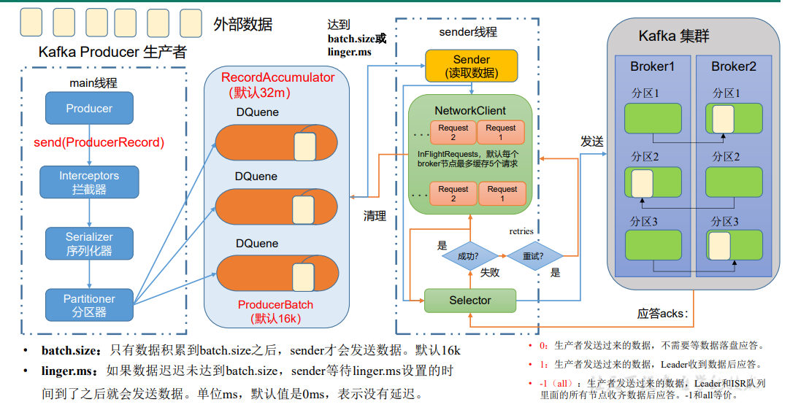
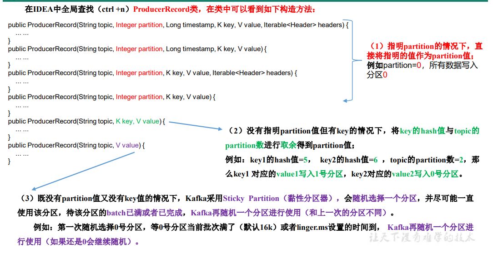

[TOC]
# 安装使用
## 安装

```
#解压复制到对应位置
#创建logs文件夹
mkdir logs
#允许删除topic，填写logs文件夹，指定zk集群地址。
cd config
vim server.properties
#指定kafka的id，每台机器不一样。
broker.id=0
#删除topic功能使能
delete.topic.enable=true
#kafka运行日志存放的路径
log.dirs=/opt/module/kafka/data
#配置连接Zookeeper集群地址
zookeeper.connect=hadoop102:2181,hadoop103:2181,hadoop104:2181/kafka
```

## 启动

```
#启动独立的zookeeper
zkServer.sh start
zkCli.sh -server localhost：2181
#指定config启动kafka
kafka-server-start.sh     conf/server.properties
```

## 管理

##### 常用端口

```
9092端口
```


##### 查看zookeeper结点

```
#查看zookeeper结点
ls /
get /zk_test
set /zk_test name
delete /zk_test
```

##### 创建topic

```
#创建topic
bin/kafka-topics.sh --create --bootstrap-server hbase:9092 --replication-factor 1 --partitions 1 --topic test
```

##### 查看所有topic

```
#查看所有topic
bin/kafka-topics.sh --list --bootstrap-server hbase:9092
test
bin/kafka-topics.sh --delete --zookeeper localhost:2181 --topic test
bin/kafka-console-producer.sh --broker-list hbase:9092 --topic  test
bin/kafka-console-consumer.sh --bootstrap-server hbase:9092 --topic test --from-beginning
#监听topic
bin/kafka-console-consumer.sh \
--bootstrap-server h:9092 --from-beginning --topic topic_log

```


# 理论知识

>kafka是高吞吐量的开源流处理平台，可以作为一种分布式的基于发布与订阅的消息队列，但消息队列的部分功能需要自己编写，如失败重试动作，同步异步任务等，与rabbitmq有区别。

## kafka

## kafka基础架构

生产者生产消息  kafka集群管理消息  消费者消费消息   Zookeeper注册消息

### kafka集群管理消息

kafka由多个broker构成，每个broker由topic和partion构成，一个topic可以有多个partion，由partion编号进行区分。每个topic的partion有多个，分布在不同机器上，他们有一个leader，当leader无法服务后，由其他机器上的follower代理。

```
消费者通过指定topic 进行消费， partion可以将topic中的数据分开存储。
offset针对特定topic，特定partion，特定消费者group。Zookeerper中保存这每个topic下的每个partition在每个group中消费的offset 。
```

### 消费者消费消息

#### consumer group

同一个分区的数据只能被同一个cg里的一个消费者消费。

```
conda install --channel https://conda.anaconda.org/conda-forge kafka-python
```

##### 版本

>kafka 2.4.1 zookeeper 3.5.9

```
kibana 5601,es 9200
```


## 异步处理

>用户请求服务后需等待服务完成再得到结果信息，这是同步处理。对于异步处理，用户提交请求后，请求放入消息队列后，无需等待执行完成，用户即可结束进程。异步处理可以实现解耦，异步通信，缓冲缓解服务器压力，提高灵活性和峰值处理能力。

## 消息队列的两种模式

### 1点对点模式

一对一，消费者主动拉取数据，消息收到后清楚，即一个消息对应一个消费者。

### 2发布订阅模式

>此模式又分为消费者主动拉取和队列主动推送，推送速度有不同的角色决定。

生产者发布消息到topic中，一个消息可以对应多个消息订阅者。

kafka是基于发布订阅模式的消费者拉取。

#### 消费者主动拉取模式

>消费者需要主动询问是否有我的消息，执行了长轮询，消耗资源。

#### 队列主动推送模式

>消费者性能有差别，队列推送要满足不同的速度。

## 基本概念

##### Producer

>消息生产者，向kafka broker发消息的客户端

##### Consumer

>消息消费者，向Kafka broker取消息的客户端

##### Consumer Group

>消费者组，由多个consumer组成。消费者组内每个消费者负责不同分区的数据，一个分区只能由一个组内消费者消费。一个消费者组的多个消费者是并行处理同一份数据的，它们整体视为一个订阅者。Topic虽然有多个分区，其也作为整体被producer选择发布，被consumer订阅。consumer组内如何分布，由kafka决定。

##### Broker

>一台kafka服务器就是一个broker，一个broker可以有多个topic的子分区。

##### Topic

>是producer发布和consumer订阅的基本单位。

##### Partition

>将topic进行partition，分布到多个broker上，每个partion是topic数据的一部分，其保持内部有序。topic可以设定replication数量。

##### Replica

>副本，一个topic每个partition有若干个副本，一个leader和若干个follower。

##### Leader与Follower

>Leader是发布和订阅的对象，Follower实时从Leader同步数据，当Leader故障时，挑选一个Follower为Leader。


## Producer Consumer工作原理

##### Producer

>main线程将数据存储到RecordAccumulator，sender不断读取RecordAccumulator并发送到broker。sender根据两个参数发送数据，batch.size，linger.ms，当超过时间或达到了batchsize会进行发送。



###### ProduceRecord

>根据partion分区，根据key的哈希分区，随机分区，当随机分区触发一次send，下次再随机挑选一个。

 

>自定义分区ProduceRecord
>
>1实现Partitioner接口
>
>2重写partition方法
>
>3设定使用自定义partitioner：
>
>properties.put(ProducerConfig.PARTITIONER_CLASS_CONFIG,"com.atgui gu.kafka.producer.MyPartitioner");

# kafka用法
### windows使用
>https://blog.csdn.net/YY_WG/article/details/104154823
>consumer启动后，不会自动读取latest信息，需要回车一下才会显示最新的消息,kafka-server也需要回车一下。
```
bin\windows\zookeeper-server-start.bat config\zookeeper.properties
bin\windows\kafka-server-start.bat config\server.properties
bin\windows\kafka-topics.bat --create --bootstrap-server localhost:2181 --replication-factor 1 --partitions 1 --topic test
bin\windows\kafka-console-producer.bat --broker-list localhost:9092 --topic ods_json
bin\windows\kafka-console-consumer.bat --bootstrap-server localhost:9092 --topic ods_json --from-beginning
```

### shell命令

##### 启动关闭

```
#启动独立的zookeeper
zkServer.sh start
zkCli.sh -server localhost：2181
#指定config启动kafka
kafka-server-start.sh     conf/server.properties

zk.sh start
bin/kafka-server-start.sh -daemon config/server.properties
```

##### topic

```
#创建topic
bin/kafka-topics.sh --create --bootstrap-server hbase:9092 --replication-factor 1 --partitions 1 --topic test

#查看所有topic
bin/kafka-topics.sh --list --bootstrap-server hbase:9092
test
bin/kafka-topics.sh --delete --zookeeper localhost:2181 --topic test
```

```
#kafka-topic.sh --help查看帮助，用的时候看吧。
#大致如此梳理，增删改查，“改”指修改topic的配置，“查”指查看所有已创建的topic。
Option                                   Description
------                                   -----------
--alter                                  Alter the number of partitions,
                                           replica assignment, and/or
                                           configuration for the topic.
--at-min-isr-partitions                  if set when describing topics, only
                                           show partitions whose isr count is
                                           equal to the configured minimum. Not
                                           supported with the --zookeeper
                                           option.
--bootstrap-server <String: server to    REQUIRED: The Kafka server to connect
  connect to>                              to. In case of providing this, a
                                           direct Zookeeper connection won't be
                                           required.
--command-config <String: command        Property file containing configs to be
  config property file>                    passed to Admin Client. This is used
                                           only with --bootstrap-server option
                                           for describing and altering broker
                                           configs.
--config <String: name=value>            A topic configuration override for the
                                           topic being created or altered.The
                                           following is a list of valid
                                           configurations:
                                                cleanup.policy
                                                compression.type
                                                delete.retention.ms
                                                file.delete.delay.ms
                                                flush.messages
                                                flush.ms
                                                follower.replication.throttled.
                                           replicas
                                                index.interval.bytes
                                                leader.replication.throttled.replicas
                                                max.compaction.lag.ms
                                                max.message.bytes
                                                message.downconversion.enable
                                                message.format.version
                                                message.timestamp.difference.max.ms
                                                message.timestamp.type
                                                min.cleanable.dirty.ratio
                                                min.compaction.lag.ms
                                                min.insync.replicas
                                                preallocate
                                                retention.bytes
                                                retention.ms
                                                segment.bytes
                                                segment.index.bytes
                                                segment.jitter.ms
                                                segment.ms
                                                unclean.leader.election.enable
                                         See the Kafka documentation for full
                                           details on the topic configs.It is
                                           supported only in combination with --
                                           create if --bootstrap-server option
                                           is used.
--create                                 Create a new topic.
--delete                                 Delete a topic
--delete-config <String: name>           A topic configuration override to be
                                           removed for an existing topic (see
                                           the list of configurations under the
                                           --config option). Not supported with
                                           the --bootstrap-server option.
--describe                               List details for the given topics.
--disable-rack-aware                     Disable rack aware replica assignment
--exclude-internal                       exclude internal topics when running
                                           list or describe command. The
                                           internal topics will be listed by
                                           default
--force                                  Suppress console prompts
--help                                   Print usage information.
--if-exists                              if set when altering or deleting or
                                           describing topics, the action will
                                           only execute if the topic exists.
                                           Not supported with the --bootstrap-
                                           server option.
--if-not-exists                          if set when creating topics, the
                                           action will only execute if the
                                           topic does not already exist. Not
                                           supported with the --bootstrap-
                                           server option.
--list                                   List all available topics.
--partitions <Integer: # of partitions>  The number of partitions for the topic
                                           being created or altered (WARNING:
                                           If partitions are increased for a
                                           topic that has a key, the partition
                                           logic or ordering of the messages
                                           will be affected). If not supplied
                                           for create, defaults to the cluster
                                           default.
--replica-assignment <String:            A list of manual partition-to-broker
  broker_id_for_part1_replica1 :           assignments for the topic being
  broker_id_for_part1_replica2 ,           created or altered.
  broker_id_for_part2_replica1 :
  broker_id_for_part2_replica2 , ...>
--replication-factor <Integer:           The replication factor for each
  replication factor>                      partition in the topic being
                                           created. If not supplied, defaults
                                           to the cluster default.
--topic <String: topic>                  The topic to create, alter, describe
                                           or delete. It also accepts a regular
                                           expression, except for --create
                                           option. Put topic name in double
                                           quotes and use the '\' prefix to
                                           escape regular expression symbols; e.
                                           g. "test\.topic".
--topics-with-overrides                  if set when describing topics, only
                                           show topics that have overridden
                                           configs
--unavailable-partitions                 if set when describing topics, only
                                           show partitions whose leader is not
                                           available
--under-min-isr-partitions               if set when describing topics, only
                                           show partitions whose isr count is
                                           less than the configured minimum.
                                           Not supported with the --zookeeper
                                           option.
--under-replicated-partitions            if set when describing topics, only
                                           show under replicated partitions
--version                                Display Kafka version.
```


##### producer

```
bin/kafka-console-producer.sh --broker-list hbase:9092 --topic 
#设定这次producer的一些参数，如timeout（等待批次的最大时间）、max-memory-bytes、重试次数等。
```

##### consumer

```
#指定如offset、分区、序列化类。
#监听topic
bin/kafka-console-consumer.sh \
--bootstrap-server h:9092 --from-beginning --topic topic_log

bin/kafka-console-consumer.sh --bootstrap-server hbase:9092 --topic test --from-beginning
```

### Scala API
```
import org.apache.kafka.clients.producer.{KafkaProducer, ProducerRecord}

val properties = new Properties
properties.put("bootstrap.servers", broker_list)
properties.put("key.serializer", "org.apache.kafka.common.serialization.StringSerializer")
properties.put("value.serializer", "org.apache.kafka.common.serialization.StringSerializer")
properties.put("enable.idempotence",(true: java.lang.Boolean))

var producer = new KafkaProducer[String, String](properties)
producer.send(new ProducerRecord[String, String](topic, msg))
#指定key
producer.send(new ProducerRecord[String, String](topic,key, msg))
```

```
val consumer = new KafkaConsumer[String, String](props)
consumer.subscribe(Collections.singletonList("log_test"))
while (true){
  val records = consumer.poll(1000)
  val it = records.iterator()
  while (it.hasNext){
    val next: ConsumerRecord[String, String] = it.next()
    println("value=="+next.value())
  }
}
  
```
### Java API

#### 异步发送

```
KafkaProducer<String, String> kafkaProducer = new KafkaProducer<String, String>(properties);
kafkaProducer.send(new ProducerRecord<>("first","test"));
#带回调的异步发送，回调函数的excepitn为null时说明成功。
kafkaProducer.send(new ProducerRecord<>("first", 
"test"), new Callback() {
// 该方法在 Producer 收到 ack 时调用，为异步调用
     @Override
     public void onCompletion(RecordMetadata metadata, 
        Exception exception) {
         if (exception == null) {
             // 没有异常,输出信息到控制台
             System.out.println(" 主题： " + 
            metadata.topic() + "->" + "分区：" + metadata.partition());
         } else {
             // 出现异常打印
            exception.printStackTrace();
     	}//else end
	 }//onCompletion end
 });//send end
```

#### 同步发送

```
#调用get()等待返回值，再处理后续程序。
kafkaProducer.send(new ProducerRecord<>("first","kafka")).get()
```


```
KafkaConsumer<String, String> consumer = new KafkaConsumer<String, String>(props);
consumer.subscribe(Arrays.asList("test01","mytopic"));
        while (true) {
            ConsumerRecords<String, String> records = consumer.poll(100);
            for (ConsumerRecord<String, String> record : records)
                System.out.printf("offset = %d, key = %s, value = %s", record.offset(), record.key(), record.value()+"\n");
        }

```

# 生产经验

### Producer提高吞吐量

>结合producer的理论部分不难这些关键参数：batch.size,linger.ms,compression.type,RecordAccumulator。涉及到双端队列的大小，何时发送数据，数据是否压缩。

```
//batch size
properties.put(ProducerConfig.BATCH_SIZE_CONFIG, 16384);
 // linger.ms：等待时间，默认5-100ms
 properties.put(ProducerConfig.LINGER_MS_CONFIG, 1);
 // RecordAccumulator：缓冲区大小，默认 32M：buffer.memory
 properties.put(ProducerConfig.BUFFER_MEMORY_CONFIG,
```

### 数据可靠性

>acks=0，生产者发送过来数据就不管了，可靠性差，效率高； acks=1，生产者发送过来数据Leader应答，可靠性中等，效率中等； acks=-1，生产者发送过来数据Leader和ISR队列里面所有Follwer应答，可靠性高，效率低； 在生产环境中，acks=0很少使用；acks=1，一般用于传输普通日志，允许丢个别数据；acks=-1，一般用于传输和钱相关的数据， 对可靠性要求比较高的场景。

```
//设置ACK类型
properties.put(ProducerConfig.ACKS_CONFIG, "all");
 // 重试次数 retries，默认是 int 最大值，2147483647
properties.put(ProducerConfig.RETRIES_CONFIG, 3);
```

>min.insync.replicas 表示IST in sync replica同步副本数目，即leader+follower保持同步的数量。
>
>replica.lag.time.max.ms表示 同步时间阈值，超过此时间不响应的replica follower剔除出ISR。

### 数据去重

>至少一次，至多一次，精确一次。
>
>当ACK设置为0时，就是至多一次。不会重发
>
>当ACK级别为-1，副本数大于等于2，ISR应答副本数大于等于2，就是至少一次。可能重发
>
>当使用幂等性和事务时，并满足至少一次的相同条件时（ack=-1，ISR>2,replica>2），保持精确一次。

##### 幂等性原理

>使用<PID,Partition,SeqNumber>确定唯一消息，不可持久化重复的数据。即其保证不重启情况下的单个分区数据幂等性。
>
>PID:producerID，每次kafka重启分配一个新的PID
>
>Partition，表示分区
>
>Sequence Number表示在producer端的编号。
>
>enable.idempotence 默认为true，开启。

##### 生产者事务

>开启事务必须开启幂等性。

```
// 1 初始化事务
void initTransactions(); 

// 2 开启事务 
void beginTransaction() throws ProducerFencedException;

 // 3 在事务内提交已经消费的偏移量（主要用于消费者） 
void sendOffsetsToTransaction(Map offsets, String consumerGroupId) throws  ProducerFencedException; 

// 4 提交事务 
void commitTransaction() throws ProducerFencedException; 

// 5 放弃事务（类似于回滚事务的操作） 
void abortTransaction() throws ProducerFencedException;

```

```
// 设置事务 id（必须），事务 id 任意起名
 properties.put(ProducerConfig.TRANSACTIONAL_ID_CONFIG, 
"transaction_id_0");
// 初始化事务
 kafkaProducer.initTransactions();
 // 开启事务
 kafkaProducer.beginTransaction();
 try{
	kafkaProducer.send("","") 
	kafkaProducer.commitTransaction();
 }catch(Exception e){
 	kafkaProducer.abortTransaction();
 }finally{
 	kafkaProducer.close();
 }
```

### 数据有序

>1未开幂等性启时，max.in.flight.requests.per.connection需要设置为1。
>
>2开启幂等性时，max.in.flight.requests.per.connection需要设置小于等于5。

## 相关链接


### problem

##### poll无反应

```
开启过多消费者，将限制的进程杀死即可恢复。
```

```
查看客户端是否reset offset，若显示了则一般正常。
```

